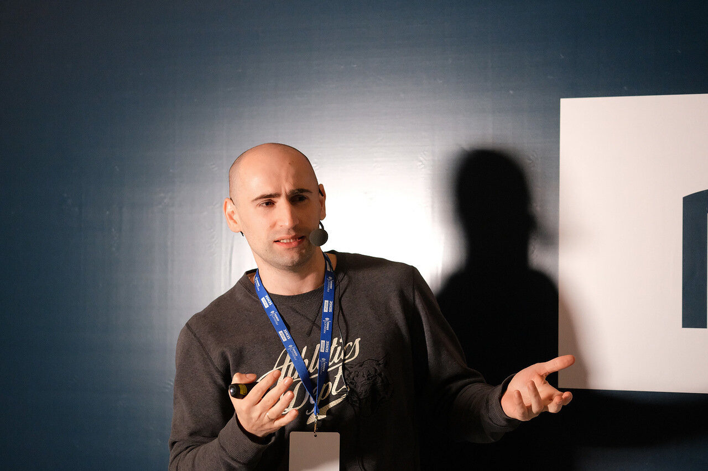

Удаляем лишние фичи и продукты, чтобы улучшить бизнес / Блог компании ProductSense

Юрий Андрейкович, Senior Product Manager в Wrike, рассказал на конференции [ProductSense](http://productsense.io/) в Минске, когда и зачем надо удалять фичи из продукта.

Я работаю в [Wrike](https://www.wrike.com/) — это сервис для совместной работы и управления проектами. В Wrike более миллиона пользователей, но наши прямые клиенты — это компании, которые платят за сотрудников. Таких примерно 17 тысяч.

Я не раз сталкивался с необходимостью удалять фичи из продукта, а иногда ко мне приходили с запросом: «У нас есть несколько тысяч пользователей, они чем-то пользуются, а мы хотим это удалить. Действуй». Я расскажу, на каких этапах жизненного цикла продукта стоит задуматься об удалении фичей и какие подводные камни можно обойти.

Давайте разберемся, зачем вообще удалять фичи из продукта. Лишняя фича — это та, без которой продукту станет лучше, а лишний продукт — тот, без которого бизнесу будет лучше. Удалять фичи и продукты стоит по нескольким причинам:

1.  Вы тратите ресурсы поддержки и разработчиков на сопровождение.
2.  Пользователи расстраиваются, что вы не развиваете фичу, которую они используют. Они не знают, что вы больше не хотите ей заниматься.
3.  Команде сложно сфокусироваться. Если у менеджера продукта и команды сто фичей или несколько продуктов, им сложно везде успевать.
4.  В продукте появляется неконсистентность. Например, вы переводите на русский язык все тексты сервиса, и на одном экране поддерживаете русскую локализацию, а на другом — неприоритетном — уже нет.
5.  Совокупная ценность продукта уменьшается. [Даниел Канеман](https://ru.wikipedia.org/wiki/%D0%9A%D0%B0%D0%BD%D0%B5%D0%BC%D0%B0%D0%BD,_%D0%94%D0%B0%D0%BD%D0%B8%D0%B5%D0%BB) в результате исследования выявил когнитивное искажение оценки по среднему. Например, если предложить человеку оценить ручку «Паркер», цена будет одна. Если к ручке «Паркер» добавить дешевую китайскую — цена набора из двух ручек будет ниже. Стоимость дорогой ручки будет уменьшаться за счет дешевой. Так ценность продукта будет снижаться из-за ненужных фичей и вырастет, если вы их удалите.

  

## 8 поводов задуматься об удалении фич или продуктов

В жизненном цикле продукта есть несколько этапов, когда удалять фичи удобно и полезно. Я расскажу, на что обратить внимание и какие инструменты использовать, чтобы принять решение.

**Делаем новую фичу**

Вы решили добавить новую фичу в продукт. Вам кажется, что это хорошая идея, но может быть наоборот. Лучше убить фичу до того, как начать что-то делать. Есть хорошие инструменты, чтобы проверить гипотезу: аналитика, кастдев, анализ рынка. Если после исследований поймете, что ничего добавлять не надо — вы молодцы.

**Проверяем гипотезы**

По интервью и аналитике не всегда можно понять, нужно ли делать фичу. Более ценны метрики и обратная связь реальных пользователей, поэтому приходится делать прототип. Старайтесь не запускать его на всю аудиторию, потому что удалять или вносить значительные изменения будет сложнее и болезненнее. Чтобы упростить задачу, можно запустить прототип на часть аудитории или создать изолированную среду для тестовых фич. В Wrike мы используем Labs — это закрытая секция в сервисе, где любой пользователь может включить экспериментальную фичу и оставить обратную связь.

> В Labs пользователи предупреждены, что экспериментальные фичи мы можем отключить в любое время. Поэтому они не завязывают процессы на этих фичах.

**Готовимся к релизу на всех пользователей**

После того, как вы обкатали фичу на какой-то части аудитории, надо проанализировать результаты. Есть опасная история «мы уже сделали», когда фича написана и ее можно запускать хоть сегодня. Но нужно остановиться и убрать всё, что не нужно пользователям.

Например, в [SEMrush](https://ru.semrush.com/) сделали аналитику для маркетологов и запустили в тестовых группах. Потом проанализировали, что было полезно. Неудачные эксперименты убрали и запустили на всю аудиторию около 30% функционала. Ценность продукта выросла, а ресурсы не стали тратить ни сейчас, ни в будущем.

**Что-то сломалось**

Если фичу уже сделали, она может в какой-то момент сломаться. Вероятно, вы узнаете об этом от службы поддержки или из упавших тестов. Однако не всегда непременно нужно чинить фичу или добавлять фикс в бэклог.

Например, для внутренних команд мы сделали скоринг пользователей, который они могли интегрировать к себе. Когда сервис уже должны были интегрировать, мы узнали, что он не работает больше месяца. Пропустим историю, почему наш мониторинг не выявил проблему раньше — важнее, что мы не стали сразу исправлять проблему, а решили поговорить с командами.

> Оказалось, что у команд либо бэклог забит интеграциями на полгода вперед, либо они уже используют другой сервис, либо у них серьезные проблемы в процессах и им сейчас не до этого.

Никто бы не пользовался скорингом в следующие полгода. Поэтому мы не стали ничего восстанавливать, а наоборот, закрыли сервис и отложили до лучших времен. Занимайтесь приоритетными продуктами и фичами и вовремя избавляйтесь от ненужных, чтобы не тратить ресурсы.

**Много тикетов с низким приоритетом**

Служба поддержки получает заявки с проблемами пользователей. Проанализировав их, вы увидите области продукта или фичей, которыми не любите заниматься. Проверьте, так ли они нужны, и если не нужны, запланируйте их удаление. Если решите оставить фичи, выделите ресурсы для исправления ошибок и мониторьте их состояние.

**Делаем новую версию**

Когда продукт уже зрелый, в его коде накопилось много устаревшего и ненужного. Иногда приходится принимать болезненное решение о большом рефакторинге или переписывании технической части функционала.

> Если объем технической задачи очень большой, отнеситесь к рефакторингу и переписыванию, как к новому продукту. Разберитесь в проблемах и аналитике, чтобы одновременно убрать ненужные фичи и увеличить ценность продукта.

**Команда перегружена**

Сделали новую версию, потом новую фичу или продукт, увлеклись — и появилось еще пять продуктов. В какой-то момент команда начинает гореть, потому что нужно всё это поддерживать. Люди демотивированы и ничего не успевают. Чтобы этого избежать, разберитесь со всеми продуктами: проведите интервью, соберите аналитику, проанализируйте результаты. Избавьтесь от ненужных или менее приоритетных продуктов или передайте другим командам, у которых есть ресурсы.

**Фича блокирует развитие или масштабирование**

Бывает, что какая-то фича накладывает ограничения на масштабирование и рост продукта. В Wrike мы столкнулись с тем, что одна из корневых возможностей, которой пользовались тысячи пользователей, мешала нормально масштабироваться и развивать продукт. Несмотря на риски в краткосрочной перспективе, мы провели большую работу и удалили фичу, параллельно изменяя архитектуру приложения.

**Регулярные ревью**

Запланируйте ревью раз в полгода: вместе с аналитиком и UX-специалистом посмотрите данные и проанализируйте, что происходит. Так вы быстрее сообразите, какие фичи или продукты могут стать кандидатами на удаление.

## Как принять решение об удалении фичи

Когда вы уже нашли проблемную фичу, встает вопрос, удалять или не удалять. Чтобы не ошибиться, нужно проанализировать все данные:

1.  **Vision фичи и продукта.** Если вы не понимаете, зачем эта фича нужна и как ее развивать, есть смысл в этом разобраться. Если не получается — хороший повод подумать об удалении.
2.  **Match продукта и фичи.** Оцените, куда развивается продукт и фича по отдельности. Когда направления не совпадают, из фичи можно сделать отдельный продукт или развернуть весь продукт в сторону фичи, если она приносит деньги и хорошо растет.
3.  **Ценность и обходные решения.** Если мы отбираем фичу и пользователь не может решить задачу другим способом, это может быть больно. Часто люди используют устаревшие неудобные решения, даже если вы уже реализовали новый удобный функционал. Это может быть сила привычки, а возможно функционал спрятан за десятью экранами. Донесите ценность нового решения пользователю.
4.  **Метрики.** У каждой фичи и продукта есть метрики, которые помогают оценить их прибыльность и эффективность.

  

## Риски при удалении фичи

При удалении фичи вам нужно подумать о рисках:

1.  Вы можете навредить бренду. Может быть, у вас всего пять фанатов фичи, но они уничтожат компанию в соцсетях и на профильных сайтах. Вам нужно проанализировать, что это за люди и как они взаимодействуют с поддержкой.
2.  Для кого-то удаление фичи может быть критичным, и он уйдет.
3.  Пользователи фичи могут «обвалить» поддержку. Это произойдет в том случае, если вы не оценили или плохо оценили риски. Возможно, вам придется вернуть фичу, а до этого лучше не доводить.

  

> Работать с рисками надо в два этапа: оценить и минимизировать.

Оцените риски:

*   Проанализируйте аналитику: например, в Wrike аналитики помогают менеджерам продукта оценить обратную связь качественно и количественно.
*   Поговорите с поддержкой, менеджерами по продажам, аккаунт-менеджерами. Вы можете получить неочевидные ответы, которые повлияют на ваше решение. Например, аккаунт-менеджеры могут сказать, что фичу мало используют и она не решает проблему, а продавцы считают ее отличным триггером для продажи и используют в каждом разговоре с клиентами.
*   Обязательно проконсультируйтесь с юристами. Может быть, в пользовательском соглашении написано, что вы обязаны предупредить об изменениях в продукте за полгода.

Когда вы качественно оценили риски, постарайтесь их минимизировать:

*   Поговорите с пользователями. Вы поймете, что это за люди и как они могут отреагировать на удаление фичи, а также определите значимость фичи и возможные последствия ее удаления.
*   Подготовьте Q&A для поддержки, отдела маркетинга и продаж, чтобы уменьшить гнев пользователей и помочь командам справиться со сложными вопросами от них.
*   Донесите свой план до руководства и действуйте максимально прозрачно. Если руководству, топ-менеджерам и инвесторам будут непонятны риски, вы окажетесь «плохим парнем» — даже если сделаете всё правильно.

  

## Как удалять фичи

Я выделил три сценария удаления фич: плохой, спорный и универсальный. Но каждая ситуация уникальна, поэтому один и тот же сценарий может быть хорошим в одном случае и плохим — в другом.

**Плохой**

Вы можете дать фиче медленно умереть, если сильно заняты другими делами. Но вам всё равно придется когда-нибудь это сделать.

Плюс: не нужно напрягаться.  
Минусы: фича все еще отнимает ресурсы, пользователи недовольны.

**Спорный**

Удаляете незаметно. Но есть риск, что пользователи однажды не увидят какого-то экрана, графика или кнопки и поднимут негативную волну. Поэтому удаляйте фичу без предупреждения, только если уверены в маленьких рисках:

*   у фичи маленькая аудитория,
*   удаление не повлияет на бренд,
*   у вас нет стратегических клиентов.

Плюс: просто.  
Минус: есть шанс недооценить риски.

**Универсальный**

1.  Общаетесь с пользователями, аналитиками, менеджерами по продажам и аккаунт-менеджерами, юристами, руководством. Готовите Q&A, обновляете хелп и другие публичные документы, страницы на сайте.
2.  Предупреждаете заранее, что собираетесь закрыть фичу. Это поможет пользователям свыкнуться с этой мыслью и перенести свои данные, если нужно.
3.  Закрываете доступ к фиче новым пользователям.
4.  Если вместо фичи делаете новый функционал, даете пользователю возможность его попробовать.
5.  Идете до конца, потому что препятствий и страхов будет много.

Иногда фичу можно не удалять, а продать конкуренту. Если эта часть продукта вам не нужна, он может увидеть в ней ценность. Или выделить фичу в отдельный продукт и передать свободной команде.

> Если с первого раза фича не взлетела, иногда достаточно ее доделать. Вы думаете, что она никому не нравится, а ее просто сложно найти. Проводите тесты, собирайте обратную связь. Дайте фиче второй шанс.

  

## Чек-лист

  

1.  Определите проблемные фичи и продукты: выясните, почему ими не занимаются, надо ли их развивать или пора закрыть.
2.  Оцените возможность и необходимость удаления фичей на каждом этапе жизненного цикла продукта.
3.  Проведите исследования и тесты, чтобы понять, нужно ли удалять фичу или продукт.
4.  Проанализируйте данные, которые у вас есть, чтобы принять решение об удалении фичи, а также vision продукта и фичи, match продукта и фичи, ценность и обходные решения, метрики.
5.  Оцените риски, действуйте прозрачно, предупреждайте всех, что собираетесь удалить фичу. Управляйте ожиданиями пользователей, чтобы уменьшить их боль и сохранить лояльность.
6.  Дайте фиче второй шанс.
7.  Удаляйте фичу по сценарию, который подходит в вашей ситуации: опирайтесь на чек-лист, добавляйте или удаляйте шаги по необходимости и принимайте взвешенное решение.

[Полное выступление Юрия Андрейковича.](https://youtu.be/wKYofn5Iqn8)