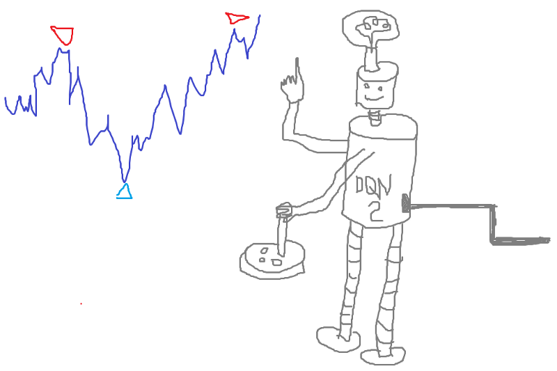
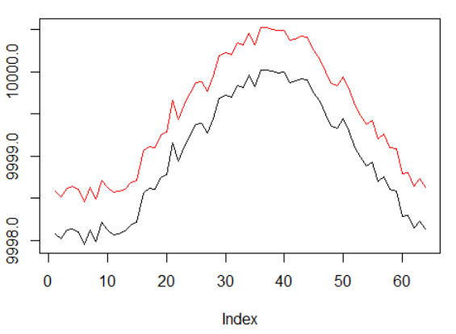
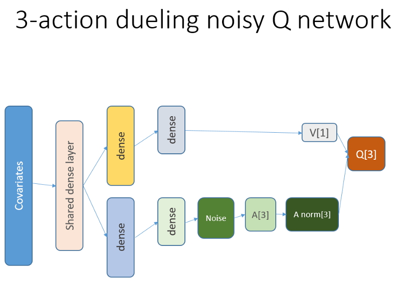
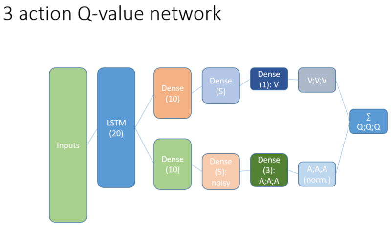
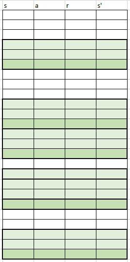
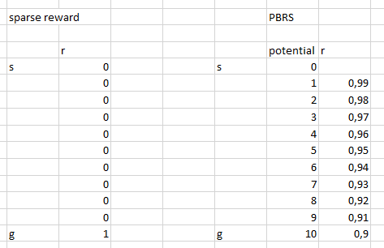
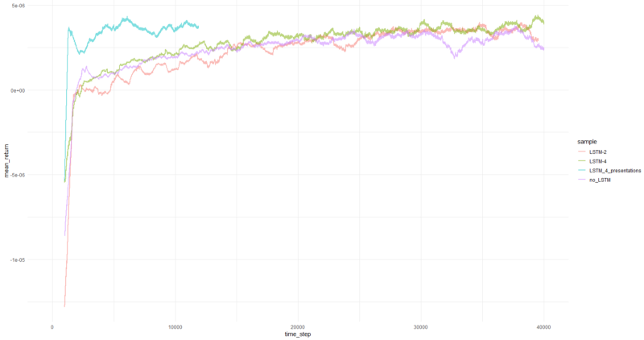
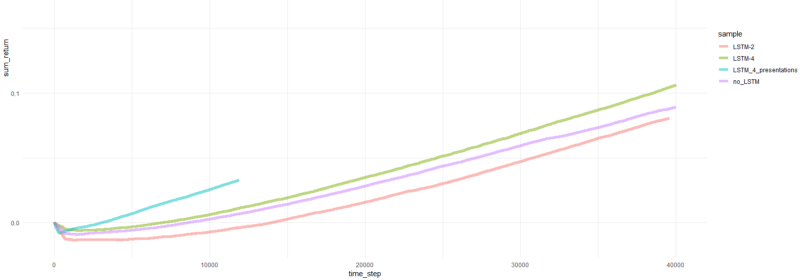
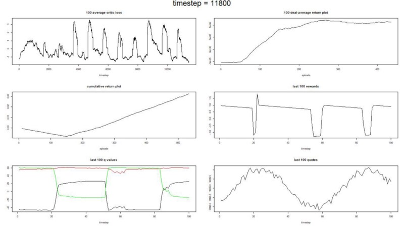
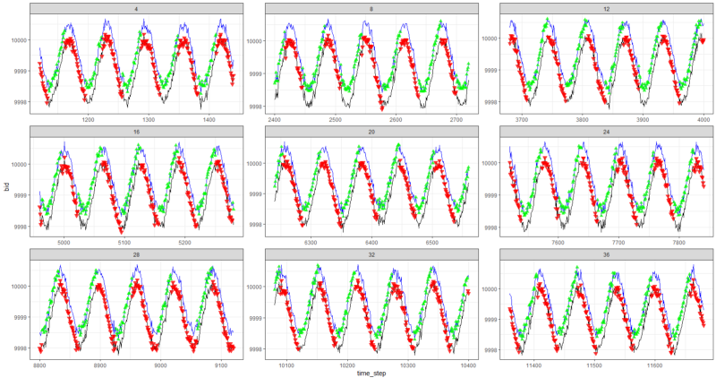

Улучшение агента на основе Q-Learning, торгующего stocks, путем добавления рекуррентности и формирования наград

### Напоминание

Привет, Хабр! Предлагаю вашему вниманию ещё один перевод моей новой статьи с [медиума](https://medium.com/@alexeybnk/improving-q-learning-agent-trading-stock-by-adding-recurrency-and-reward-shaping-b9e0ee095c8b).

В прошлый раз ([первая статья](https://medium.com/@alexeybnk/can-reinforcement-learning-trade-stock-implementation-in-r-8cd54d13165c)) ([Habr](https://habr.com/ru/post/433182/)) мы создали агента на технологии Q-Learning, который совершает сделки на имитированных и реальных биржевых временных рядах и пытались проверить, подходит ли эта область задач для обучения с подкреплением.

В этот раз мы добавим LSTM слой для учета временных зависимостей внутри траектории и сделаем инженерию наград (reward shaping) на основе презентаций.

  
  
Напомню, что для проверки концепции мы использовали следующие синтетические данные:

Синтетические данные: синус с белым шумом.

Функция синуса была первой отправной точкой. Две кривые имитируют цену покупки и продажи актива, где спред — это минимальная стоимость транзакции.

Однако на этот раз мы хотим усложнить эту простую задачу, удлинив путь присвоения кредита (credit assignment):

Синтетические данные: синус с белым шумом.

Фаза синуса была увеличена в два раза.

Это означает, что разреженные награды, которые мы используем, должны распространяться по более длинным траекториям. Кроме того, мы значительно снижаем вероятность получения положительного вознаграждения, поскольку агент должен был выполнить последовательность правильных действий в 2 раза дольше, чтобы преодолеть операционные издержки. Оба фактора значительно усложняют задачу для RL даже в таких простых условиях, как синусоида.

Кроме того, напомним, что мы использовали эту архитектуру нейронной сети:

### Что было добавлено и почему

  

#### LSTM

Прежде всего, мы хотели дать агенту больше понимания динамики изменений внутри траектории. Проще говоря, агент должен лучше понимать свое собственное поведение: что он сделал прямо сейчас и какое-то время в прошлом, и как развивалось распределение состояний-действий, а также полученных наград. Использование рекуррентного слоя может решить именно эту проблему. Приветствуем новую архитектуру, используемую для запуска нового набора экспериментов:

Обратите внимание, что я немного улучшил описание. Единственное отличие от старой NN — это первый скрытый слой LSTM вместо полносвязанного.

Обратите внимание, что с LSTM в работе мы должны изменить выборку примеров воспроизведения опыта для обучения: теперь нам нужны последовательности переходов вместо отдельных примеров. Вот как это работает (это один из алгоритмов). Мы использовали точечную выборку раньше:

Фиктивная схема буфера воспроизведения.

Мы используем эту схему с LSTM:

Теперь отбираются последовательности (чью длину мы задаем эмпирически).

Как раньше, так и сейчас выборка регулируется приоритетным алгоритмом на основе ошибок темпорально-временного обучения.

Рекуррентный уровень LSTM позволяет прямому распространению информации из временных рядов перехватывать дополнительный сигнал, скрытый в прошлых лагах. Временные ряды у нас — это двухмерный тензор с размером: длина последовательности на представления нашего состояния-действия.

#### Презентации

Инжениринг наград, Potential Based Reward Shaping (PBRS), — основанный на потенциале, является мощным инструментом, позволяющим повысить скорость, стабильность и не нарушать оптимальность процесса поиска политики для решения нашего окружения. Я рекомендую прочитать по крайней мере этот оригинальный документ на тему:

[people.eecs.berkeley.edu/~russell/papers/ml99-shaping.ps](https://people.eecs.berkeley.edu/~russell/papers/ml99-shaping.ps)

Потенциал определяет, насколько хорошо наше текущее состояние по отношению к целевому состоянию, в которое мы хотим войти. Схематичный взгляд на то, как это работает:

Существуют варианты и сложности, которые вы могли бы понять после проб и ошибок, и мы опускаем эти детали, оставляя вам на домашнее задание.

Стоит упомянуть еще одну вещь, которая заключается в том, что PBRS можно обосновать с помощью презентаций, которые являются формой экспертного (или симулированного) знания о _почти_ оптимальном поведении агента в среде. Есть способ найти такие презентации для нашей задачи, используя схемы оптимизации. Опустим детали поиска.

Потенциальная награда принимает следующую форму (уравнение 1):

r ’= r + gamma * F (s’) — F (s)

где F означает потенциал состояния, а r — исходная награда, gamma — дисконтирующий фактор (0:1).

**С этими мыслями мы переходим к кодированию.**

Реализация в R  
Вот код нейронной сети, основанный на Keras API:

**Код**

    
    library('keras')
    library('R6')
    state_names_length <- 12 
    lstm_seq_length <- 4
    learning_rate <- 1e-3
    a_CustomLayer <- R6::R6Class(
     “CustomLayer”
     , inherit = KerasLayer
     , public = list(
     
     call = function(x, mask = NULL) {
     x — k_mean(x, axis = 2, keepdims = T)
     }
     
     )
    )
    a_normalize_layer <- function(object) {
     create_layer(a_CustomLayer, object, list(name = ‘a_normalize_layer’))
    }
    v_CustomLayer <- R6::R6Class(
     “CustomLayer”
     , inherit = KerasLayer
     , public = list(
     
     call = function(x, mask = NULL) {
     k_concatenate(list(x, x, x), axis = 2)
     }
     
     , compute_output_shape = function(input_shape) {
     
     output_shape = input_shape
     output_shape[[2]] <- input_shape[[2]] * 3L
     
     output_shape
     }
     )
    )
    v_normalize_layer <- function(object) {
     create_layer(v_CustomLayer, object, list(name = ‘v_normalize_layer’))
    }
    noise_CustomLayer <- R6::R6Class(
     “CustomLayer”
     , inherit = KerasLayer
     , lock_objects = FALSE
     , public = list(
     
     initialize = function(output_dim) {
     self$output_dim <- output_dim
     }
     
     , build = function(input_shape) {
     
     self$input_dim <- input_shape[[2]]
     
     sqr_inputs <- self$input_dim ** (1/2)
     
     self$sigma_initializer <- initializer_constant(.5 / sqr_inputs)
     
     self$mu_initializer <- initializer_random_uniform(minval = (-1 / sqr_inputs), maxval = (1 / sqr_inputs))
     
     self$mu_weight <- self$add_weight(
     name = ‘mu_weight’, 
     shape = list(self$input_dim, self$output_dim),
     initializer = self$mu_initializer,
     trainable = TRUE
     )
     
     self$sigma_weight <- self$add_weight(
     name = ‘sigma_weight’, 
     shape = list(self$input_dim, self$output_dim),
     initializer = self$sigma_initializer,
     trainable = TRUE
     )
     
     self$mu_bias <- self$add_weight(
     name = ‘mu_bias’, 
     shape = list(self$output_dim),
     initializer = self$mu_initializer,
     trainable = TRUE
     )
     
     self$sigma_bias <- self$add_weight(
     name = ‘sigma_bias’, 
     shape = list(self$output_dim),
     initializer = self$sigma_initializer,
     trainable = TRUE
     )
     
     }
     
     , call = function(x, mask = NULL) {
     
     
     
     e_i = k_random_normal(shape = list(self$input_dim, self$output_dim))
     e_j = k_random_normal(shape = list(self$output_dim))
     
     
     
     
     eW = k_sign(e_i) * (k_sqrt(k_abs(e_i))) * k_sign(e_j) * (k_sqrt(k_abs(e_j)))
     eB = k_sign(e_j) * (k_abs(e_j) ** (1/2))
     
     
     
     
     noise_injected_weights = k_dot(x, self$mu_weight + (self$sigma_weight * eW))
     noise_injected_bias = self$mu_bias + (self$sigma_bias * eB)
     output = k_bias_add(noise_injected_weights, noise_injected_bias)
     
     output
     
     }
     
     , compute_output_shape = function(input_shape) {
     
     output_shape <- input_shape
     output_shape[[2]] <- self$output_dim
     
     output_shape
     
     }
     )
    )
    noise_add_layer <- function(object, output_dim) {
     create_layer(
     noise_CustomLayer
     , object
     , list(
     name = ‘noise_add_layer’
     , output_dim = as.integer(output_dim)
     , trainable = T
     )
     )
    }
    critic_input <- layer_input(
     shape = list(NULL, as.integer(state_names_length))
     , name = ‘critic_input’
    )
    common_lstm_layer <- layer_lstm(
     units = 20
     , activation = “tanh”
     , recurrent_activation = “hard_sigmoid”
     , use_bias = T
     , return_sequences = F
     , stateful = F
     , name = ‘lstm1’
    )
    critic_layer_dense_v_1 <- layer_dense(
     units = 10
     , activation = “tanh”
    )
    critic_layer_dense_v_2 <- layer_dense(
     units = 5
     , activation = “tanh”
    )
    critic_layer_dense_v_3 <- layer_dense(
     units = 1
     , name = ‘critic_layer_dense_v_3’
    )
    critic_layer_dense_a_1 <- layer_dense(
     units = 10
     , activation = “tanh”
    )
    
    
    
    
    critic_layer_dense_a_3 <- layer_dense(
     units = length(actions)
     , name = ‘critic_layer_dense_a_3’
    )
    critic_model_v <-
     critic_input %>%
     common_lstm_layer %>%
     critic_layer_dense_v_1 %>%
     critic_layer_dense_v_2 %>%
     critic_layer_dense_v_3 %>%
     v_normalize_layer
    critic_model_a <-
     critic_input %>%
     common_lstm_layer %>%
     critic_layer_dense_a_1 %>%
     
     noise_add_layer(output_dim = 5) %>%
     critic_layer_dense_a_3 %>%
     a_normalize_layer
    critic_output <-
     layer_add(
     list(
     critic_model_v
     , critic_model_a
     )
     , name = ‘critic_output’
     )
    critic_model_1 <- keras_model(
     inputs = critic_input
     , outputs = critic_output
    )
    critic_optimizer = optimizer_adam(lr = learning_rate)
    keras::compile(
     critic_model_1
     , optimizer = critic_optimizer
     , loss = ‘mse’
     , metrics = ‘mse’
    )
    train.x <- array_reshape(rnorm(10 * lstm_seq_length * state_names_length)
     , dim = c(10, lstm_seq_length, state_names_length)
     , order = ‘C’)
    predict(critic_model_1, train.x)
    layer_name <- ‘noise_add_layer’
    intermediate_layer_model <- keras_model(inputs = critic_model_1$input, outputs = get_layer(critic_model_1, layer_name)$output)
    predict(intermediate_layer_model, train.x)[1,]
    critic_model_2 <- critic_model_1
    

  

Отладка вашего решения на вашей совести…

### Результаты и сравнение

Давайте погрузимся прямо к конечным результатам. _Примечание: все результаты являются точечными оценками и могут отличаться при многократном запуске с разными случайными начальными сидами._

Сравнение включает в себя:

*   предыдущая версия без LSTM и презентаций
*   простой 2-элементный LSTM
*   4-элементный LSTM
*   LSTM с 4 ячейками и наградами сформированными через PBRS

Средняя доходность за эпизод усредненная за 1000 эпизодов.

Суммарная доходность по эпизодам.

**Графики для самого успешного агента:**

Успеваемость агента.

Что же, довольно очевидно, что агент в форме PBRS сходится так быстро и стабильно по сравнению с более ранними попытками, что можно принять это как значимый результат. Скорость примерно в 4–5 раз выше, чем без презентаций. Стабильность замечательна.

Когда дело доходит до использования LSTM, 4 ячейки показали лучшие результаты, чем 2 ячейки. LSTM с 2 ячейками показал лучший результат, чем версия без LSTM (однако, возможно, это иллюзия одиночного эксперимента).

### Заключительные слова

Мы были свидетелями того, что рекуррентность и формирование вознаграждения на основе потенциала помогает. Мне особенно понравилось, как PBRS показала себя так высоко.

Не верьте никому, кто заставляет меня говорить, что легко создать агента RL, который хорошо сходится, так как это ложь. Каждый новый компонент, добавляемый в систему, делает ее потенциально менее стабильной и требует большой настройки и отладки.

Тем не менее, есть четкое свидетельство того, что решение задачи можно улучшить, просто улучшив используемые методы (данные остались нетронутыми). Это факт, что для любой задачи определенный диапазон параметров работает лучше, чем другие. Имея это в виду, вы вступаете на путь успешного обучения с подкреплением.

**Спасибо.**