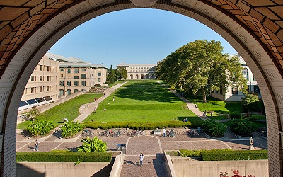
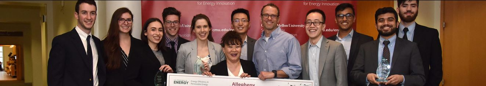

Университеты и Корпоративные акселераторы как рычаг для запуска B2B стартапа в США

Перепробовав себя как предприниматель в разных отраслях – от логистики до производства питьевой воды, я нашел свое истинное призвание в инжиниринге, взявшись помочь своему другу мега-инженеру превратить его мастерскую в инжиниринговую компанию. Все было круто до конца 2013, когда на горизонте показались невеселые времена и я заранее впал в тоску — до марта 2014, когда прочитал на Хабре о эмиграции через получение американского МБА.  
США стали моей первой заграницей в 2000 году после участия в программе Work&Travel и свадьбу со моей будущей женой мы устроили на двоих в Лас-Вегасе в 2008, поэтому выбор страны не стоял.  
Через полтора года, в августе 2015 года я начал учебу в Carnegie Mellon University в Питтсбурге.

**План статьи такой:**  
1\. Возможности для стартапов в американских университетах  
a. Конкурсы бизнес-планов  
b. Инвестиции от государственных фондов  
2\. Корпоративные конкурсы проектов и технологий  
3\. Глобальные индустриальные акселераторы

## 1\. Возможности для стартапов в американских университетах

На ознакомительных встречах нам много рассказывали о глубокой интеграции университета с глобальными технологическими корпорациями, но все это было в контексте поиска работы. И вот когда на предпринимательской сессии рассказали, какие технологии вышли из университета, и какие на подходе – тогда стало действительно интересно. Самой прорывной технологией были изобретенные в университете UHF диоды, способные работать на частотах до сотен ТГц и до 30 ГГц в режиме zero-bias, сулящие революционные перспективы в электронике.

Я безуспешно пытался установить контакт с профессором-изобретателем в течение 7 месяцев, но получилось только летом 2016, когда вместо щедро оплачиваемой летней стажировки в Гугл я подписался на практически бесплатное волонтерство в университетском Офисе Трансферта Технологий – с условием, что меня поставят на этот проект.

Лето пролетело в изучении потенциальных применений технологии, размера рынков и способа выхода на них: начиная от детекторов радиосигнала и радиотелескопов и заканчивая конвертацией радиоволн в электричество. К осени стало понятно, что наша главная цель – предложить рынку вечные батарейки, черпающие энергию фонового радиоизлучения.

Активная и даже в отдельных областях — ведущая роль университетов в формировании стратегической повестки в бизнесе и госуправлении — одна из главных отличительных черт американского образования. Кроме того, что учебные учреждения нацелены на выдачу готовых специалистов для работы в профильных отраслях, существуют тесная обратная связь от предприятий, которые заказывают и спонсируют исследования с последующей реализаций их в производстве и бизнесе. Так, одной из моих задач, как стажера в Офисе Трансферта Технологий, было создание базы данных всех прошлых, текущих и будущих исследовательских работ для оперативного взаимодействия с потенциальными заказчиками и инвесторами из бизнеса.  
Есть и практические курсы, когда компания заказывает исследование рынка или вполне конкретную разработку, и целый курс студентов, разбившись на группы, целый семестр работает над решением с финальной презентацией по окончанию. Не всегда можно ожидать прорывных решений от студентов, но из всего потока обычно найдется одна-две команды, которые выдадут нечто интересное.  
Стартапы в университетах обычно рождаются из курсовых проектов.

### 1.a. Конкурсы бизнес-планов

  
Итак, классная идея, возможно подпитанная университетской технологией, бодрые ребята с горящими глазами – дальше вступает университетский Центр Предпринимательства (по-моему, они есть сейчас при каждом университете, поскольку одним из критериев в университетских рейтингах (очень важная штука в штатах) является количество компаний, созданных выпускниками). Продолжить работу над стартапом можно в рамках курса по предпринимательству или заручившись поддержкой бизнес департамента для подготовки к местным / региональным / национальным конкурсам бизнес-планов (Pitch Competitions) – было бы желание. Опять же, вовлеченность бизнеса в университетскую жизнь, приводит к тому, что к этим соревнованиям проявляют интерес – спонсируют и внимательно изучают – инвесторы и представители индустрии, поэтому участие может дать возможность не просто поднять денег, но и получить доступ к важным партнерствам.

Мой опыт ознаменовался двумя вторыми местами в [университетском](https://www.cmu.edu/swartz-center-for-entrepreneurship/events/mcginnis-venture-competition/past-winners.html) и [региональном](https://cleantechprize.org/2017-final-pitches/) соревнованиях, позволившими установить личный контакт с вице-президентом Walmart по технологиям и энергетике, директором по инновациям из Phillips десятком других авторитетных и полезных для развития бизнеса людей, ну и $50 тысяч призовых денег. Взяв главный приз в своей категории в [Калифорнийском Технологическом Институте](http://www.flow.caltech.edu/2017-winners), я установил контакт с директором по инновациям из EPRI (Исследовательских Институт Электрической Энергии) – авторитетнейшей организацией, определяющий развитие все электроэнергетической отрасли. В общем, университетские конкурсы в США – реальный трамплин в большой бизнес.

Важно заметить, что стартапы, рожденные из технологии, разработанной в университете и за счет университета, при создании обычно выделяют университету долю в уставном капитале и дополнительно платят роялти за использование технологии. Обычно существует некая стандартная практика, единая для университета. В Карнеги Меллон это 7% в уставном капитале и 2-3% от дохода.  
За соблюдением интеллектуальных прав тщательно следит Офис Трансферта Технологий и время от времени слышны отзвуки громких судебных тяжб на этот счет ([мировая на $750 миллионов c Marvell Technology](https://www.wsj.com/articles/marvell-to-pay-750-million-in-settlement-with-carnegie-mellon-1455746246)).

### 1.b. Инвестиции от государственных фондов

Конкурсы в Калифорнийском Технологическом Институте и Пенсильванский Allegheny Cleantech – были региональными отборочными турами [национального конкурса Министерства Энергетики](https://www.energy.gov/eere/technology-to-market/cleantech-university-prize-cleantech) (DOE), так что мне довелось выступить и в Вашингтоне.

Исследовательские гранты от профильных министерств – важный источник финансирования университетских исследований. Государственный орган определяет стратегически важные темы, которые публикуются на сайте соответствующих министерств. Университеты (и частные компании) подают свои заявки, которые проходят слепой отбор комиссией отраслевых экспертов из академии и индустрии. Победители обычно получают гранты в 2-3 части, по мере достижения заранее согласованных целей: $150-250 тыс.; $1-2 млн.; $3-5 млн. – в зависимости от природы проекта, но в достаточном объеме, чтобы произвести демонстрационный образец и снизить риски для коммерческих инвестиций.

Воспользовавшись грантом, спонсируемая компания обычно оставляет за собой право собственности на разработку, но передает Спонсору неэкслюзивную лицензию на ее использование. Далее, распоряжаясь созданной интеллектуальной собственностью, разработчик может либо продавать коммерческие лицензии, либо реализовать собственный продукт

Получение грантов – одна из главных задач университетских профессоров. Если ваше исследование советует национальным интересам США (или может быть подано, как таковое) – есть отличные шанс получить на это дело много бесплатных денег. Одна проблема – время. От написания до получения денег может легко пройти год, так что хорошо иметь запасной вариант.

**Куда податься:**

•  – широкий спектр тем, фокус на фундаментальных открытиях. Программные менеджеры, указанные ответственными за проведения отбора, обычно выполняют администраторские функции, решение принимается комитетом экспертов, которые не знают друг друга и не видят авторов запросов, чтобы обеспечить объективность оценки.

•  – очевидно – все что связано с энергетикой. При этом темы могут связаны с энергетикой довольно опосредованно – тут пригодится опыт притягивания за уши — например, подвязать проект теплиц на гидропонной технологии, как средство сбережения пресной воды, которая в свою очередь бережет энергию. Ну вы поняли…  
o [ARPA-E](https://arpa-e-foa.energy.gov/)  
o [National Renewable Energy Laboratory (NREL)](https://www.nrelforum.com/Attend/Attend-the-Forum?utm_source=Jackie&utm_medium=direct&utm_campaign=igf_mktg)

•  – министерство обороны. Здесь финальное решение принимается программным менеджером, поэтому установление и поддержание плодотворного сотрудничество важно на ранней стадии. Есть нюанс – экспорт разработки военного или двойного назначения (когда они теоретически могут быть использованы для военного назначения), разработанной в рамках гранта, будет либо полностью закрыт, либо сильно ограничен.  
o [DARPA](https://www.darpa.mil/work-with-us/opportunities)

• Есть и другие министерства, полный доступ к грантам здесь — [Grants.gov](https://www.grants.gov/web/grants/search-grants.html)

Наша заявка в NSF спустя полгода была отклонена из-за «недостаточной амбициозности» заявленных целей. Можно было бы, конечно, побороться на следующий год, но за неимением времени мы пошли другим путем:

## 2\. Корпоративные конкурсы проектов и технологий

Aмериканские компании всерьез воспринимают университеты как источник вдохновения и инноваторской мысли. Кроме того, после щелчков по носу от стартаперов, перевернувших целые индустрии, и начитавшись «Дилеммы Инноватора» Криштенсена, глобальные корпорации начали молодиться и создавать корпоративные акселераторы с намерением «disrupt ourselves» (порвать себя(?)).  
Несмотря на очевидное противоречие в миссии, подобный аутсорс инноваций позволяет приобретать восходящие звезды в виде успешных продуктов, технологий и команд. А для стартаперских команд это может значить много бесплатных (возможно) денег, доступ к готовому большому рынку или моментальная накачка репутации в индустрии.  
Условием для участия во многих подобных конкурсах является связь с американским университетом, поэтому стартаперы активно используют свои университетские корни, чтобы либо нарисовать необходимую связь, или взять в команду студента-выпускника, который становится пропуском в мир возможностей.  
Если в венчурной среде на профессоров среди основателей и адвайзеров смотрят с некоторым недоверием («учить» и «изобретать» редко сочетается с «создать продукт» и «продать»), то в корпоративных акселераторах, где экспертами и судьями выступают PhD-шники и научные консультанты (ну конечно, на инновацию бросаются лучшие силы) – университетская аура добавляет очков.

Я подавался во все, что имеет отношение к электротехнике:

•  [Global Problem Solver Challenge](https://cisco.innovationchallenge.com/cisco-global-problem-solver-challenge-2019)

•  [Bell Labs Prize](https://www.bell-labs.com/prize/)

•  [Energy Research Network (BERN)](https://www.bosch.us/our-company/innovation/)

•  [Shell Game Changer](https://www.shell.com/energy-and-innovation/innovating-together/shell-gamechanger.html)

Заполнение каждой заявки заставляет под новым углом взглянуть на потребности рынка, понять какой продукт надо разрабатывать, чтобы потребитель захотел заплатить за него еще до появления на свет. Если сначала я пытался продавать Cisco технологию, которая «произведет в революцию в электронике», то в итоге пришел к решению конкретных проблем Shell и подсчету сэкономленных средств на обслуживании беспроводных датчиков коррозии, произведенных в партнерстве с лидирующим производителем антикоррозийного оборудования из Великобритании.  
Конкретика и фокус на сегодняшних проблемах партнера сработали лучше воздушных замков.

## 3\. Глобальные индустриальные акселераторы

Возможности на этом не заканчиваются. Ведомые благими намерениями и PR-соображениями, глобальные корпорации объединяются для решения стратегических проблем энергетической безопасности в планетарном масштабе и создают международные фонды и акселераторы, вкладывающиеся в амбициозные проекты, прямо или косвенно решающие проблемы энергетики и экологии.  
Многие из этих программ предоставляют гранты в $1 миллион прошедшим отбор компаниям, доступ к лучшим экспертам и бизнес благоприятствование на уровне вплоть до государственного. В общем – сплошные плюсы.

Вот те, с которыми я взаимодействовал и могу порекомендовать:

Зарегистрировавшись на сайтах этих организаций, вы будете получать регулярные уведомления о планирующихся возможностях, отборах, знаковых событий и инвестиций. Если ваш проект хотя бы частично попадает в русло своей глобальностью и потенциальным позитивным эффектом – что-то подходящее рано или поздно появится.

Надеюсь, кому-то мой рассказ поможет вам запустить свой проект или послужит вдохновением для создания технологии, которая спасет мир. Всех нюансов в статью, конечно, не поместить – так что пишите – посоветую, чем смогу.