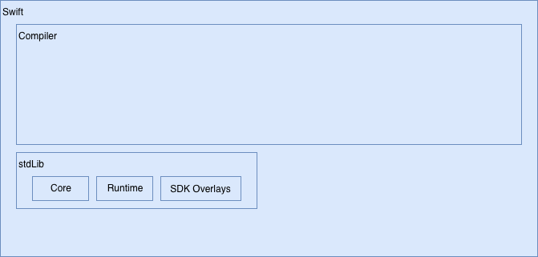
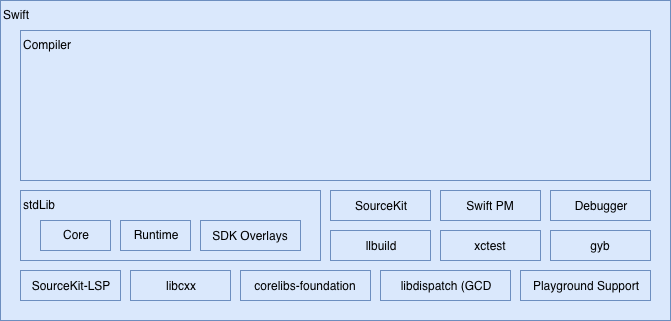
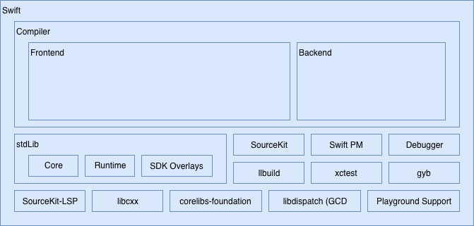
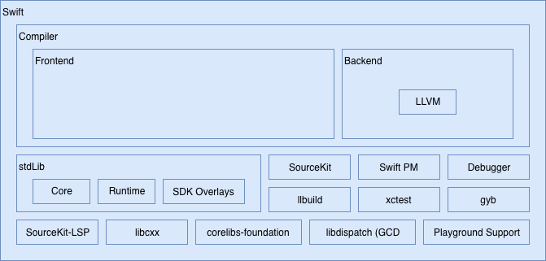
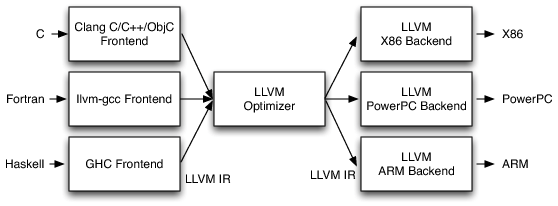

Устройство компилятора Swift. Часть 1 / Блог компании e-Legion

Swift — это не только язык программирования. Это проект, в который помимо компилятора входит много других компонентов. Да и сам компилятор — это не большая и страшная коробка, которая с помощью магии превращает ваш код в набор понятных для машины инструкций. Его тоже можно разбить на компоненты. Если вам интересно, на какие именно — добро пожаловать под кат.

Я не специалист по компиляторам и не имею опыта в этой области. Но мне стало интересно, как же он работает, и я начал изучать компилятор Swift. Так как статья получилась слишком большая пришлось разделить её на 4 части:

  

*   общий обзор компонентов,
*   разбор исходного файла,
*   Swift intermediate language,
*   LLVM IR и кодогенерация.

  

Swift уже более двух лет является проектом с открытым исходным кодом. За это время в него было добавлено немало улучшений от комьюнити. Следить за ними можно на специальном [сайте](https://apple.github.io/swift-evolution), а так же на [форуме](https://forums.swift.org/). Там же можно обсудить предложения по улучшению языка или выложить свои идеи. Но чтобы это сделать, нужно сначала разобраться, как устроен проект.

  

Основными частями Swift, конечно же, являются компилятор и стандартная библиотека функций. Они развиваются параллельно и практически неотделимы друг от друга.

Компилятор написан на C++, а основная часть stdlib — на Swift. Однако язык, используемый в ней, имеет несколько особенностей:

  

*   Стандартная библиотека через модуль Builtin имеет прямой доступ к функциям компилятора. Это позволяет ей обращаться к низкоуровневым представлениям языка и «сырым» указателям.
*   В стандартной библиотеке не используется модификатор доступа private. Вместо этого имена сущностей, не являющиеся публичными, начинаются с подчёркивания. Подробнее можно прочитать [тут](https://github.com/apple/swift/blob/master/docs/AccessControlInStdlib.rst).
*   Используется кодогенерация с помощью утилиты [Generate Your Boilerplate](https://github.com/apple/swift/blob/master/utils/gyb.py) (GYB) для уменьшения повторений в коде стандартной библиотеки.

Стандартная библиотека обычно ассоциируется с контейнерами и полезными функциями, упрощающими жизнь разработчику, но это лишь одна из её частей. Всего можно выделить 3 наиболее интересных компонента:

  

*   Core. Ядро со всеми её протоколами, типами данных и функциями. [Исходники](https://github.com/apple/swift/tree/master/stdlib/public/core).
*   Runtime. Промежуточный слой между стандартной библиотекой и компилятором. Он отвечает за приведение типов, работу с памятью, рефлексию и другие динамические возможности языка. Написан на C++ и Objective-C. [Исходники](https://github.com/apple/swift/tree/master/stdlib/public/runtime).
*   SDK Overlays. Обёртки над Foundation и другими системными фреймворками, которые делают обращение к ним из Swift более удобным. [Исходники](https://github.com/apple/swift/tree/master/stdlib/public/Darwin).

  

Помимо компилятора и стандартной библиотеки в открытом доступе находится множество других подпроектов. Некоторые из них перечислены ниже.

  

### SourceKit

[Фреймворк для поддержки IDE](https://github.com/apple/swift/tree/master/tools/SourceKit): индексация, подсветка синтаксиса, автодополнение кода и так далее.

  

### SourceKit-LSP

[Реализация LSP для Swift](https://github.com/apple/sourcekit-lsp), созданная на основе SourceKit. О том, что это такое, можно почитать [тут](https://microsoft.github.io/language-server-protocol/).

  

### Swift Package Manager

[Пакетный менеджер](https://github.com/apple/swift-package-manager) для проектов на Swift.

  

### Foundation

[Порт библиотеки Foundation](https://github.com/apple/swift-corelibs-foundation), которая является одной из основных для ОС от Apple под сторонние платформы.

  

### libdispatch (GCD)

[GCD](https://github.com/apple/swift-corelibs-libdispatch) для сторонних платформ.

  

### XCTest

[XCTest](https://github.com/apple/swift-corelibs-xctest) для сторонних платформ.

  

### LLDB

[LLDB](https://github.com/apple/swift-lldb) с поддержкой Swift и REPL.

  

### Playground Support

В [проект](https://github.com/apple/swift-xcode-playground-support) входят два фреймворка — PlaygroundSupport и PlaygroundLogger. Они обеспечивают взаимодействие с Xcode и красивое отображение данных соответственно.

  

### llbuild

[Билд-система](https://github.com/apple/swift-llbuild).

  

### gyb

[Утилита](https://github.com/apple/swift/blob/master/utils/gyb.py) для кодогенерации.

  

### libcxx

[Реализация](https://github.com/apple/swift-libcxx) стандартной библиотеки C++.

  

Компилятор в широком понимании — программа, преобразующая код из одного языка в другой. Но чаще компиляцией называют преобразование исходного кода именно в машинный (или в другое низкоуровневое представление), который можно потом использовать для создания исполняемого файла.

Компилятор часто делят на три части: frontend, middlend, backend. Первая отвечает за преобразование исходного кода в промежуточное представление, с которым удобно работать компилятору. Middlend выполняет оптимизацию, а бекенд генерирует машинный код из оптимизированного промежуточного представления.

Однако в Swift оптимизация выполняется и во фронтенде, и (большая часть) в бекенде. Поэтому промежуточный шаг на схеме не показан.

  

В качестве бекенда в компиляторе Swift используется LLVM. LLVM — это большой проект, включающий в себя множество технологий. В его основе лежит intermediate representation (IR). Это универсальное промежуточное представление кода, которое можно преобразовать в исполняемый код на любой платформе, поддерживаемой LLVM.

Если появится новая архитектура, то достаточно будет добавить в LLVM генерацию машинного кода из IR под эту платформу. После этого все языки, для которых есть компилятор с генерацией IR, будут поддерживать эту архитектуру.

С другой стороны, для создания компилятора под новый язык программирования достаточно написать трансляцию исходного кода в IR, а поддержку различных архитектур возьмёт на себя LLVM.

Ещё одним плюсом такой системы является то, что LLVM умеет оптимизировать промежуточное представление, и фронтенд может не заниматься оптимизацией. Это значительно упрощает разработку компилятора.

IR имеет три вида отображения:

  

*   Дерево объектов в памяти. Каждый объект соответствует определённой сущности в исходном коде: функции, оператору, строке, указателю и так далее. Это дерево создается фронтендом на этапе генерации IR.
*   Текстовое представление. IR можно вывести в виде низкоуровневого исходного кода. Его можно сохранить в файл и выполнить с помощью интерпретатора.
*   Сериализованный битовый формат «биткод» (не путать с байткодом, который используется, например, в Java). Его можно использовать в качестве конечного результата работы бекенда и передавать в линкер для оптимизации на уровне линковки. Преобразование в машинный код в этом случае будет осуществлено линкером.

[Линкер](https://en.wikipedia.org/wiki/Linker_(computing)) — программа, которая генерируюет исполняемый файл. Её описание выходит за рамки статьи.

Исходный код версии LLVM, используемой в Swift, можно найти [тут](https://github.com/apple/swift-llvm), а документацию — на официальном [сайте](http://llvm.org/).

Как видите, в Apple выложили в открытый доступ много интересных проектов. В следующей части я расскажу о разборе исходного файла и генерации AST.