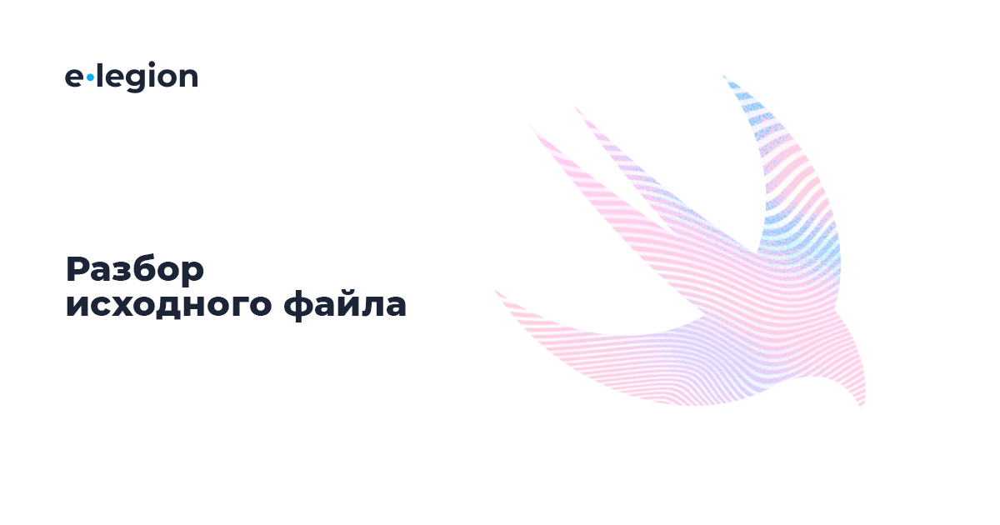
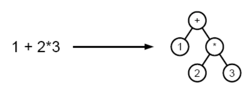

Устройство компилятора Swift. Часть 2 / Блог компании e-Legion

Вторая часть моего рассказа о компиляторе Swift. Мы начнём изучать фронтенд, а точнее те его части, которые отвечают за первоначальный разбор и анализ исходного кода.

Первую часть статьи можно найти [тут](https://habr.com/ru/company/e-Legion/blog/438204/).

  

Задача фронтенда — сгенерировать из исходного кода промежуточное представление и передать его в LLVM. Этот процесс можно разделить на 8 шагов. Результат работы почти каждого из них можно вывести, передав в компилятор специальный параметр.

Ниже я продемонстрирую реализацию компилятора для примитивного «языка программирования», который содержит только «области видимости» и число. Единственная его функция — вывод числа (если оно есть) в консоль. Например, в результате выполнения этого «кода» будет выведено число 678:

  

    {{{678}}}

Этот компилятор нужен только для того, чтобы вам было проще понять, что происходит на разных этапах. На реализацию настоящего, но простого языка можно посмотреть на примере [Kaledoscope](http://llvm.org/docs/tutorial/index.html).

Каждая область видимости состоит из открывающей скобки, содержимого и закрывающей скобки. Это можно записать так:

  

    scope ::= open_brace x close_brace
    open_brace ::= "{"
    close_brace ::= "}"

Содержимым может являться такая же область видимости, число, либо ничего, обозначенное тут**:  
**  

    scope ::= open_brace x close_brace
    x ::=  scope | number | <empty>
    open_brace ::= "{"
    close_brace ::= "}"

Символ | означает «или». Число состоит из одной или более цифр:

  

    scope ::= open_brace x close_brace
    x ::=  scope | number | <empty>
    open_brace ::= "{"
    close_brace ::= "}"
    number ::= digit | number digit
    digit :: = "0" | "1" | "2" | "3" | "4" | "5" | "6" | "7" | "8" | "9"

Такую запись называют формой Бэкуса-Наура (БНФ), а совокупность всех правил — грамматикой языка или синтаксисом.

Существует также расширенная БНФ (РБНФ). В неё были добавлены дополнительные специальные символы, например, круглые скобки для группировки.

Фигурные скобки обозначают повторения. Такая запись означает, что A либо пусто, либо равно любому количеству B:

  

    A ::= { B }

Квадратные скобки используются для условного вхождения. Такая запись означает, что A либо пусто, либо равно B:

  

    A ::= [B]

Используя РБНФ грамматику компилятора скобок, можно преобразовать в такой вид:

  

    scope ::= open_brace [scope | number] close_brace
    open_brace ::= "{"
    close_brace ::= "}"
    number ::= digit {digit}
    digit :: = "0" | "1" | "2" | "3" | "4" | "5" | "6" | "7" | "8" | "9"

Кроме компилятора скобок я покажу, как использовать компилятор Swift для получения результатов каждого из шагов на примере простейшего выражения:

  

    let x = 16

Код такой простой для того, чтобы было легче разобраться. Грамматика реального языка программирования гораздо сложнее, чем приведенная выше. Посмотреть на синтаксис Swift можно на официальном [сайте](https://docs.swift.org/swift-book/ReferenceManual/AboutTheLanguageReference.html).

  

С точки зрения компилятора файл с исходным кодом — это поток случайных символов, а может и какого-то мусора. Поэтому первый шаг — преобразование этих случайных символов в слова, которые допустимо использовать в языке программирования.

Этим занимается лексический анализатор (лексер/токенизатор). Слова, которые он ищет, называются лексемами или токенами (не будем вдаваться в ненужные детали и примем эти термины синонимами). Поэтому этот процесс также называют токенизацией.

Лексер производит анализ в соответствии с синтаксисом языка. Сканируя символ за символом, он находит соответствие исходного кода и правой части записи, а затем генерирует соответствующий токен из левой части.

  

### Пример реализации лексера

Грамматикой разрешены три токена: открывающая скобка, закрывающая скобка и число. Они представлены в виде перечисления. Как и список возможных ошибок:

  

    enum Token: CustomStringConvertible {
        case openBraceToken
        case closeBraceToken
        case number(Int)
    
        var description: String {
            switch self {
            case .openBraceToken:
                return "openBraceToken"
            case .closeBraceToken:
                return "closeBraceToken"
            case .number(let value):
                return "\(value)"
            }
        }
    }
    
    enum LexerError: Error {
        case unexpectedCharacted
        case invalidNumber
    }

В самом лексере хранятся входная строка и индекс текущего символа:

  

    class Lexer {
        private let string: String
        private var index: String.Index
        private var currentCharacter: Character? {
            return index != string.endIndex ? string[index] : nil
        }
    
        init(string: String) {
            self.string = string
            index = string.startIndex
        }

Анализ запускается вызовом метода **startAnalyze()**. В нём в цикле вызывается метод для получения следующего токена, который добавляется в массив. В конце — перехват ошибок распознавания:

  

    func startAnalyzing() -> [Token] {
        var result: [Token] = []
    
        do {
            while let token = try getNextToken() {
                result.append(token)
            }
        } catch LexerError.unexpectedCharacted {
            print("Unexpected character at index \(index.encodedOffset)")
            result = []
        } catch LexerError.invalidNumber {
            print("Invalid number at index \(index.encodedOffset)")
            result = []
        } catch {
            print("Unexpected error")
            result = []
        }
    
        return result
    }

Получение токена состоит из проверки текущего символа и передвижения индекса вперёд на один или несколько символов:

  

    private func getNextToken() throws -> Token? {
        guard let character = currentCharacter else {
            return nil
        }
    
        switch character {
        case "{":
            return getOpenBrace()
        case "}":
            return getCloseBrace()
        default:
            break
        }
    
        if let scalar = character.unicodeScalars.first,
            CharacterSet.decimalDigits.contains(scalar) {
    
            return try getNumber()
        }
    
        throw LexerError.unexpectedCharacted
    }
    
    private func getOpenBrace() -> Token {
        moveIndex()
        return Token.openBraceToken
    }
    
    private func getCloseBrace() -> Token {
        moveIndex()
        return Token.closeBraceToken
    }

Если будет найдена цифра, то для её парсинга вызовется метод **getNumber()**. Он просто собирает в одну строку все цифры и преобразует ее в Int:

  

    private func getNumber() throws -> Token {
        var numberString = ""
    
        while let character = currentCharacter,
            let scalar = character.unicodeScalars.first,
            CharacterSet.decimalDigits.contains(scalar) {
    
                numberString.append(character)
                moveIndex()
        }
    
        guard let number = Int(numberString) else {
            throw LexerError.invalidNumber
        }
    
        return Token.number(number)
    }

Для запуска лексера нужно передать ему строку с исходным кодом и вызвать метод **startAnalyze()**:

  

    let lexer = Lexer(string: "{{5678}}")
    let tokens = lexer.startAnalyzing()

Результат соответствует ожиданиям:

  

    [openBraceToken, openBraceToken, 5678, closeBraceToken, closeBraceToken]

В Swift лексер является частью парсера, и получить список токенов, соответствующих исходному коду, нельзя.

Исходный код:

  

*   [Lexer.h](https://github.com/apple/swift/blob/master/include/swift/Parse/Lexer.h)
*   [Lexer.cpp](https://github.com/apple/swift/blob/master/lib/Parse/Lexer.cpp)

  

Парсер осуществляет синтаксический анализ. На вход ему передается последовательность токенов, а результатом работы является AST.

AST — это граф, в котором вершинами являются операторы, а листьями — их операнды. Например, выражение 1 + (2*3) состоит из двух операторов: сложения и умножения. Первым операндом сложения является 1, а вторым — результат произведения 2 и 3. Группирующие скобки в AST не используются, так как в них нет необходимости. Сам граф определяет вложенность операций:

Каждый узел может быть представлен, например, структурой или перечислением, содержащим дочерние элементы.

Во время формирования дерева парсер проверяет грамматику языка: корректная ли последовательность составлена из «слов». Например, строка **"{{}"** будет успешно разобрана лексером, однако является неверной, так как отсутствует вторая закрывающая скобка.

Парсер Swift является рекурсивным нисходящим парсером. Это значит, что он сначала находит внешнюю сущность, а потом рекурсивно анализирует её содержимое. Восходящий парсер сначала находит самую вложенную сущность, а потом поднимается вверх.

  

### Пример реализации парсера

Существует большое количество видов и реализаций парсеров. Ниже представлены простейшая реализация нисходящего и восходящего парсера для наглядной демонстрации разницы.

Общим для обоих парсеров будет перечисление, которое представляет одну из ошибок и узел AST:

  

    indirect enum ASTNode: CustomStringConvertible {
        case brace(childNode: ASTNode?)
        case number(value: Int)
    
        var description: String {
            switch self {
            case let .brace(childNode?):
                return "brace(\(childNode.description))"
            case .brace(nil):
                return "brace(nil)"
            case let .number(value):
                return "\(value)"
            }
        }
    }
    
    enum ParserError: Error {
        case expectedOpenBrace
        case expectedCloseBrace
        case expectedNumber
        case expectedEndOfArray
    }

  

### Нисходящий парсер

Нисходящий парсер хранит массив токенов и индекс текущего токена:

  

    class TopDownParser {
        private let tokens: [Token]
        private var index: Int
        private var currentToken: Token? {
            return index != tokens.endIndex ? tokens[index] : nil
        }
    
        init(tokens: [Token]) {
            self.tokens = tokens
            index = tokens.startIndex
        }

Единственный публичный метод — запуск парсинга. Сначала вызывается парсинг пары скобок. Так как корневой сущностью может быть только пара скобок (строка **"{}{}"** недопустима), этого достаточно. Дальнейший анализ будет произведен рекурсивно. Останется только проверить, что массив токенов пуст, и произвести перехват исключений:

  

    func startParsing() -> ASTNode? {
        var rootNode: ASTNode?
    
        do {
            rootNode = try parseBraces()
    
            guard currentToken == nil else {
                rootNode = nil
                throw ParserError.expectedEndOfArray
            }
        } catch ParserError.expectedCloseBrace {
            print("Expected close brace at index \(index)")
        } catch ParserError.expectedOpenBrace {
            print("Expected open brace at index \(index)")
        } catch ParserError.expectedEndOfArray {
            print("Expected end of tokens array at index \(index)")
        } catch {
            print("Unexpected error")
        }
    
        return rootNode
    }

При парсинге скобок сначала сканируется открывающая скобка, далее рекурсивно — содержимое внутри пары (если оно есть), а в конце — закрывающая скобка.

Важный момент: как только парсер видит открывающую скобку, он считает, что успешно нашёл очередную пару и можно переходить к анализу содержимого. Именно поэтому он идёт от внешних сущностей к внутренним.

  

    private func parseBraces() throws -> ASTNode? {
        try consumeOpenBrace()
        print("Pair found")
    
        let node: ASTNode?
        if let currentToken = self.currentToken,
            case .openBraceToken = currentToken {
    
            node = .brace(childNode: try parseBraces())
        } else if let currentToken = self.currentToken,
            case let .number(value) = currentToken {
    
            node = .brace(childNode: .number(value: value))
            try consumeNumber()
        } else {
            node = .brace(childNode: nil)
        }
    
        try consumeCloseBrace()
    
        return node
    }

Сканирование состоит из проверки токена и передвижения текущего индекса:

  

    private func consumeOpenBrace() throws {
        if let currentToken = self.currentToken,
            case .openBraceToken = currentToken {
    
            print("Open brace found")
            moveIndex()
        } else {
            throw ParserError.expectedOpenBrace
        }
    }

  

### Восходящий парсер

Реализация восходящего парсера немного сложнее. Ему нужно хранить свой стейт, стек токенов и таблицу переходов между стейтами.

Состояние представлено в виде перечисления. Оно нужно для того, чтобы учитывать предыдущие токены и правильно реагировать на появление нового. Так как данный пример очень простой, получилось так, что в первом состоянии парсер разбирает открывающие скобки, а во втором — закрывающие:

  

    class BottomUpParser {
        private enum State {
            case state1
            case state2
        }

Инициализируются парсер аналогично первому. Таблицы переходов как отдельной сущности нет. Ради упрощения её роль будет играть switch:

  

    private let tokens: [Token]
    private var index: Int
    private var state: State = .state1
    private var stack: [Token] = []
    private var rootNode: ASTNode?
    private var currentToken: Token? {
        return index != tokens.endIndex ? tokens[index] : nil
    }
    
    init(tokens: [Token]) {
        self.tokens = tokens
        index = tokens.startIndex
    }

Запуск анализа осуществляется также с помощью метода **startParsing()**. В нём каждый токен по очереди обрабатывается, а в конце вызывается проверка на то, что стек пустой и парсинг закончен успешно:

  

    func startParsing() -> ASTNode? {
        do {
            guard !tokens.isEmpty else {
                throw ParserError.expectedOpenBrace
            }
    
            while index != tokens.endIndex {
                try parseNextToken()
                moveIndex()
            }
    
            guard stack.isEmpty else {
                rootNode = nil
                throw ParserError.expectedCloseBrace
            }
        } catch ParserError.expectedCloseBrace {
            rootNode = nil
            print("Expected close brace at index \(index)")
        } catch ParserError.expectedOpenBrace {
            rootNode = nil
            print("Expected open brace at index \(index)")
        } catch ParserError.expectedEndOfArray {
            rootNode = nil
            print("Expected end of tokens array at index \(index)")
        } catch {
            rootNode = nil
            print("Unexpected error")
        }
    
        return rootNode
    }

Обрабатывается очередной токен в switch с учётом текущего состояния. Если пришла открывающая скобка и состояние равно 1, то она добавляется в стек. Если закрывающая — парсер проверяет есть ли для неё открывающая скобка в стеке, затем убирает её из стека и переходит в состояние 2. Переход во второе состояние осуществляется и при нахождении числа.

Парсер продолжает удалять из стека по одному элементу на каждую закрывающую скобку. Если в этот момент приходит открывающая скобка или число — это ошибка во входном массиве.

Важный момент: восходящий парсер считает, что нашёл пару только после того, как, погрузившись вниз иерархии, увидит закрывающую скобку при условии, что открывающая есть в стеке. Только после этого он будет искать содержащую её сущность, и так далее до корневой. Именно поэтому он называется восходящим.

  

    private func parseNextToken() throws {
        guard let currentToken = currentToken else {
            return
        }
    
        switch (state, currentToken) {
        case (.state1, .openBraceToken):
            print("Open brace found")
            stack.append(.openBraceToken)
        case (.state1, .number(let value)):
            if stack.isEmpty {
                throw ParserError.expectedOpenBrace
            } else {
                consumeNumber(value: value)
                state = .state2
            }
        case (.state1, .closeBraceToken):
            if stack.isEmpty {
                throw ParserError.expectedOpenBrace
            } else {
                consumeCloseBrace()
                state = .state2
            }
        case (.state2, .closeBraceToken):
            if stack.isEmpty {
                throw ParserError.expectedEndOfArray
            } else {
                consumeCloseBrace()
            }
        case (.state2, .number), (.state2, .openBraceToken):
            if stack.isEmpty {
                throw ParserError.expectedEndOfArray
            } else {
                throw ParserError.expectedCloseBrace
            }
        }
    }
    
    private func consumeCloseBrace() {
        print("Close brace found")
        _ = stack.popLast()
        print("Pair found")
    
        if rootNode == nil {
            rootNode = .brace(childNode: nil)
        } else {
            rootNode = .brace(childNode: rootNode)
        }
    }
    
    private func consumeNumber(value: Int) {
        rootNode = .number(value: value)
    }

Для запуска обоих парсеров нужно передать массив токенов, полученных от лексера, и вызывать метод **startParsing()**:

  

    let parserTD = TopDownParser(tokens: tokens)
    let ast1 = parserTD.startParsing()
    
    let parserBU = BottomUpParser(tokens: tokens)
    let ast2 = parserBU.startParsing()

Результат у обоих парсеров получился верным:

  

    brace(brace(5678))

  

### Использование парсера Swift

Для запуска парсера Swift нужно передать компилятору флаг **-dump-parse**:

  

    swiftc -dump-parse main.swift

Реальное AST имеет более сложную структуру, чем у парсера скобок. Но так как оно небольшое, в нём можно легко разобраться и найти целочисленный литерал 16 и константу **x**:

  

    (source_file
      (top_level_code_decl
        (brace_stmt
          (pattern_binding_decl
            (pattern_named 'x')
            (integer_literal_expr type='<null>' value=16))
    ))
      (var_decl "x" type='<null type>' let storage_kind=stored))

Эта форма AST является нетипизированным деревом. Поэтому у константы x не указан тип type=''. Если указать его явно — let x: Int = 16 дерево изменится, но тип всё равно не будет прописан:  

    (source_file
      (top_level_code_decl
        (brace_stmt
          (pattern_binding_decl
            (pattern_typed
              (pattern_named 'x')
              (type_ident
                (component id='Int' bind=none)))
            (integer_literal_expr type='<null>' value=16))
    ))
      (var_decl "x" type='<null type>' let storage_kind=stored))

Исходный код:

  

*   [Parser Headers](https://github.com/apple/swift/tree/master/include/swift/Parse)
*   [Parser Implementation files](https://github.com/apple/swift/tree/master/lib/Parse)

  

Дерево, полученное от парсера, является грамматически верным, но в нём всё ещё могут быть ошибки. Например, в ходе парсинга нельзя (нецелесообразно) определить, что переменная объявлена до использования. Этим занимается семантический анализатор. Он проходит по всему дереву и присваивает типы выражениям, проверяет поддержку протоколов, синтезирует для структур инициализаторы по умолчанию и многое другое.

  

### Использование семантического анализатора Swift

Для запуска семантического анализатора используется флаг **-dump-ast**:

  

    swiftc -dump-ast main.swift

Результат выполнения команды:

  

    (source_file
      (top_level_code_decl
        (brace_stmt
          (pattern_binding_decl
            (pattern_named type='Int' 'x')
            (call_expr implicit type='Int' location=main.swift:1:9 range=[main.swift:1:9 - line:1:9] nothrow arg_labels=_builtinIntegerLiteral:
              (constructor_ref_call_expr implicit type='(_MaxBuiltinIntegerType) -> Int' location=main.swift:1:9 range=[main.swift:1:9 - line:1:9] nothrow
                (declref_expr implicit type='(Int.Type) -> (_MaxBuiltinIntegerType) -> Int' location=main.swift:1:9 range=[main.swift:1:9 - line:1:9] decl=Swift.(file).Int.init(_builtinIntegerLiteral:) function_ref=single)
                (type_expr implicit type='Int.Type' location=main.swift:1:9 range=[main.swift:1:9 - line:1:9] typerepr='Int'))
              (tuple_expr implicit type='(_builtinIntegerLiteral: Int2048)' location=main.swift:1:9 range=[main.swift:1:9 - line:1:9] names=_builtinIntegerLiteral
                (integer_literal_expr type='Int2048' location=main.swift:1:9 range=[main.swift:1:9 - line:1:9] value=16))))
    ))
      (var_decl "x" type='Int' interface type='Int' access=internal let storage_kind=stored))

У константы появился тип **type='Int'**, а также уровень доступа. Инициализация константы немного усложнилась. Добавился вызов конструктора **_builtinIntegerLiteral**. Если представить это дерево в виде Swift кода, то получится:

  

    internal let x: Int = Int(_builtinIntegerLiteral: 16)

В следующем примере содержится ошибка:

  

    let x: Bool = 16

Если передать его в парсер, то он не обнаружит никаких отклонений:

  

    (source_file
      (top_level_code_decl
        (brace_stmt
          (pattern_binding_decl
            (pattern_typed
              (pattern_named 'x')
              (type_ident
                (component id='Bool' bind=none)))
            (integer_literal_expr type='<null>' value=16))
    ))
      (var_decl "x" type='<null type>' let storage_kind=stored))

А вот семантический анализатор укажет, что не так с переданным ему кодом:

  

    error: cannot convert value of type 'Int' to specified type 'Bool'
    let x: Bool = 16

Очевидно, что ошибка заключалась в попытке присвоить значение типа Int в константу типа Bool. Swift такое не позволяет. Спасибо семантическому анализатору.

Исходный код:

  

*   [Sema](https://github.com/apple/swift/tree/master/lib/Sema)

  

На данном этапе происходит импорт Clang модулей и маппинг C и Objective-C API в соответствующие вызовы из Swift.

Исходный код:

  

*   [Clang importer](https://github.com/apple/swift/tree/master/lib/ClangImporter)

Теперь у нас есть полностью разобранный исходный код, который прошёл первоначальную проверку. Но прежде чем переходить к генерации LLVM IR, нужно выполнить Swift специфичные оптимизации.

Полную версию исходного кода можно найти в [репозитории](https://github.com/ildar-gilfanov/BraceCompiler).