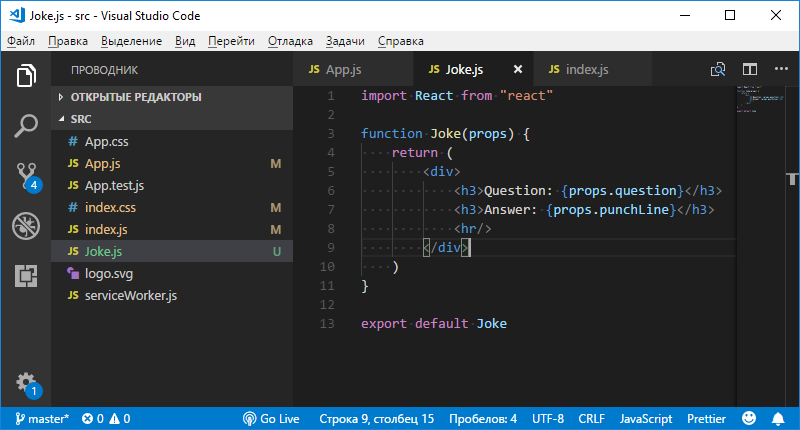
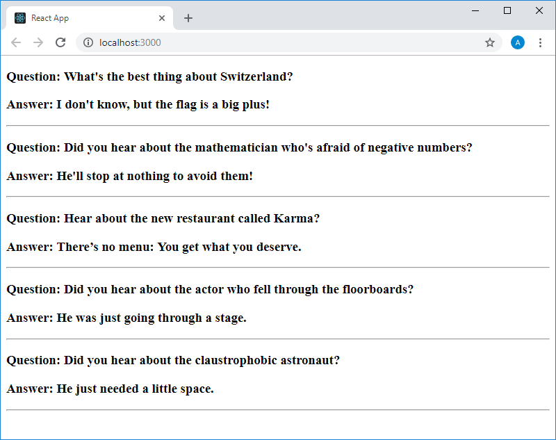
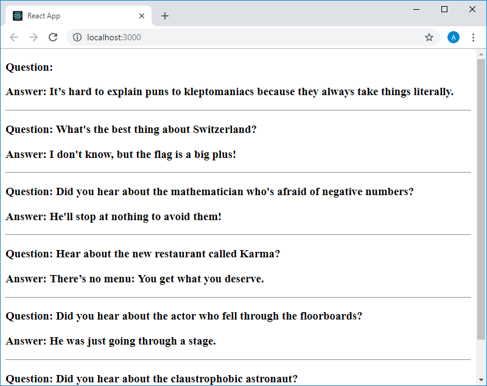
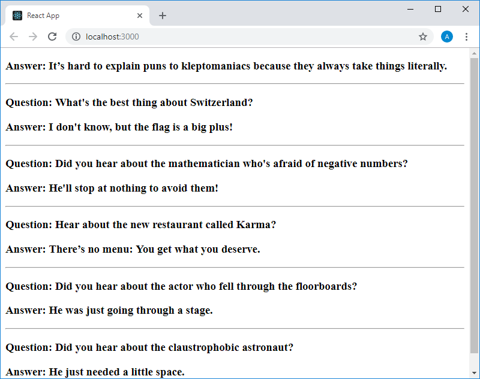

Учебный курс по React, часть 10: практикум по работе со свойствами компонентов и стилизации / Блог компании RUVDS.com

Сегодня, в десятой части перевода учебного курса по React, мы предлагаем вам выполнить практическое задание по работе со свойствами компонентов и по их стилизации.

→ [Часть 1: обзор курса, причины популярности React, ReactDOM и JSX](https://habr.com/post/432636/)  
→ [Часть 2: функциональные компоненты](https://habr.com/post/433400/)  
→ [Часть 3: файлы компонентов, структура проектов](https://habr.com/post/433404/)  
→ [Часть 4: родительские и дочерние компоненты](https://habr.com/company/ruvds/blog/434118/)  
→ [Часть 5: начало работы над TODO-приложением, основы стилизации](https://habr.com/company/ruvds/blog/434120/)  
→ [Часть 6: о некоторых особенностях курса, JSX и JavaScript](https://habr.com/company/ruvds/blog/435466/)  
→ [Часть 7: встроенные стили](https://habr.com/company/ruvds/blog/435468/)  
→ [Часть 8: продолжение работы над TODO-приложением, знакомство со свойствами компонентов](https://habr.com/company/ruvds/blog/435470/)  
→ [Часть 9: свойства компонентов](https://habr.com/company/ruvds/blog/436032/)  
→ [Часть 10: практикум по работе со свойствами компонентов и стилизации](https://habr.com/company/ruvds/blog/436890/)  
→ [Часть 11: динамическое формирование разметки и метод массивов map](https://habr.com/company/ruvds/blog/436892/)  
→ [Часть 12: практикум, третий этап работы над TODO-приложением](https://habr.com/company/ruvds/blog/437988/)  

## Занятие 20\. Практикум. Свойства компонентов, стилизация

→ [Оригинал](https://scrimba.com/p/p7P5Hd/cbykBfa)

### ▍Задание

  

1.  Создайте новый проект React-приложения.
2.  Выведите на странице приложения компонент `App`, код которого должен находиться в отдельном файле.
3.  Компонент App должен выводить 5 компонентов `Joke`, содержащих анекдоты. Выведите эти компоненты так, как вам хочется.
4.  Каждый компонент `Joke` должен принимать и обрабатывать свойство `question`, для основной части анекдота, и свойство `punchLine` — для его ключевой фразы.

  

### ▍Дополнительное задание

Некоторые анекдоты целиком состоят из ключевой фразы. Например: «It’s hard to explain puns to kleptomaniacs because they always take things literally». Подумайте над тем, как компонент `Joke` может вывести лишь переданное ему свойство `punchLine`, в том случае, если свойство `question` не задано. Поэкспериментируйте со стилизацией компонентов.

### ▍Решение

  

#### Основное задание

Файл `index.js` будет выглядеть вполне привычно:

    import React from "react"
    import ReactDOM from "react-dom"
    
    import App from "./App"
    
    ReactDOM.render(<App />, 
        document.getElementById("root"))

Вот код файла `App.js`:

    import React from "react"
    import Joke from "./Joke"
    
    function App() {
        return (
            

                <Joke 
                    question="What's the best thing about Switzerland?" 
                    punchLine="I don't know, but the flag is a big plus!"
                />
                
                <Joke 
                    question="Did you hear about the mathematician who's afraid of negative numbers?" 
                    punchLine="He'll stop at nothing to avoid them!"
                />
                
                <Joke 
                    question="Hear about the new restaurant called Karma?" 
                    punchLine="There’s no menu: You get what you deserve."
                />
                
                <Joke 
                    question="Did you hear about the actor who fell through the floorboards?" 
                    punchLine="He was just going through a stage."
                />
                
                <Joke 
                    question="Did you hear about the claustrophobic astronaut?" 
                    punchLine="He just needed a little space."
                />
                
            

        )
    }
    
    export default App

Обратите внимание на то, что, так как файл компонента `Joke` расположен в той же папке, что и файл компонента `App`, мы импортируем его командой `import Joke from "./Joke"`. Из `App` мы возвращаем несколько элементов, поэтому весь вывод нужно обернуть в некий тег, например — в тег `
`. Экземплярам компонента мы передаём свойства `question` и `punchLine`.

Вот код файла `Joke.js`:

    import React from "react"
    
    function Joke(props) {
        return (
            

                <h3>Question: {props.question}</h3>
                <h3>Answer: {props.punchLine}</h3>
                

            

        )
    }
    
    export default Joke

Здесь, при объявлении функции `Joke`, мы указываем параметр `props`. Напомним, что именно такое имя используется по сложившейся традиции. На самом деле оно может быть любым, но лучше называть его именно `props`.

Из компонента мы возвращаем несколько элементов — поэтому они заключены в тег `
`. С помощью конструкций `props.question` и `props.punchLine` мы обращаемся к свойствам, переданным экземпляру компонента при его создании. Эти свойства становятся свойствами объекта `props`. Они заключены в фигурные скобки из-за того, что JavaScript-код, используемый в JSX-разметке, нужно оформлять фигурными скобками. Иначе система примет имена переменных за обычный текст. После пары элементов `<h3>`, в одном из которых выводится основной текст анекдота, а в другой — его ключевая фраза, находится элемент `
`, описывающий горизонтальную линию. Такие линии будут выводиться после каждого анекдота, разделяя их.

Вот как выглядит проект приложения в VSCode.

_Приложение в VSCode_

Вот страница приложения.

_Страница приложения в браузере_

#### Дополнительное задание

Напомним, что основная цель дополнительного задания заключается в том, чтобы организовать правильный вывод анекдотов, которые целиком состоят из ключевой фразы. Это выражается в том, что, при создании экземпляра компонента `Joke`, ему передают лишь свойство `punchLine`, а свойство `question` не передают. Создание экземпляра подобного компонента выглядит так:

    <Joke 
        punchLine="It’s hard to explain puns to kleptomaniacs because they always take things literally."
    />

Если поместить этот код в верхнюю часть кода, возвращаемого компонентом `App`, то страница приложения примет следующий вид.

_Неправильно сформированная страница приложения_

Очевидно, проблема тут заключается в том, что, хотя компоненту не передано свойства `question`, он выводит текст, предваряющий основную часть каждого анекдота, после которого ничего уже не выводится.

Забегая вперёд отметим, что в будущих частях курса мы поговорим об условном рендеринге. С помощью этого подхода к рендерингу можно эффективно решать задачи, подобные нашей. Пока же мы попытаемся воспользоваться средствами стилизации страниц. А именно, сделаем так, чтобы, если компоненту не передаётся свойство `question`, соответствующий фрагмент возвращаемой им JSX-разметки не отображался бы на странице. Вот полный код компонента `Joke`, в котором реализован один из возможных подходов решения нашей проблемы средствами CSS:

    import React from "react"
    
    function Joke(props) {
        return (
            

                <h3 style={{display: props.question ? "block" : "none"}}>Question: {props.question}</h3>
                <h3>Answer: {props.punchLine}</h3>
                

            

        )
    }
    
    export default Joke

Первому элементу `<h3>` мы назначаем стиль, который определяется в процессе создания экземпляра компонента на основе наличия в объекте свойства `props.question`. Если это свойство в объекте есть, элемент принимает стиль `display: block` и выводится на страницу, если нет — `display: none` и на страницу не выводится. К тому же эффекту приведёт и использование такой конструкции:

    <h3 style={{display: !props.question && "none"}}>Question: {props.question}</h3>

Здесь стиль `display: none` назначается элементу в том случае, если у объекта `props` нет свойства `question`, в противном случае свойству `display` не назначается ничего.

Теперь страница приложения в браузере будет выглядеть так, как показано ниже.

_Правильная обработка компонентом ситуации, в которой ему не передают свойство question_

Можно заметить, что все элементы, формируемые компонентом `Joke`, выглядят одинаково. Подумаем над тем, как выделить те из них, которым передаётся лишь свойство `punchLine`. Решим эту задачу, используя встроенные стили, и тот подход, который мы рассмотрели выше. Вот обновлённый код компонента `Joke`:

    import React from "react"
    
    function Joke(props) {
        return (
            

                <h3 style={{display: !props.question && "none"}}>Question: {props.question}</h3>
                <h3 style={{color: !props.question && "#888888"}}>Answer: {props.punchLine}</h3>
                

            

        )
    }
    
    export default Joke

А вот как выглядит то, что теперь выводится на страницу приложения.

_Стилизация элемента, который отличается от других_

Теперь, после того, как мы поработали над компонентом `Joke`, он стал более универсальным и лучше подходящим для повторного использования.

## Итоги

На этом практическом занятии мы занимались отработкой навыков передачи компонентам свойств. Если проанализировать код приведённого здесь примера, можно заметить, что для вывода нескольких похожих блоков разметки приходится постоянно писать повторяющиеся фрагменты JSX-кода. На следующем занятии мы поговорим о том, как стандартными средствами JavaScript автоматизировать формирование подобных страниц, заодно разделив разметку и данные.

**Уважаемые читатели!** Если ваше решение задач этого практикума отличается от предложенного — просим о нём рассказать.

