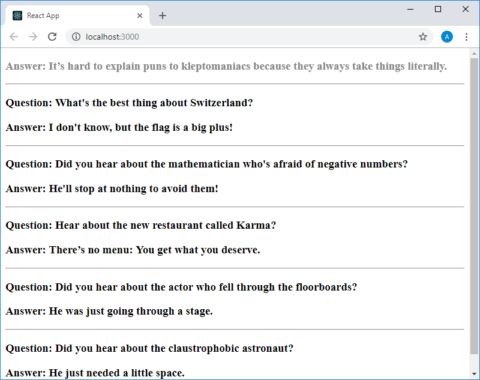
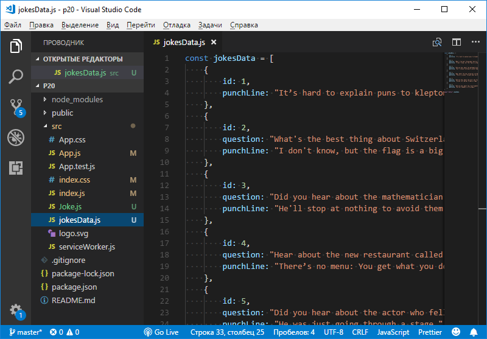

Учебный курс по React, часть 11: динамическое формирование разметки и метод массивов map / Блог компании RUVDS.com

В сегодняшней части перевода учебного курса по React мы поговорим об использовании стандартного метода массивов map() для организации динамического формирования JSX-разметки, описывающей наборы однотипных элементов.

→ [Часть 1: обзор курса, причины популярности React, ReactDOM и JSX](https://habr.com/post/432636/)  
→ [Часть 2: функциональные компоненты](https://habr.com/post/433400/)  
→ [Часть 3: файлы компонентов, структура проектов](https://habr.com/post/433404/)  
→ [Часть 4: родительские и дочерние компоненты](https://habr.com/company/ruvds/blog/434118/)  
→ [Часть 5: начало работы над TODO-приложением, основы стилизации](https://habr.com/company/ruvds/blog/434120/)  
→ [Часть 6: о некоторых особенностях курса, JSX и JavaScript](https://habr.com/company/ruvds/blog/435466/)  
→ [Часть 7: встроенные стили](https://habr.com/company/ruvds/blog/435468/)  
→ [Часть 8: продолжение работы над TODO-приложением, знакомство со свойствами компонентов](https://habr.com/company/ruvds/blog/435470/)  
→ [Часть 9: свойства компонентов](https://habr.com/company/ruvds/blog/436032/)  
→ [Часть 10: практикум по работе со свойствами компонентов и стилизации](https://habr.com/company/ruvds/blog/436890/)  
→ [Часть 11: динамическое формирование разметки и метод массивов map](https://habr.com/company/ruvds/blog/436892/)  
→ [Часть 12: практикум, третий этап работы над TODO-приложением](https://habr.com/company/ruvds/blog/437988/)

## Занятие 21\. Динамическое формирование разметки и метод массивов map

→ [Оригинал](https://scrimba.com/p/p7P5Hd/cDZbahv)

Продолжим работу с того момента, на котором мы остановились, выполняя предыдущее практическое задание. Напомним, что тогда код файла `App.js` выглядел следующим образом:

    import React from "react"
    
    import Joke from "./Joke"
    
    function App() {
        return (
            

                <Joke punchLine="It’s hard to explain puns to kleptomaniacs because they always take things literally." />
                
                <Joke 
                    question="What's the best thing about Switzerland?" 
                    punchLine="I don't know, but the flag is a big plus!"
                />
                
                <Joke 
                    question="Did you hear about the mathematician who's afraid of negative numbers?" 
                    punchLine="He'll stop at nothing to avoid them!"
                />
                
                <Joke 
                    question="Hear about the new restaurant called Karma?" 
                    punchLine="There’s no menu: You get what you deserve."
                />
                
                <Joke 
                    question="Did you hear about the actor who fell through the floorboards?" 
                    punchLine="He was just going through a stage."
                />
                
                <Joke 
                    question="Did you hear about the claustrophobic astronaut?" 
                    punchLine="He just needed a little space."
                />
                
            

        )
    }
    
    export default App

Компонент `App` выводит набор компонентов `Joke`. Вот как на данном этапе работы выглядит страница приложения.

_Страница приложения_

Некоторым из этих компонентов передаются свойства `question` и `punchLine`, а некоторым — только `punchLine`. Сейчас значения этих свойств заданы в коде создания экземпляров компонента `Joke` в виде обычного текста. В реальности же основной объём данных, которые выводят на страницы React-приложений, поступает в приложение в результате выполнения HTTP-запросов к неким API. Эти API поддерживаются средствами серверов, которые берут информацию из баз данных, оформляют её в виде JSON-кода и отправляют этот код клиентским частям приложений. Мы пока ещё не дошли до такого уровня, чтобы выполнять запросы к API, поэтому сейчас мы, в роли источника данных, воспользуемся файлом с данными, которые могли бы быть получены в результате разбора JSON-ответа сервера. А именно, это будет файл `jokesData.js` со следующим содержимым:

    const jokesData = [
        {
            id: 1,
            punchLine: "It’s hard to explain puns to kleptomaniacs because they always take things literally."
        },
        {
            id: 2,
            question: "What's the best thing about Switzerland?",
            punchLine: "I don't know, but the flag is a big plus!"
        },
        {
            id: 3,
            question: "Did you hear about the mathematician who's afraid of negative numbers?",
            punchLine: "He'll stop at nothing to avoid them!"
        },
        {
            id: 4,
            question: "Hear about the new restaurant called Karma?",
            punchLine: "There’s no menu: You get what you deserve."
        },
        {
            id: 5,
            question: "Did you hear about the actor who fell through the floorboards?",
            punchLine: "He was just going through a stage."
        },
        {
            id: 6,
            question: "Did you hear about the claustrophobic astronaut?",
            punchLine: "He just needed a little space."
        }
    ]
    
    export default jokesData

Этот файл будет расположен в директории `src` нашего проекта.

_Новый файл в папке src_

Фактически, в нём содержится массив объектов. Похожий массив можно получить, разобрав JSON-данные, полученные от некоего API. Мы экспортируем из этого файла массив `jokesData`. При необходимости мы можем импортировать этот файл в компонент, в котором он нужен, и представить себе, что работаем мы не с данными, взятыми из файла, а с тем, что вернуло нам некое API.

Теперь, когда у нас есть массив исходных данных, подумаем о том, как превратить эти данные в набор экземпляров React-компонентов.

Многие разработчики говорят о том, что благодаря освоению React они лучше изучили JavaScript. Причина подобного заключается в том, что действия, подобные тому, о котором мы будем сейчас говорить, в других фреймворках, вроде Angular и Vue, выполняются с помощью каких-то особых средств. А в React подобное делается с помощью обычного JavaScript.

В частности, мы планируем пользоваться некоторыми стандартными методами массивов, являющимися функциями высшего порядка. Эти методы могут, в качестве аргументов, принимать функции, описываемые программистами. Именно эти функции определяют то, что вызов того или иного стандартного метода сделает с элементами массива.

Предположим, у нас есть числовой массив:

    const nums = [1, 2, 3, 4, 5, 6, 7, 8, 9, 10]

Мы можем обработать этот массив с помощью стандартного метода массивов `map()`, передав ему некую функцию, которая задаёт порядок преобразования элементов этого массива. В нашем случае этой функции будут передаваться, по одному, числа из этого массива. Функция может делать с ними всё, что угодно, после чего то, что она возвратит, попадёт в новый массив, в элемент, индекс которого соответствует индексу обрабатываемого элемента. Если нам нужно сформировать новый массив, элементы которого представляют собой элементы исходного массива, умноженные на 2, то выглядеть это будет так:

    const doubled = nums.map(function(num) {
        return num * 2
    })

Проверим работу этого кода:

    console.log(doubled) 

Если раньше вы не встречались с [методами массивов](https://developer.mozilla.org/ru/docs/Web/JavaScript/Reference/Global_Objects/Array) — такими, как `map()`, `filter()`, `reduce()` и другие — рекомендуется с ними разобраться.

Здесь мы, для автоматического формирования списка экземпляров компонента, будем пользоваться методом `map()`.

Вернёмся к нашему примеру. Импортируем в файл `App.js` файл `jokesData.js`. Делается это так:

    import jokesData from "./jokesData"

После этого, в коде программы, мы сможем работать с массивом `jokesData`. А именно, мы собираемся воспользоваться методом `map()`. Вот как будет выглядеть «заготовка» этого метода.

    jokesData.map(joke => {
    
    })

Обратите внимание на то, что мы здесь передаём методу `map()` стрелочную функцию. В нашем случае это позволяет сделать код компактнее. Так как функция принимает всего один параметр (`joke`), мы, при её объявлении, можем обойтись без круглых скобок.

Из функции, передаваемой методу `map()`, мы хотим вернуть новый экземпляр компонента `Joke`, которому переданы свойства `question` и `punchLine` поступившего в неё элемента массива `jokesData`. Вот как это может выглядеть:

    jokesData.map(joke => {
        return (
        <Joke question={joke.question} punchLine={joke.punchLine} />
        )
    })

Этот код можно сократить, если учесть два факта. Во-первых, `return` возвращает лишь один элемент, поэтому можно поместить этот элемент сразу после `return`, избавившись от круглых скобок. Во-вторых, стрелочная функция содержит лишь операцию возврата некоего значения, поэтому при объявлении такой функции можно обойтись и без ключевого слова `return` и без фигурных скобок. Кроме того, вспомним о том, что в результате работы метода `map()` формируется новый массив. Этот массив нужно где-то сохранить. Все эти рассуждения приводят нас к следующему:

    const jokeComponents = jokesData.map(joke => <Joke question={joke.question} punchLine={joke.punchLine} />)

В константе `jokeComponents` теперь будет содержаться массив, каждый элемент которого представляет собой описание экземпляра компонента `Joke` с переданными ему свойствами `question` и `punchLine`.

Что нам теперь делать с этим массивом компонентов? React позволяет очень удобно работать с такими массивами. А именно, речь идёт о том, что такой массив можно использовать в JSX-коде. Вот как теперь будет выглядеть код файла `App`:

    import React from "react"
    
    import Joke from "./Joke"
    import jokesData from "./jokesData"
    
    function App() {
        const jokeComponents = jokesData.map(joke => <Joke question={joke.question} punchLine={joke.punchLine} />)
        
        
        return (
            

                {jokeComponents}
            

        )
    }
    
    export default App

Страница приложения после этого будет выглядеть так же, как и прежде, однако в консоли браузера можно будет увидеть следующее предупреждение:

    Warning: Each child in an array or iterator should have a unique "key" prop.
    
    Check the render method of `App`. See https:
    
        in Joke (at App.js:7)
        in App (at src/index.js:6)

Смысл его сводится к тому, что у элементов массива должно быть уникальное свойство `key`. Мы не будем вдаваться в подробности, касающиеся того, почему React ожидает наличия уникального свойства `key` у повторяющихся компонентов. Нам достаточно учесть тот факт, что выполняя операции массового создания экземпляров компонентов, наподобие той, которую мы только что выполняли с помощью метода `map()`, экземплярам нужно передавать свойство `key`. При этом такое свойство можно передать и самому экземпляру компонента, и, например, тегу `
`, в который заключён код компонента. Это особой роли не играет.

Итак, свойству `key` нужно назначить некое уникальное значение. Как правило, в объектах данных, получаемых из API, имеются некие идентификаторы (свойства наподобие `id`). Главное для нас — их уникальность. Например, мы могли бы назначить свойству `key` значение `joke.question` — все тексты в этих свойствах в нашем приложении уникальны. Но мы поступим иначе. Вспомните о том, как выглядят объекты с данными из массива, который мы экспортировали из файла `jokesData.js`. Вот его фрагмент:

    const jokesData = [
        {
            id: 1,
            punchLine: "It’s hard to explain puns to kleptomaniacs because they always take things literally."
        },
        {
            id: 2,
            question: "What's the best thing about Switzerland?",
            punchLine: "I don't know, but the flag is a big plus!"
        },
    ...
    
    ]

У каждого объекта есть свойство `id`, уникальность которого мы поддерживаем самостоятельно. Именно значения таких свойств и можно использовать в роли значений для свойства `key`.

Теперь код создания массива экземпляров компонента в `App.js` примет следующий вид:

    const jokeComponents = jokesData.map(joke => <Joke key={joke.id} question={joke.question} punchLine={joke.punchLine} />)

Если внести это изменение в код, взглянуть на страницу приложения в браузере и проверить содержимое консоли, то окажется, что уведомление о свойстве `key` исчезло.

После всех преобразований, которым мы подвергли проект, внешний вид страницы приложения не изменился. Однако код компонента `App` стал гораздо короче и понятней, а данные для формирования списка компонентов берутся теперь из чего-то, сильно напоминающего внешний источник данных. Именно по такой схеме работают настоящие приложения.

Кроме того надо отметить, что ядром вышеописанной модификации кода стало использование стандартного метода массивов `map()`. Мы пользовались методикой формирования списка экземпляров компонента `Joke` в компоненте `App`, но ничто не мешает нам, при необходимости, воспользоваться таким же подходом и в компоненте `Joke`, который может, на основе переданных ему данных, формировать собственный список экземпляров некоего компонента.

При этом, как мы уже говорили, среди стандартных методов массивов можно найти и другие интересные инструменты. Например, метод `sort()` можно использовать для сортировки элементов массивов по некоему признаку. Метод `filter()` можно использовать для отбора только тех элементов массива, которые соответствуют неким критериям. Всё это применимо и при работе с массивами, содержащими экземпляры компонентов.

Если хотите — можете поэкспериментировать с этими методами. Скажем, попытайтесь воспользоваться методом `filter()` и убрать из вывода, формируемого компонентом `App`, те экземпляры компонента `Joke`, свойство `question` которых не превышает заданную длину. Или сделайте так, чтобы в вывод попали бы только компоненты, для которых задано и свойство `question`, и свойство `punchLine`.

## Итоги

Сегодня мы поговорили об использовании стандартного метода массивов `map()` для формирования списков компонентов, а также обсудили возможности, которые даёт нам использование других стандартных методов массивов. В следующий раз вас ждёт практическое занятие по изученному сегодня материалу.

**Уважаемые читатели!** Как бы вы подошли к решению задачи по выводу компонентом App только тех экземпляров компонента Joke, длина значения свойства question которых превышает заданную длину?

