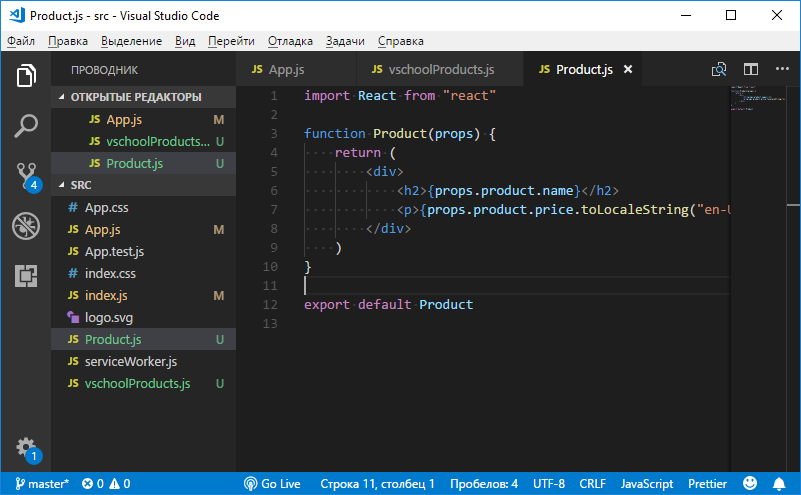
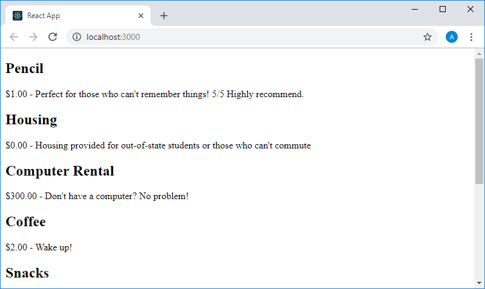
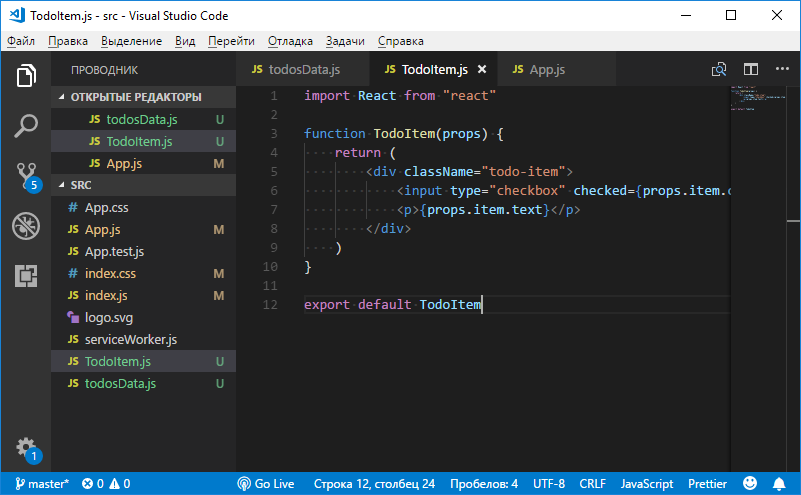
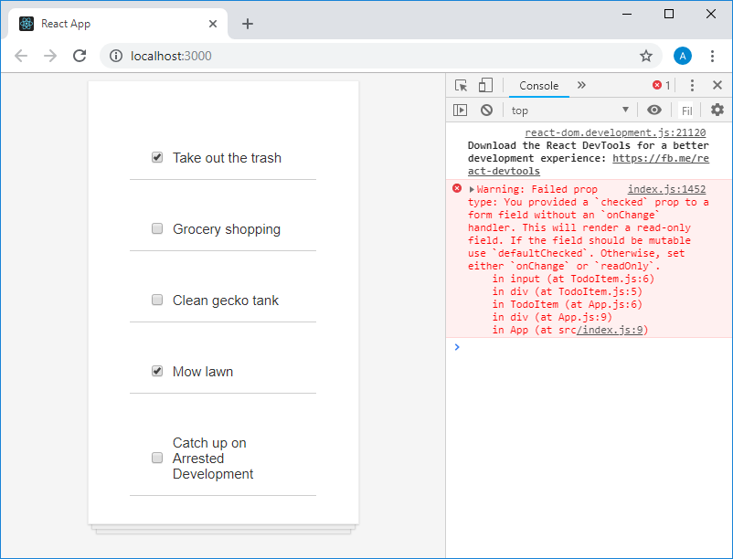

Учебный курс по React, часть 12: практикум, третий этап работы над TODO-приложением / Блог компании RUVDS.com

В сегодняшней части перевода курса по React мы предлагаем вам выполнить практическое задание по формированию наборов компонентов средствами JavaScript и продолжить работу над TODO-приложением.

→ [Часть 1: обзор курса, причины популярности React, ReactDOM и JSX](https://habr.com/post/432636/)  
→ [Часть 2: функциональные компоненты](https://habr.com/post/433400/)  
→ [Часть 3: файлы компонентов, структура проектов](https://habr.com/post/433404/)  
→ [Часть 4: родительские и дочерние компоненты](https://habr.com/company/ruvds/blog/434118/)  
→ [Часть 5: начало работы над TODO-приложением, основы стилизации](https://habr.com/company/ruvds/blog/434120/)  
→ [Часть 6: о некоторых особенностях курса, JSX и JavaScript](https://habr.com/company/ruvds/blog/435466/)  
→ [Часть 7: встроенные стили](https://habr.com/company/ruvds/blog/435468/)  
→ [Часть 8: продолжение работы над TODO-приложением, знакомство со свойствами компонентов](https://habr.com/company/ruvds/blog/435470/)  
→ [Часть 9: свойства компонентов](https://habr.com/company/ruvds/blog/436032/)  
→ [Часть 10: практикум по работе со свойствами компонентов и стилизации](https://habr.com/company/ruvds/blog/436890/)  
→ [Часть 11: динамическое формирование разметки и метод массивов map](https://habr.com/company/ruvds/blog/436892/)  
→ [Часть 12: практикум, третий этап работы над TODO-приложением](https://habr.com/company/ruvds/blog/437988/)

## Занятие 22\. Практикум. Динамическое формирование наборов компонентов

→ [Оригинал](https://scrimba.com/p/p7P5Hd/c6b6Lfm)

### ▍Задание

Взяв за основу стандартный проект React-приложения, формируемый `create-react-app`, и воспользовавшись приведённым ниже кодом файла с данными `vschoolProducts.js`, создайте приложение, которое выводит на странице список компонентов `Product`, формируемый с использованием стандартного метода массива `.map()` на основе данных из `vschoolProducts.js`.

Не забудьте, создавая экземпляры компонента, передавать им атрибут `key` с уникальным идентификатором, иначе система выдаст соответствующее предупреждение.

В процессе решения задачи можете пользоваться следующей заготовкой файла `App.js`:

    import React from "react"
    import productsData from "./vschoolProducts"
    
    function App() {
      return (
        

            
        

      )
    }
    
    export default App

Вот код файла `vschoolProducts.js`:

    const products = [
        {
            id: "1",
            name: "Pencil",
            price: 1,
            description: "Perfect for those who can't remember things! 5/5 Highly recommend."
        },
        {
            id: "2",
            name: "Housing",
            price: 0,
            description: "Housing provided for out-of-state students or those who can't commute"
        },
        {
            id: "3",
            name: "Computer Rental",
            price: 300,
            description: "Don't have a computer? No problem!"
        },
        {
            id: "4",
            name: "Coffee",
            price: 2,
            description: "Wake up!"
        },
        {
            id: "5",
            name: "Snacks",
            price: 0,
            description: "Free snacks!"
        },
        {
            id: "6",
            name: "Rubber Duckies",
            price: 3.50,
            description: "To help you solve your hardest coding problems."
        },
        {
            id: "7",
            name: "Fidget Spinner",
            price: 21.99,
            description: "Because we like to pretend we're in high school."
        },
        {
            id: "8",
            name: "Sticker Set",
            price: 14.99,
            description: "To prove to other devs you know a lot."
        }
    ]
    
    export default products

  

### ▍Решение

Вот код файла `App.js`:

    import React from "react"
    import Product from "./Product"
    import productsData from "./vschoolProducts"
    
    function App() {
        const productComponents = productsData.map(item => <Product key={item.id} product={item}/>)
        
        return (
            

                {productComponents}
            

        )
    }
    
    export default App

Обратите внимание на то, что свойство `id` объектов из файла с данными выводить на экран необязательно. Это свойство пригодилось нам для задания атрибута `key` создаваемых средствами метода `.map()` экземпляров компонента `Product`.

Вот код файла `Product.js`:

    import React from "react"
    
    function Product(props) {
        return (
            

                <h2>{props.product.name}</h2>
                
{props.product.price.toLocaleString("en-US", { style: "currency", currency: "USD" })} - {props.product.description}

            

        )
    }
    
    export default Product

Здесь мы, при выводе свойства, содержащего цену товара, которое видно в компоненте как `props.product.price`, используем метод `toLocaleString()`, средствами которого форматируем сумму товара.

Вот как выглядит проект приложения в VSCode.

_Приложение в VSCode_

А вот страница приложения в браузере.

_Страница приложения в браузере_

Обратите внимание на то, в каком виде представлена стоимость товаров.

## Занятие 23\. Практикум. TODO-приложение. Этап №3

→ [Оригинал](https://scrimba.com/p/p7P5Hd/c4dDqtg)

Здесь мы продолжаем работу над TODO-приложением, которой занимались [здесь](https://habr.com/company/ruvds/blog/434120/) и [здесь](https://habr.com/company/ruvds/blog/435470/). В частности, здесь вам будет предложено применить знания о динамическом формировании списков компонентов для создания списка дел, выводимого приложением.

### ▍Задание

Используя файл с данными о делах `todosData.js`, содержимое которого приведено ниже, создайте список компонентов `TodoItem` и выведите этот список в компоненте `App`. Обратите внимание на то, что вам нужно будет модифицировать код компонента `TodoItem` таким образом, чтобы он мог бы выводить передаваемые ему свойства.

Вот содержимое файла `todosData.js`:

    const todosData = [
        {
            id: 1,
            text: "Take out the trash",
            completed: true
        },
        {
            id: 2,
            text: "Grocery shopping",
            completed: false
        },
        {
            id: 3,
            text: "Clean gecko tank",
            completed: false
        },
        {
            id: 4,
            text: "Mow lawn",
            completed: true
        },
        {
            id: 5,
            text: "Catch up on Arrested Development",
            completed: false
        }
    ]
    
    export default todosData

  

### ▍Решение

Вот код файла `App.js`:

    import React from "react"
    import TodoItem from "./TodoItem"
    import todosData from "./todosData"
    
    function App() {
        const todoItems = todosData.map(item => <TodoItem key={item.id} item={item}/>)
        
        return (
            

                {todoItems}
            

        )
    }
    
    export default App

Вот код файла `TodoItem.js`:

    import React from "react"
    
    function TodoItem(props) {
        return (
            

                <input type="checkbox" checked={props.item.completed}/>
                
{props.item.text}

            

        )
    }
    
    export default TodoItem

Вот проект приложения в VSCode.

_Приложение в VSCode_

Надо отметить, что после завершения работ, предусмотренных этим практическим занятием, мы, несмотря на то, что оснастим приложение новыми возможностями, нарушим его функционал. В частности, речь идёт о состоянии флажков. Флажки, для настройки состояния которых использовалось свойство `props.item.completed`, установленное в значение `true`, будут установлены, флажки, для которых использовалось это же свойство, установленное в `false`, будут сняты. Но если щёлкнуть мышью по флажку на странице приложения — ничего не произойдёт, так как мы неправильно настроили соответствующий HTML-элемент. В консоли можно видеть предупреждение об этом.

_Страница приложения в браузере и предупреждение в консоли_

Позже мы будем говорить о формах и исправим наше учебное приложение при продолжении работы над ним.

## Итоги

На этом занятии у вас была возможность попрактиковаться в создании файлов компонентов, в работе со свойствами, передаваемыми экземплярам компонентов при их создании, и в использовании стандартного метода JavaScript-массивов `.map()`. Кроме того, тут мы продолжили работу над учебным приложением. В следующий раз поговорим о компонентах, основанных на классах.

**Уважаемые читатели!** Освоили ли вы методику использования метода JavaScript-массивов `.map()` для создания наборов компонентов?

