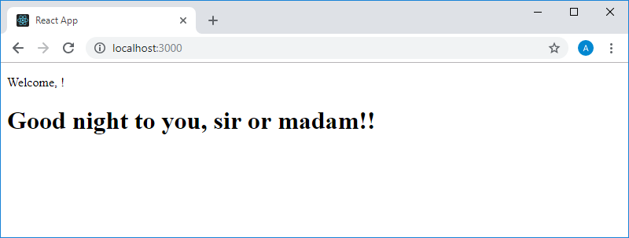
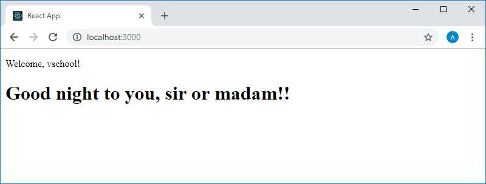
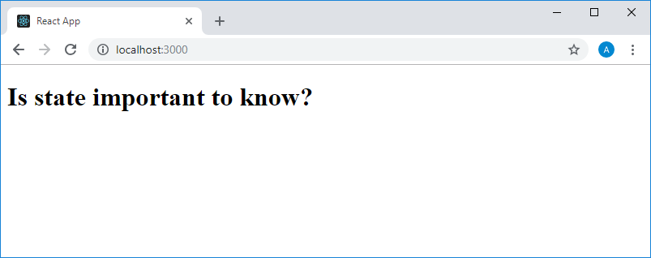
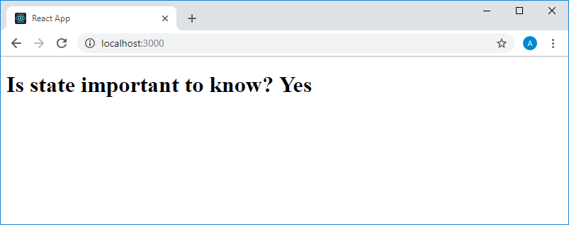

Учебный курс по React, часть 14: практикум по компонентам, основанным на классах, состояние компонентов / Блог компании RUVDS.com

В этой части перевода учебного курса по React мы предлагаем вам выполнить практическое задание по работе с компонентами, основанными на классах. После этого мы приступим к освоению такого важного понятия React, как состояние компонентов.

→ [Часть 1: обзор курса, причины популярности React, ReactDOM и JSX](https://habr.com/post/432636/)  
→ [Часть 2: функциональные компоненты](https://habr.com/post/433400/)  
→ [Часть 3: файлы компонентов, структура проектов](https://habr.com/post/433404/)  
→ [Часть 4: родительские и дочерние ко��поненты](https://habr.com/company/ruvds/blog/434118/)  
→ [Часть 5: начало работы над TODO-приложением, основы стилизации](https://habr.com/company/ruvds/blog/434120/)  
→ [Часть 6: о некоторых особенностях курса, JSX и JavaScript](https://habr.com/company/ruvds/blog/435466/)  
→ [Часть 7: встроенные стили](https://habr.com/company/ruvds/blog/435468/)  
→ [Часть 8: продолжение работы над TODO-приложением, знакомство со свойствами компонентов](https://habr.com/company/ruvds/blog/435470/)  
→ [Часть 9: свойства компонентов](https://habr.com/company/ruvds/blog/436032/)  
→ [Часть 10: практикум по работе со свойствами компонентов и стилизации](https://habr.com/company/ruvds/blog/436890/)  
→ [Часть 11: динамическое формирование разметки и метод массивов map](https://habr.com/company/ruvds/blog/436892/)  
→ [Часть 12: практикум, третий этап работы над TODO-приложением](https://habr.com/company/ruvds/blog/437988/)  
→ [Часть 13: компоненты, основанные на классах](https://habr.com/ru/company/ruvds/blog/437990/)  
→ [Часть 14: практикум по компонентам, основанным на классах, состояние компонентов](https://habr.com/ru/company/ruvds/blog/438986/)  

## Занятие 25\. Практикум. Компоненты, основанные на классах

→ [Оригинал](https://scrimba.com/p/p7P5Hd/crV6eSv)

### ▍Задание

Ниже представлен код, который нужно поместить в файл `index.js` стандартного React-приложения, созданного средствами `create-react-app`. Преобразуйте функциональные компоненты, которые вы встретите в этом коде, в компоненты, основанные на классах, и, кроме того, найдите и исправьте небольшую ошибку.

Код файла `index.js`:

    import React from "react"
    import ReactDOM from "react-dom"
    
    
    function App() {
        return (
            

                <Header />
                <Greeting />
            

        )
    }
    
    
    function Header(props) {
        return (
            <header>
                
Welcome, {props.username}!

            </header>
        )
    }
    
    
    function Greeting() {
        const date = new Date()
        const hours = date.getHours()
        let timeOfDay
        
        if (hours < 12) {
            timeOfDay = "morning"
        } else if (hours >= 12 && hours < 17) {
            timeOfDay = "afternoon"
        } else {
            timeOfDay = "night"
        }
        return (
            <h1>Good {timeOfDay} to you, sir or madam!</h1>
        )
    }
    
    ReactDOM.render(<App />, document.getElementById("root"))

  

### ▍Решение

Для начала посмотрим на то, что выдаёт приложение в его исходном виде, открыв его в браузере.

_Страница исходного приложения в браузере_

Видно, что верхняя строка, которая выводится на странице, выглядит неправильно. После запятой, следующей за Welcome, очевидно, должно быть нечто вроде имени пользователя.

Если проанализировать код приложения, то окажется, что эту строчку выводит компонент `Header`, ожидая получить свойство `username`, задаваемое при создании его экземпляра. Экземпляр этого компонента создаётся в компоненте `App`. Выяснив это, мы сможем исправить ту самую ошибку, о которой шла речь в задании.

Надо отметить, что компоненты обычно размещают в разных файлах, но в данном случае мы описали их все в одном файле.

Приступим к преобразованию функционального компонента `App` в компонент, основанный на классе. Для этого достаточно привести его код к такому виду:

    class App extends React.Component {
        render() {
            return (
                

                    <Header username="vschool"/>
                    <Greeting />
                

            )    
        }
    }

Перед именем компонента теперь идёт ключевое слово `class`, дальше следует команда `extends React.Component`, после чего, в фигурных скобках, описывается тело класса. Здесь должен присутствовать метод `render()`, возвращающий то, что мы возвращали из функционального компонента. По такому же принципу перерабатываются и другие компоненты. Обратите внимание на конструкцию `<Header username="vschool"/>`. Здесь мы передаём компоненту `Header` свойство `username` со значением `vschool`, исправляя тем самым ошибку, которая имеется в исходном приложении.

Как вы уже знаете, компонент `Header` ожидает получение свойства `username`, и в функциональном компоненте доступ к этому свойству осуществляется с помощью конструкции `props.username` (`props` в данном случае — это аргумент функции, описывающей компонент). В компонентах, основанных на классах то же самое выглядит как `this.props.username`. Вот переработанный код компонента `Header`:

    class Header extends React.Component {
        render() {
            return (
                <header>
                    
Welcome, {this.props.username}!

                </header>
            )    
        }
    }

Третий компонент, `Greeting`, немного отличается от других. Дело в том, что в нём, перед командой `return`, выполняются некоторые вычисления. При преобразовании его в компонент, основанный на классе, эти вычисления нужно поместить в метод `render()` до команды возврата. Вот код переработанного компонента `Greeting`:

    class Greeting extends Component {
        render() {
            const date = new Date()
            const hours = date.getHours()
            let timeOfDay
            
            if (hours < 12) {
                timeOfDay = "morning"
            } else if (hours >= 12 && hours < 17) {
                timeOfDay = "afternoon"
            } else {
                timeOfDay = "night"
            }
            return (
                <h1>Good {timeOfDay} to you, sir or madam!</h1>
            )
        }
    }

Обратите внимание на то, что при объявлении этого компонента использована такая конструкция: `class Greeting extends Component`. Часто так делают ради краткости кода, но для того, чтобы это сработало, нам нужно доработать команду импорта `react`, приведя её к такому виду:

    import React, {Component} from "react"

Вот как выглядит страница переработанного приложения в браузере.

_Страница переработанного приложения в браузере_

Собственно говоря, выглядит она так же, как и страница исходного приложения, а единственное заметное различие между этими страницами заключается в том, что теперь в первой строчке выводится переданное компоненту `Header` имя пользователя.

Вот полный код переработанного файла `index.js`:

    import React, {Component} from "react"
    import ReactDOM from "react-dom"
    
    
    class App extends React.Component {
        render() {
            return (
                

                    <Header username="vschool"/>
                    <Greeting />
                

            )    
        }
    }
    
    // #2
    class Header extends React.Component {
        render() {
            return (
                <header>
                    
Welcome, {this.props.username}!

                </header>
            )    
        }
    }
    
    // #3
    class Greeting extends Component {
        render() {
            const date = new Date()
            const hours = date.getHours()
            let timeOfDay
            
            if (hours < 12) {
                timeOfDay = "morning"
            } else if (hours >= 12 && hours < 17) {
                timeOfDay = "afternoon"
            } else {
                timeOfDay = "night"
            }
            return (
                <h1>Good {timeOfDay} to you, sir or madam!</h1>
            )
        }
    }
    
    ReactDOM.render(<App />, document.getElementById("root"))

Если выполнение этого практического задания не вызвало у вас сложностей — замечательно. Если же вы пока ещё не вполне освоились с компонентами, основанными на классах — уделите время на эксперименты с ними. Например, можете снова переделать компоненты, основанные на классах, в функциональные компоненты, а потом выполнить обратное преобразование.

## Занятие 26\. Состояние компонентов

→ [Оригинал](https://scrimba.com/p/p7P5Hd/cnKwVtE)

Состояние (state) — это невероятно важная концепция React. Если компонент нуждается в хранении каких-либо собственных данных и в управлении этими данными (в отличие от ситуации, когда данные ему передаёт родительский компонент, используя механизм свойств), используют состояние компонента. Сегодня мы рассмотрим основные понятия, касающиеся состояния компонентов.

Состояние — это всего лишь данные, которыми управляет компонент. В частности, это означает, что компонент может эти данные менять. При этом уже знакомые нам свойства, получаемые компонентом от родительского компонента, компонент-получатель изменить не может. Они, в соответствии с [документацией](https://reactjs.org/docs/components-and-props.html#props-are-read-only) React, иммутабельны (неизменяемы). Например, если попытаться, в компоненте, основанном на классе, использовать конструкцию наподобие `this.props.name = "NoName"` — мы столкнёмся с сообщением об ошибке.

Нужно отметить, что если некоему компоненту нужно работать с состоянием, то это должен быть компонент, основанный на классе. Поговорим о том, как оснастить компонент состоянием, начав работу со следующего фрагмента кода, представляющего собой содержимое файла `App.js` стандартного проекта, созданного средствами `create-react-app`:

    import React from "react"
    
    class App extends React.Component {
        render() {
            return (
                

                    <h1>Is state important to know?</h1>
                

            )
        }
    }
    
    export default App

Вот как выглядит страница приложения в браузере.

_Страница приложения в браузере_

Для того чтобы оснастить компонент состоянием сначала нужно создать конструктор класса. Он выглядит как метод класса `constructor()`. После этого код компонента будет выглядеть так:

    class App extends React.Component {
        constructor() {
            
        }
        
        render() {
            return (
                

                    <h1>Is state important to know?</h1>
                

            )
        }
    }
    Constructor()

Это специальный метод, встроенный в JavaScript, который предназначен для создания и инициализации объектов, основанных на классах. Собственно говоря, если при создании объекта нужно что-то инициализировать, соответствующие операции выполняются именно в методе `constructor()`.

Первое, что нужно сделать в коде конструктора — выполнить вызов конструктора родительского класса. Делается это с помощью функции `super()`. В конструкторе родительского класса могут выполняться некие операции по инициализации, результаты выполнения которых пригодятся и нашему объекту. Вот как теперь будет выглядеть конструктор нашего класса:

    constructor() {
        super()
    }

Теперь, для того, чтобы оснастить компонент состоянием, нам нужно, в конструкторе, добавить к экземпляру класса свойство `state`. Это свойство является объектом:

    constructor() {
        super()
        this.state = {}
    }

Здесь мы инициализировали его пустым объектом. Работать с состоянием в коде компонента можно, используя конструкцию `this.state`. Добавим в состояние новое свойство:

    constructor() {
        super()
        this.state = {
            answer: "Yes"
        }
    }

Подумаем теперь о том, как воспользоваться тем, что хранится в состоянии, в коде. Вспомним о том, что компонент выводит на экран вопрос `Is state important to know?`. В состоянии хранится ответ на этот вопрос. Для того чтобы добавить этот ответ после вопроса, нужно поступить так же, как мы обычно поступаем, добавляя JavaScript-конструкции в JSX-код. А именно, надо добавить в конец строки конструкцию `{this.state.answer}`. В результате полный код компонента будет выглядеть так:

    class App extends React.Component {
        constructor() {
            super()
            this.state = {
                answer: "Yes"
            }
        }
        
        render() {
            return (
                

                    <h1>Is state important to know? {this.state.answer}</h1>
                

            )
        }
    }

А вот как будет выглядеть страница приложения в браузере.

_Страница приложения в браузере_

Тут хотелось бы отметить, что состояние, которое получает компонент при инициализации, можно менять в процессе работы компонента. Кроме того, компоненты могут передавать состояние компонентам-потомкам с помощью уже известного вам механизма работы со свойствами. Например, в нашем случае, если предположить, что имеется некий компонент `ChildComponent`, данные из состояния ему можно передать так:

    <ChildComponent answer={this.state.answer}/>

Пока мы не будем подробно говорить о том, как менять данные, хранящиеся в состоянии компонента. Отметим лишь, что при вызове метода `setState()`, который используется для решения этой задачи, будет изменено не только состояние компонента, но и обновлены данные состояния, переданные через механизм свойств его дочерним компонентам. Кроме того, изменение состояния приведёт к тому, что данные из состояния, отображающиеся на странице приложения, автоматически изменятся.

## Итоги

Сегодня у вас была возможность поработать с компонентами, основанными на классах. Кроме того, здесь началось ваше знакомство с концепцией состояния компонентов. В следующий раз вас ждут практические задания по работе с состоянием.

**Уважаемые читатели!** Если вы используете React на практике — просим рассказать о том, как вы управляете состоянием компонентов. Используете ли вы для этого стандартные средства React или что-то другое?

