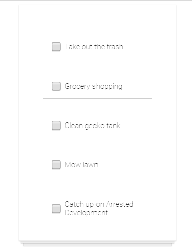
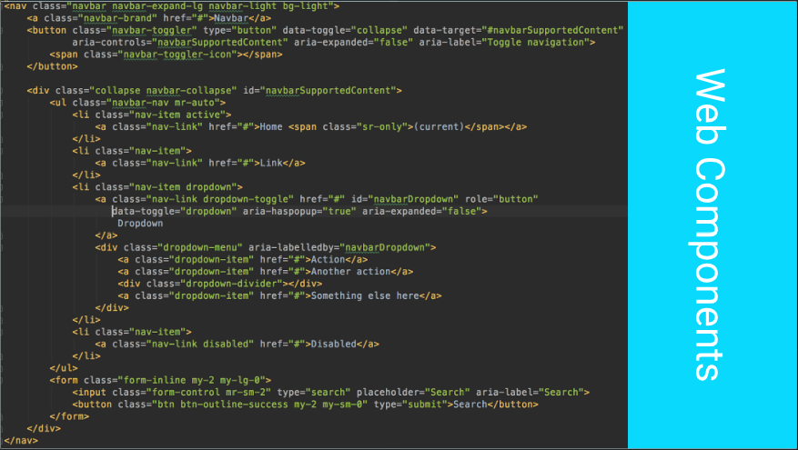
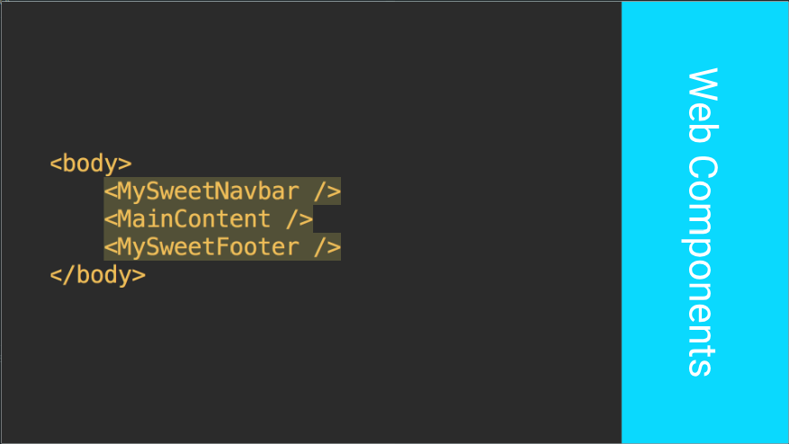
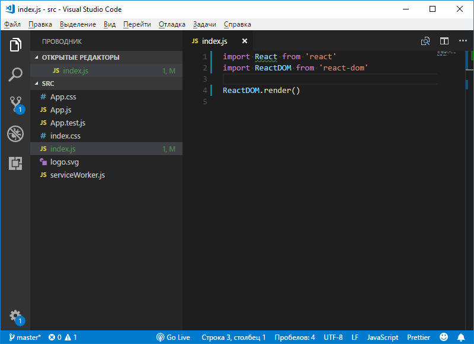

Учебный курс по React, часть 1: обзор курса, причины популярности React, ReactDOM и JSX / Блог компании RUVDS.com

Представляем вашему вниманию первые 5 занятий [учебного курса по React](https://scrimba.com/playlist/p7P5Hd) для начинающих. Оригинал курса на английском, состоящий из 48 уроков, опубликован на платформе Scrimba.com. Возможности этой платформы позволяют, слушая ведущего, иногда ставить воспроизведение на паузу и самостоятельно, в том же окне, в котором ведётся демонстрация, экспериментировать с кодом. Курс показался нам интересным, мы решили перевести его на русский и преобразовать в формат традиционных публикаций.

→ [Часть 1: обзор курса, причины популярности React, ReactDOM и JSX](https://habr.com/post/432636/)  
→ [Часть 2: функциональные компоненты](https://habr.com/post/433400/)  
→ [Часть 3: файлы компонентов, структура проектов](https://habr.com/post/433404/)

Полагаем, этот курс будет полезен всем, кто, что называется, «не умеет в React», но хочет научиться. В то же время, на то, чтобы превратить этот курс в обычные публикации, нужны немалые силы и время, поэтому мы, прежде чем принимать окончательное решение о запуске этого проекта, предлагаем всем желающим оценить курс и поучаствовать в опросе о целесообразности его перевода.  

## Занятие 1\. Обзор курса и рекомендации по его освоению

→ [Оригинал](https://scrimba.com/p/p7P5Hd/cBv8ruL)

Добро пожаловать на курс «Основы React». Меня зовут Боб Зиролл, я расскажу вам о том, как создавать фронтенд-проекты, используя один из самых популярных в мире веб-фреймворков. Я работаю в области компьютерного образования уже много лет, в частности, сейчас руковожу организацией учебного процесса в [V School](https://vschool.io/).

### ▍О процессе освоения курса

За годы разработки учебных курсов, направленных на то, чтобы помочь всем желающим быстро осваивать сложные вещи, я разработал собственный подход к обучению, о котором, думаю, полезно будет рассказать.

Для начала хочу отметить, что самый лёгкий и результативный способ изучить что угодно заключается в том, чтобы не жалеть сил и времени на практику. Если вы хотите научиться программировать — то чем раньше вы начнёте делать что-то сами, и чем чаще будете это делать — тем выше ваши шансы на успех.

Обычно, когда я ввожу в курс дела учащихся V School, я привожу им следующий пример из собственной жизни. Недавно меня потянуло на работу с деревом. Я читал книги, смотрел бесчисленные видео на YouTube, мне дарили инструменты. Но я не мог сделать ничего достойного до тех пор, пока не взял инструменты в руки. Только многие часы, потраченные на работу пилой и наждачной бумагой, на склеивание и свинчивание деталей, позволили мне приблизиться к цели. Собственно говоря, по такому же принципу устроено и освоение всего, чего угодно. Хотите изучить React? Пишите код.

Большинство занятий этого курса содержат упражнения. Ожидается, что вы постараетесь выполнять их самостоятельно. Если же вы, ознакомившись с заданием для самостоятельной работы, тут же перейдёте к описанию его решения, то вы, на самом деле, выберете самый сложный способ изучения React. Кроме того, не ждите, пока вам предложат попрактиковаться — берите инициативу на себя и пробуйте всё, о чём узнаёте. Старайтесь как можно больше самостоятельно работать с кодом. В частности, когда вы уже немного освоите React — создавайте нечто такое, что вам интересно, испытывайте всё, что вам любопытно испытать. Это позволит вам избежать такой неприятности, как «[tutorial hell](https://codeburst.io/digging-my-way-out-of-tutorial-hell-6dd5f9927384)».

Ещё один важный момент моего подхода заключается в интервальном обучении и в повторении пройденного материала. Это — важнейшие вещи, которые позволяют по-настоящему запомнить то, чему вы учитесь. Не рекомендуется с головой бросаться в изучение курса. Это — путь в тот самый «tutorial hell». При таком подходе возникает ощущение, как будто вы и правда что-то узнали, а в реальности же вы просто не в состоянии запомнить то, что «изучили».

Поэтому, продвигаясь по материалам, делайте частые перерывы. Речь идёт не о периодических перерывах в 5-10 минут, а кое о чём более масштабном. Изучите пару принципов, попрактикуйтесь в их использовании, а затем денёк передохните. Когда вы вернётесь к курсу, будет очень полезно повторить уже изученные материалы. Конечно, при таком подходе на то, чтобы освоить курс, уйдёт больше времени, но это чрезвычайно благотворно скажется на вашем обучении.  
Теперь давайте в двух словах обсудим то, чему вы научитесь, освоив этот курс.

### ▍Состав курса и предварительные требования

Вот перечень основных тем курса:

*   Компоненты. Говоря о React, нельзя избежать обсуждения концепции компонентов. Компоненты в React — это основной строительный блок для создания фрагментов HTML-кода, подходящих для повторного использования. И практически всё остальное, о чём мы будем говорить, имеет отношение к тому, как использовать эти компоненты для построения веб-приложений.
*   JSX. Это — синтаксическое расширение JavaScript, которое позволяет создавать компоненты, используя возможности HTML и JavaScript.
*   Стилизация компонентов. Стилизация позволяет придать компонентам привлекательный внешний вид.
*   Свойства и обмен данными в приложении. Свойства используются для передачи данных между компонентами.
*   Состояние. Механизмы состояния компонентов используются для хранения данных в приложении и для управления ими.
*   Обработка событий. События позволяют наладить интерактивные взаимоотношения с пользователями приложений.
*   Методы жизненного цикла компонентов. Эти методы позволяют программисту влиять на различные события, происходящие с компонентами.
*   Загрузка данных из внешних API с использованием протокола HTTP.
*   Работа с формами.

Для того чтобы продуктивно заниматься по этому курсу, вам нужно знать HTML, CSS и JavaScript (ES6).

## Занятие 2\. Учебные проекты

→ [Оригинал](https://scrimba.com/p/p7P5Hd/cWab7AV)

В процессе прохождения этого курса вы будете разрабатывать учебные проекты. Взглянем на некоторые из них.

Нашей первой разработкой будет стандартное TODO-приложение.

_TODO-приложение_

Может и выглядит оно скучновато, но в ходе его разработки будет задействовано множество возможностей, о которых мы будем говорить в курсе. По элементам списка дел можно будет щелкать, отмечая их как завершённые, и видеть, как меняется их внешний вид.

_Отмеченные дела в TODO-приложении_

А вот — наш курсовой проект — генератор мемов.

_Генератор мемов_

При работе с этим приложением в поля `Top Text` и `Bottom Text` вводят тексты, которые, соответственно, попадут в верхнюю и нижнюю часть изображения. По нажатию на кнопку `Gen` программа случайным образом выбирает изображение мема из соответствующего API и добавляет к нему текст. Вот пример работы этого приложения:

_Готовый мем_

## Занятие 3\. Зачем нужен React и почему его стоит изучать?

→ [Оригинал](https://scrimba.com/p/p7P5Hd/cep4DT4)

Зачем использовать React, если можно разработать веб-проект на чистом JavaScript? Если вы интересуетесь веб-разработкой, то, возможно, слышали о том, что React позволяет создавать очень быстрые приложения, производительность которых превышает то, что достижимо с использованием лишь JavaScript. Это достигается за счёт использования в React технологии, называемой Virtual DOM. Мы не будем вдаваться в подробности о Virtual DOM, если вы хотите познакомиться с этой технологией поближе, можете посмотреть [это](https://www.youtube.com/watch?v=BYbgopx44vo) видео.

Сейчас нам достаточно знать о том, что Virtual DOM помогает веб-приложениям работать гораздо быстрее, чем если бы при их разработки использовался обычный JS. Ещё одно по-настоящему замечательное преимущество, которое даёт нам React — это возможность создавать веб-компоненты, подходящие для повторного использования. Рассмотрим пример.

У нас имеется стандартный элемент `navbar` (навигационная панель) из библиотеки Bootstrap.

_Навигационная панель_

Если вы раньше не пользовались Bootstrap, то знайте, что это просто CSS-библиотека, которая даёт веб-разработчику красиво оформленные элементы. Тут примерно четыре десятка строк кода, всё это выглядит довольно громоздко, ориентироваться в таком коде непросто. Если включить всё это в состав HTML-страницы, на которой и так имеется много всего, код такой страницы окажется попросту перегруженным различными конструкциями.

Веб-компоненты React позволяют брать фрагменты HTML-кода, оформлять их в виде самостоятельных компонентов, и, вместо того, чтобы добавлять на страницу эти фрагменты, включать в состав страниц нечто вроде особых HTML-тегов, указывающих на них. В нашем случае, вместо того, чтобы добавлять на страницу сорок строк HTML-разметки, достаточно включить в её состав компонент, содержащий эту разметку. У нас он называется `MySweetNavbar`.

_Компонентный подход к формированию веб-страниц_

Назвать такой компонент можно как угодно. Как видно, разметку страницы, основанную на компонентах, гораздо легче читать. Разработчик сразу видит общую структуру такой страницы. В данном случае, как можно понять из содержимого тега `<body>`, в верхней части страницы находится навигационная панель (`MySweetNavbar`), в середине размещено основное содержимое (`MainContent`), а в нижней части страницы имеется подвал (`MySweetFooter`).

Кроме того, компоненты не только улучшают структуру кода HTML-страниц. Они ещё и подходят для повторного использования. Как быть, если на нескольких страницах нужна одна и та же навигационная панель? Как быть, если такие панели на разных страницах немного отличаются друг от друга? Что делать, если всё та же панель используется на множестве страниц, а в неё нужно внести некое изменение? Без использования компонентного подхода трудно дать достойные ответы на эти и на многие другие вопросы.

Ещё одной причиной популярности React можно считать тот факт, что разработкой и поддержкой этой библиотеки занимается Facebook. Это, по меньшей мере, означает, что React на постоянной основе, занимаются квалифицированные программисты. Популярность React, и то, что проект это опенсорсный, опубликованный на GitHub, означает ещё и то, что вклад в проект делают множество сторонних разработчиков. Всё это позволяет говорить о том, что React, в обозримом будущем, будет жить и развиваться.

Говоря о React, и, в частности, о том, почему эту библиотеку стоит изучать, нельзя не вспомнить об огромном рынке труда, связанном с этой библиотекой. В наши дни React-специалисты пользуются устойчивым спросом. Если вы изучаете React с целью найти работу в сфере фронтенд-разработки — это означает, что вы на правильном пути.

## Занятие 4\. Среда разработки, ReactDOM и JSX

→ [Оригинал](https://scrimba.com/p/p7P5Hd/cV7M2uR)

Здесь мы поговорим о том, как создать простейшее React-приложение с использованием ReactDOM и затронем некоторые ключевые моменты, касающиеся JSX. Но, прежде чем приступать к работе с кодом, поговорим о том, где этот код запускать.

### ▍Среда разработки

Для того чтобы экспериментировать с React-кодом, пожалуй, лучше всего будет развернуть полноценную локальную среду разработки. Для того чтобы это сделать, вы можете обратиться к недавно опубликованному нами материалу [React.js: понятное руководство для начинающих](https://habr.com/company/ruvds/blog/428077/), в частности, к его разделу Практика разработки React-приложений. А именно, для того чтобы приступить к экспериментам, нужно, с помощью `create-react-app`, создать новое приложение, после чего запустить локальный сервер разработки и приступить к редактированию кода. Если речь идёт о простейших примерах, то их код можно вводить прямо в стандартный файл `index.js`, убрав из него имеющийся в нём код или закомментировав его.

Содержимое файла `index.html` в проекте, создаваемом `create-react-app`, соответствует его содержимому в примерах, которые будут приводиться в данном курсе. В частности, речь идёт о наличии на странице элемента `
` с идентификатором `root`.

Ещё один вариант, который обычно подходит для каких-то совсем простых экспериментов, заключается в использовании онлайн-платформ наподобие codepen.io. Например, [вот](https://codepen.io/gaearon/pen/zKRGpo) демонстрационный проект React-приложения Дэна Абрамова. Суть подготовки Codepen-проекта к экспериментам с React заключается в подключении к нему библиотек `react` и `react-dom` (это можно сделать, щёлкнув по кнопке `Settings` в верхней части страницы, перейдя в появившемся окне в раздел `JavaScript` и подключив к проекту, предварительно найдя их с помощью встроенной системы поиска, нужные библиотеки).

Вполне возможно, что вам, для экспериментов, будет удобно пользоваться возможностями Scrimba. Для этого можете просто открыть страницу соответствующего занятия. Ссылки на эти страницы можно найти ниже заголовков с номерами и названиями занятий.

### ▍Первая программа

Надо отметить, что в наших примерах будут использоваться возможности ES6 (ES2015), поэтому вам весьма желательно в них ориентироваться. В частности, для того чтобы импортировать в проект библиотеку `react`, служит такая конструкция:

    import React from "react"

А так можно импортировать библиотеку `react-dom`:

    import ReactDOM from "react-dom"

Теперь воспользуемся методом `render() ReactDOM` для того чтобы вывести что-то на экран:

    ReactDOM.render()

Если вы решите использовать для экспериментов проект, созданный средствами `create-react-app`, то сейчас его файл `index.js` (открытый в VSCode), будет выглядеть так, как показано на следующем рисунке.

_Ввод кода в index.js_

Если у вас запущен сервер разработки и в браузере открыта страница `http://localhost:3000/`, то вы, сохранив такой `index.js`, вы увидите там сообщения об ошибках. Это, на данном этапе работы, совершенно нормально, так как мы пока не сообщили системе о том, что и куда мы хотим вывести командой `render()`.

На самом деле, сейчас пришло время разобраться с тем кодом, который мы только что написали. А именно, здесь мы импортировали в проект React, потом — ReactDOM — для того, чтобы возможностями этой библиотеки можно было бы воспользоваться для вывода чего-то на экран.

Метод `render()` принимает два аргумента. Первый будет тем, что мы хотим вывести, а второй — будет тем местом, куда мы хотим что-то вывести. Если это записать в виде псевдокода, то получится следующее:

    ReactDOM.render(ЧТО ВЫВОДИТЬ, КУДА ВЫВОДИТЬ)

То, что мы хотим вывести, должно быть каким-то образом привязано к некоей HTML-странице. Тот код, который мы будем писать, будет превращён в HTML-элементы, которые и попадут на страницу.

Вот как эта страница может выглядеть.

    <html>
        <head>
            <link rel="stylesheet" href="style.css">
        </head>
        <body>
            

            
        </body>
    </html>

Тут имеются все базовые элементы HTML-страницы, включая тег `<link>` и тег `<script>`.

Если вы пользуетесь `create-react-app`, то страница `index.html` будет выглядеть немного иначе. В частности, в её коде нет команды импорта `index.js`. Дело в том, что при сборке проекта связь `index.html` и `index.js` осуществляется [автоматически](https://stackoverflow.com/questions/42438171/create-react-app-index-html-and-index-js-connection).

Обратите внимание на элемент `
` с идентификатором `root`. Между открывающим и закрывающим тегами этого элемента React разместит всё, что мы создадим. Этот элемент можно считать контейнером для всего нашего приложения.

Если теперь вернуться к файлу `index.js` и к методу `render()` `ReactDOM`, его вторым аргументом, местом, куда надо выводить данные, будет указание на элемент `
` с идентификатором `root`. Тут мы воспользуемся обычным JavaScript, после чего второй аргумент метода Render будет выглядеть так:

    ReactDOM.render(ЧТО ВЫВОДИТЬ, document.getElementById("root"))

При таком подходе метод `render()` берёт первый аргумент и выводит то, что он описывает, в указанное место. Теперь займёмся этим первым аргументом. Начнём с простого элемента `<h1>`. И, как это обычно бывает при написании первой программы, добавим в него текст `Hello world!`:

    ReactDOM.render(<h1>Hello world!</h1>, document.getElementById("root"))

Если теперь обновить страницу браузера, то на ней будет выведен, в качестве заголовка первого уровня, заданный текст.

_Результат работы первой программы_

Тут у вас может возникнуть вопрос о том, почему это мы помещаем описание HTML-элемента в то место, где ожидается аргумент JavaScript-метода. Ведь JavaScript, столкнувшись с чем-то вроде `<h1>Hello world!</h1>`, вероятно, решит, что первый символ этого выражения представляет собой оператор «меньше», дальше, очевидно, идёт имя переменной, потом — оператор сравнения «больше». JavaScript не распознает в этой последовательности символов HTML-элемент, да он и не должен этого делать.

Разработчики React создали не только библиотеку, но и особый язык, который называется JSX. JSX очень похож на разновидность HTML. Дальше вы увидите, что практически весь JSX-код почти полностью совпадает с формируемой с его помощью HTML-разметкой. Различия между JSX и HTML, конечно, есть, и мы их постепенно обсудим.

Мы ввели довольно простую и короткую инструкцию, но в недрах React при её выполнении происходит много всего интересного. Так, эта инструкция преобразуется в её версию на JavaScript, осуществляется формирование HTML-кода, хотя в детали этого процесса мы тут не вдаёмся. Именно поэтому нам надо импортировать в проект не только `react-dom`, но и `react`, так как библиотека React — это именно то, что позволяет нам пользоваться JSX и сделать так, чтобы JSX-конструкции работали так, как ожидается. Если из нашего примера убрать строку `import React from "react"`, сохранить файл скрипта и обновить страницу, будет выведено сообщение об ошибке. В частности, `create-react-app` сообщит нам о том, что без доступа к React пользоваться JSX нельзя (`'React' must be in scope when using JSX  react/react-in-jsx-scope`).

Дело в том, что даже хотя в нашем примере React напрямую не используется, библиотека применяется для работы с JSX.

Ещё кое-что, касающееся работы с JSX, на что я хочу обратить ваше внимание, заключается в том, что нельзя рендерить JSX-элементы, следующие друг за другом. Предположим, что после элемента `<h1>` нужно вывести элемент `
`. Попробуем воспользоваться такой конструкцией:

    ReactDOM.render(<h1>Hello world!</h1>
This is a paragraph
, document.getElementById("root")) //неправильно

Если после этого обновить страницу — будет выведено сообщение об ошибке (в `create-react-app` это выглядит как `Parsing error: Adjacent JSX elements must be wrapped in an enclosing tag`). Суть этой ошибки заключается в том, что такие элементы должны быть обёрнуты в какой-то другой элемент. То, что получится в итоге, должно выглядеть как один элемент с двумя вложенными в него элементами.

Для того чтобы наш пример заработал, обернём код `<h1>Hello world!</h1>
This is a paragraph
` в элемент `
`:

    ReactDOM.render(
<h1>Hello world!</h1>
This is a paragraph

, document.getElementById("root"))

Если теперь обновить страницу, то всё будет выглядеть так, как ожидается.

_Два HTML-элемента на странице_

Для того чтобы привыкнуть к JSX, потребуется некоторое время, но после этого его использование окажется гораздо легче и удобнее, чем работа с HTML-элементами с использованием стандартных средств JavaScript. Например, для того чтобы стандартными средствами описать элемент `
` и настроить его содержимое, понадобится примерно следующее:

    var myNewP = document.createElement("p")
    myNewP.innerHTML = "This is a paragraph."

Потом нужно подключить его к элементу, который уже есть на странице. Это — образец императивного программирования, а то же самое, благодаря JSX, можно делать в декларативном стиле.

## Занятие 5\. Практикум. ReactDOM и JSX

→ [Оригинал](https://scrimba.com/playlist/p7P5Hd)

На прошлом занятии вы познакомились с ReactDOM и JSX, а теперь пришло время применить полученные знания на практике.

Все практические задания мы будем оформлять следующим образом. Сначала, в разделе с заголовком Задание, будет дано само задание, и, возможно, в разделе Подсказки, будут даны краткие рекомендации по его выполнению. Затем будет следовать раздел Решение. Рекомендуется приложить все усилия к тому, чтобы выполнить задание самостоятельно, а потом уже разбираться с приведённым решением.

Если вы чувствуете, что не справляетесь — вернитесь к предыдущему занятию, повторите соответствующий материал и попробуйте снова.

### ▍Задание

Напишите React-приложение, которое выводит на страницу маркированный список (тег `<ul>`). Этот список должен содержать три элемента (`<li>`) с любым текстом.

### ▍Подсказки

Сначала надо импортировать в проект необходимые библиотеки, а потом воспользоваться одной из них для вывода элементов, сформированных с помощью некоего JSX-кода, на страницу.

**Решение**

Для начала нужно импортировать в файл необходимые библиотеки. А именно — речь идёт о библиотеке `react`, и, так как мы собираемся выводить что-то на страницу, о библиотеке `react-dom`.

    import React from "react"
    import ReactDOM from "react-dom"

После этого надо воспользоваться методом `render()` объекта `ReactDOM`, передав ему описание элемента, который мы хотим вывести на страницу и указав место на странице, куда должен быть выведен этот элемент.

    ReactDOM.render(
      <ul>
        <li>1</li>
        <li>2</li>
        <li>3</li>
      </ul>,
      document.getElementById("root")
    )

Первый аргумент — это описание маркированного списка, второй — элемент страницы, в который он должен попасть — тег `
` с идентификатором `root`. HTML-код можно записать и в одну строку, но лучше оформить его так, как в нашем варианте решения.

Вот полный код решения:

    import React from "react"
    import ReactDOM from "react-dom"
    
    ReactDOM.render(
      <ul>
        <li>1</li>
        <li>2</li>
        <li>3</li>
      </ul>,
      document.getElementById("root")
    )

Со временем мы поговорим о том, как, используя аккуратные конструкции, выводить с помощью метода `render()` большие объёмы HTML-разметки.

  

## Итоги

Сейчас, после того, как вы ознакомились с первыми занятиями курса по React, просим вас принять участие в опросе.

Спасибо за внимание!

