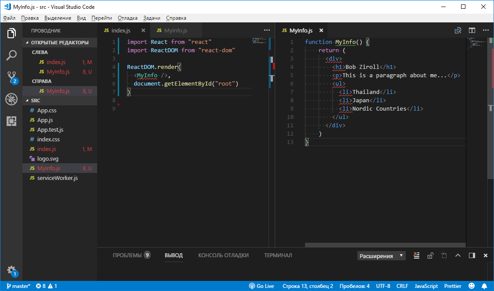
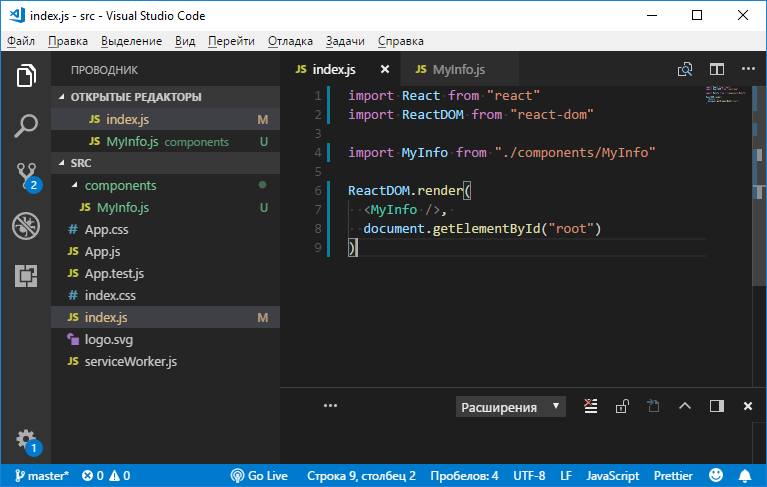

Учебный курс по React, часть 3: файлы компонентов, структура проектов / Блог компании RUVDS.com

В этом материале мы поговорим о файлах компонентов и о структуре React-проектов.

→ [Часть 1: обзор курса, причины популярности React, ReactDOM и JSX](https://habr.com/post/432636/)  
→ [Часть 2: функциональные компоненты](https://habr.com/post/433400/)  
→ [Часть 3: файлы компонентов, структура проектов](https://habr.com/post/433404/)

## Занятие 8\. Файлы компонентов, структура React-проектов

→ [Оригинал](https://scrimba.com/p/p7P5Hd/cQ7natG)  

### ▍Файлы компонентов

Если предположить, что вы выполняли задание из предыдущего практического занятия, используя стандартный проект, созданный `create-react-app`, то сейчас в нём задействован файл `index.html` из папки `public`, содержимое которого нас устраивает, и файл `index.js` из папки `src`, в котором мы пишем код. В частности, `index.js` выглядит сейчас примерно так:

    import React from "react"
    import ReactDOM from "react-dom"
    
    function MyInfo() {
      return (
        

          <h1>Bob Ziroll</h1>
          
This is a paragraph about me...

          <ul>
            <li>Thailand</li>
            <li>Japan</li>
            <li>Nordic Countries</li>
          </ul>
        

      )
    }
    
    ReactDOM.render(
      <MyInfo />, 
      document.getElementById("root")
    )

Обратите внимание на то, что код функционального компонента `MyInfo` содержится именно в этом файле. Как вы помните, React позволяет создавать множество компонентов, в этом кроется одна из его сильных сторон. Понятно, что разместить код большого количества компонентов в одном файле, хотя и технически реализуемо, на практике означает большие неудобства. Поэтому код компонентов, даже небольших по объёму, обычно оформляют в виде отдельных файлов. Именно такому подходу и рекомендуется следовать при разработке React-приложений.

Файлам компонентов дают имена, соответствующие именам компонентов, код которых эти файлы хранят. Размещают их, в случае с `create-react-app`, в той же папке `src`, где расположен файл `index.js`. При таком подходе файл с компонентом `MyInfo` получит имя `MyInfo.js`.

Создадим файл `MyInfo.js` и перенесём в него код компонента `MyInfo`, удалив его из `index.js`.

На данном этапе работы `index.js` будет выглядеть так:

    import React from "react"
    import ReactDOM from "react-dom"
    
    ReactDOM.render(
      <MyInfo />, 
      document.getElementById("root")
    )

Код `MyInfo.js` будет таким:

    function MyInfo() {
        return (
          

            <h1>Bob Ziroll</h1>
            
This is a paragraph about me...

            <ul>
              <li>Thailand</li>
              <li>Japan</li>
              <li>Nordic Countries</li>
            </ul>
          

        )
    }

Вот как всё это выглядит в VSCode.

_Перенос кода компонента в новый файл_

Код компонента из `index.js` мы перенесли, но получившаяся у нас сейчас структура пока ещё неработоспособна.

Во-первых, вспомните — для чего в `index.js` нужна команда `import React from "react"`, даже с учётом того, что мы напрямую к `React` здесь не обращаемся. Причина этого в том, что без импорта `React` не будут работать механизмы этой библиотеки, в частности — JSX. Именно благодаря этой команде импорта мы могли, на предыдущих занятиях, передавать методу `ReactDOM.render()` JSX-код и выводить HTML-разметку, создаваемую на его основе, на страницу. Всё это значит, что в файле `MyInfo.js` нам тоже нужно импортировать React. Это — обычная практика для файлов компонентов.

Во-вторых, нам нужно сделать так, чтобы функцией `MyInfo` из файла `MyInfo.js` можно было бы воспользоваться в других файлах приложения. Её для этого нужно экспортировать. Тут используются возможности стандарта ES6. В результате обновлённый код `MyInfo.js` принимает следующий вид:

    import React from "react"
    
    function MyInfo() {
        return (
          

            <h1>Bob Ziroll</h1>
            
This is a paragraph about me...

            <ul>
              <li>Thailand</li>
              <li>Japan</li>
              <li>Nordic Countries</li>
            </ul>
          

        )
    }
    
    export default MyInfo

Теперь поработаем над файлом `index.js`. А именно, нам нужно, чтобы компонент `MyInfo` был бы доступен в этом файле. Сделать его доступным в `index.js` можно, импортировав его.

Что если попробовать записать команду импорта компонента по образцу команд импорта `react` и `react-dom` в `index.js`? Например, внесём в файл такую команду импорта:

    import MyInfo from "MyInfo.js" 

Система, увидев такую команду, в частности, опираясь на то, что в ней отсутствуют сведения об относительном пути к файлу, будет искать зависимость проекта — модуль с именем, заданным при вызове этой команды ([вот](https://facebook.github.io/create-react-app/docs/installing-a-dependency) как устанавливать зависимости в проекты, созданные средствами `create-react-app`; эти зависимости потом можно импортировать в React-проекты так же, как была импортирована библиотека React). Такого модуля она не найдёт, в результате команда импорта не сработает. Поэтому команду импорта файла нужно переписать с указанием пути к нему. В данном случае нас устроит указание на текущую директорию (`./`) и команда импорта приобретёт следующий вид:

    import MyInfo from "./MyInfo.js" 

Кроме того, если говорить о команде `import`, важно учитывать, что она подразумевает то, что с её помощью импортируются JavaScript-файлы. То есть расширение `.js` вполне можно убрать, и команда `import`, приобретя вид, показанный ниже, не утратит работоспособности.

    import MyInfo from "./MyInfo" 

Обычно подобные команды импорта JS-файлов записывают именно так.

Вот полный код файла `index.js`.

    import React from "react"
    import ReactDOM from "react-dom"
    
    import MyInfo from "./MyInfo"
    
    ReactDOM.render(
      <MyInfo />, 
      document.getElementById("root")
    )

  

### ▍Структура проекта

При росте размеров и сложности React-проектов очень важно поддерживать в хорошем состоянии их структуру. В нашем случае, хотя наш проект сейчас и невелик, можно, в папке `src`, создать папку `components`, предназначенную для хранения файлов с кодом компонентов.

Создадим такую папку и переместим в неё файл `MyInfo.js`. После этого нужно будет отредактировать команду импорта этого файла в `index.js`.

А именно, сейчас путь к `MyInfo.js` указывает на то, что этот файл находится там же, где и `index.js`, но на самом деле файл этот теперь находится в папке `components`, находящейся в той же папке, что и `index.js`. В результате относительный путь к нему в `index.js` будет выглядеть так: `./components/MyInfo`. Вот каким будет обновлённый код `index.js`:

    import React from "react"
    import ReactDOM from "react-dom"
    
    import MyInfo from "./components/MyInfo"
    
    ReactDOM.render(
      <MyInfo />, 
      document.getElementById("root")
    )

А вот как всё это выглядит в VSCode.

_Папка для хранения компонентов и импорт компонента из этой папки в VSCode_

На самом деле, одна папка `components`, предназначенная для размещения кода всех компонентов — это пример чрезвычайно упрощённой структуры проекта. В реальных проектах, для обеспечения удобства работы с большим количеством сущностей, используются гораздо более сложные структуры папок. То, какими именно будут эти структуры, зависит от нужд проекта и от личных предпочтений программиста.

Рекомендуется поэкспериментировать со всем тем, о чём вы сегодня узнали. Например, можете попробовать переместить файл `MyInfo.js` в какую-нибудь папку и посмотреть — что из этого выйдет, можно попытаться переименовать его, поменять в нём какой-то код. Когда в ходе подобных экспериментов правильная работа проекта будет нарушена — полезно будет разобраться в проблеме и снова привести проект в работоспособное состояние.

## Итоги

На этом занятии мы поговорили об оформлении кода компонентов в виде отдельных файлов, об экспорте и импорте кода средствами ES6 и о структуре React-проектов. В следующий раз мы продолжим знакомиться с возможностями компонентов.

**Уважаемые читатели!** Просим опытных React-разработчиков поделиться с новичками идеями по поводу организации структуры проектов.

