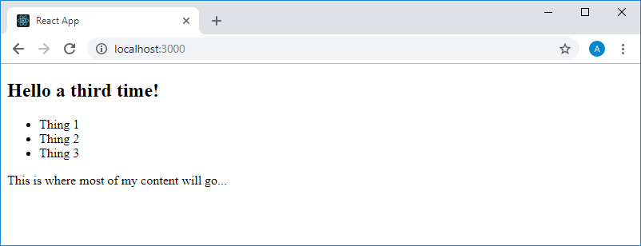
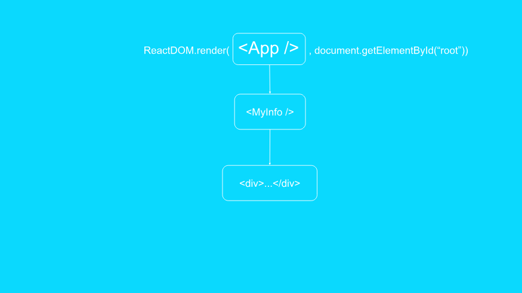
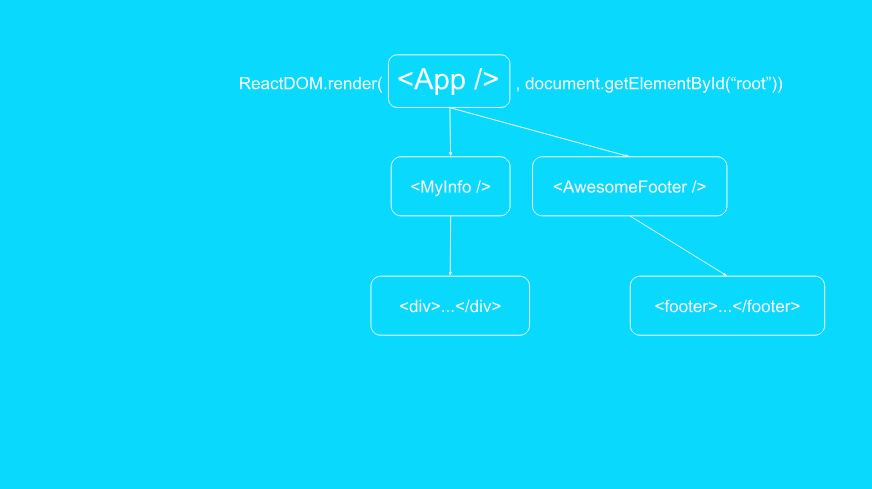
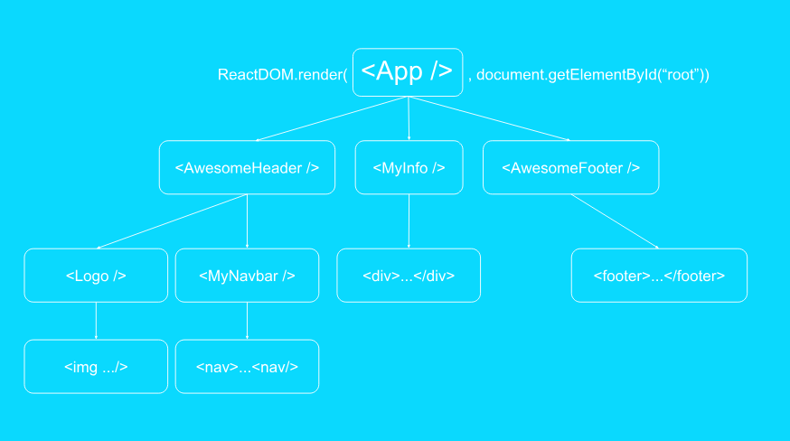
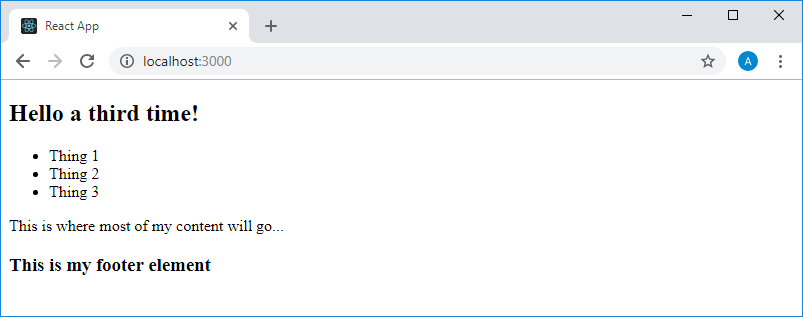

Учебный курс по React, часть 4: родительские и дочерние компоненты / Блог компании RUVDS.com

Публикуем очередную часть перевода учебного курса по React. Нашей сегодняшней темой будут взаимоотношения родительских и дочерних компонентов.

→ [Часть 1: обзор курса, причины популярности React, ReactDOM и JSX](https://habr.com/post/432636/)  
→ [Часть 2: функциональные компоненты](https://habr.com/post/433400/)  
→ [Часть 3: файлы компонентов, структура проектов](https://habr.com/post/433404/)  
→ [Часть 4: родительские и дочерние компоненты](https://habr.com/company/ruvds/blog/434118/)

## Занятие 9\. Родительские и дочерние компоненты

→ [Оригинал](https://scrimba.com/p/p7P5Hd/cQ726Sr)

Сегодня мы поговорим о родительских и дочерних компонентах. Использование подобных конструкций сделает наше приложение гораздо более сложным, чем в случае, когда в нём был всего один компонент, выводимый в DOM, такой, как `MyInfo`. Вместо этой простой структуры в приложении может присутствовать сложная иерархия компонентов, которая, в итоге, преобразуется в JSX-элементы.

Начнём с уже знакомого вам шаблона приложения. Для того чтобы вспомнить пройденное, можете, по памяти, в пустом файле `index.js`, написать код для вывода на страницу заголовка первого уровня с текстом `Hello World!` средствами React. Вот как может выглядеть подобный код:

    import React from "react"
    import ReactDOM from "react-dom"
    
    ReactDOM.render(
      <h1>Hello World!</h1>,
      document.getElementById("root")
    )

В прошлый раз там, где в вышеприведённом коде находится описание элемента `<h1>`, присутствовал код для вывода компонента `MyInfo`. Теперь же мы собираемся создать компонент `App` и вывести его. Для этого нам понадобится код следующего вида:

    import React from "react"
    import ReactDOM from "react-dom"
    
    ReactDOM.render(
      <App />,
      document.getElementById("root")
    )

Компонент `App` будет точкой входа в наше приложение. Вероятно, вы уже заметили, что в коде предыдущего примера кое-чего не хватает. Это действительно так — мы пока не импортировали сюда `App`. Сделаем это:

    import React from "react"
    import ReactDOM from "react-dom"
    
    import App from "./App"
    
    ReactDOM.render(
      <App />,
      document.getElementById("root")
    )

Но такой код всё ещё остаётся нерабочим. Нам нужен файл компонента `App` (`App.js`), расположенный в той же папке, что и `index.js`. Именно к такому файлу мы обращаемся в команде импорта `import App from "./App"`. Напомним, что имена компонентов React записываются в верблюжьем стиле и начинаются с заглавной буквы. Создадим нужный нам файл и опишем в нём компонент `App`. Попытайтесь сделать это самостоятельно. А именно — напишите код, благодаря которому компонент `App` выведет на страницу текст `Hello again`.

Вот как выглядит этот код:

    import React from "react"
    
    function App(){
      return (
        <h1>Hello again</h1>
      )
    }
    
    export default App

Тут функция `App` возвращает единственный элемент, но напомним, что из подобных функций можно возвращать и более сложные структуры. Самое главное — не забывать о том, что возвратить можно лишь один элемент, который, если, на самом деле, вывести нужно несколько элементов, представляет собой контейнер, включающий их в себя. Например, вот как будет выглядеть возврат разметки, описывающей заголовок первого уровня и маркированный список:

    import React from "react"
    
    function App(){
      return (
        

          <h1>Hello a third time!</h1>
          <ul>
            <li>Thing 1</li>
            <li>Thing 2</li>
            <li>Thing 3</li>
          </ul>
        

      )
    }
    
    export default App

Возможно, сейчас мы решим, что то, что формируется средствами компонента `App`, должно представлять собой некий веб-сайт. У него будет навигационный блок (`<nav></nav>`) и область основного содержимого (`<main></main>`). Это решение приведёт к формированию следующего кода:

    import React from "react"
    
    function App(){
      return (
        

          <nav>
            <h1>Hello a third time!</h1>
            <ul>
              <li>Thing 1</li>
              <li>Thing 2</li>
              <li>Thing 3</li>
            </ul>
          </nav>
          <main>
            
This is where most of my content will go...

          </main>
        

      )
    }
    
    export default App

Вот как всё это будет выглядеть в браузере.

_Приложение в браузере_

Тут ещё можно стилизовать список для того, чтобы он стал больше похожим на навигационную панель.

Можно заметить, что код компонента уже стал довольно большим. Это идёт вразрез с целью, ради которой мы используем React. Ранее мы говорили о том, что фрагменты HTML-кода можно представлять в виде отдельных компонентов, а в нашем компоненте всё свалено в одну кучу. Поэтому сейчас мы создадим компоненты для каждого самостоятельного фрагмента разметки.

Взгляните на эту схему для того, чтобы лучше разобраться в том, о чём идёт речь.

_Компонент App выводит компонент MyInfo, выводящий элемент &lt;div&gt;_

Тут мы выводим на страницу компонент `App`. При этом компонент `App` решает вывести ещё один компонент — `MyInfo`. А уже компонент `MyInfo` выводит некий JSX-элемент. Обратите внимание на разницу между понятиями «компонент» и «элемент». Элементы — это сущности, которые превращаются в обычный HTML-код. Так, в элементе, представленном в нижней части схемы, используется простой тег `
`, его имя начинается с маленькой буквы, что говорит нам о том, что это — обычный элемент, а не один из созданных нами компонентов. С другой стороны, имя `MyInfo` начинается с большой буквы. Это помогает понять, что перед нами — компонент.

Вы могли слышать о том, что DOM (Document Object Model, объектная модель документа) часто называют «деревом». Корневым элементом этого дерева является элемент `<html>`. В нашем случаем корневым элементом дерева, представленного на схеме, является компонент `App`. Возможности этого компонента не ограничиваются выводом другого компонента, `MyInfo` в нашем случае. Он может, например, вывести ещё один компонент, представляющий собой «подвал», нижнюю часть страницы. Скажем, этот компонент будет носить имя `AwesomeFooter`.

_Компонент App выводит два компонента_

Этот компонент, в свою очередь, может вывести элемент `<footer>`, который будет содержать HTML-код нижней части страницы.

Если у нас имеется «подвал» страницы, то она может содержать и «шапку», оформляющую её верхнюю часть.

_Компонент App выводит три компонента_

Верхняя часть страницы представлена на нашей схеме компонентом `AwesomeHeader`. Такие имена этим компонентам даны для того, чтобы не путать их с элементами. Компонент `AwesomeHeader`, как и компонент `App`, может выводить не только JSX-разметку, но и другие компоненты. Например, это может быть компонент `NavBar`, представляющий собой навигационную панель, и компонент `Logo`, выводящий логотип. А эти компоненты уже выведут обычные элементы — такие, как `` и `<nav>`.

По мере рассмотрения этой схемы вы можете заметить, что React-приложение, в ходе его развития, может становиться всё более и более сложным. И то, что мы тут рассмотрели, на самом деле, представляет собой пример крайне простой структуры приложения.

Теперь давайте создадим в нашем учебном приложении компонент, который будет представлять собой «подвал» страницы.

Для этого создадим, в той же папке, где находится файл `index.js`, новый файл. Назовём его `Footer.js` и поместим в него следующий код:

    import React from "react"
    
    function Footer() {
        return (
            <footer>
                <h3>▍This is my footer element</h3>
            </footer>
        )
    }
    
    export default Footer

Обратите внимание на то, что имя функционального компонента начинается с большой буквы (`Footer`), а имя элемента `(<footer>`) — с маленькой. Как уже было сказано, это помогает отличать элементы от компонентов.

Если теперь обновить страницу, то разметка, формируемая компонентом `Footer`, в её нижней части выведена не будет. Это совершенно ожидаемо, так как для того, чтобы её вывести, нужно внести соответствующие изменения в код компонента `App`.

А именно, речь идёт о том, что в коде файла компонента `App` нужно импортировать компонент `Footer` и создать его экземпляр. Отредактируем код файла `App.js`:

    import React from "react"
    import Footer from "./Footer"
    
    function App(){
      return (
        

          <nav>
            <h1>Hello a third time!</h1>
            <ul>
              <li>Thing 1</li>
              <li>Thing 2</li>
              <li>Thing 3</li>
            </ul>
          </nav>
          <main>
            
This is where most of my content will go...

          </main>
          <Footer />
        

      )
    }
    
    export default App

Теперь страница, которую формирует приложение, будет выглядеть так, как показано ниже.

_Компонент App выводит в нижней части страницы разметку, формируемую другим компонентом — Footer_

Можно заметить, что сейчас в коде, выводимом компонентом `App`, имеется странная смесь из обычных JSX-элементов с компонентами. Куда лучше было бы, если бы то, что выводит компонент `App`, было бы похоже на нечто вроде оглавления книги, чтобы в нём присутствовали, в основном, компоненты. А именно, речь идёт о том, чтобы код компонента выглядел бы примерно так:

    import React from "react"
    import Footer from "./Footer"
    
    function App() {
        return (
            

                <Header />
                <MainContent />
                <Footer />
            

        )
    }
    
    export default App

Если приложение имеет подобную структуру (в нашем случае, так как файлы компонентов `Header` и `MainContent` пока не созданы, код работать не будет), то описание элементов, формирующих различные части страницы, будет находиться в файлах соответствующих компонентов. При этом компоненты, импортируемые в компонент `App`, могут содержать другие вложенные компоненты. Так могут быть сформированы довольно обширные структуры, размеры которых определяются нуждами конкретного приложения.

Здесь мы поговорили о том, как работать с вложенными компонентами. Вы вполне можете попробовать на практике то, что только что узнали, приведя проект, файл `App.js` которого выглядит так, как показано выше, в рабочее состояние.

## Занятие 10\. Практикум. Родительские и дочерние компоненты

→ [Оригинал](https://scrimba.com/p/p7P5Hd/caQwRHM)

### ▍Задание

Создайте React-приложение с нуля. Выведите на страницу корневой компонент `App` (определённый в отдельном файле). Внутри этого компонента выведите следующие компоненты:

1.  `Navbar`
2.  `MainContent`
3.  `Footer`

Компоненты, выводимые `App`, должны быть описаны в отдельных файлах, каждый из них должен выводить какие-нибудь JSX-элементы.

### ▍Решение

В качестве основы для решения этой задачи используется стандартный проект, создаваемый средствами `create-react-app` (если вы не знаете как такой проект создать — взгляните на [этот](https://habr.com/company/ruvds/blog/432636/) материал). Тут используется стандартный `index.html`.

Код файла `index.js`:

    import React from "react"
    import ReactDOM from "react-dom"
    
    import App from "./App"
    
    ReactDOM.render(
      <App />,
      document.getElementById("root")
    )

Вот код файла `App.js`. Обратите внимание на то, что для хранения файлов компонентов мы будем использовать папку `components`.

    import React from "react"
    
    import Header from "./components/Header"
    import MainContent from "./components/MainContent"
    import Footer from "./components/Footer"
    
    function App() {
        return (
            

                <Header />
                <MainContent />
                <Footer />
            

        )
    }
    
    export default App

Код файла `Header.js`:

    import React from "react"
    
    function Header() {
        return (
            <header>This is the header</header>
        )
    }
    
    export default Header

Код файла `MainContent.js`:

    import React from "react"
    
    function MainContent() {
        return (
            <main>This is the main section</main>
        )
    }
    
    export default MainContent

Код файла `Footer.js`:

    import React from "react"
    
    function Footer() {
        return (
            <footer>This is the footer</footer>
        )
    }
    
    export default Footer

Работу с компонентами вы можете организовать так, как вам будет удобнее. То есть, можно, например, сначала написать в файле `App.js` весь необходимый код, выполняющий импорт компонентов и вывод их экземпляров, а потом создать файлы компонентов. Можно сделать всё наоборот — сначала создать файлы компонентов с кодом, а потом уже работать над файлом `App.js`. Самое главное, чтобы в итоге получилось работающее приложение.

Вот как выглядит проект в VSCode.

_Проект в VSCode_

А вот как выглядит страница, которую сформировало это приложение.

_Страница приложения в браузере_

Наше React-приложение работает, но то, что оно выводит на страницу, выглядит как-то совсем неинтересно. Исправить это можно, стилизовав содержимое страницы.

## Итоги

Сегодня мы поговорили о родительских и дочерних компонентах. В следующий раз мы начнём работу над нашим первым большим учебным проектом и поговорим о стилизации элементов страницы.

**Уважаемые читатели!** Если вы занимаетесь по этому курсу — просим рассказать о том, как вы выполняете практические занятия. А именно — пишете ли код, что называется, «из головы», или поглядываете на текст предыдущего занятия? А, может быть, вы пытаетесь найти то, что забыли, в интернете?

