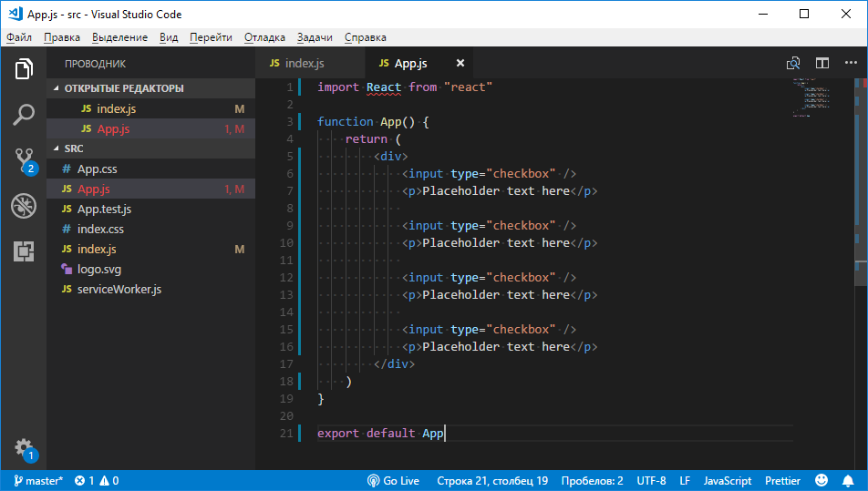
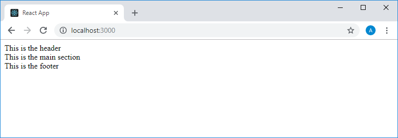
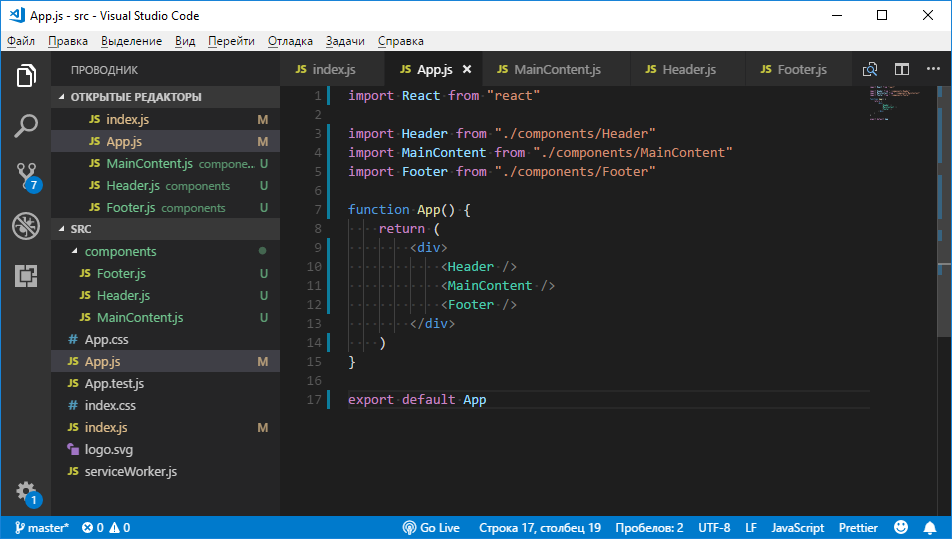
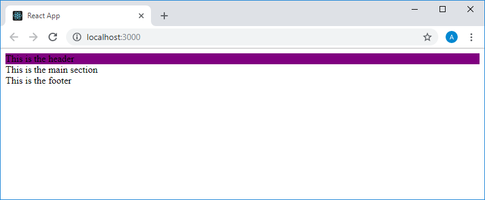
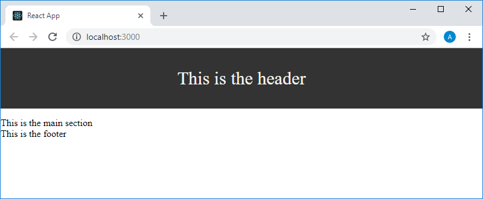
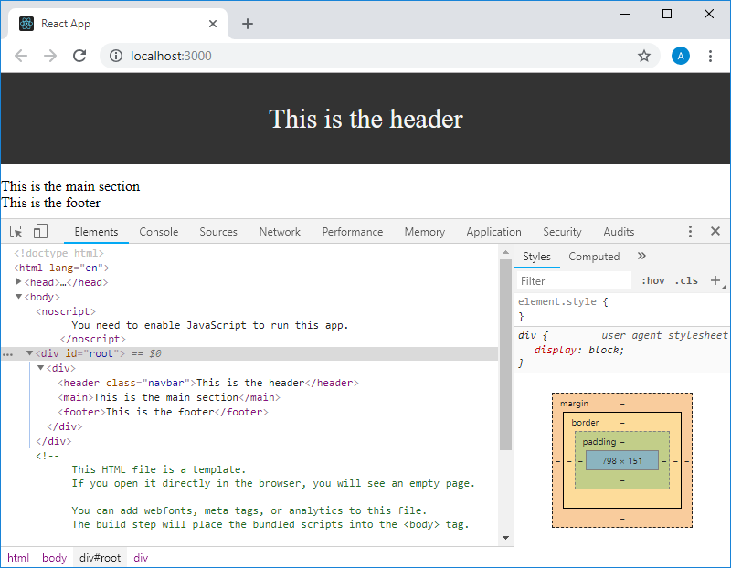

Учебный курс по React, часть 5: начало работы над TODO-приложением, основы стилизации / Блог компании RUVDS.com

Сегодня, в следующей части перевода учебного курса по React, мы начнём работу над первым учебным проектом и поговорим об основах стилизации.

  

## Занятие 11\. Практикум. TODO-приложение. Этап №1

→ [Оригинал](https://scrimba.com/p/p7P5Hd/cVwzpCp)

На этом занятии мы начнём работу над нашим первым учебным проектом — TODO-приложением. Подобные занятия будут оформлены как обычные практикумы. Сначала вам будет дано задание, для выполнения которого будет необходимо ориентироваться в ранее изученном материале, после чего будет представлено решение.

Мы будем работать над этим приложением довольно долго, поэтому, если вы пользуетесь `create-react-app`, рекомендуется создать для него отдельный проект.

### ▍Задание

  

*   Создайте новое React-приложение.
*   Выведите на страницу компонент `<App />` средствами файла `index.js`.
*   Компонент `<App />` должен формировать код для вывода 3-4 флажков с каким-нибудь текстом, следующим после них. Текст может быть оформлен с помощью тегов `
` или ``. То, что у вас получится, должно напоминать список дел, в который уже внесены некие записи.

  

### ▍Решение

Код файла `index.js`:

    import React from 'react'
    import ReactDOM from 'react-dom'
    
    import App from './App'
    
    ReactDOM.render(
        <App />, 
        document.getElementById('root')
    )

Код файла `App.js`:

    import React from "react"
    
    function App() {
        return (
            

                <input type="checkbox" />
                
Placeholder text here

                
                <input type="checkbox" />
                
Placeholder text here

                
                <input type="checkbox" />
                
Placeholder text here

                
                <input type="checkbox" />
                
Placeholder text here

            

        )
    }
    
    export default App

Вот как на данном этапе работы выглядит стандартный проект `create-react-app` в VSCode.

_Проект в VSCode_

Вот что наше приложение выводит сейчас на страницу.

_Внешний вид приложения в браузере_

Сегодня мы сделали первый шаг на пути к TODO-приложению. Но то, что выводит это приложение на экран, выглядит не так уж и приятно, как и то, что оказывалось на страницах в ходе прошлых наших экспериментов. Поэтому на следующем занятии мы займёмся стилизацией элементов.

## Занятие 12\. Стилизация в React с использованием CSS-классов

→ [Оригинал](https://scrimba.com/p/p7P5Hd/cepwWUp)

Сейчас мы будем работать над тем приложением, которое было создано в результате выполнения практикума на занятии 10\. Вот как выглядело то, что выводило на экран это приложение.

_Страница приложения в браузере_

Мы хотели бы стилизовать элементы страницы. В React существует множество подходов к стилизации. Мы используем сейчас тот подход, с принципами которого вы, вероятно, уже знакомы. Он заключается в применении CSS-классов и CSS-правил, назначаемых этим классам. Взглянем на структуру этого проекта и подумаем о том, каким элементам нужно назначить классы, которые будут использоваться для их стилизации.

_Проект в VSCode_

Файл `index.js` ответственен за рендеринг компонента `App`. Компонент `App` выводит элемент `
`, в котором содержатся три других компонента — `Header`, `MainComponent` и `Footer`. А каждый из этих компонентов просто выводит по одному JSX-элементу с текстом. Именно в этих компонентах мы и будем заниматься стилизацией. Поработаем над компонентом `Header`. Напомним, что на данном этапе работы его код выглядит так:

    import React from "react"
    
    function Header() {
        return (
            <header>This is the header</header>
        )
    }
    
    export default Header

Обычно, когда работают с HTML-кодом и хотят назначить некоему элементу класс, это делается с помощью атрибута `class`. Предположим, мы собираемся назначить такой атрибут элементу `<header>`. Но тут нельзя забывать о том, что мы работаем не с HTML-кодом, а с JSX. И здесь атрибут `class` мы использовать не можем (на самом деле, воспользоваться атрибутом с таким именем можно, но делать так не рекомендуется). Вместо этого используется атрибут с именем `className`. Во многих публикациях говорится о том, что причина этого заключается в том, что `class` — это зарезервированное ключевое слово `JavaScript`. Но, на самом деле, JSX использует обычный API JavaScript для работы с DOM. Для доступа к элементам с использованием этого API применяется уже знакомая вам конструкция следующего вида:

    document.getElementById("something")

Для того чтобы добавить к элементу новый класс, поступают так:

    document.getElementById("something").className += " new-class-name"

В похожей ситуации удобнее пользоваться свойством элементов `classList`, в частности, из-за того, что у него есть удобные методы для добавления и удаления классов, но в данном случае это неважно. А важно то, что тут применяется свойство `className`.

Собственно говоря, нам, для назначения классов JSX-элементам, достаточно знать о том, что там, где в HTML используется ключевое слово `class`, в JSX надо пользоваться ключевым словом `className`.

Назначим элементу `<header>` класс `navbar`:

    import React from "react"
    
    function Header() {
        return (
            <header className="navbar">This is the header</header>
        )
    }
    
    export default Header

Теперь, в папке `components`, создадим файл `Header.css`. Поместим в него следующий код:

    .navbar {
      background-color: purple;
    }

Теперь подключим этот файл в `Header.js` командой `import "./Header.css"` (этой командой, расширяющей возможности стандартной команды `import`, мы [сообщаем](https://facebook.github.io/create-react-app/docs/adding-a-stylesheet) бандлеру Webpack, который используется в проектах, созданных средствами `create-react-app`, о том, что хотим использовать `Header.css` в `Header.js`).

Вот как это будет выглядеть в VSCode.

_Файл стилей и его подключение в VSCode_

Всё это приведёт к тому, что внешний вид самой верхней строки, выводимой приложением на страницу, изменится.

_Изменение стиля верхней строки_

Тут мы использовали крайне простой стиль. Заменим содержимое файла `Header.css` на следующее:

    .navbar {
        height: 100px;
        background-color: #333;
        color: whitesmoke;
        margin-bottom: 15px;
        text-align: center;
        font-size: 30px;
        display: flex;
        justify-content: center;
        align-items: center;
    }

Кроме того, откроем уже существующий в проекте файл `index.css` и поместим в него следующий стиль:

    body {
        margin: 0;
    }

Подключим этот файл в `index.js` командой `import "./index.css"`. В результате страница приложения примет вид, показанный на следующем рисунке.

_Изменение стиля страницы_

Обратите внимание на то, что стили, заданные в `index.css`, повлияли на все элементы страницы. Если вы для экспериментов, пользуетесь, например, неким онлайн-редактором, там работа с файлами стилей может быть организована по-особенному. Например, в таком редакторе может присутствовать единственный стандартный файл стилей, автоматически подключаемый к странице, CSS-правила, описанные в котором, будут применяться ко всем элементам страницы. В нашем простом примере вполне можно было бы поместить все стили в `index.css`.

Собственно говоря, предполагая, что вы уже знакомы с CSS, можно сказать, что здесь используется в точности такой же CSS-код, который применяется для стилизации обычных HTML-элементов. Главная особенность, о которой надо помнить, стилизуя элементы с помощью классов в React, заключается в том, что вместо атрибута элемента `class`, применяемого в HTML, используется `className`.

Кроме того, нужно отметить, что классы можно назначать лишь элементам React — таким, как `<header>`, `
` или `<h1>`. Если попытаться назначить имя класса экземпляру компонента — наподобие `<Header />` или `<MainContent />`, система будет вести себя совсем не так, как можно ожидать. Об этом мы ещё поговорим. Пока же просто запомните, что классы в React-приложениях назначают элементам, а не компонентам.

Вот ещё кое-что, что в начале работы с React может показаться вам сложным. Речь идёт о стилизации элементов, которые имеют разный уровень иерархии на странице. Скажем, это происходит в тех случаях, когда для стилизации используются технологии CSS Flexbox или CSS Grid. В подобных случаях, например, при использовании Flex-вёрстки, нужно знать о том, какая сущность является flex-контейнером, и о том, какие сущности являются flex-элементами. А именно, может быть непросто понять — как именно стилизовать элементы, к каким именно элементам применять те или иные стили. Предположим, например, что элемент `
` из нашего компонента `App` должен быть flex-контейнером:

    import React from "react"
    
    import Header from "./components/Header"
    import MainContent from "./components/MainContent"
    import Footer from "./components/Footer"
    
    function App() {
        return (
            

                <Header />
                <MainContent />
                <Footer />
            

        )
    }
    
    export default App

При этом flex-элементы выводятся средствами компонентов `Header`, `MainContent` и `Footer`. Взглянем, например, на код компонента `Header`:

    import React from "react"
    import "./Header.css"
    
    function Header() {
        return (
            <header className="navbar">
                This is the header
            </header>
        )
    }
    
    export default Header

Элемент `<header>` должен быть прямым потомком элемента `
` из компонента `App`. Его и надо стилизовать как flex-элемент.

Для того чтобы разобраться в стилизации подобных конструкций, нужно учитывать то, каким будет HTML-код, сформированный приложением. Откроем вкладку `Elements` инструментов разработчика Chrome для той страницы, которая выводится в браузере при работе с проектом, созданным средствами `create-react-app`.

_Код страницы_

Элемент `
` с идентификатором `root` — это тот элемент страницы `index.html`, к которому мы обращаемся в методе `ReactDOM.render()`, вызываемом в файле `index.js`. В него выводится разметка, формируемая компонентом `App`, а именно — следующий элемент `
`, который содержит элементы `<header>`, `<main>` и `<footer>`, формируемые соответствующими компонентами.

То есть, анализируя код React-приложения, приведённый выше, можно считать, что конструкция `<Header />` в компоненте `App` заменяется на конструкцию `<header className="navbar">This is the header</header>`. Понимание этого факта позволяет использовать сложные схемы стилизации элементов страниц.

На этом мы завершаем первое знакомство со стилизацией React-приложений. Рекомендуется поэкспериментировать с тем, что вы только что узнали. Например — попробуйте самостоятельно стилизовать элементы, выводимые компонентами `<MainContent />` и `<Footer />`.

## Итоги

Сегодня мы приступили к разработке нашего первого учебного проекта — TODO-приложения, а также познакомились со стилизацией React-приложений средствами CSS-классов. В следующий раз поговорим об особенностях стиля кода, которого придерживается автор этого курса, а также о некоторых вещах, касающихся JSX и JavaScript.

Уважаемые читатели! Есть ли у вас уже идея приложения, которое вы хотели бы создать с помощью React?

