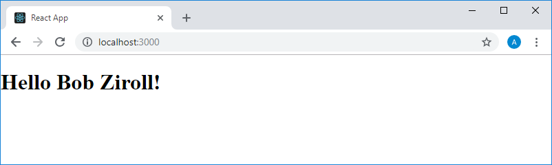

Учебный курс по React, часть 6: о некоторых особенностях курса, JSX и JavaScript / Блог компании RUVDS.com

Сегодня мы публикуем продолжение учебного курса по React. Здесь речь пойдёт о некоторых особенностях курса, касающихся, в частности, стиля кода. Тут же мы подробнее поговорим о взаимоотношениях между JSX и JavaScript.

→ [Часть 1: обзор курса, причины популярности React, ReactDOM и JSX](https://habr.com/post/432636/)  
→ [Часть 2: функциональные компоненты](https://habr.com/post/433400/)  
→ [Часть 3: файлы компонентов, структура проектов](https://habr.com/post/433404/)  
→ [Часть 4: родительские и дочерние компоненты](https://habr.com/company/ruvds/blog/434118/)  
→ [Часть 5: начало работы над TODO-приложением, основы стилизации](https://habr.com/company/ruvds/blog/434120/)  
→ [Часть 6: о некоторых особенностях курса, JSX и JavaScript](https://habr.com/company/ruvds/blog/435466/)  
→ [Часть 7: встроенные стили](https://habr.com/company/ruvds/blog/435468/)  

## Занятие 13\. О некоторых особенностях курса

→ [Оригинал](https://scrimba.com/p/p7P5Hd/cM7GrSJ)

Прежде чем мы продолжим занятия, мне хотелось бы немного рассказать о некоторых особенностях кода, который я демонстрирую в этом курсе. Вы могли обратить внимание на то, что в коде обычно не используются точки с запятой. Например, как видите, в примерах, подобных следующему, их нет:

    import React from "react"
    import ReactDOM from "react-dom"
    
    function App() {
        return (
           <h1>Hello world!</h1>
        )
    }
    
    ReactDOM.render(<App />, document.getElementById("root"))

Возможно, вы привыкли ставить точки с запятой везде, где это возможно. Тогда, например, первые две строчки предыдущего фрагмента кода выглядели бы так:

    import React from "react";
    import ReactDOM from "react-dom";

Я же недавно решил, что буду обходиться без них, в результате у меня и получается такой код, который вы видите в примерах. Конечно, в JavaScript есть конструкции, в которых без точек с запятой не обойтись. Скажем, при описании цикла [for](https://developer.mozilla.org/ru/docs/Web/JavaScript/Reference/Statements/for), синтаксис которого выглядит так:

    for ([инициализация]; [условие]; [финальное выражение])выражение

Но в большинстве случаев без точек с запятой в конце строк обойтись можно. И их отсутствие в коде никак не нарушит его работу. На самом деле, вопрос использования в коде точек с запятой — это вопрос личных предпочтений программиста.

Ещё одна особенность кода, который я пишу, заключается в том, что хотя ES6 технически позволяет использовать стрелочные функции в тех случаях, когда функции объявляют с использованием ключевого слова `function`, я этим не пользуюсь.

Например, код, приведённый выше, можно переписать так:

    import React from "react"
    import ReactDOM from "react-dom"
    
    const App = () => <h1>Hello world!</h1>
    
    ReactDOM.render(<App />, document.getElementById("root"))

Но я к подобному не привык. Полагаю, что стрелочные функции чрезвычайно полезны в определённых случаях, в которых особенности этих функций не мешают правильной работе кода. Например, тогда, когда обычно пользуются анонимными функциями, или когда пишут методы классов. Но я предпочитаю пользоваться традиционными функциями. Многие, при описании функциональных компонентов, пользуются стрелочными функциями. Я согласен с тем, что у такого подхода есть преимущества перед использованием традиционных конструкций. При этом я не стремлюсь навязывать какой-то определённый способ объявления функциональных компонентов.

## Занятие 14\. JSX и JavaScript

→ [Оригинал](https://scrimba.com/p/p7P5Hd/c6G36SV)

На следующих занятиях мы будем говорить о встроенных стилях. Прежде чем перейти к этим темам, нам нужно уточнить некоторые особенности взаимодействия JavaScript и JSX. Вы уже знаете, что, пользуясь возможностями React, мы можем, из обычного JavaScript-кода, возвращать конструкции, напоминающие обычную HTML-разметку, но являющиеся JSX-кодом. Такое происходит, например, в коде функциональных компонентов.

Что если имеется некая переменная, значение которой нужно подставить в возвращаемый функциональным компонентом JSX-код?

Предположим, у нас есть такой код:

    import React from "react"
    import ReactDOM from "react-dom"
    
    function App() {
      return (
        <h1>Hello world!</h1>
      )
    }
    
    ReactDOM.render(<App />, document.getElementById("root"))

Добавим в функциональный компонент пару переменных, содержащих имя и фамилию пользователя.

    function App() {
      const firstName = "Bob"
      const lastName = "Ziroll"
      
      return (
        <h1>Hello world!</h1>
      )
    }

Теперь мы хотим, чтобы то, что возвращает функциональный компонент, оказалось бы не заголовком первого уровня с текстом `Hello world!`, а заголовком, содержащим приветствие вида `Hello Bob Ziroll!`, которое сформировано с использованием имеющихся в компоненте переменных.

Попробуем переписать то, что возвращает компонент, так:

    <h1>Hello firstName + " " + lastName!</h1>

Если взглянуть на то, что появится на странице после обработки подобного кода, то окажется, что выглядит это не так, как нам нужно. А именно, на страницу попадёт текст `Hello firstName + " " + lastName!`. При этом, если для запуска примера используется стандартный проект, созданный средствами `create-react-app`, нас предупредят о том, что константам `firstName` и `lastName` назначены значения, которые нигде не используются. Правда, это не помешает появлению на странице текста, который представляет собой в точности то, что было возвращено функциональным компонентом, без подстановки вместо того, что нам казалось именами переменных, их значений. Имена переменных в таком виде система считает обычным текстом.

Зададимся вопросом о том, как воспользоваться возможностями JavaScript в JSX-коде. На самом деле, сделать это довольно просто. В нашем случае достаточно лишь заключить то, что должно быть интерпретировано как JavaScript-код, в фигурные скобки. В результате то, что возвращает компонент, будет выглядеть так:

    <h1>Hello {firstName + " " + lastName}!</h1>

При этом на страницу попадёт текст `Hello Bob Ziroll!`. В этих фрагментах JSX-кода, выделенных фигурными скобками, можно использовать обычные JavaScript-конструкции. Вот как выглядит в браузере то, что выведет этот код:

_Страница, разметка которой сформирована средствами JSX и JavaScript_

Так как при работе со строками в современных условиях, в основном, применяются возможности ES6, перепишем код с их использованием. А именно, речь идёт о [шаблонных литералах](https://developer.mozilla.org/ru/docs/Web/JavaScript/Reference/template_strings), оформляемых с помощью обратных кавычек (`` ` ` ``). Такие строки могут содержать конструкции вида `${выражение}`. Стандартное поведение шаблонных литералов предусматривает вычисление содержащихся в фигурных скобках выражений и преобразование того, что получится, в строку. В нашем случае это будет выглядеть так:

    <h1>Hello {`${firstName} ${lastName}`}!</h1>

Обратите внимание на то, что имя и фамилия разделены пробелом, который интерпретируется здесь как обычный символ. Результат выполнения этого кода будет таким же, как было показано выше. В общем-то, самое главное, что вы должны сейчас понять, заключается, в том, что то, что заключено в фигурные скобки, находящиеся в JSX-коде — это обычный JS.

Рассмотрим ещё один пример. А именно, перепишем наш код так, чтобы, если его вызывают утром, он выводил бы текст `Good morning`, если днём — `Good afternoon`, а если вечером — `Good night`. Для начала напишем программу, которая сообщает о том, который сейчас час. Вот код функционального компонента `App`, который решает эту задачу:

    function App() {
      const date = new Date()
      
      return (
        <h1>It is currently about {date.getHours() % 12} o'clock!</h1>
      )
    }

Тут создан новый экземпляр объекта `Date`. В JSX используется JavaScript-код, благодаря которому мы узнаём, вызвав метод `date.getHours()`, который сейчас час, после чего, вычисляя остаток от деления этого числа на `12`, приводим время к 12-часовому формату. Похожим образом можно, проверив время, сформировать нужную нам строку. Например, это может выглядеть так:

    function App() {
      const date = new Date()
      const hours = date.getHours()
      let timeOfDay
      
      if (hours < 12) {
        timeOfDay = "morning"
      } else if (hours >= 12 && hours < 17) {
        timeOfDay = "afternoon"
      } else {
        timeOfDay = "night"
      }
      
      return (
        <h1>Good {timeOfDay}!</h1>
      )
    }

Тут имеется переменная `timeOfDay`, а анализируя текущее время с помощью конструкции `if`, мы узнаём время дня и записываем его в эту переменную. После этого мы используем переменную в возвращаемом компонентом JSX-коде.

Как обычно, рекомендуется поэкспериментировать с тем, что мы сегодня изучили.

## Итоги

На этом занятии мы поговорили о некоторых особенностях стиля кода, используемых в этом курсе, а также о взаимодействии JSX и JavaScript. Использование JavaScript-кода в JSX открывает большие возможности, практическую полезность которых мы ощутим уже на следующем занятии, когда будем разбираться со встроенными стилями.

**Уважаемые читатели!** Пользуетесь ли вы точками с запятой в своём JavaScript-коде?

