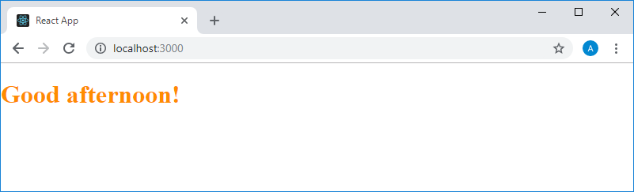
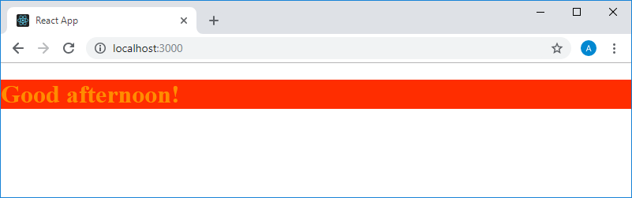

Учебный курс по React, часть 7: встроенные стили / Блог компании RUVDS.com

Сегодня, в следующей части курса по React, мы поговорим о встроенных стилях.

→ [Часть 1: обзор курса, причины популярности React, ReactDOM и JSX](https://habr.com/post/432636/)  
→ [Часть 2: функциональные компоненты](https://habr.com/post/433400/)  
→ [Часть 3: файлы компонентов, структура проектов](https://habr.com/post/433404/)  
→ [Часть 4: родительские и дочерние компоненты](https://habr.com/company/ruvds/blog/434118/)  
→ [Часть 5: начало работы над TODO-приложением, основы стилизации](https://habr.com/company/ruvds/blog/434120/)  
→ [Часть 6: о некоторых особенностях курса, JSX и JavaScript](https://habr.com/company/ruvds/blog/435466/)  
→ [Часть 7: встроенные стили](https://habr.com/company/ruvds/blog/435468/)  

## Занятие 15\. Встроенные стили

→ [Оригинал](https://scrimba.com/p/p7P5Hd/cbyv9hb)

В конце прошлого занятия мы создали компонент, который анализирует время суток и выводит соответствующее приветствие. Вот полный код файла `index.js`, реализующий этот функционал:

    import React from "react"
    import ReactDOM from "react-dom"
    
    function App() {
      const date = new Date()
      const hours = date.getHours()
      let timeOfDay
      
      if (hours < 12) {
        timeOfDay = "morning"
      } else if (hours >= 12 && hours < 17) {
        timeOfDay = "afternoon"
      } else {
        timeOfDay = "night"
      }
      
      return (
        <h1>Good {timeOfDay}!</h1>
      )
    }
    
    ReactDOM.render(<App />, document.getElementById("root"))

Теперь нам нужно стилизовать то, что этот код выводит на страницу. При этом мы собираемся использовать здесь подход, который отличается от рассмотренной ранее [стилизации](https://habr.com/company/ruvds/blog/434120/) элементов с применением CSS-классов. А именно, речь идёт о применении HTML-атрибута `style`. Посмотрим, что произойдёт, если воспользоваться такой конструкцией:

    <h1 style="color: #FF8C00">Good {timeOfDay}!</h1>

На самом деле — ничего хорошего. Текст на страницу не попадёт, вместо этого будет выведено сообщение об ошибке. Суть его сводится к тому, что тут, при настройке стилей, ожидается не строковое значение, а объект, содержащий пары вида `ключ: значение`, где ключами являются имена CSS-свойств, а значениями — их значения.

Пытаясь пользоваться HTML-атрибутами в JSX-коде, мы не должны забывать о том, что то, с чем мы работаем, хотя и похоже на обычный HTML-код, им не является. В результате то, как тут будет выглядеть та или иная конструкция, может отличаться от того, что принято в HTML. В данном случае нам нужен обычный JavaScript-объект, содержащий описание стилей. Вооружившись этой идеей, перепишем вышеприведённый фрагмент кода так:

    <h1 style={color: "#FF8C00"}>Good {timeOfDay}!</h1>

Так, к сожалению, наш код тоже не заработает. В результате его выполнения снова выведется сообщение об ошибке, правда, не такое, как в прошлый раз. Оно теперь сообщает о том, что там, где система может ожидать фигурную скобку, она находит что-то другое. Для того чтобы решить эту проблему, нужно вспомнить о том, о чём мы говорили на предыдущем занятии. А именно — о том, что JavaScript-код, встраиваемый в JSX, должен быть заключён в фигурные скобки. Те фигурные скобки, которые уже имеются в нашем коде, используются для описания объектного литерала, а не для выделения JS-кода. Исправим это:

    <h1 style={{color: "#FF8C00"}}>Good {timeOfDay}!</h1>

Теперь компонент формирует на странице именно то, что нужно.

_Стилизованный текст, выводимый на страницу компонентом_

Что если мы решим продолжить стилизацию этого текста? Для этого нам нужно вспомнить о том, что стили мы описываем в JS-объекте, а это значит, что в этот объект надо добавить дополнительные пары вида `ключ: значение`. Например, попытаемся стилизовать таким образом фон текста, использовав CSS-свойство `background-color` и дополним код так:

    <h1 style={{color: "#FF8C00", background-color: "#FF2D00"}}>Good {timeOfDay}!</h1>

Такая конструкция приведёт к сообщению об ошибке. Дело тут в том, что стили мы описываем с помощью обычного JS-объекта, а в JavaScript переменные и имена свойств объектов ([идентификаторы](https://developer.mozilla.org/ru/docs/Web/JavaScript/Guide/Grammar_and_types#%D0%9F%D0%B5%D1%80%D0%B5%D0%BC%D0%B5%D0%BD%D0%BD%D1%8B%D0%B5)) не могут содержать символ «-», тире. На самом деле, это ограничение можно обойти, например, заключив имя свойства объекта в кавычки, но в нашем случае это к делу не относится. Мы в подобных ситуациях, когда имена свойств CSS содержат тире, этот символ убираем и делаем первую букву слова, следующего за ним, заглавной. Несложно заметить, что при таком подходе имена свойств CSS будут записываться в верблюжьем стиле — так же, как в JavaScript принято записывать имена переменных, состоящие из нескольких слов. Перепишем код:

    <h1 style={{color: "#FF8C00", backgroundColor: "#FF2D00"}}>Good {timeOfDay}!</h1>

Посмотрим на результаты его работы.

_Стилизованный текст, выводимый на страницу компонентом_

В процессе стилизации текста код объекта со стилями становится всё длиннее. Работать с ним неудобно. Если попытаться разбить этот код на несколько строк, ничего хорошего тоже не получится. Поэтому мы вынесем описание объекта со стилями из JSX-кода, создав константу с именем `styles`, записав в неё объект и использовав её имя в JSX. В результате у нас получится следующее:

    const styles = {
        color: "#FF8C00", 
        backgroundColor: "#FF2D00"
      }
      
      return (
        <h1 style={styles}>Good {timeOfDay}!</h1>
      )

Этот код работает в точности так же, как и вышеописанный, но такой подход оказывается очень удобным, когда возникает необходимость в добавлении в объект новых стилей. Это не приводит к разрастанию кода, возвращаемого компонентом.

Как видите, сейчас значения CSS-свойств задаются в объекте `styles` в виде строк. При работе с этим объектом стоит учесть некоторые особенности, которые, в частности, касаются свойств, значения которых задаются в виде чисел. Например, это свойство `fontSize` (выглядящее как `font-size` в CSS). Так, это свойство можно задать в виде обычного числа, а не строки, заключённой в кавычки. Например, вполне допустима такая конструкция:

    const styles = {
        color: "#FF8C00", 
        backgroundColor: "#FF2D00",
        fontSize: 24
    }

Здесь число `24` будет интерпретировано как размер шрифта, указываемый в пикселях. Если единицу измерения нужно указать в явном виде — нам снова нужно будет пользоваться строковыми значениями свойств. Например, следующий фрагмент кода аналогичен, в плане воздействия на размер шрифта, предыдущему, но единица измерения размера тут указана в явном виде:

    const styles = {
        color: "#FF8C00", 
        backgroundColor: "#FF2D00",
        fontSize: "24px"
    }

Здесь мы указали размер в пикселях, но при необходимости в подобных конструкциях можно использовать и другие единицы измерения.

Говоря о встроенных стилях нельзя не упомянуть и об ограничениях этого подхода. Так, если в стили нужно добавить [префиксы браузеров](https://react-cn.github.io/react/tips/inline-styles.html), это может оказаться немного более сложной задачей чем добавление других стилей. А вот что-то наподобие [псевдокласов](https://developer.mozilla.org/ru/docs/Web/CSS/%D0%9F%D1%81%D0%B5%D0%B2%D0%B4%D0%BE-%D0%BA%D0%BB%D0%B0%D1%81%D1%81%D1%8B), таких как `:hover`, не поддерживается. Если вам это понадобится на данном этапе освоения React — лучше всего будет воспользоваться стилизацией элементов с использованием CSS-классов. А в будущем вам, вероятно, удобнее всего будет пользоваться для подобных целей специализированными библиотеками вроде [styled-components](https://github.com/styled-components/styled-components). Но сейчас мы ограничимся встроенными стилями и стилизацией элементов с помощью CSS-классов.

Возможно, после того, как вы узнали об этом ограничении встроенных стилей, вы зададитесь вопросом о том, зачем пользоваться ими, если CSS-классы позволяют добиться того же эффекта и обладают более обширными возможностями. Одна из причин использования встроенных стилей в React заключается в том, что такие стили можно формировать динамически. При этом то, каким будет тот или иной стиль, определяется средствами JavaScript-кода. Перепишем наш пример так, чтобы цвет текста менялся бы в зависимости от времени суток, в которое выводится сообщение.

Вот полный код компонента, в котором используется динамическое формирование стилей.

    function App() {
      const date = new Date()
      const hours = date.getHours()
      let timeOfDay
      const styles = {
        fontSize: 30
      }
      
      if (hours < 12) {
        timeOfDay = "morning"
        styles.color = "#04756F"
      } else if (hours >= 12 && hours < 17) {
        timeOfDay = "afternoon"
        styles.color = "#2E0927"
      } else {
        timeOfDay = "night"
        styles.color = "#D90000"
      }
      
      return (
        <h1 style={styles}>Good {timeOfDay}!</h1>
      )
    }

Обратите внимание на то, что объявление константы `styles` теперь находится перед блоком `if`. В объекте, определяющем стиль, установлен лишь размер шрифта надписи — `30` пикселей. Затем в объект добавляют свойство `color`, значение которого зависит от времени суток. Напомним, что речь идёт о совершенно обычном объекте JavaScript, а такие объекты поддерживают добавление и изменение свойств после их создания. После того, как стиль сформирован, он применяется при выводе текста. Для того чтобы быстро протестировать все ветви условного оператора, можно, при инициализации константы `date`, передать конструктору объекта типа `Date` желаемые дату и время. Например, это может выглядеть так:

    const date = new Date(2018, 6, 31, 15)

Собственно говоря, смысл этого всего заключается в том, что динамические данные могут воздействовать на то, как выглядят элементы, формируемые компонентами. Это открывает перед разработчиком большие возможности.

## Итоги

Сегодня мы поговорили о встроенных стилях, об их возможностях и ограничениях. На следующем занятии мы продолжим работу над TODO-приложением, а также начнём знакомство со свойствами компонентов, с важнейшей концепцией React. Поэтому всем, кто занимается по этому курсу, рекомендовано, прежде чем продолжать учёбу, как следует всё повторить и поэкспериментировать со всем тем, что мы к данному моменту разобрали.

**Уважаемые читатели!** Если вы хорошо разбираетесь в React-разработке, просим рассказать о том, какими библиотеками для стилизации компонентов вы пользуетесь.

