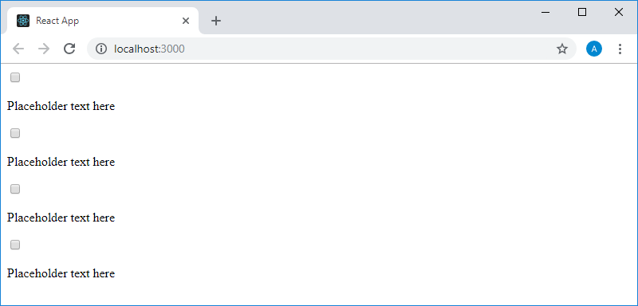
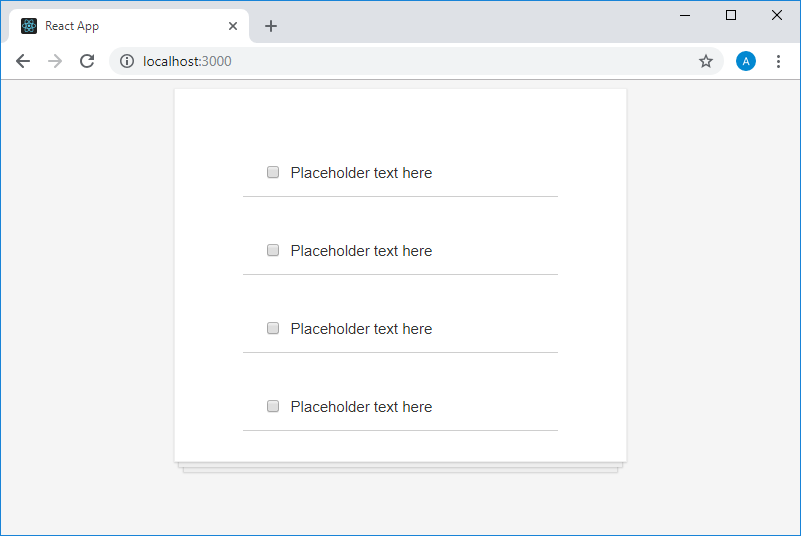
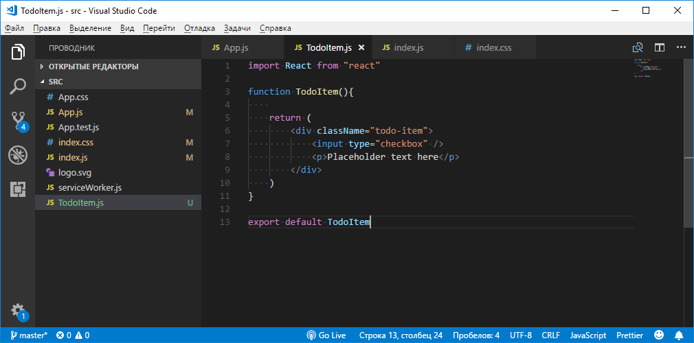
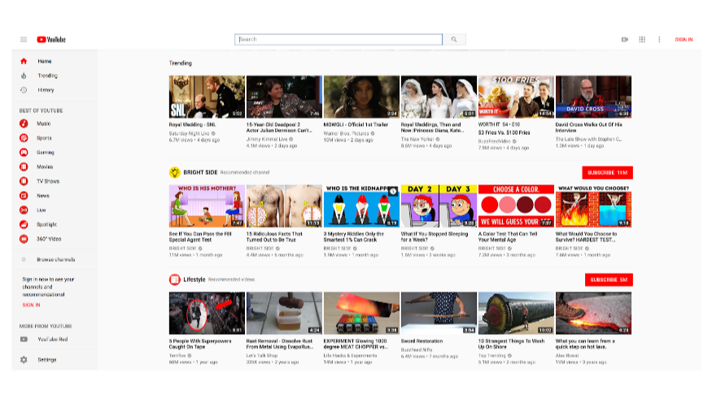
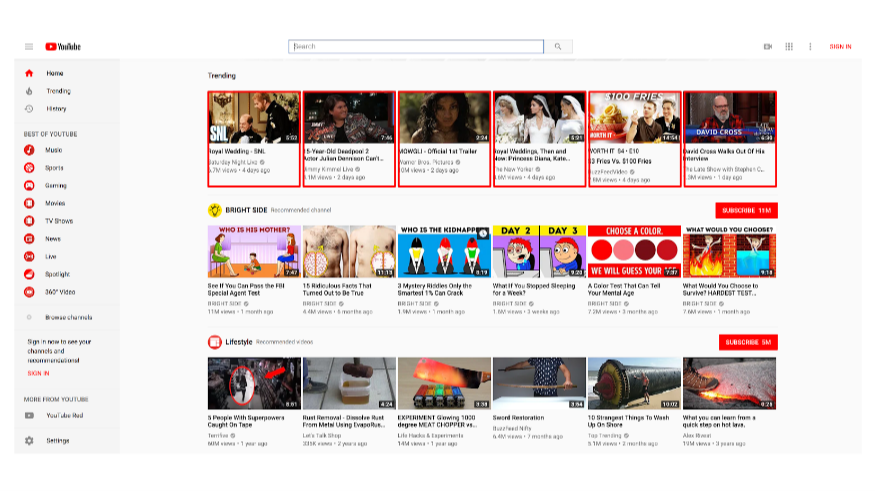
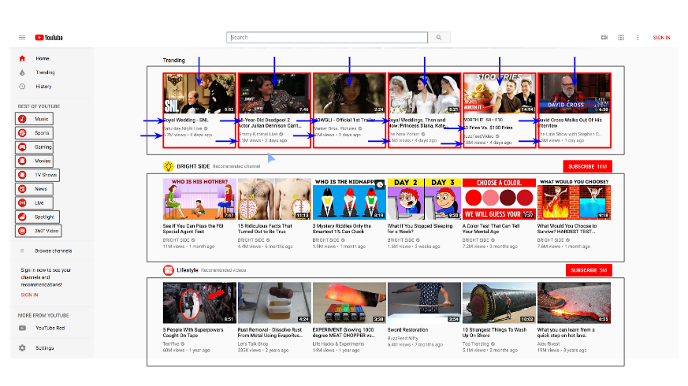

Учебный курс по React, часть 8: продолжение работы над TODO-приложением, знакомство со свойствами компонентов / Блог компании RUVDS.com

Сегодняшние занятия учебного курса по React, перевод которого мы публикуем, посвящены продолжению работы над TODO-приложением и свойствам компонентов.

→ [Часть 1: обзор курса, причины популярности React, ReactDOM и JSX](https://habr.com/post/432636/)  
→ [Часть 2: функциональные компоненты](https://habr.com/post/433400/)  
→ [Часть 3: файлы компонентов, структура проектов](https://habr.com/post/433404/)  
→ [Часть 4: родительские и дочерние компоненты](https://habr.com/company/ruvds/blog/434118/)  
→ [Часть 5: начало работы над TODO-приложением, основы стилизации](https://habr.com/company/ruvds/blog/434120/)  
→ [Часть 6: о некоторых особенностях курса, JSX и JavaScript](https://habr.com/company/ruvds/blog/435466/)  
→ [Часть 7: встроенные стили](https://habr.com/company/ruvds/blog/435468/)  
→ [Часть 8: продолжение работы над TODO-приложением, знакомство со свойствами компонентов](https://habr.com/company/ruvds/blog/435470/)  

## Занятие 16\. Практикум. TODO-приложение. Этап №2

→ [Оригинал](https://scrimba.com/p/p7P5Hd/cewQ3fp)

### ▍Задание

  

1.  Выполняя [предыдущий практикум](https://habr.com/company/ruvds/blog/434120/), вы создали React-приложение, компонент `App` которого выводит набор пар элементов — флажков (элементов `<input type="checkbox" />`) и их описаний (элементов `
 
`). Оформите элементы этого набора в виде самостоятельного компонента — `<TodoItem />` и используйте его для формирования списка в компоненте `App`. При этом пока не обращайте внимания на то, что все элементы этого списка будут выглядеть одинаково (позже мы поговорим о том, как наполнить их разными данными).
2.  Стилизуйте страницу так, как вам захочется, используя CSS-файлы, встроенные стили, или комбинацию из этих методов стилизации React-приложений.

  

### ▍Решение

Здесь предполагается, что вы продолжаете работу над приложением, основанном на стандартном проекте, который создан средствами `create-react-app`. Вот каким был код компонента `App` до выполнения задания.

    import React from "react"
    
    function App() {
        return (
            

                <input type="checkbox" />
                
Placeholder text here

                
                <input type="checkbox" />
                
Placeholder text here

                
                <input type="checkbox" />
                
Placeholder text here

                
                <input type="checkbox" />
                
Placeholder text here

            

        )
    }
    
    export default App

Создадим, в той же папке, в которой находится этот файл, файл `TodoItem.js`, в котором будет храниться код компонента `TodoItem`. Теперь импортируем этот файл в файл `App.js` следующей командой:

    import TodoItem from "./TodoItem"

Сделать это можно и позже, когда придёт время пользоваться кодом компонента `TodoItem` (ещё пока не написанным). Этим кодом мы сейчас и займёмся. Вот каким он будет:

    import React from "react"
    
    function TodoItem() {
        return (
            

                <input type="checkbox" />
                
Placeholder text here

            

        )
    }
    
    export default TodoItem

Обратите внимание на две вещи. Во-первых — этот компонент возвращает два элемента — поэтому они обёрнуты в элемент `
`. Во-вторых — то, что он возвращает, представляет собой копию одной из пар элементов флажок/описание из файла `App.js`.

Теперь мы снова переходим к файлу `App.js` и, вместо пар флажок/описание, используем в возвращаемой им разметке экземпляры компонента `TodoItem`:

    import React from "react"
    import TodoItem from "./TodoItem"
    
    function App() {
        return (
            

                <TodoItem />
                <TodoItem />
                <TodoItem />
                <TodoItem />
            

        )
    }
    
    export default App

В результате страница, которую формирует приложение, будет выглядеть так, как показано ниже.

_Внешний вид приложения в браузере_

Собственно говоря, её внешний вид, в сравнении с предыдущим вариантом, не изменился, но то, что теперь для формирования пар элементов используется компонент, открывает перед нами большие возможности, которыми мы воспользуемся позже.

Теперь выполним второе задание, стилизовав приложение с использованием CSS-классов. Для этого приведём код компонента `App` к следующему виду:

    import React from "react"
    import TodoItem from "./TodoItem"
    
    function App() {
        return (
            

                <TodoItem />
                <TodoItem />
                <TodoItem />
                <TodoItem />
            

        )
    }
    
    export default App

Тут мы назначили имя класса для элемента `
`. Похожим образом поработаем с кодом компонента `TodoItem`:

    import React from "react"
    
    function TodoItem(){
        
        return (
            

                <input type="checkbox" />
                
Placeholder text here

            

        )
    }
    
    export default TodoItem

Теперь подключим CSS-файл `index.css`, который уже имеется в проекте, так как он создан средствами `create-react-app`, в файле `index.js`:

    import React from "react"
    import ReactDOM from "react-dom"
    
    import "./index.css"
    
    import App from "./App"
    
    ReactDOM.render(
        <App />, 
        document.getElementById("root")
    )

Добавим в `index.css` следующее описание стилей:

    body {
        background-color: whitesmoke;
    }
    
    .todo-list {
        background-color: white;
        margin: auto;
        width: 50%;
        display: flex;
        flex-direction: column;
        align-items: center;
        border: 1px solid #efefef;
        box-shadow:
        
            0 1px 1px rgba(0,0,0,0.15),
                
            0 10px 0 -5px #eee,
                
            0 10px 1px -4px rgba(0,0,0,0.15),
                
            0 20px 0 -10px #eee,
                
            0 20px 1px -9px rgba(0,0,0,0.15);
        padding: 30px;
    }
    
    .todo-item {
        display: flex;
        justify-content: flex-start;
        align-items: center;
        padding: 30px 20px 0;
        width: 70%;
        border-bottom: 1px solid #cecece;
        font-family: Roboto, sans-serif;
        font-weight: 100;
        font-size: 15px;
        color: #333333;
    }
    
    input[type=checkbox] {
        margin-right: 10px;
        font-size: 30px;
    }
    
    input[type=checkbox]:focus {
        outline: 0;
    }

Вот как теперь будет выглядеть страница приложения в браузере.

_Внешний вид приложения в браузере_

Вы можете самостоятельно проанализировать и отредактировать эти стили.

Если говорить об особенностях кода, применяемого при стилизации, обратите внимание на то, что для назначения классов элементам тут используется ключевое слово `className`, и на то, что React поддерживает встроенные стили. Вот как на данном этапе выглядит проект нашего приложения в VSCode.

_Проект приложения в VSCode_

Если сейчас поэкспериментировать с тем, что у нас получилось, окажется, что флажки реагируют на воздействия пользователя.

_Флажки реагируют на воздействия пользователя_

Но при этом код приложения ничего не знает о тех изменениях, которые с этими флажками происходят. Если коду будет известно о том, что происходит в интерфейсе приложения, это позволит нам организовать его реакцию на различные события. Например, элемент списка дел, в котором установлен флажок, указывающий на то, что соответствующая задача выполнена, можно как-то изменить. О том, как это сделать, мы поговорим на следующих занятиях.

## Занятие 17\. Свойства, часть 1. Атрибуты HTML-элементов

→ [Оригинал](https://scrimba.com/p/p7P5Hd/cvP7Qf2)

Поговорим о концепции свойств в React. Начнём с примера HTML-кода некоей страницы:

    <html>
        <head></head>
        <body>
            <a>This is a link</a>
            <input />
            
        </body>
    </html>

Как видите, тут нет ничего, относящегося к React. Перед нами — обычная HTML-разметка. Обратите внимание на три элемента, присутствующих в теле страницы, описываемой этой разметкой: `<a>`, `<input />` и ``, и подумайте о том, что с ними не так.

Проблема тут заключается в том, что все эти элементы не выполняют свойственных им функций. Ссылка, описываемая тегом `<a>`, никуда не ведёт. Этому тегу нужно назначить атрибут (свойство) `href`, содержащий некий адрес, по которому будет осуществлён переход при щелчке по ссылке. Та же проблема характерна и для тега `` из нашего примера. Ему не назначен атрибут `src`, задающий изображение, локальное, или доступное по URL, которое будет выводить этот элемент. В результате оказывается, что для обеспечения правильной работы элементов `<a>` и `` необходимо, соответственно, задать их свойства `href` и `src`. Если говорить об элементе `<input>`, то он, без настройки его атрибутов, выведет на страницу поле ввода, но в таком виде его обычно не используют, настраивая его свойства `placeholder`, `name`, `type`. Последнее свойство, например, позволяет кардинально менять внешний вид и поведение элемента `<input>`, превращая его из поля для ввода текста во флажок, в радиокнопку, или в кнопку для отправки формы. Надо отметить, что термины «атрибут» и «свойство» мы используем здесь как взаимозаменяемые.

Отредактировав вышеприведённый код, мы можем привести его к следующему виду:

    <html>
        <head></head>
        <body>
            <a href="https://google.com">This is a link</a>
            <input placeholder="First Name" name="" type=""/>
            
        </body>
    </html>

Он и в таком виде пока не вполне нормален, но тут мы, по крайней мере, задали значения для некоторых атрибутов HTML-элементов, и обозначили места, куда можно ввести значения для ещё некоторых атрибутов.

Собственно говоря, если вышеописанная концепция атрибутов HTML-элементов вам понятна, то вы без труда разберётесь и с концепцией свойств компонентов React. А именно, речь идёт о том, что мы, в React-приложениях, можем использовать компоненты собственной разработки, а не только стандартные HTML-теги. При работе с компонентами мы можем назначать им свойства, которые, при обработке их в компонентах, способны менять их поведение. Например — такие свойства позволяют настраивать внешний вид компонентов.

## Занятие 18\. Свойства, часть 2. Компоненты, подходящие для повторного использования

→ [Оригинал](https://scrimba.com/p/p7P5Hd/cd27pTk)

Прежде чем мы перейдём к разговору об использовании свойств в React, рассмотрим ещё одно концептуальное понятие. Взглянем на домашнюю страницу YouTube.

_Домашняя страница YouTube_

Уверен, что на этой странице React не использует, так как Google занимается развитием фреймворка Angular, но принципы, которые мы рассмотрим на этом примере, универсальны.

Подумайте о том, как подобную страницу можно было бы построить, используя возможности React. Пожалуй, первое, на что вы обратите внимание — это то, что данную страницу можно разделить на фрагменты, представленные самостоятельными компонентами. Например, несложно заметить, что элементы, в которых выводится информация о видеоклипах, выделенные на рисунке ниже, очень похожи друг на друга.

_Домашняя страница YouTube, элементы, похожие друг на друга_

Если присмотреться к этим элементам, окажется, что в верхней части каждого из них имеется изображение, и то, что все эти изображения имеют одинаковый размер. У каждого из этих элементов есть заголовок, оформленный полужирным шрифтом и находящийся сразу под изображением. Каждый элемент содержит сведения о количестве просмотров соответствующего видео, о дате его публикации. В правом нижнем углу каждого изображения, присутствующего на элементе, имеются сведения о длительности соответствующего видеоклипа.

Вполне понятно то, что тот, кто создал эту страницу, не занимался чем-то вроде копирования, вставки и модифицирования кода для представления каждого из выведенных на ней элементов. Если бы подобная страница была создана средствами React, то можно было бы представить себе, что карточки видеоклипов являются экземплярами некоего компонента, скажем, `<VideoTile />`. При этом такой компонент включает в себя некоторое количество других компонентов, представляющих собой изображение, заголовок, сведения о длительности клипа, и другие элементы карточки видеоклипа.

Вышесказанное приводит нас к мысли о том, что для формирования подобной страницы был разработан единственный компонент, представляющий собой карточку видеоклипа. При этом на страницу было выведено множество экземпляров этого компонента, каждый из которых отображает уникальные данные. То есть — при разработке подобного компонента нужно предусмотреть возможность изменения неких свойств, вроде URL изображения, влияющих на его внешний вид и поведение. Собственно говоря, именно этому и посвящено наше следующее занятие. Но, прежде чем мы к нему перейдём, мне хотелось бы, чтобы вы освоились с идеей использования компонентов в React.

Вспомните о том занятии, на котором мы обсуждали родительские и дочерние компоненты, и о том, что компоненты могут формировать структуры, обладающие большой глубиной вложенности. Например, в нашем случае, на странице можно выделить горизонтальные группы карточек видеоклипов, вероятно, расположенные таким образом с помощью некоего служебного компонента для вывода списков элементов. Этими элементами являются карточки видеоклипов, которые, в свою очередь, выводят некое количество других элементов, представляющих собой сведения о конкретном клипе.

_Домашняя страница YouTube, родительские и дочерние компоненты_

Кроме того, в левой части страницы можно видеть вертикальную группу похожих друг на друга элементов. Вероятнее всего, они являются экземплярами одного и того же компонента. При этом у каждого из них имеется собственное изображение и текст.

То, что современные фреймворки для разработки веб-интерфейсов, такие, как React, Angular или Vue, позволяют, один раз создав компонент, многократно использовать его, задавая его свойства, является одной из причин популярности этих фреймворков. Это значительно облегчает и ускоряет разработку.

## Итоги

На этом занятии мы продолжили работу над TODO-приложением и разобрали темы, посвящённые атрибутам HTML-элементов и идее повторного использования компонентов, подводящие нас к работе со свойствами React-компонентов. Именно этим мы и займёмся в следующий раз.

**Уважаемые читатели!** Понятна ли вам концепция свойств компонентов?

