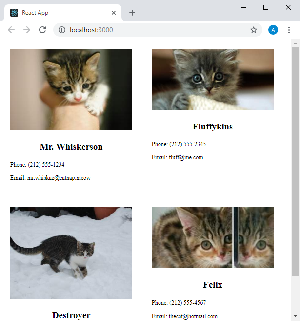
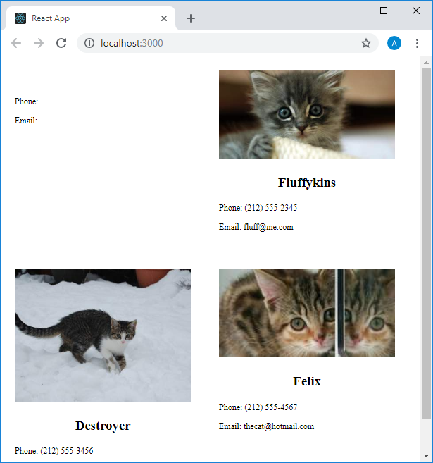

Учебный курс по React, часть 9: свойства компонентов / Блог компании RUVDS.com

В сегодняшней части перевода учебного курса по React мы поговорим о свойствах компонентов. Это — одна из важнейших концепций, нашедших отражение в данной библиотеке.

→ [Часть 1: обзор курса, причины популярности React, ReactDOM и JSX](https://habr.com/post/432636/)  
→ [Часть 2: функциональные компоненты](https://habr.com/post/433400/)  
→ [Часть 3: файлы компонентов, структура проектов](https://habr.com/post/433404/)  
→ [Часть 4: родительские и дочерние компоненты](https://habr.com/company/ruvds/blog/434118/)  
→ [Часть 5: начало работы над TODO-приложением, основы стилизации](https://habr.com/company/ruvds/blog/434120/)  
→ [Часть 6: о некоторых особенностях курса, JSX и JavaScript](https://habr.com/company/ruvds/blog/435466/)  
→ [Часть 7: встроенные стили](https://habr.com/company/ruvds/blog/435468/)  
→ [Часть 8: продолжение работы над TODO-приложением, знакомство со свойствами компонентов](https://habr.com/company/ruvds/blog/435470/)  
→ [Часть 9: свойства компонентов](https://habr.com/company/ruvds/blog/436032/)

## Занятие 19\. Свойства компонентов в React

→ [Оригинал](https://scrimba.com/p/p7P5Hd/cqP7bhm)

Создадим новый проект средствами `create-react-app` и изменим код нескольких стандартных файлов из папки `src`.

Вот код файла `index.js`:

    import React from "react"
    import ReactDOM from "react-dom"
    import "./index.css"
    
    import App from "./App"
    
    ReactDOM.render(<App />, document.getElementById("root"))

Вот стили, которые описаны в файле `index.css`:

    body {
      margin: 0;
    }
    
    .contacts {
      display: flex;
      flex-wrap: wrap;
    }
    
    .contact-card {
      flex-basis: 250px;
      margin: 20px;
    }
    
    .contact-card > img {
      width: 100%;
      height: auto;
    }
    
    .contact-card > h3 {
      text-align: center;
    }
    
    .contact-card > p {
      font-size: 12px;
    }

Вот код, находящийся в файле `App.js`:

    import React from "react"
    
    function App() {
        return (
            

                

                    
                    <h3>▍Mr. Whiskerson</h3>
                    
Phone: (212) 555-1234

                    
Email: mr.whiskaz@catnap.meow

                

                
                

                    
                    <h3>▍Fluffykins</h3>
                    
Phone: (212) 555-2345

                    
Email: fluff@me.com

                

                
                

                    
                    <h3>▍Destroyer</h3>
                    
Phone: (212) 555-3456

                    
Email: ofworlds@yahoo.com

                

                
                

                    
                    <h3>▍Felix</h3>
                    
Phone: (212) 555-4567

                    
Email: thecat@hotmail.com

                

            

        )
    }
    
    export default App

Вот как будет выглядеть это приложение в браузере.

_Страница приложения в браузере_

Проанализировав код и внешний вид приложения можно прийти к выводу о том, что для вывода карточек со сведениями о животных хорошо было бы использовать особые компоненты. Сейчас эти элементы формируются средствами компонента `App`. Учитывая же то, о чём мы говорили на предыдущих занятиях, можно пойти и дальше — подумать об универсальном компоненте, который можно настраивать, передавая ему атрибуты или свойства.

В нашем приложении имеются карточки с изображениями кошек, их именами и контактными сведениями их владельцев (а может — и их самих) — телефоном и адресом электронной почты. Для того чтобы создать компонент, который в дальнейшем станет основой для всех подобных карточек, можно взять один из фрагментов разметки, возвращаемой компонентом `App`. Например — такой:

    

        
        <h3>▍Mr. Whiskerson</h3>
        
Phone: (212) 555-1234

        
Email: mr.whiskaz@catnap.meow

    

App возвращает четыре подобных блока, каждый из них можно было бы использовать для создания самостоятельного компонента, но такой подход нас не устраивает. Поэтому создадим один компонент, который станет основой всех карточек, выводимых приложением. Для этого создадим в папке `src` новый файл компонента — `ContactCard.js` и поместим в него код, который возвращает первый элемент `
`, возвращаемый компонентом `App`, код которого приведён выше. Вот каким будет код компонента `ContactCard`:

    import React from "react"
    
    function ContactCard() {
        return (
            

                
                <h3>▍Mr. Whiskerson</h3>
                
Phone: (212) 555-1234

                
Email: mr.whiskaz@catnap.meow

            

        )
    }
    
    export default ContactCard

Ясно, что если создать несколько экземпляров этого компонента, то все они будут содержать одни и те же данные, так как эти данные жёстко заданы в коде компонента. А нам хотелось бы, чтобы, при создании разных экземпляров этого компонента, можно было бы настраивать выводимые им данные. Речь идёт о том, чтобы компоненту можно было бы передавать некие свойства, которыми он потом сможет воспользоваться.

Мы работаем с функциональными компонентами, которые представляют собой обычные JS-функции, в которых, благодаря использованию библиотеки React, можно использовать особые конструкции. Как известно, функции могут принимать аргументы, хотя их можно использовать и без аргументов. Аналогией нашего компонента `ContactCard`, в том виде, в котором он сейчас существует, может стать такая вот простая функция, которая, ничего не принимая, просто возвращает сумму двух чисел:

    function addNumbers() {
        return 1 + 1
    }

Её можно использовать для того, чтобы узнать сумму чисел 1 и 1, но, например, для того, чтобы сложить 1 и 2, используя функции, которые не принимают никаких входных данных, нам пришлось бы писать новую функцию. Совершенно очевидно то, что такой подход приведёт к огромным неудобствам при необходимости сложения разных чисел, поэтому в подобной ситуации будет разумным создать универсальную функцию для сложения чисел, которая принимает два числа и возвращает их сумму:

    function addNumbers(a, b) {
        return a + b
    }

То, что возвращает такая функция, будет зависеть от того, какие аргументы ей передали при вызове. Создавая React-компоненты мы можем пойти точно таким же путём.

Импортируем в файл `App.js` компонент `ContactCard` и вернём четыре его экземпляра, не удаляя пока код, который формирует карточки на странице приложения:

    import React from "react"
    import ContactCard from "./ContactCard"
    
    function App() {
        return (
            

                <ContactCard />
                <ContactCard />
                <ContactCard />
                <ContactCard />
    
                

                    
                    <h3>▍Mr. Whiskerson</h3>
                    
Phone: (212) 555-1234

                    
Email: mr.whiskaz@catnap.meow

                

                
                

                    
                    <h3>▍Fluffykins</h3>
                    
Phone: (212) 555-2345

                    
Email: fluff@me.com

                

                
                

                    
                    <h3>▍Destroyer</h3>
                    
Phone: (212) 555-3456

                    
Email: ofworlds@yahoo.com

                

                
                

                    
                    <h3>▍Felix</h3>
                    
Phone: (212) 555-4567

                    
Email: thecat@hotmail.com

                

            

        )
    }
    
    export default App

Теперь поработаем над кодом, используемым для создания экземпляров компонента `ContactCard`. Создавая обычные HTML-элементы, мы можем настраивать их атрибуты, влияющие на их поведение и внешний вид. Имена этих атрибутов жёстко заданы стандартом. В случае с компонентами можно воспользоваться точно таким же подходом, с той только разницей, что имена атрибутов мы придумываем сами, и сами же решаем — как именно они будут использованы в коде компонента.

Каждая из карточек содержит четыре фрагмента информации, которые, от карточки к карточке, могут меняться. Это — изображение кошки и её имя, а также телефон и адрес электронной почты. Пусть имя кошки будет содержаться в свойстве `name`, адрес изображения — в свойстве `imgURL`, телефон — в свойстве `phone`, а адрес электронной почты — в свойстве `email`.

Зададим эти свойства экземплярам компонентов `ContactCard` и, по мере переноса данных из кода, который уже имеется в `App`, будем удалять соответствующие его фрагменты. В результате код компонента `App` будет выглядеть так:

    import React from "react"
    import ContactCard from "./ContactCard"
    
    function App() {
        return (
            

                <ContactCard 
                    name="Mr. Whiskerson" 
                    imgUrl="http://placekitten.com/300/200" 
                    phone="(212) 555-1234" 
                    email="mr.whiskaz@catnap.meow"
                />
                
                <ContactCard 
                    name="Fluffykins" 
                    imgUrl="http://placekitten.com/400/200" 
                    phone="(212) 555-2345" 
                    email="fluff@me.com"
                />
                
                <ContactCard 
                    name="Destroyer" 
                    imgUrl="http://placekitten.com/400/300" 
                    phone="(212) 555-3456" 
                    email="ofworlds@yahoo.com"
                />
                
                <ContactCard 
                    name="Felix" 
                    imgUrl="http://placekitten.com/200/100" 
                    phone="(212) 555-4567" 
                    email="thecat@hotmail.com"
                />
                
            

        )
    }
    
    export default App

Правда, одной только передачи свойств компоненту недостаточно для того, чтобы они были бы в нём использованы. Страница, которая будет сформирована вышеприведённым компонентом `App`, будет содержать четыре одинаковых карточки, данные которых заданы в коде компонента `ContactCard`, который пока не знает о том, что ему делать с переданными ему свойствами.

_Данные карточек жёстко заданы в коде, компонент не умеет работать с переданными ему свойствами_

Поэтому сейчас пришло время поговорить о том, как компонент `ContactCard` может работать со свойствами, передаваемыми ему при создании его экземпляров.

Приступим к решению этой задачи, указав, при объявлении функции `ContactCard`, что она принимает параметр `props`. При этом код компонента будет выглядеть так:

    import React from "react"
    
    function ContactCard(props) {
        return (
            

                
                <h3>▍Mr. Whiskerson</h3>
                
Phone: (212) 555-1234

                
Email: mr.whiskaz@catnap.meow

            

        )
    }
    
    export default ContactCard

На самом деле, этот параметр можно назвать как угодно, но в React принято называть его именно `props`, и те свойства, о которых мы тут говорим, часто называют просто «props».

Параметр `props` — это объект. Свойствами этого объекта являются свойства, переданные компоненту при создании его экземпляра. То есть, например, в нашем объекте `props` будет свойство `props.name`, содержащее имя кошки, переданное компоненту при создании его экземпляра. Кроме того, у него будут свойства `props.imgUrl`, `props.phone`, `props.email`. Для того чтобы в этом убедиться, добавим в начало функции `ContactCard` команду `console.log(props)`.

    import React from "react"
    
    function ContactCard(props) {
        console.log(props)
        return (
            

                
                <h3>▍Mr. Whiskerson</h3>
                
Phone: (212) 555-1234

                
Email: mr.whiskaz@catnap.meow

            

        )
    }
    
    export default ContactCard

Это позволит вывести объект `props`, получаемый компонентом, в консоль.

_Объект props в консоли_

Тут можно видеть вывод четырёх объектов из `ContactCard.js`. Их именно столько из-за того, что мы создаём четыре экземпляра компонента `ContactCard`.

Всё это даёт нам возможность использовать в коде компонента, вместо жёстко заданных значений, то, что передано ему при создании его экземпляра, доступное в виде свойств объекта `props`.

Что если мы попытаемся воспользоваться свойством `props.imgUrl` так:

    

На первый взгляд такая конструкция может сработать, но вспомним о том, что тут нам нужно использовать сущность из JavaScript в JSX-коде. О том, как это делается, мы говорили на одном из предыдущих занятий. А именно, в нашем случае свойство объекта нужно заключить в фигурные скобки:

    

Переработаем по такому же принципу другие элементы, возвращаемые компонентом, после чего его код примет следующий вид:

    import React from "react"
    
    function ContactCard(props) {
        return (
            

                
                <h3>▍{props.name}</h3>
                
Phone: {props.phone}

                
Email: {props.email}

            

        )
    }
    
    export default ContactCard

Обратите внимание на то, что в полях для вывода телефона и адреса электронной почты мы оставили тексты `Phone:` и `Email:` с пробелами, следующими за ними, так как эти тексты используются во всех компонентах. Если теперь взглянуть на страницу приложения, то можно заметить, что она содержит четыре разных карточки.

_Страница, сформированная с использованием универсального компонента_

Наш компонент принимает всего четыре свойства. Что если некоему компоненту нужно будет, например, передать 50 свойств? Пожалуй, передавать каждое такое свойство отдельной строкой, как это сделано в компоненте `App`, будет неудобно. В таких случаях можно воспользоваться другим способом передачи свойств компонентам. Он заключается в том, что, при создании экземпляра компонента, ему передаётся не список свойств, а объект со свойствами. Вот как это может выглядеть на примере первого компонента:

    import React from "react"
    import ContactCard from "./ContactCard"
    
    function App() {
        return (
            

                <ContactCard 
                    contact={{
                      name: "Mr. Whiskerson",
                      imgUrl: "http://placekitten.com/300/200",
                      phone: "(212) 555-1234",
                      email: "mr.whiskaz@catnap.meow"
                    }}
                />
                
                <ContactCard 
                    name="Fluffykins" 
                    imgUrl="http://placekitten.com/400/200" 
                    phone="(212) 555-2345" 
                    email="fluff@me.com"
                />
                
                <ContactCard 
                    name="Destroyer" 
                    imgUrl="http://placekitten.com/400/300" 
                    phone="(212) 555-3456" 
                    email="ofworlds@yahoo.com"
                />
                
                <ContactCard 
                    name="Felix" 
                    imgUrl="http://placekitten.com/200/100" 
                    phone="(212) 555-4567" 
                    email="thecat@hotmail.com"
                />
                
            

        )
    }
    
    export default App

Нельзя сказать, что этот подход значительно сократил количество кода, используемого для описания экземпляра компонента. Дело в том, что свойства, передаваемые компоненту, всё так же жёстко заданы в коде, хотя мы и передаём компоненту лишь один объект. Преимущества этого подхода можно будет ощутить в ситуациях, когда данные для компонента получают из неких внешних источников. Например — из JSON-файла.

В ходе модификации кода компонента `App`, используемого для создания первого экземпляра компонента `ContactCard`, правильная работа приложения была нарушена. Вот как теперь будет выглядеть его страница.

_Нарушение правильной работы приложения_

Как это можно это исправить? Для того чтобы в этом разобраться, полезно будет проанализировать происходящее с помощью команды `console.log(props)`.

_Анализ объекта props_

Как видно, объект `props` первого компонента отличается от такого же объекта второго и следующих компонентов.

В компоненте `ContactCard` мы пользуемся объектом `props` исходя из предположения о том, что у него есть свойства `name`, `imgUrl` и прочие подобные. Здесь же первый компонент получает лишь одно свойство — `contact`. Это приводит к тому, что у объекта `props` оказывается лишь одно свойство — `contact`, являющееся объектом, а в коде компонента работа с подобной структурой не предусмотрена.

Перевести наш компонент на модель использования лишь одного свойства-объекта `contact`, содержащего другие свойства, довольно просто. Для этого, например, для доступа к свойству `name`, достаточно воспользоваться конструкцией вида `props.contact.name` в коде компонента. Аналогичные конструкции позволяют правильно работать с другими нужными нам свойствами.

Переработаем код компонента с учётом передачи ему единственного свойства-объекта `contact`, содержащего другие свойства:

    import React from "react"
    
    function ContactCard(props) {
        console.log(props)
        return (
            

                
                <h3>▍{props.contact.name}</h3>
                
Phone: {props.contact.phone}

                
Email: {props.contact.email}

            

        )
    }
    
    export default ContactCard

Первый компонент теперь должен будет выводиться нормально, но мы этого, на данном этапе работы над проектом, не увидим, так как система сообщит нам о множестве ошибок, связанных с тем, что несколько экземпляров компонента `ContactCard`, создаваемые в компоненте `App`, не получают свойство-объект `contact`. При выполнении кода это свойство будет иметь значение `undefined`. В результате производится попытка обратиться к некоему свойству значения `undefined`, что и приводит к возникновению ошибки. Исправим это, переработав код компонента `App`, ответственный за формирование компонентов `ContactCard`:

    import React from "react"
    import ContactCard from "./ContactCard"
    
    function App() {
        return (
            

                <ContactCard 
                    contact={{
                      name: "Mr. Whiskerson", 
                      imgUrl: "http://placekitten.com/300/200", 
                      phone: "(212) 555-1234", 
                      email: "mr.whiskaz@catnap.meow"
                    }}
                />
                
                <ContactCard 
                    contact={{
                      name: "Fluffykins", 
                      imgUrl: "http://placekitten.com/400/200", 
                      phone: "(212) 555-2345", 
                      email: "fluff@me.com"
                    }}
                />
                
                <ContactCard
                    contact={{
                      name: "Destroyer", 
                      imgUrl: "http://placekitten.com/400/300", 
                      phone: "(212) 555-3456", 
                      email: "ofworlds@yahoo.com"
                    }}
                />
                
                <ContactCard 
                    contact={{
                      name: "Felix", 
                      imgUrl: "http://placekitten.com/200/100", 
                      phone: "(212) 555-4567", 
                      email: "thecat@hotmail.com"
                    }}
                />
                
            

        )
    }
    
    export default App

Теперь страница приложения будет выглядеть так же, как раньше.

Как обычно, рекомендуется самостоятельно поэкспериментировать с изученными сегодня концепциями для того, чтобы лучше их усвоить. Например — можете поработать с кодом, добавить новые свойства, передаваемые компоненту, и попытаться использовать их в компоненте.

## Итоги

Сегодня мы познакомились с концепцией свойств, которые можно передавать компонентам React для того, чтобы управлять их поведением и внешним видом. Эти свойства напоминают атрибуты HTML-элементов, но, пользуясь свойствами в компонентах, программист самостоятельно принимает решение о том, какой смысл они несут и что именно делать с ними в компоненте. В следующий раз вас будет ждать практическое занятие по работе со свойствами компонентов и по стилизации.

**Уважаемые читатели!** Как вы экспериментировали с кодом сегодняшнего примера для того, чтобы лучше разобраться со свойствами React-компонентов?