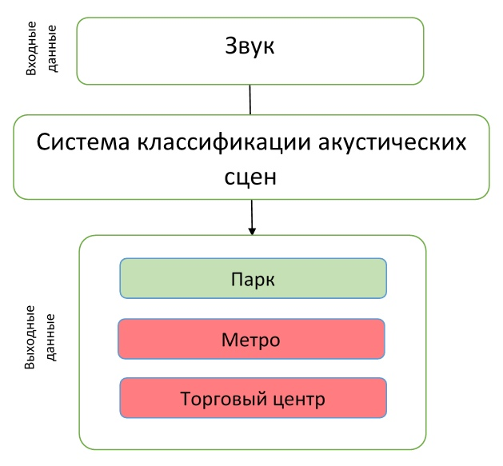
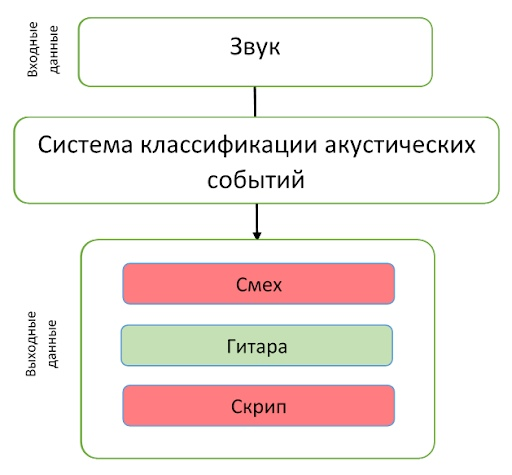
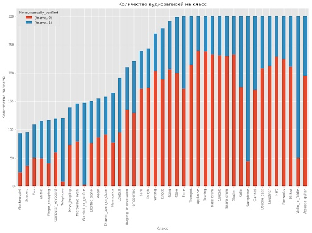
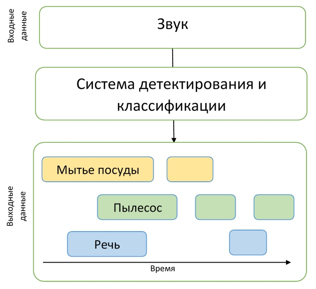
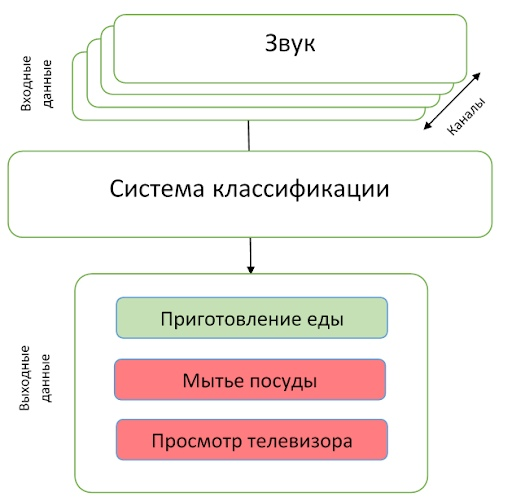

Учим компьютер различать звуки: знакомство с конкурсом DCASE и сборка своего аудио классификатора за 30 минут

### Введение

Доброго времени суток, хабр! Накопив немного опыта в решении задач классификации и детектирования акустических событий, мы с [ananaskelly](https://habr.com/ru/users/ananaskelly/) решили, что готовы им с вами поделиться. Цель этой статьи — познакомить вас с некоторыми задачами и рассказать о соревновании по автоматической обработке звука [“DCASE 2018”](http://dcase.community/challenge2018/index). Рассказывая вам о конкурсе, мы обойдемся без сложных формул и определений, связанных с машинным обучением, таким образом общий смысл статьи будет понятен широкой аудитории.

Для тех, кого в названии привлекла именно **сборка классификатора**, мы подготовили небольшой код на python, и по ссылке на [гитхабе](https://github.com/Ananaskelly/Event-detection) вы можете найти notebook, где мы на примере [второго трека](https://habr.com/ru/post/437818/#Track2) конкурса DCASE создаем простую сверточную сеть на keras для классификации аудиофайлов. Там мы немного рассказываем о сети и признаках, используемых для обучения, и как с помощью простой архитектуры получить близкий к baseline результат ([MAP@3](https://www.kaggle.com/wendykan/map-k-demo) = 0.6).

Дополнительно здесь будут описаны базовые подходы для решения задач (baseline), предложенные организаторами. Также в будущем появится несколько статей, где мы будем более подробно и в деталях рассказывать как о нашем опыте участия в соревновании, так и о решениях, предложенных другими участниками конкурса. Ссылки на эти статьи будут постепенно появляться здесь.

Наверняка, многие совсем не имеют представления о каком-то там **“DCASE”**, поэтому давайте разберемся, что же это за фрукт и с чем его едят. Соревнование “DCASE” проходит ежегодно, и в нем каждый год выкладывается несколько задач, посвященных решению проблем в области классификации аудиозаписей и детектирования акустических событий. Принять участие в соревновании может любой желающий, оно бесплатное, для этого достаточно просто зарегистрироваться на сайте в качестве участника. По итогам соревнования проводится конференция, посвященная той же тематике, но, в отличие от самого конкурса, участие в ней уже платное, и о ней мы больше говорить не будем. Денежные вознаграждения за лучшие решения обычно не полагаются, однако бывают исключения (например, 3-я задача в 2018 году). В этом году организаторами были предложены следующие 5 задач:

  

1.  [Классификация акустических сцен (подразделяется на 3 подзадачи)](https://habr.com/ru/post/437818/#Track1)  
    A. обучающий и проверочный наборы данных записаны на одно и то же устройство  
    B. обучающий и проверочный наборы данных записаны на разные устройства  
    C. разрешено обучение с использованием данных, которые не были предложены организаторами
2.  [Классификация акустических событий](https://habr.com/ru/post/437818/#Track2)
3.  [Детектирование пения птиц](https://habr.com/ru/post/437818/#Track3)
4.  [Детектирование акустических событий в бытовых условиях с использованием слабо-размеченного набора данных](https://habr.com/ru/post/437818/#Track4)
5.  [Классификация бытовой активности в помещении по многоканальной записи](https://habr.com/ru/post/437818/#Track5)

  

#### О детектировании и классификации

Как мы видим, в названиях всех заданий присутствует одно из двух слов: “детектирование” или “классификация”. Давайте проясним, в чем же разница между этими понятиями, чтобы не осталось никакой путаницы.

Представим, что у нас есть аудиозапись, на которой в один момент времени лает собака, а в другой мяукает кошка, а других событий там попросту нет. Тогда если мы хотим понять, когда именно происходят эти события, то нам нужно решить задачу детектирования акустического события. То есть нам нужно узнать время начала и конца для каждого события. Решив задачу детектирования, мы узнаем, когда именно происходят события, но не знаем, кем именно издаются найденные звуки — тогда нам нужно решить задачу классификации, то есть определить, что именно произошло в заданном временном промежутке.

Для понимания описания задач соревнования этих примеров будет вполне достаточно, а это значит, что вводная часть закончена, и мы можем переходить к подробному описанию самих заданий.

  

* * *

  

### Track 1. Классификация акустических сцен

Первая задача заключается в определении окружающей обстановки (акустической сцены), в которой была сделана аудиозапись, например “Станция метро”, “Аэропорт” или “Пешеходная улица”. Решение такой задачи может пригодиться при оценке окружающей среды системой искусственного интеллекта, например, в автомобилях с автопилотом.

В этой задаче для обучения были представлены датасеты TUT Urban Acoustic Scenes 2018 и TUT Urban Acoustic Scenes 2018 Mobile, которые были подготовлены технологическим университетом Тампере (Финляндия). Подробное описание процесса подготовки датасета, а также базового решения, описано в [статье](https://arxiv.org/pdf/1807.09840.pdf).

Всего для соревнования были представлены 10 акустических сцен, которые и предстояло предсказывать участникам.

  

#### Подзадача А

Как мы уже говорили, задача разбивается на 3 подзадачи, каждая из которых отличается качеством аудиозаписей. Например, в подзадаче А для записи использовались специальные микрофоны, которые располагались в ушах человека. Таким образом производилась стереозапись более близкая к человеческому восприятию звука. Участникам представлялась возможность использовать такой подход к записи, чтобы улучшить качество распознавания акустической сцены.

  

#### Подзадача В

В подзадаче В для записи использовались также другие устройства (например, мобильные телефоны). Данные из подзадачи А были переведены в моно формат, частота дискретизации была уменьшена, имитация “слышимости” звука человеком в наборе данных для этой задачи отсутствует, зато имеется больше данных для обучения.

  

#### Подзадача С

Набор данных для подзадачи С такой же, как и в подзадаче А, но при решении этой задачи разрешается использовать любые внешние данные, какие сможет найти участник. Цель решения этой задачи — узнать, можно ли улучшить результат, полученный в подзадаче А, с помощью привлечения сторонних данных.

Качество решений на данном треке оценивалось по метрике [Accuracy](https://habr.com/company/ods/blog/328372/).

Baseline для этой задачи представляет двухслойную [сверточную нейронную сеть](http://cs231n.github.io/convolutional-networks/), обучающуюся на логарифмах [мелспектрограмм](https://habr.com/post/140828/) исходных аудиоданных. В предложенной архитектуре используются уже стандартные техники BatchNormalization и Dropout. Код на GitHub можно посмотреть [здесь](https://github.com/DCASE-REPO/dcase2018_baseline/tree/master/task1).

  

* * *

  

### Track 2. Классификация акустических событий

В этой задаче предлагается создать систему, осуществляющую классификацию акустических событий. Подобная система может стать дополнением для “умных” домов, повысить безопасность в местах большого скопления людей или облегчить жизнь людям с нарушениями слуха.

Набор данных для этой задачи состоит из файлов, взятых из набора данных [Freesound](https://freesound.org/) и размеченных с использованием меток из [AudioSet](https://research.google.com/audioset/index.html) от Google. Более подробно процесс подготовки датасета описывает [статья](https://arxiv.org/abs/1807.09902), подготовленная организаторами конкурса.

Вернемся к самой задаче, у которой есть несколько особенностей.

Во-первых, участникам предстояло создать модель, способную выявлять различия между акустическими событиями очень разной природы. Набор данных разделен на 41 класс, в нем представлены различные музыкальные инструменты, звуки, издаваемые человеком, животными, бытовые звуки и прочее.

Во-вторых, помимо обычной разметки данных, также присутствует дополнительная информация о проверке метки вручную. То есть участникам известно, какие файлы из набора данных были проверены человеком на соответствие метке, а какие нет. Как показала практика, участники, так или иначе использовавшие эту дополнительную информацию, занимали призовые места при решении этой задачи.

Дополнительно нужно сказать, что длительность записей в наборе данных очень сильно разнится: от 0.3 секунд до 30 секунд. В этой задаче также сильно варьируется количество данных на один класс, на которых нужно обучать модель. Лучше всего это изобразить в виде гистограммы, код для построения которой взят [отсюда](https://www.kaggle.com/fizzbuzz/beginner-s-guide-to-audio-data).

Как видно из гистограммы, ручная разметка по представленным классам тоже несбалансирована, что добавляет трудности при желании использовать эту информацию при обучении моделей.  
Результаты в этом треке оценивались по метрике усредненной точности (англ. Mean Average Precision, MAP@3), довольно простую демонстрацию вычисления этой метрики с примерами и кодом можно найти [здесь](https://www.kaggle.com/wendykan/map-k-demo).

  

* * *

  

### Track 3. Детектирование птичьего пения

Следующий трек — детектирование пения птиц. Подобная задача возникает, например, в различных системах автоматического мониторинга дикой природы — это первый шаг обработки данных перед, например, классификацией. Такие системы часто нуждаются в настройке, являются неустойчивыми к новым акустическим условиям, поэтому цель данного трека — призвать силу машинного обучения для решения подобных проблем.

Данный трек является расширенной версией конкурса [“Bird Audio Detection challenge”](http://machine-listening.eecs.qmul.ac.uk/bird-audio-detection-challenge/), организованного Лондонским Университетом Святой Марии, проходившего в 2017/2018 году. Для интересующихся [здесь](https://arxiv.org/abs/1807.05812) можно ознакомиться со статьей от авторов соревнования, где приводятся подробности про формирование данных, организацию самого конкурса и анализ полученных решений.

Однако, вернемся к задаче DCASE. Организаторами было предоставлено шесть наборов данных — три для обучения, три для тестирования — все они сильно отличаются — записаны в разных акустических условиях, при помощи различных записывающих устройств, на фоне имеются различные шумы. Таким образом основной посыл таков, что модель должна не зависеть от окружающей обстановки или уметь к ней адаптироваться. Несмотря на то, что в названии значится “детектирование”, задача состоит не в определении границ события, а в простой классификации — конечное решение представляет собой некий бинарный классификатор, который получает на вход короткую аудиозапись и принимает решение — есть на ней пение птицы или нет. Для оценки точности использовалась AUC метрика.

В основном участники пытались добиться обобщения и адаптации путем различной аугментации данных. Одна из команд [описывает](http://dcase.community/documents/challenge2018/technical_reports/DCASE2018_Liaqat_96.pdf) применение различных техник — изменение частотного разрешения в извлеченных признаках, предварительная шумоочистка, [метод адаптации](https://arxiv.org/abs/1511.05547), основанный на выравнивании статистик второго порядка для различных наборов данных. Однако подобные методы, как и разные виды аугментации, дают весьма маленький прирост над базовым решением, как отмечают многие участники.

В качестве базового решения авторы подготовили модификацию наиболее удачного решения из оригинального соревнования “Bird Audio Detection challenge”. Код, как обычно, [доступен на гитхабе](https://github.com/DCASE-REPO/bulbul_bird_detection_dcase2018).

  

* * *

  

### Track 4. Детектирование акустических событий в бытовых условиях с использованием слабо размеченного набора данных.

В четвертом треке решается уже непосредственно задача детектирования. Участникам был предоставлен сравнительно небольшой датасет размеченных данных — всего 1578 аудиозаписей по 10 секунд, имеющих только разметку по классам: известно, что в файле содержится одно или несколько событий указанных классов, но временная разметка полностью отсутствует. Кроме этого, предоставлялось два больших датасета неразмеченных данных — 14412 файлов, содержащие таргет-события, таких же классов, как в обучающей и тестовой выборке, а также 39999 файлов, содержащие произвольные события, не входящие в таргеты. Все данные являются подмножеством [огромного датасета audioset, собранного гуглом](https://research.google.com/audioset/).

Таким образом, участникам было необходимо создать модель, способную обучиться по слабо размеченным данным находить временные метки начала и конца событий (события могут быть пересекающимися), и попытаться улучшить ее при помощи большого объема неразмеченных дополнительных данных. Кроме того, стоит отметить, что в данном треке была использована достаточно жесткая метрика — необходимо было предсказывать временные метки событий с точностью до 200 мс. В общем, участниками предстояло решить достаточно сложную задачу создания адекватной модели, при этом практически не имея хороших данных для обучения.  
В большинстве решения были основаны на сверточных рекуррентных сетях — достаточно популярной архитектуре в области детектирования акустических событий в последнее время (пример можно почитать [по ссылке](https://arxiv.org/pdf/1702.06286.pdf)).

Базовое решение от авторов, также на сверточных реккурентных сетях, основано на двух моделях. Модели имеют практически одинаковую архитектуру: три сверточных и один реккурентный слой. Отличие состоит лишь в выходе сетей. Первая модель обучена для разметки неразмеченных данных для расширения исходного датасета — таким образом на выходе имеем классы присутствующих в файле событий. Вторая — для уже непосредственно решения задачи детектирования, то есть на выходе получаем временную разметку для файла. Код по [ссылке](https://github.com/DCASE-REPO/dcase2018_baseline/tree/master/task4/).

  

* * *

  

### Track 5. Классификация бытовой активности в помещении по многоканальной записи.

Последний трек отличался от остальных в первую очередь тем, что участникам были предложены многоканальные записи. Сама задача состояла в классификации: необходимо предсказывать класс события, произошедшего на записи. В отличие от предыдущего трека задача несколько проще — известно, что в записи присутствует лишь одно событие.

Датасет представлен приблизительно 200 часами записей на линейную микрофонную решетку из 4 микрофонов. События представляют из себя разного рода бытовые занятия — готовка, мытье посуды, социальная активность (разговор по телефону, визит и личная беседа) и др., также выделен класс отсутствия каких-либо событий.

Авторы трека подчеркивают, что условия задачи сравнительно несложные для того, чтобы участники сфокусировались непосредственно на использовании пространственной информации из многоканальных записей. Также участникам была предоставлена возможность использовать дополнительные данные и предобученные модели. Качество оценивалось по F1-мере.

В качестве базового решения авторы трека предложили простенькую сверточную сеть с двумя сверточными слоями. В их решении пространственная информация не использовалась — данные с четырех микрофонов использовались для обучения независимо, а при тестировании предсказания усреднялись. Описание и код доступны [по ссылке](https://github.com/DCASE-REPO/dcase2018_baseline/tree/master/task5).

  

* * *

  

### Заключение

В статье мы попытались кратко рассказать о детектировании акустических событий и о таком конкурсе как DCASE. Возможно, смогли заинтересовать кого-то на участие в 2019 году — конкурс стартует уже в марте.