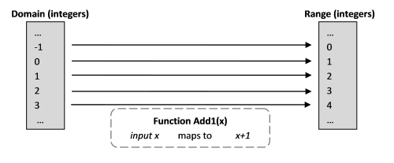

Функциональное мышление. Часть 1 / Блог компании Microsoft

В этой серии статей вы познакомитесь с основными принципами функционального программирования и поймёте, что значит «мыслить функционально» и как этот подход отличается от объектно-ориентированного или императивного программирования.

  

*   **[Первая часть](https://habr.com/company/microsoft/blog/415189/)**
*   **[Вторая часть](https://habr.com/company/microsoft/blog/420039/)**
*   **[Третья часть](https://habr.com/company/microsoft/blog/422115/)**
*   **[Четвертая часть](https://habr.com/company/microsoft/blog/430620/)**

Теперь, когда вы увидели некоторые из причин, по которым стоит использовать F#, в статье «[Погружение в F#. Пособие для C#-разработчиков](https://habr.com/company/microsoft/blog/335560/)», сделаем шаг назад и обсудим основы функционального программирования. Что в действительности означает «программировать функционально», и чем этот подход отличается от объектно-ориентированного или императивного программирования?

  

## Смена образа мышления (Intro)

Важно понимать, что функциональное программирование — это не просто отдельный стиль программирования. Это совсем другой способ мышления в программировании, который отличается от «традиционного» подхода так же значительно, как настоящее ООП (в стиле Smalltalk) отличается от традиционного императивного языка — такого, как C.

F# позволяет использовать нефункциональные стили кодирования, и это искушает программиста сохранить его существующие привычки. На F# вы можете программировать так, как привыкли, не меняя радикально мировоззрения, и даже не представляя, что при этом упускаете. Однако, чтобы получить от F# максимальную отдачу, а также научиться уверенно программировать в функциональном стиле вообще, очень важно научиться мыслить функционально, а не императивно.

  

> Цель данной серии статей — помочь читателю понять подоплёку функционального программирования и изменить его способ мышления.

Это будет довольно абстрактная серия, хотя я буду использовать множество коротких примеров кода для демонстрации некоторых моментов. Мы рассмотрим следующие темы:

  

*   **Математические функции**. Первая статья знакомит с математическими представлениями, лежащими в основе функциональных языков и преимуществами, которые приносит данный подход.
*   **Функции и значения**. Следующая знакомит с функциями и значениями, объясняет чем «значения» отличаются от переменных, и какие есть сходства между функциями и простыми значениями.
*   **Типы**. Затем мы перейдем к основным типам, которые работают с функциями: примитивные типы, такие как string и int, тип unit, функциональные типы, и обобщённые типы (generic).
*   **Функции с несколькими параметрами**. Далее я объясню понятия «каррирования» и «частичного применения». В этом месте чьим-то мозгам будет больно, особенно если у этих мозгов только императивное прошлое.
*   **Определение функций**. Затем несколько постов будут посвящены множеству различных способов определения и комбинирования функций.
*   **Сигнатуры функций**. Далее будет важный пост о критическом значении сигнатур функций, что они значат, и как использовать сигнатуры для понимания содержимого функций.
*   **Организация функций**. Когда станет понятно, как создавать функции, возникнет вопрос: как можно их организовать, чтобы сделать доступными для остальной части кода?

  

## Математические функции

Функциональное программирование вдохновлено математикой. Математические функции имеют ряд очень приятных особенностей, которые функциональные языки пытаются претворить в жизнь.

Давайте начнем с математической функции, которая добавляет 1 к числу.

  

    Add1(x) = x+1

Что на самом деле означает это выражение? Выглядит довольно просто. Оно означает, что существует такая операция, которая берет число и прибавляет к нему 1.  
Добавим немного терминологии:

  

*   Множество допустимых входных значений функции называются _domain_ (область определения). В данном примере, это могло быть множество действительных чисел, но сделаем жизнь проще и ограничимся здесь только целыми числами.
*   Множество возможных результатов функции (область значений) называется _range_ (технически, изображение **codomain-а**). В данном случае также множество целых.
*   Функцией называют _отображение_ (в оригинале _map_) из domain-а в range. (Т.е. из области определения в область значений.)

Вот как это определение будет выглядеть на F#.

  

    let add1 x = x + 1

Если ввести его в F# Interactive (не забудьте про двойные точку с запятой), то можно увидеть результат («сигнатуру» функции):

  

    val add1 : int -> int

Рассмотрим вывод подробно:

  

*   Общий смысл — это функция `add1` сопоставляет целые числа (из области определения) с целыми числами (из области значений).
*   «`add1`» определена как «val», сокращение от «value» (значения). Хм? что это значит? Мы обсудим значения чуть позже.
*   Стрелочная нотация «->» используется, чтобы показать domain и range. В данном случае, domain является типом 'int', как и range.

Заметьте, что тип не был указан явно, но компилятор F# решил, что функция работает с int-ами. (Можно ли это изменить? Да, и скоро мы это увидим).

  

#### Ключевые свойства математических функций

Математические функции имеют ряд свойств, которые очень сильно отличают их от функций, которые используются в процедурном программировании.

  

*   Функция всегда имеет один и тот же результат для одного и того же входного значения.
*   Функция не имеет побочных эффектов.

Эти свойства дают ряд заметных преимуществ, которые функциональные языки программирования пытаются по мере сил реализовать в своем дизайне. Рассмотрим каждое из них по очереди.

  

#### Математические функции всегда _возвращают одинаковый результат на заданное значение_

В императивном программировании мы думаем, что функции либо что-то «делают», либо что-то «подсчитывают». Математические функции ничего не считают, это чистые сопоставления из input в output. В самом деле, другое определение функции — это простое множество всех отображений. Например, очень грубо можно определить функцию «'add1'» (в C#) как

  

    int add1(int input)
    { 
       switch (input)
       {
       case 0: return 1;
       case 1: return 2;
       case 2: return 3;
       case 3: return 4;
       etc ad infinitum
       }
    }

Очевидно, что невозможно иметь по case-у на каждое возможное число, но принцип тот же. При такой постановке никаких вычислений не производится, осуществляется лишь поиск.

  

#### Математические функции свободны от побочных эффектов

В математической функции, входное и выходное значения логически две различные вещи, обе являющиеся предопределенными. Функция не изменяет входные или выходные данные и просто отображает предопределенное входное значение из области определения в предварительно определенное выходное значение в области значений.

Другими словами, вычисление функции _не может иметь каких либо эффектов на входные данные или еще что-нибудь в подобном роде_. Следует запомнить, что вычисление функции в действительности не считает и не манипулирует чем-либо, это просто перехваленный поиск.

Эта «иммутабельность» значений очень тонкая, но в тоже время очень важная вещь. Когда я занимаюсь математикой, я не жду, что числа будут изменяться в процессе их сложения. Например, если у меня дано:

  

    x = 5
    y = x+1

То я не ожидаю, что `x` изменится при добавлении к нему 1\. Я ожидаю, что получу другое число (`y`), и `x` должен остаться нетронутым. В мире математики целые числа уже существуют в неизменяемом множестве, и функция «add1» просто определяет отношения между ними.

  

#### Сила чистых функций

Те разновидности функций, что имеют повторяемые результаты и не имеют побочных эффектов называются «чистыми / pure функциями», и с ними можно сделать некоторые интересные вещи:

  

*   Их легко распараллелить. Скажем, можно бы взять целые числа в диапазоне от 1 до 1000 и раздать их 1000 различных процессоров, после чего поручить каждому CPU выполнить «`add1`» над соответствующим числом, одновременно будучи уверенным, что нет необходимости в каком-либо взаимодействии между ними. Не потребуется ни блокировок, ни мьютексов, ни семафоров, ни т.п.
*   Можно использовать функции лениво, вычисляя их тогда, когда это необходимо для логики программы. Можно быть уверенным, что ответ будет точно таким же, независимо от того, проводятся вычисления сейчас или позже.
*   Можно лишь один раз провести вычисления функции для конкретного входа, после чего закешировать результат, потому что известно, что данные входные значения будут давать такой же выход.
*   Если есть множество чистых функций, их можно вычислять в любом порядке. Опять же, это не может повлиять на финальный результат.

Соответственно, если в языке программирования есть возможность создавать чистые функции, можно немедленно получить множество мощных приемов. И несомненно, все это можно сделать в F#:

  

*   Пример параллельных вычислений был в серии [«Why use F#?»](https://fsharpforfunandprofit.com/posts/why-use-fsharp-intro/).
*   Ленивое вычисление функций будет обсуждено в серии [«Optimization»](https://fsharpforfunandprofit.com/series/optimization.html).
*   Кэширование результатов функций называется [мемоизацией](https://ru.wikipedia.org/wiki/%D0%9C%D0%B5%D0%BC%D0%BE%D0%B8%D0%B7%D0%B0%D1%86%D0%B8%D1%8F) и также будет обсуждено в серии [«Optimization»](https://fsharpforfunandprofit.com/series/optimization.html).
*   Отсутствие необходимости в отслеживании порядка выполнения делает параллельное программирование гораздо проще и позволяет не сталкиваться с багами вызванными сменой порядка функций или рефакторинга.

  

#### «Бесполезные» свойства математических функций

Математические функции также имеют некоторые свойства кажущиеся не очень полезными при программировании.

  

*   Входные и выходные значения неизменяемы
*   Функции всегда имеют один вход и один выход

Данные свойства отражаются в дизайне функциональных языков программирования. Стоит рассмотреть их по отдельности.

**Входные и выходные значения неизменяемы**

Иммутабельные значения в теории кажутся хорошей идеей, но как можно реально сделать какую-либо работу, если нет возможности назначить переменную традиционным способом.

Я могу заверить, что это не такая большая проблема как можно представить. В ходе данной серии статей будет ясно, как это работает на практике.

**Математические функции всегда имеют один вход и один выход**

Как видно из диаграмм, для математической функции всегда существует только один вход и только один выход. Это также верно для функциональных языков программирования, хотя может быть неочевидным при первом использовании.  
Это похоже на большое неудобство. Как можно сделать что-либо полезное без функций с двумя (или более) параметрами?

Оказывается, существует путь сделать это, и более того он является абсолютно прозрачным на F#. Называется он «каррированием», и заслуживает отдельного поста, который появится в ближайшее время.

На самом деле, позже выяснится, что эти два «бесполезных» свойства станут невероятно ценными, и будут ключевой частью, которая делает функциональное программирование столь мощным.

  

Для F# существует множество самоучителей, включая материалы для тех, кто пришел с опытом C# или Java. Следующие ссылки могут быть полезными по мере того, как вы будете глубже изучать F#:

  

*   [F# Guide](https://docs.microsoft.com/en-US/dotnet/fsharp/)
*   [F# for Fun and Profit](https://swlaschin.gitbooks.io/fsharpforfunandprofit/content/)
*   [F# Wiki](https://en.wikibooks.org/wiki/F_Sharp_Programming)
*   [Learn X in Y Minutes: F#](https://learnxinyminutes.com/docs/fsharp/)

Также описаны еще несколько способов, как [начать изучение F#](https://docs.microsoft.com/en-us/dotnet/fsharp/get-started/).

И наконец, сообщество F# очень дружелюбно к начинающим. Есть очень активный чат в Slack, поддерживаемый F# Software Foundation, с комнатами для начинающих, к которым вы [можете свободно присоединиться](http://foundation.fsharp.org/join). Мы настоятельно рекомендуем вам это сделать!

Не забудьте посетить сайт [русскоязычного сообщества F#](http://fsharplang.ru/)! Если у вас возникнут вопросы по изучению языка, мы будем рады обсудить их в чатах:

  

*   комната `#ru_general` в [Slack-чате F# Software Foundation](http://foundation.fsharp.org/join)
*   [чат в Telegram](https://t.me/Fsharp_chat)
*   [чат в Gitter](http://gitter.im/fsharplang_ru)

  

## Об авторах перевода

Автор перевода [_@kleidemos_](https://habrahabr.ru/users/kleidemos/)  
 Перевод и редакторские правки сделаны усилиями [русскоязычного сообщества F#-разработчиков](http://fsharplang.ru/). Мы также благодарим [_@schvepsss_](https://habrahabr.ru/users/schvepsss/) и [_@shwars_](https://habr.com/users/shwars/) за подготовку данной статьи к публикации.