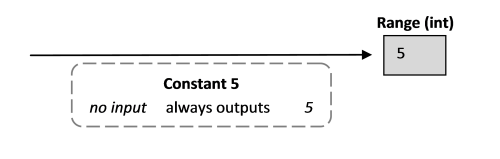
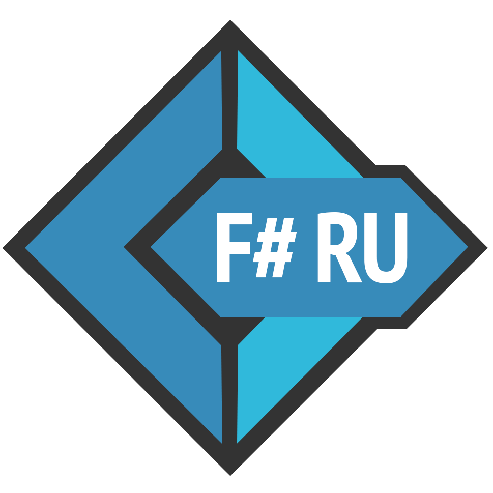

Функциональное мышление. Часть 2 / Блог компании Microsoft

Друзья, продолжаем разбираться в функциональном программировании. Во второй части из этой серии статей вы познакомитесь с основными принципами этой парадигмы разработки и поймёте, как этот подход отличается от объектно-ориентированного или императивного программирования.

  

*   **[Первая часть](https://habr.com/company/microsoft/blog/415189/)**
*   **[Вторая часть](https://habr.com/company/microsoft/blog/420039/)**
*   **[Третья часть](https://habr.com/company/microsoft/blog/422115/)**
*   **[Четвертая часть](https://habr.com/company/microsoft/blog/430620/)**

  

Ещё раз рассмотрим эту простую функцию.

  

    let add1 x = x + 1

Что здесь означает «`x`»:

  

1.  Возьми некоторое значение из domain (области определения).
2.  Используй имя «`x`» для предоставления этого значения, чтоб к нему можно было обратиться позже.

Использование имени для представления значения называется «привязкой» (binding). Имя «`x`» «привязано» к входному значению.

Так что если вычислить функцию с входным значением, скажем, равным 5, то произойдёт следующее: везде, где стоит «`x`» в изначальном определении, ставится значение 5, аналогично функции «найти и заменить» в текстовом редакторе.

  

    let add1 x = x + 1
    add1 5
    // заменяем «x» with «5»
    // add1 5 = 5 + 1 = 6
    // результат  6

Важно понимать, что это не присваивание. «`x`» не «слот» и не переменная с присвоенным значением, которое можно изменить позднее. Это разовая ассоциация имени «`x`» с неким значением. Это значение — одно из предопределённых целых чисел, оно не может быть изменено. Т.е. однажды привязанный `x` _не может быть изменён_. Метка единожды ассоциированная со значением, навсегда связана с этим значением.

Данный принцип — критически важная часть функционального мышления: _нет «переменных», только значения_.

  

## Функции как значения

Если поразмыслить над этим чуть подольше, можно увидеть, что имя «`add1`» само по себе — это просто привязка к «функции, которая увеличивает ввод на единицу». Сама функция независима от имени, которое к ней привязано.

Введя `let add1 x = x + 1`, мы говорим компилятору F# «каждый раз когда ты видишь имя «`add1`», замени его на функцию, которая добавляет 1 к вводу». «`add1`» называется **функцией-значением (function value)**.

Чтобы увидеть, что функция не зависит от своего имени, достаточно выполнить следующий код:

  

    let add1 x = x + 1
    let plus1 = add1
    add1 5
    plus1 5

Как видно, «`add`'» и «`plus`» — это два имени, привязанных к одной и той же функции.

Идентифицировать функцию-значение всегда можно по её сигнатуре, которая имеет стандартную форму `domain -> range`. Обобщенная сигнатура функции-значения:

  

    val functionName : domain -> range

  

## Простые значения

Представим операцию, которая ничего не принимает и всегда возвращает 5.

Это была бы «константная» операция.

Как можно было бы описать это в F#? Мы хотим сказать компилятору: «каждый раз, когда ты видишь имя `c`, замени его на 5». Вот так:

  

    let c = 5

При вычислении вернётся:

  

    val c : int = 5

В этот раз нет стрелки сопоставления, всего лишь один int. Из нового — знак равенства с реальным значением, выведенным после него. F# компилятор знает, что эта привязка имеет известное значение, которое будет возвращаться всегда, а именно — число 5.

Другими словами, мы только что определили константу, или, в терминах F#, простое значение.  
Всегда можно отличить простое значение от функции-значения, потому все простые значения имеют подобную сигнатуру:

  

    val aName: type = constant     // Заметьте - стрелки отсутствуют

  

## Simple values vs. function values | Простые значение vs. функции-значения

Важно понять, что в F#, в отличии от других языков, таких, как C#, существует очень небольшая разница между простыми значения и функциями-значениями. Оба типа являются значениями, которые могут быть связаны с именами (используя ключевое слово `let`), после чего они могут быть переданы везде. На самом деле, скоро мы увидим, идея о том, что _функции — это значения, которые могут быть переданы как входные данные другим функциям_, является одним из ключевых аспектов функционального мышления.

Следует учесть, что существует небольшая разница между простым значением и функцией-значением. Функция всегда имеет domain и range, и должна быть «применена» к аргументу, чтобы вернуть результат. Простое значение не надо вычислять после привязки. Используя пример выше, если мы захотим определить «константную функцию» которая возвращает 5, мы могли бы использовать:

  

    let c = fun()->5    
    // or
    let c() = 5

Сигнатура таких функций выглядит так:

  

    val c : unit -> int

А не так:

  

    val c : int = 5

Больше информации о `unit`, синтаксисе функций и анонимных функциях будет дано позднее.

  

## «Значения» vs. «Объекты»

В функциональных языках программирования, таких как F#, большинство вещей называется «значениями». В объектно-ориентированных языках, таких как C#, большинство вещей называются «объектами». Какова разница между «значением» и «объектом»?

Значение, как мы видели выше, является членом domain (домена). Домен целых чисел, домен строк, домен функций, которые сопоставляют целым числам строки, и так далее. В принципе, значения иммутабельны (не изменяемы). И значения не имеют поведения, прикрепленного к ним.

Объекты в каноническом определении являются инкапсуляцией структуры данных с ассоциированным поведением (методами). В общем случае, объекты должны иметь состояние (то есть, быть изменяемыми), и все операции, которые меняют внутреннее состояние, должны предоставляться самим объектом (через «dot»-нотацию).

В F#, даже примитивные значения обладают некоторым объемом «объектного» поведения. Например, можно через точку получить длину строки:

  

    «abc».Length

Но в целом, мы будем избегать термина «объект» для стандартных значений в F#, приберегая к нему для обращения к полноценным классам, или другим значениям, предоставляющим методы.

  

## Именование значений

Стандартные правила именования, используемые для имён значений и функций, в основном, это алфавитно\-цифровая строка \+ символы подчеркивания. Но есть пара дополнений:

  

1.  Можно добавлять апостроф в любой части имени, исключая первый символ.

  

    A'b'c     begin'  // валидные имена

  

1.  Последний случай часто используется как метка для «различных» версий какого-либо значения:

  

    let f = x
    let f' = derivative f
    let f'' = derivative f'

или для переменных одноименных существующим ключевым словам

  

    let if' b t f = if b then t else f

Можно также использовать двойные обратные кавычки для любой строки, чтобы сделать ее допустимым идентификатором.

  

    ``this is a name``  ``123``    //валидные имена

Случаи, когда может понадобиться использование трюка с двойными обратными кавычками:

  

*   Когда необходимо использовать идентификатор, который совпадает с ключевым словом.

  

    let ``begin`` = «begin»

  

*   Когда необходимо использовать естественные языки для бизнес-правил, модульных тестов, или BBD стиля исполняемой документации типа Cucumber.

  

    let ``is first time customer?`` = true
    let ``add gift to order`` = ()
    if ``is first time customer?`` then ``add gift to order``
    
    // Юнит-тест
    let [<Test>] ``When input is 2 then expect square is 4``=  
       // code here
    
    // BDD clause
    let [<Given>] ``I have (.*) N products in my cart`` (n:int) =  
       // code here

В отличие от C#, конвенция именования F# требует, чтобы функции и значения начинались со строчной буквы, а не прописной (`camelCase`, а не `PascalCase`), кроме тех случаев, когда они предназначены для _взаимодействия с другими_ языками .NET. Однако типы и модули используют заглавные буквы (в начале).

  

Для F# существует множество самоучителей, включая материалы для тех, кто пришел с опытом C# или Java. Следующие ссылки могут быть полезными по мере того, как вы будете глубже изучать F#:

  

*   [F# Guide](https://docs.microsoft.com/en-US/dotnet/fsharp/)
*   [F# for Fun and Profit](https://swlaschin.gitbooks.io/fsharpforfunandprofit/content/)
*   [F# Wiki](https://en.wikibooks.org/wiki/F_Sharp_Programming)
*   [Learn X in Y Minutes: F#](https://learnxinyminutes.com/docs/fsharp/)

Также описаны еще несколько способов, как [начать изучение F#](https://docs.microsoft.com/en-us/dotnet/fsharp/get-started/).

И наконец, сообщество F# очень дружелюбно к начинающим. Есть очень активный чат в Slack, поддерживаемый F# Software Foundation, с комнатами для начинающих, к которым вы [можете свободно присоединиться](http://foundation.fsharp.org/join). Мы настоятельно рекомендуем вам это сделать!

Не забудьте посетить сайт [русскоязычного сообщества F#](http://fsharplang.ru/)! Если у вас возникнут вопросы по изучению языка, мы будем рады обсудить их в чатах:

  

*   комната `#ru_general` в [Slack-чате F# Software Foundation](http://foundation.fsharp.org/join)
*   [чат в Telegram](https://t.me/Fsharp_chat)
*   [чат в Gitter](http://gitter.im/fsharplang_ru)

  

## Об авторах перевода

Автор перевода [_@kleidemos_](https://habrahabr.ru/users/kleidemos/)  
 Перевод и редакторские правки сделаны усилиями [русскоязычного сообщества F#-разработчиков](http://fsharplang.ru/). Мы также благодарим [_@schvepsss_](https://habrahabr.ru/users/schvepsss/) и [_@shwars_](https://habr.com/users/shwars/) за подготовку данной статьи к публикации.