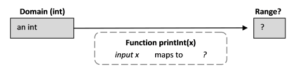

Функциональное мышление. Часть 3 / Блог компании Microsoft

Подъехала третья часть из серии статей по функциональному программированию. Сегодня мы расскажем обо всех типах этой парадигмы и на примерах покажем их использование. Подробнее о примитивных типах, обобщенных типах и многом другом под катом!

  

*   **[Первая часть](https://habr.com/company/microsoft/blog/415189/)**
*   **[Вторая часть](https://habr.com/company/microsoft/blog/420039/)**
*   **[Третья часть](https://habr.com/company/microsoft/blog/422115/)**
*   **[Четвертая часть](https://habr.com/company/microsoft/blog/430620/)**

Теперь, когда у нас есть некоторое понимание функций, мы посмотрим, как типы взаимодействуют с функциями, такими как domain и range. Данная статья — это просто обзор. Для более глубокого погружения в типы есть серия ["understanding F# types"](https://fsharpforfunandprofit.com/series/understanding-fsharp-types.html).

Для начала нам надо чуть лучше понять нотацию типов. Мы видели стрелочную нотацию "`->`", разделяющую domain и range. Так что сигнатура функций всегда выглядит вот так:

  

    val functionName : domain -> range

Еще несколько примеров функций:

  

    let intToString x = sprintf "x is %i" x  // форматирует int в string
    let stringToInt x = System.Int32.Parse(x)

Если выполнить этот код в [интерактивном окне](https://docs.microsoft.com/en-us/dotnet/fsharp/tutorials/fsharp-interactive/), можно увидеть следующие сигнатуры:

  

    val intToString : int -> string
    val stringToInt : string -> int

Они означают:

  

*   `intToString` имеет domain типа `int`, который сопоставляется с range типа `string`.
*   `stringToInt` имеет domain типа `string`, который сопоставляется с range типа `int`.

  

## Примитивные типы

Есть ожидаемые примитивные типы: string, int, float, bool, char, byte, и т.д., а также еще множество других производных от системы типов .NET.

Еще пара примеров функций с примитивными типами:

  

    let intToFloat x = float x // "float" ф-ция конвертирует int во float
    let intToBool x = (x = 2)  // true если x равен 2
    let stringToString x = x + " world"

и их сигнатуры:

  

    val intToFloat : int -> float
    val intToBool : int -> bool
    val stringToString : string -> string

  

## Аннотация типов

В предыдущих примерах компилятор F# корректно определял типы параметров и результатов. Но так бывает не всегда. Если попробовать выполнить следующий код, будет получена ошибка компиляции:

  

    let stringLength x = x.Length         
       => error FS0072: Lookup on object of indeterminate type

Компилятор не знает тип аргумента "x", и из-за этого не знает, является ли "Length" валидным методом. В большинстве случаев, это может быть исправлено через передачу "аннотации типа" компилятору F#. Тогда он будет знать, какой тип необходимо использовать. В исправленной версии мы указываем, что тип "x" — string.

  

    let stringLength (x:string) = x.Length         

Скобки вокруг параметра `x:string` важны. Если они будут пропущены, то компилятор решит, что строкой является возвращаемое значение! То есть, "открытое" двоеточие используется для обозначения типа возвращаемого значения, как показано в следующем примере.

  

    let stringLengthAsInt (x:string) :int = x.Length         

Мы указываем, что параметр `x` является строкой, а возвращаемым значением является целое число.

  

## Типы функций как параметры

Функция, которая принимает другие функции как параметры или возвращает функцию, называется **функцией высшего порядка** (**higher-order function** иногда сокращается до HOF). Их применяют в качестве абстракции для задания как можно более общего поведения. Данный вид функций очень распространен в F#, их использует большинство стандартных библиотек.

Рассмотрим функцию `evalWith5ThenAdd2`, которая принимает функцию в качестве параметра, и затем вычисляет эту функцию от 5 и добавляет 2 к результату:

  

    let evalWith5ThenAdd2 fn = fn 5 + 2     // то же самое, что и fn(5) + 2

Сигнатура этой функции выглядит так:

  

    val evalWith5ThenAdd2 : (int -> int) -> int

Можно увидеть, что domain равен `(int->int)`, а range `int`. Что это значит? Это значит, что входным параметром является не простое значение, а функция из множества функций из `int` в `int`. Выходное же значение не функция, а просто `int`.

Попробуем:

  

    let add1 x = x + 1      // описываем ф-цию типа (int -> int)
    evalWith5ThenAdd2 add1  // тестируем ее

и получим:

  

    val add1 : int -> int
    val it : int = 8

"`add1`" — это функция, которая сопоставляет `int` в `int`, как мы видим из сигнатуры. Она является допустимым параметром `evalWith5ThenAdd2`, и ее результат равен 8.

Кстати, специальное слово "`it`" используется для обозначения последнего вычисленного значения, в данном случае это результат, которого мы ждали. Это не ключевое слово, это просто соглашение об именовании.

Другой случай:

  

    let times3 x = x * 3      // ф-ция типа (int -> int)
    evalWith5ThenAdd2 times3  // пробуем ее

дает:

  

    val times3 : int -> int
    val it : int = 17

"`times3`" также является функцией, которая сопоставляет `int` в `int`, что видно из сигнатуры. Она также является валидным параметром для `evalWith5ThenAdd2`. Результат вычислений равен 17.

Следует учесть, что входные данные чувствительны к типам. Если передаваемая функция использует `float`, а не `int`, то ничего не получится. Например, если у нас есть:

  

    let times3float x = x * 3.0  // ф-ция типа (float->float)  
    evalWith5ThenAdd2 times3float 

Компилятор, при попытке скомпилировать, вернет ошибку:

  

    error FS0001: Type mismatch. Expecting a int -> int but 
                  given a float -> float    

сообщающую, что входная функция должна быть функцией типа `int->int`.

  

### Функции как выходные данные

Функции-значения также могут быть результатом функций. Например, следующая функция сгенерирует "adder" функцию, которая будет добавлять входное значение.

  

    let adderGenerator numberToAdd = (+) numberToAdd

Ее сигнатура:

  

    val adderGenerator : int -> (int -> int)

означает, что генератор принимает `int` и создает функцию ("adder"), которая сопоставляет `ints` в `ints`. Посмотрим как это работает:

  

    let add1 = adderGenerator 1
    let add2 = adderGenerator 2

Создаются две функции сумматора. Первой создается функция, добавляющая к вводу 1, вторая добавляет 2. Заметим, что сигнатуры именно такие, какие мы ожидали.

  

    val add1 : (int -> int)
    val add2 : (int -> int)

Теперь можно использовать генерируемые функции как обычные, они ничем не отличаются от функций, определенных явно:

  

    add1 5    // val it : int = 6
    add2 5    // val it : int = 7

  

### Использование аннотаций типа для ограничения типов функции

В первом примере мы рассмотрели функцию:

  

    let evalWith5ThenAdd2 fn = fn 5 +2
    > val evalWith5ThenAdd2 : (int -> int) -> int

В данном примере F# может сделать вывод, что "`fn`" преобразует `int` в `int`, поэтому ее сигнатура будет `int->int`.

Но какова сигнатура "fn" в следующем случае?

  

    let evalWith5 fn = fn 5

Понятно, что "`fn`" — разновидность функции, которая принимает `int`, но что она возвращает? Компилятор не может ответить на этот вопрос. В таких случаях, если возникает необходимость указать тип функции, можно добавить тип аннотации для параметров функций, также как и для примитивных типов.

  

    let evalWith5AsInt (fn:int->int) = fn 5
    let evalWith5AsFloat (fn:int->float) = fn 5

Кроме того, можно определить возвращаемый тип.

  

    let evalWith5AsString fn :string = fn 5

Т.к. основная функция возвращает `string`, функция "`fn`" также вынуждена возвращать `string`. Таким образом, не требуется явно указывать тип "`fn`".

  

## Тип "unit"

В процессе программирования мы иногда хотим, чтобы функция делала что-то, не возвращая ничего. Рассмотрим функцию "`printInt`". Функция действительно ничего не возвращает. Она просто выводит строку на консоль как побочный эффект исполнения.

  

    let printInt x = printf "x is %i" x        // вывод на консоль

Какова же ее сигнатура?

  

    val printInt : int -> unit

Что такое "`unit`"?

Даже если функция не возвращает значений, ей все еще нужен range. В мире математики не существует "void" функций. Каждая функция должна что-то возвращать, потому-что функция — это отображение, а отображение должно что-то отображать!

Итак, в F# функции, подобные этой, возвращают специальный тип результата, называемый "`unit`". Он содержит только одно значение, обозначаемое "`()`". Можно подумать, что `unit` и `()` — что-то вроде "void" и "null" из C# соответственно. Но в отличие от них, `unit` является реальным типом, а `()` реальным значением. Чтобы убедиться в этом, достаточно выполнить:

  

    let whatIsThis = ()

будет получена следующая сигнатура:

  

    val whatIsThis : unit = ()

Которая указывает, что метка "`whatIsThis`" принадлежит типу `unit` и связана со значением `()`.

Теперь, вернувшись к сигнатуре "`printInt`", можно понять значение этой записи:

  

    val printInt : int -> unit

Данная сигнатура говорит, что `printInt` имеет domain из `int`, который преобразуется в нечто, что нас не интересует.

  

### Функции без параметров

Теперь, когда мы понимаем `unit`, можем ли мы предсказать его появление в другом контексте? Например, попробуем создать многократно используемую функцию "hello world". Поскольку нет ни ввода ни вывода, мы можем ожидать сигнатуру `unit -> unit`. Посмотрим:

  

    let printHello = printf "hello world"        // вывод на консоль

Результат:

  

    hello world
    val printHello : unit = ()

_Не совсем то_, что мы ожидали. "Hello world" было выведено немедленно, а результатом стала не функция, а простое значение типа unit. Мы можем сказать, что это простое значение, поскольку, как мы видели ранее, оно имеет сигнатуру вида:

  

    val aName: type = constant

В данном примере мы видим, что `printHello` действительно является _простым значением_ `()`. Это не функция, которую мы можем вызвать позже.

В чем разница между `printInt` и `printHello`? В случае с `printInt` значение не может быть определено до тех пор, пока мы не узнаем значения параметра `x`, поэтому определение было функцией. В случае `printHello` нет параметров, поэтому правая часть может быть определена на месте. И она была равна `()` с побочным эффектом в виде вывода на консоль.

Можно создать настоящую многократно используемую функцию без параметров, заставляя определение иметь `unit` аргумент:

  

    let printHelloFn () = printf "hello world"    // вывод на консоль

Теперь ее сигнатура равна:

  

    val printHelloFn : unit -> unit

и чтобы вызвать ее, мы должны передать `()` в качестве параметра:

  

    printHelloFn ()

  

### Усиление unit типов с помощью функции ignore

В некоторых случаях компилятор требует `unit` тип и жалуется. Для примера, оба следующих случая вызовут ошибку компилятора:

  

    do 1+1     // => FS0020: This expression should have type 'unit'
    
    let something = 
      2+2      // => FS0020: This expression should have type 'unit'
      "hello"

Чтобы помочь в данных ситуациях, существует специальная функция `ignore`, которая принимает что угодно и возвращает `unit`. Корректная версия данного кода могла бы быть такой:

  

    do (1+1 |> ignore)  // ok
    
    let something = 
      2+2 |> ignore     // ok
      "hello"

  

## Обобщенные типы

В большинстве случаев, если тип параметра функции может быть любым типом, нам надо как-то сказать об этом. F# использует обобщения (generic) из .NET для таких ситуаций.

Например, следующая функция конвертирует параметр в строку добавляя немного текста:

  

    let onAStick x = x.ToString() + " on a stick"

Не важно какого типа параметр, все объекты умеют в `ToString()`.

Сигнатура:

  

    val onAStick : 'a -> string

Что за тип `'a`? В F# — это способ индикации обобщенного типа, который неизвестен на момент компиляции. Апостроф перед "a" означает, что тип является обобщенным. Эквивалент данной сигнатуры на C#:

  

    string onAStick<a>();   
    
    //или более идиоматично
    string OnAStick<TObject>();   // F#-еры используют написание 'a так же как 
                                  // C#'-еры используют написание "TObject" по конвенции 

Надо понимать, что данная F# функция все еще обладает строгой типизацией даже с обобщенными типами. Она _не_ принимает параметр типа `Object`. Строгая типизация хороша, ибо позволяет при композиции функций сохранять их типобезопасность.

Одна и та же функция используется для `int`, `float` и `string`.

  

    onAStick 22
    onAStick 3.14159
    onAStick "hello"

Если есть два обобщенных параметра, то компилятор даст им два различных имени: `'a` для первого, `'b` для второго и т.д. Например:

  

    let concatString x y = x.ToString() + y.ToString()

В данной сигнатуре будет два обобщенных типа: `'a` и `'b`:

  

    val concatString : 'a -> 'b -> string

С другой стороны, компилятор распознает, когда требуется только один универсальный тип. В следующем примере `x` и `y` должны быть одного типа:

  

    let isEqual x y = (x=y)

Так, сигнатура функции имеет одинаковый обобщенный тип для обоих параметров:

  

    val isEqual : 'a -> 'a -> bool 

Обобщенные параметры также очень важны, когда дело касается списков и других абстрактных структур, и мы увидим их достаточно много в последующих примерах.

  

## Другие типы

До сих пор обсуждались только базовые типы. Данные типы могут быть скомбинированы различными способами в более сложные типы. Полный их разбор будет позднее в [другой серии](https://fsharpforfunandprofit.com/series/understanding-fsharp-types.html), но между тем, и здесь кратко их разберем, так чтобы можно было распознать их в сигнатурах функций.

  

*   **Кортежи (tuples)**. Это пара, тройка и т.д., составленная из других типов. Например, `("hello", 1)` — кортеж сделанный на основе `string` и `int`. Запятая — отличительный признак кортежей, если в F# где-то замечена запятая, это почти гарантировано часть кортежа.  
    В сигнатурах функций кортежи пишутся как "произведения" двух вовлеченных типов. В данном случае, кортеж будет иметь тип:

  

    string * int      // ("hello", 1)

  

*   **Коллекции**. Наиболее распространенные из них — list (список), seq (последовательность) и массив. Списки и массивы имеют фиксированный размер, в то время как последовательности потенциально бесконечны (за кулисами последовательности — это те же самые `IEnumrable`). В сигнатурах функций они имеют свои собственные ключевые слова: "`list`", "`seq`" и "`[]`" для массивов.

  

    int list          // List type  например [1;2;3]
    string list       // List type  например ["a";"b";"c"]
    seq<int>          // Seq type   например seq{1..10}
    int []            // Array type например [|1;2;3|]

  

*   **Option (опциональный тип)**. Это простая обертка над объектами, которые могут отсутствовать. Имеется два варианта: `Some` (когда значение существует) и `None`(когда значения нет). В сигнатурах функций они имеют свое собственное ключевое слово "`option`":

  

    int option        // Some 1  

  

*   **Размеченное объединение (discriminated union)**. Они построены из множества вариантов других типов. Мы видели некоторые примеры в ["why use F#?"](https://fsharpforfunandprofit.com/posts/why-use-fsharp-intro/). В сигнатурах функций на них ссылаются по имени типа, они не имеют специального ключевого слова.
*   **Record тип (записи)**. Типы, подобные структурам или строкам баз данных, набор именованных значений. Мы также видели несколько примеров в ["why use F#?"](https://fsharpforfunandprofit.com/posts/why-use-fsharp-intro/). В сигнатурах функций они называются по имени типа, а также не имеют своего ключевого слова.

  

## Проверьте свое понимание типов

Здесь представлено несколько выражений для проверки своего понимания сигнатур функций. Для проверки достаточно запустить их в интерактивном окне!

  

    let testA   = float 2
    let testB x = float 2
    let testC x = float 2 + x
    let testD x = x.ToString().Length
    let testE (x:float) = x.ToString().Length
    let testF x = printfn "%s" x
    let testG x = printfn "%f" x
    let testH   = 2 * 2 |> ignore
    let testI x = 2 * 2 |> ignore
    let testJ (x:int) = 2 * 2 |> ignore
    let testK   = "hello"
    let testL() = "hello"
    let testM x = x=x
    let testN x = x 1          // подсказка: что в данном случае x?
    let testO x:string = x 1   // подсказка: что меняется при :string ? 

  

Для F# существует множество самоучителей, включая материалы для тех, кто пришел с опытом C# или Java. Следующие ссылки могут быть полезными по мере того, как вы будете глубже изучать F#:

  

*   [F# Guide](https://docs.microsoft.com/en-US/dotnet/fsharp/)
*   [F# for Fun and Profit](https://swlaschin.gitbooks.io/fsharpforfunandprofit/content/)
*   [F# Wiki](https://en.wikibooks.org/wiki/F_Sharp_Programming)
*   [Learn X in Y Minutes: F#](https://learnxinyminutes.com/docs/fsharp/)

Также описаны еще несколько способов, как [начать изучение F#](https://docs.microsoft.com/en-us/dotnet/fsharp/get-started/).

И наконец, сообщество F# очень дружелюбно к начинающим. Есть очень активный чат в Slack, поддерживаемый F# Software Foundation, с комнатами для начинающих, к которым вы [можете свободно присоединиться](http://foundation.fsharp.org/join). Мы настоятельно рекомендуем вам это сделать!

Не забудьте посетить сайт [русскоязычного сообщества F#](http://fsharplang.ru/)! Если у вас возникнут вопросы по изучению языка, мы будем рады обсудить их в чатах:

  

*   комната `#ru_general` в [Slack-чате F# Software Foundation](http://foundation.fsharp.org/join)
*   [чат в Telegram](https://t.me/Fsharp_chat)
*   [чат в Gitter](http://gitter.im/fsharplang_ru)

  

## Об авторах перевода

Автор перевода [_@kleidemos_](https://habrahabr.ru/users/kleidemos/)  
 Перевод и редакторские правки сделаны усилиями [русскоязычного сообщества F#-разработчиков](http://fsharplang.ru/). Мы также благодарим [_@schvepsss_](https://habrahabr.ru/users/schvepsss/) и [_@shwars_](https://habr.com/users/shwars/) за подготовку данной статьи к публикации.