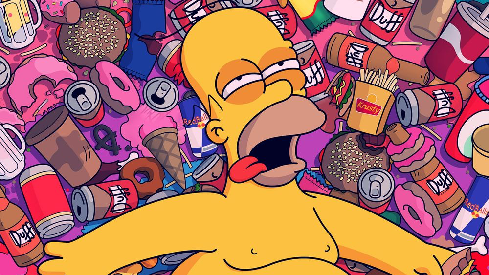

Харэ жрать? Говорим о пищевых привычках современного айтишника / Блог компании RUVDS.com

Читатели Хабра, в основном, люди интеллектуального труда и нередко наша жизнь ограничивается схемой «работа, дом, редкие посиделки с друзьями в кафе или баре». А если ещё есть заботливый работодатель, предоставляющий обеды, печеньки, снеки и напитки без ограничений, то всё, — привет, лишний вес. Конечно, среди нас есть фанаты бега, кроссов, марафонов, спортзалов и Iron Man, но их по-прежнему мало.

На Хабре нередко пишут про физические нагрузки, стоячие столы и прочие приспособления, но мы сегодня поговорим… о еде. Давайте отвлечёмся от работы, подумаем о своём здоровье и о пищевых привычках, а заодно выясним, не сгущаем ли мы краски. Тем, кто ест за компьютером — приятного аппетита!

_Беговая дорожка, не поспоришь_  

> Почему хостинг-провайдер поднял эту тему? Ну, во-первых, мы уже накормили почти тысячу человек [хабрабургерами](https://habr.com/article/410401/) и знаем толк в калорийной и ужасно вкусной еде. А во-вторых, 30 ноября у нас будет потрясающе нагруженное и важное мероприятие: в музее советских игровых автоматов пройдёт [турнир по олдскульным видеоиграм Game Overnight](https://gameovernight.ru/#1). Ночь, высочайшая мозговая активность, усталость… Всё это требует экстренного пищевого удара. У нас есть план, но мы хотим рассказать, почему он может быть только временным.

  

## Что такое еда и почему об этом важно говорить?

Наверное, каждый из нас слышал поговорку: «Я ем для того, чтобы жить, а не живу для того, чтобы есть». Увы, в наше время эта поговорка теряет часть своего смысла: вокруг фудкорты, кафе с вкусной и жирной пищей, уличный фастфуд, кофейные машины, магазины с горами необычных лакомств и вот эта подлая фраза «подумаешь, какой-то бутербродик». Всё, что нужно сделать для того, чтобы добыть еду, это отдать деньги. Между тем пища для человека это не источник быстрого удовольствия, а прежде всего — процесс усвоения организмом питательных веществ, необходимых для поддержания жизни, здоровья и работоспособности. В общем, как раз история про то, что есть нужно исключительно для того, чтобы жить.

Давайте обсудим, что представляет собой питание (поверхностно, без претензий на «отл» на экзамене по анатомии).

Человек употребляет пищу, представляющую собой набор компонентов (питательных веществ) и его пищеварительная система осуществляет механическую и химическую обработку съеденного, то есть извлекает питательные вещества из продуктов и обеспечивает их всасывание.

Разумеется, человек, съевший колбасу, не прирастает колбасой, то есть поступающие вещества (белки, жиры, углеводы, витамины и минералы) не усваиваются клетками и тканями в неизменном состоянии. В процессе пищеварения наша еда превращается в водорастворимые соединения: белки расщепляются до аминокислот, углеводы до моносахаридов, жиры — до глицерина и жирных кислот. Эти соединения поступают в кровь и лимфу, из которых извлекаются клетками и тканями. Если чего-то не хватает и организм не может синтезировать нужное вещество, возникают болезни и болезненные состояния. Как видите, ничего необычного и магического — физиология и химия. Эдакая мини-фабрика по переработке еды и созданию строительных материалов.

При этом качество пищи обусловливает состояние всего организма и, главное, непосредственно пищеварительной системы. И она, уж поверьте, очень красивое создание! Можно сказать, шедевр инженерной мысли. Морфология пищеварительного тракта отличается сложностью и многокомпонентностью, не менее сложно и её функционирование. Человек должен заботиться о том, чтобы вся эта махина от губ и зубов до, простите,

~ж… ы~

, самого конца была здоровой: один сбой вызывает нарушение всего «механизма». При этом ЖКТ ещё и очень нежная (но и очень надёжная!) штука: он включает в себя минимум хрящей и костей (то есть элементов скелета), а состоит из мягких тканей, эпителия, соединительной ткани, мышц, желез, лимфоидных образований. И всё это опутано сосудами и нервами. Кроме того, ЖКТ не изолирован от всего организма (равно как не изолирован ни один орган), и его здоровье напрямую сказывается на состоянии организма, внешности и даже на процессах сохранения молодости/старения.

Поэтому человек должен следить за питанием. Что, увы, в условиях нашего мира невозможно — из-за нашего режима (большинство из нас организуют себе «вторую смену» за ПК), отношения к качеству пищи (часто вы задумываетесь, сидя над картошечкой фри с сырным соусом или над наггетсами с кисло-сладким, м?). Конечно, изначально не всё так фатально: до какого-то момента у организма срабатывают компенсаторные механизмы и он усваивает только те питательные вещества, которые требуются в данный момент. Но при частых перееданиях и нарушении режима питания, при поступлении вредных веществ (алкоголя, никотина, излишнего сахара) сбой — дело времени, причём весьма короткого. А ещё компенсаторные механизмы плохо работают в детском и пожилом возрасте и во время различных патологий. Поэтому, утешая или поощряя детей молочным коктейлем, стоит десять раз подумать и реализовать награду с помощью фруктов, орехов, каких-то натуральных сладостей, а ещё лучше — положительных эмоций.

## Чем чреват лишний вес? Ведь нередко полный человек чувствует себя прекрасно!

Не будем вдаваться в медицину, приведём основные группы проблем.

*   Человеку просто тяжело. Он ходит и носит на себе всё это лишнее, под грузом работает весь организм. Интересно, как это? Возьмите 10 кг сахара, положите на спину и потаскайте. А хорошее самочувствие до поры, до времени объясняется тем, что жир распределяется не сразу и не в одной точке. Но органы и ткани ощущают этот жир, не сомневайтесь.
*   Постепенно организм начинает меняться. Весь жир пронизан кровеносными сосудами и сердцу нужно активно трудиться, чтобы прокачивать кровь по этой достроенной магистрали. В свою очередь сердцу не хватает крови и кислорода, ушедшего на питание жировой прослойки, оно увеличивается в размерах, активная мышечная ткань заменяется соединительной, сердце ослабляется.
*   У полного человека снижается иммунитет и значительно повышается риск возникновения заболеваний, связанных с обменными процессами (сахарный диабет, бесплодие) и заболеваний опорно-двигательного аппарата (это больно!).
*   Возникают атеросклеротические явления, которые приводят к тромбозам, ишемии, инфарктам.

Человек поправляется не сразу. Многие могут заметить, что едят как кони, а при этом «не в коня корм». Но дело меняется с того момента, как темп жизни становится чуть медленнее, а возраст чуть больше. Можно даже не заметить, как килограммы начинают активно откладываться.

По поводу режима питания сейчас кто во что горазд: часть экспертов ратуют за сытный ужин и скромный завтрак, часть за дробное питание, а третьи призывают к периодам голодовки (сутки-двое внутри недели). Какой верный? Каждый из планов питания имеет свои преимущества и тесно связан с родом деятельности человека. Главное, нужно соблюдать несколько важных правил, а уж как вы их впишете в свою деятельность — вопрос вашего комфорта.

*   Соблюдайте режим питания, исходя из «настроек» трёх основных параметров: количества приёмов пищи, интервалов между приёмами, распределением калорийности внутри приёмов.
*   Оптимальным будет 4-х разовое питание, при котором получается равномерная нагрузка на пищеварение (вы не нажираетесь на ночь и не голодаете в пик трудовой активности днём). Примерное распределение потребляемой пищи: завтрак — 25%, обед — 35%, полдник — 15%, ужин — 25%. Так вы сможете контролировать выделение желудочного сока и убережёте себя от язвы.
*   Соблюдайте нормы калорийности для своей задачи: сохранения веса, его снижения или увеличения. Нормы можно найти в интернете или любом другом приложении а-ля калоризатор.
*   Ведите дневник питания, записывая туда даже семечки и печеньку во время перерыва на чай с коллегами — вы быстро увидите, сколько витаминов не дополучаете и сколько калорий поступает сверх нормы.
*   Питайтесь разнообразно, сочетайте животные и растительные продукты (если у вас нет каких-то ментальных предпочтений, сегодня мы не о них, оставим это другим ресурсам).
*   Не ешьте за 2-3 часа до сна.
*   Не употребляйте слишком горячие и слишком холодные блюда и напитки, это вызывает периодическое раздражение ЖКТ и может привести к плачевным последствиям. Так, горячая пища должна быть 50-60 градусов, холодная — не ниже 10.
*   Соблюдайте питьевой режим, чтобы сохранить водно-солевой баланс: 2,3 л при стандартной сидячей работе, 4 л при работе с нагрузкой (ремонт, спорт, дача), до 5 л при тяжёлой работе на воздухе. Недостаток воды вызывает повышение температуры тела, тошноту, увеличивает вязкость крови, а избыточное питьё ухудшает пищеварение, создаёт нагрузку на сердечно-сосудистую систему, почки и потовые железы.
*   Не переедайте — насыщение наступает через 20 минут, за это время вы успеете основательно «перебрать» и вместо ожидаемой работоспособности и полноты сил вы ощутите сонливость и тяжесть.
*   Ну и последний совет, простой, но важный — тщательно пережёвывайте пищу, ведь процесс пищеварения чисто физиологически начинается с того момента, как вы откусили кусочек и он попал к вам в рот.

Знаете, что? Соблюсти эти правила на 100% в режиме работы программиста, инженера, сисадмина, тестировщика или менеджера (да кого угодно!) просто нереально, но приблизиться довольно легко. Подходите к вопросам питания осмотрительно и вы увидите положительный эффект. И, наверное, стоит оговориться, что в питании и отношении к здоровью многое зависит от вашего внутреннего, эмоционального состояния. Обратите на это внимание, включите силу воли и не заедайте рабочие проблемы!

## Эксперимент: ты то, что ты ешь

Автор этой статьи собрал трёх коллег, с которыми тесно общается (все из мира IT, но не все программисты) и посчитал с ними их примерный привычный план питания на основе предыдущего дня. Вышло занятно. Итак, два парня и девушка.

Мужчина, 34 года, рост 180, вес 105, активность — спортзал 3 раза в день (базовое кардио, не железо). Чувствует себя хорошо, курит, на 4 этаж пешком задыхается.

*   Яичница, 150 г, 288 ккал
*   Сыр, 60 г, 212 ккал
*   Колбаса варёная с жиром, 100 г, 301 ккал
*   Чай чёрный с сахаром и молоком, 400 мл, 172 ккал
*   Хлеб пшеничный, 100 г, 242 ккал
*   Куриные ножки в панировке, 200 г, 420 ккал
*   Двойной чизбургер, 150 г, 675 ккал
*   Кола, 170 ккал
*   Конфеты батончики Рот-Фронт, 30 г, 155 ккал
*   Печеньки, 100 г, 458 ккал
*   Колбаса варёная куриная, 100 г, 223 ккал
*   Картофаль отварной, 250 г, 205 ккал

Мы ещё не посчитали масло в картофель, соусы и майонез. Итого 3752 ккал, 2140 г еды

_Потому что первый участник может_

Мужчина, 29 лет, рост 168, вес 73, активность — спортзал 4 раза в неделю, бокс 2 раза в неделю. Лёгкий на подъём, походник, имеет диагноз ПМК. Сейчас на правильном питании без искусственных добавок и спортивных коктейлей.

*   Грецкий орех, 100 г, 654 ккал
*   Горький шоколад, 30 г, 162 ккал
*   Активия 1%, 500 г, 195 ккал
*   Курага, 50 г, 108 ккал
*   Финики, 30 г, 83 ккал
*   Куриная грудка, 100 г, 113 ккал
*   Творог 0,3%, 200 г, 180 ккал
*   Банан, 200 г, 190 ккал

Итого 1685 ккал, 1210 г еды.

Девушка на диете, 35 лет, не замужем (это важно, не рожала, проверено — гормоны в норме), рост 160, вес был 90, сейчас 72, на диете. Ультра строгая диета не допустима по состоянию здоровья. Спорт домашний + лёгкие пробежки + по выходным social dance.

*   Гречневая каша, 300 г, 396 ккал
*   Финики, 30 г, 83 ккал
*   Куриная грудка на пару, 200 г, 226 ккал
*   Кефир 1%, 200 г, 80 ккал
*   Овощное рагу — 300 г, 114 ккал
*   Сметана (круто к рагу) 10%, 25 г, 40 ккал
*   Яблоко — 200 г, 94 ккал
*   Перец печёный, 200 г, 54 ккал
*   Капуста цветная варёная (зачётно с половиной порции сметаны), 300 г, 87 ккал

Итого 1174 ккал, 1755 г еды.

Кстати, мы прикинули здоровый завтрак (каша \+ кофе), бизнес-ланч из трёх блюд, перекус бананом и орехами, куриную грудку и кефир как примерный объём пищи среднего офисного работника — 2369 ккал на 2560 грамм еды. Довольно оптимальный состав для мужчины. Девушкам, конечно, нужно меньше.

О чём говорит этот эксперимент?

*   Удельная калорийность грамма еды у девушки 0,67 ккал/г, все нужные продукты включены в рацион, при этом бедный, но жирный рацион первого мужчины имеет калорийность 1,75 ккал/г.
*   Второй мужчина соблюдает норму калорийности, но за счёт снеков в виде орехов и сухофруктов сильно проигрывает по качеству, почти не включает овощи, а значит, лишён клетчатки. Несмотря на диету, это прямой путь к ожирению печени и проблемам с ЖКТ.
*   На калорийность одного типа продуктов можно «купить» гору другого — например, наш богатырь мог легко обменять чизбургер на 600 грамм отварной грудки (которые почти нереально съесть). И ему было бы сытно и полезно (а с привычкой и вкусно!). Кстати, вот эта мысль об обмене продукта на больший объём полезного неплохой шаг для начала диеты — вы сразу начнёте задумываться о качестве и употреблять меньший объём, тем самым не превращая желудок в ненасытный большой мешок.
*   Орехи и сухофрукты, которые мы принимаем за перекус и держим на столе, очень коварны. Орехи крайне калорийны и могут привести к ожирению за счёт значительного увеличения калорийности рациона (шутка ли, на Кавказе индеек перед новым годом откармливают орехами, чтобы они были жирными и с увеличенной печенью). Сухофрукты содержат много сахаров, которые опять же мы съедаем бесконтрольно. 5 штучек кураги = 5 абрикосов. Вы съедите за раз 5 абрикосов? А 5 и более штук кураги — легко. Столь же коварны и соки. Мы не съедим 4 яблока за раз, а стакан сока — как нечего делать, и все сахара в легко усвояемом виде с нами.
*   Иногда мы не знаем, сколько весит продукт. Например, наша героиня сказала, что иногда может съесть 2 небольших банана, «ну грамм 150, наверное». Мы выбрали в магазине самые небольшие из обычных — 380 г. Также как 5 офисных сдобных печенек могут составить 100 г. Они точно на тёмной стороне.
*   Нужно обязательно следить за объёмом пищи и дробить порции. Участники 1 и 3 нарушают это правило. Увы, 400 грамм капусты за раз постепенно растянут очень эластичный желудок, и он будет мучить вас требованиями чем-то его наполнить.
*   Лучше не употреблять чистый сахар (в чай) и соль (в орешках, например) — их и так с избытком в продуктах, которые мы едим.

_Чувак, пора прийти в чувство!_

## ВОЗ предупреждает

Предупреждать предупреждает, но наклейки о вреде еды клеить не предписывает, хотя иногда точно стоило бы. Оказывается, на еду тоже есть документация, в которой изложены базовые правила здоровой и долгой жизни. Кстати, есть отличная [система диетического питания по Певзнеру](https://prokishechnik.info/profilaktika/pitanie/lechebnye-stoly-1-15.html), которая применялась и применяется в санаториях — иногда к ней стоит присмотреться.

Согласно [рекомендациям ВОЗ](http://apps.who.int/mediacentre/factsheets/fs394/ru/index.html) (всемирной организации здравоохранения), здоровый рацион взрослого человека включает в себя:

*   Фрукты, овощи, бобовые (например, чечевицу, фасоль), орехи и цельные злаки (например, непереработанную кукурузу, просо, овес, пшеницу, нешлифованный рис).
*   По меньшей мере, 400 г (5 порций) фруктов и овощей в день. Картофель, батат и другие крахмалистые корнеплоды не относятся ни к фруктам, ни к овощам.
*   Менее 10% суммарной энергии за счет свободных сахаров, что эквивалентно 50 г (или примерно 12 чайным ложкам без верха) для человека со здоровой массой тела, потребляющего примерно 2000 калорий в день, но в идеале менее 5% суммарной энергии для получения дополнительного положительного эффекта для здоровья.
*   Большинство свободных сахаров добавляются в пищевые продукты производителем, потребителем и могут также содержаться в виде естественного сахара в меде, сиропах, фруктовых соках и фруктовых концентратах.
*   Менее 30% суммарной энергии за счет жиров. Ненасыщенные жиры (например, содержащиеся в рыбе, авокадо, орехах, подсолнечном масле, оливковом масле) предпочтительнее насыщенных жиров (например, содержащихся в жирном мясе, сливочном масле, пальмовом и кокосовом масле, сливках, сыре, свином сале). Промышленные трансжиры (содержащиеся в переработанных пищевых продуктах, еде быстрого приготовления, закусочных пищевых продуктах, жареной еде, замороженных пиццах, пирогах, печенье, маргаринах и бутербродных смесях) не входят в состав здорового рациона.
*   Менее 5 г соли (что эквивалентно примерно одной чайной ложке) в день и использование йодированной соли.

Нарушить эти рекомендации проще простого: 0,33 Red Bull дадут вам 36,3 грамма сахара, Кола чуть меньше, несколько скромных печенек — 28 грамм. Если прибавить утренний чай или кофе и дневной напиток с парой конфет, огого. А ведь белый сахар содержится ещё и в хлебе, колбасе, йогурте и почти в любой приготовленной еде. Более того, в ресторанах сахар может использоваться как «гармонизатор» вкуса — ради интереса, добавьте в готовый борщ, другой суп или гуляш немного сахара — закачаетесь, как сразу заиграет вкус. Глутамат так деликатно не работает, он делает вкус грубо выраженным, а сахар — вкусным (прочтите за игру слов, мы тут не филологи).

Та же история с солью, которая содержится везде: от эклеров до салата. Например, двойной чизбургер содержит 2,4 грамма соли и 7,4 грамма сахара. А это всего лишь бургер! Как его съесть без фри, соуса, колы и наггетсов — да рука не поднимется!

## А как же любимые всеми бургеры?

Поговорим о них отдельно, раз уж компания RUVDS стала главным не только по хостингу, но и по бургерам на Хабре (что само по себе звучит необычно).

_Вы же помните Хабрабургер (снят с продажи)?_

Сказать, что бургеры исключительно полезны для здоровья — это просто слукавить. Итак, перед нами бургер. Вроде бы, всё отлично: красное (чаще говядина) или куриное мясо, овощи, специи, хлеб, сыр. Всё это входит в план питания обычного здорового человека, не сидящего на диете и не выбравшего путь вегетарианства. Но давайте рассмотрим бургер более пристально.

## Польза

Собственно говоря, определённая польза есть в любой пище, особенно, если она тщательно пережёвана и не запита газировкой. Так, в одном бургере с говяжьей котлетой содержится около 3 мг железа, 35% которого усвоит ваш организм (около 1 мг — 1/8 суточной нормы взрослого мужчины). Кстати, железо из животной пищи усваивается на 15% лучше, чем из растительной (например, из граната или яблока). Плюс ко всему, из этой же качественной котлеты вашему организму достанется витамин В12 (около 3 мкг, суточная норма) и белок, важнейший строительный материал для нашего тела (в среднем из хорошего мясного бургера с одной котлетой вы извлечёте 30 г белка при норме 50-175 грамм в день). Прибавим к этому немного клетчатки из хлеба и овощей. Говорить про витамин С из овощей не приходится — их слишком мало. Но они крайне необходимы — овощи вызывают интенсивное выделение желудочного сока, который поможет справиться с более тяжелыми ингредиентами. Речь, конечно, о «профессиональных» бургерах, приготовленных дома или в хороших бургерных таких как Burger Heroes. Фастфуда это касается в меньшей степени.

## Вред

Вред бургера обусловлен большой жирностью мяса (в меньшей мере), сладостью соусов и булочки, а также жирностью и составом майонезных соусов. Кстати, у многих видов пиццы та же беда. Представьте себе, жирность очень жирной говядины от 15 до 20%, а жирность любимого многими сырного соуса 36%, жирность классического майонеза — 67%, жирность «безобидного» чесночного соуса с укропчиком — 32%. Опять же, в кетчупе 23 г углеводов (сахаров) на 100 грамм, в 70% горьком шоколаде (который ещё вкусный) — 32 г. Плюс ко всему, все ингредиенты бургера содержат огромное количество соли — в итоге, натрия, который задерживает воду в организме и способствует «завязыванию жирка».

Как видите, баланс во многом на стороне зла. Или нет? На самом деле, бургер всегда можно сделать немного полезнее. Например, мы попросили наших друзей из Burger Heroes сделать бургер «Саб-Зиро» с овощной сальсой (соус без жира и с уменьшенным содержанием белого сахара), печёными овощами и с соусом с ментолом. То есть традиционное мясо будет сочетаться с овощным наполнением. Печёные овощи также будут способствовать лучшему усвоению пищи. Почему такой рецепт? Всё просто. Во-первых, это вкусно. Во-вторых, наш супер чемпионат будет проходить ночью и точить тяжёлые майонезные соусы и бекон в два утра — это к сонливости, что, согласитесь, не очень нужно во время баталии. В-третьих, такой бургер насытит на более длительный период. Ну и он всё равно сохраняет свою основную функцию вкусной жирной белковой еды — ароматическая альфа-аминокислота триптофан стимулирует выработку гормона «счастья» серотонина и тем самым улучшает настроение участников. Всё просчитано до последнего укуса, а вы как думали.

Всё есть яд и всё есть лекарство. Эта фраза — идеальная иллюстрация того, как мы питаемся. И если кто-то съест бургер-другой во время ночного баттла **[Game Overnight](https://gameovernight.ru/#1)**, то будет только активная работа мозга и отличное настроение. В общем, всё зависит от нашего с вами сознания, эмоций и воли.

А мы вас зовём на наш олдскульный турнир. Ну где ещё попробуешь бургер с ментолом!