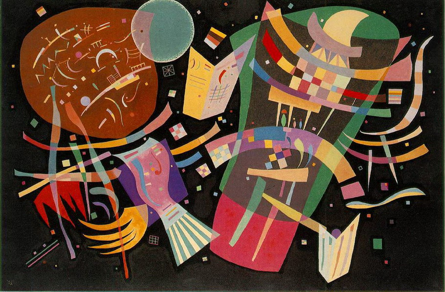
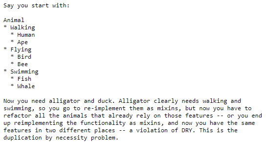
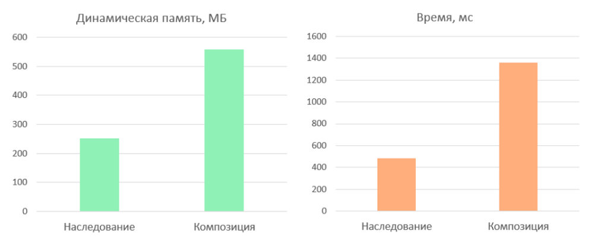

Цена композиции в Javascript-мире

Мысль о том, что в разработке любой более-менее сложной бизнес-логики приоритет должен отдаваться композиции объектов, нежели наследованию популярна в среде разработчиков программных продуктов самых разных типов. На очередной волне популярности функциональной парадигмы программирования, запущенной состоявшимся успехом ReactJS, разговоры о преимуществах композиционных решений пришли и во фронтенд. В данном посте есть немного раскладки по полкам теории о композиции объектов в Javascript, конкретный пример, его разбор и ответ на вопрос сколько стоит смысловая элегантность для пользователя (спойлер: немало).

  
_Василий Кандинский — «Композиция X»_  
  
Годы успешного развития объектно-ориентированного подхода к разработке, по большей части в академической сфере, привели к заметному перекосу в уме среднестатистического разработчика. Так, в большинстве случаев первой мыслью при необходимости обобщить для ряда разноплановых сущностей какое-либо поведение является создание родительского класса и наследование этого поведения. Этот подход при злоупотреблении им приводит к нескольким проблемам, усложняющим проект и тормозящим разработку. 

Во первых, перегруженный логикой базовый класс становится [хрупким](https://en.wikipedia.org/wiki/Fragile_base_class) - небольшое изменение в его методах способно фатальным образом отразиться на производных классах. Один из способов обойти такую ситуацию - распределить логику по нескольким классам, образовав более сложную иерархию наследования. В этом случае разработчик получает другую проблему - логика родительских классов дублируется в наследниках по необходимости, в случаях пересечения между функционалом родительских классов, но, что важно, не полном.

  
[mail.mozilla.org/pipermail/es-discuss/2013-June/031614.html](https://mail.mozilla.org/pipermail/es-discuss/2013-June/031614.html)

Ну и наконец, создавая достаточно глубокую иерархию, пользователь при использовании любой сущности, вынужден тянуть за собой всех ее предков вкупе со всеми их зависимостями не взирая на то, собирается он использовать их функционал или нет. Эта проблема избыточной зависимости от окружения с легкой руки Джо Армстронга, создателя Erlang, получила название проблемы гориллы и банана:

> I think the lack of reusability comes in object-oriented languages, not functional languages. Because the problem with object-oriented languages is they've got all this implicit environment that they carry around with them. You wanted a banana but what you got was a gorilla holding the banana and the entire jungle.

Решить все эти проблемы призвана композиция объектов, как альтернатива наследованию классов. Идея совсем не нова, однако не находит полного понимания среди разработчиков. Немного лучше ситуация в мире фронтенда, где структура программных проектов зачастую достаточно проста и не стимулирует к созданию сложной объектно-ориентированной схемы отношений. Однако, слепое следование заветам Банды четырех, рекомендующим предпочесть композицию наследованию, также может сыграть злую шутку с вдохновленным мудростью великих разработчиком.

Перенося определения из «Шаблонов проектирования» в динамический мир Javascript можно обобщенно говорить о трех типах объектной композиции: **агрегации**, **конкатенации** и **делегировании**. Стоит сказать что данное разделение и вообще понятие объектной композиции имеет сугубо техническую природу, в то время как по смыслу эти термины имеют пересечения, что вносит путаницу. Так, например, наследование классов в Javascript реализовано на основе делегирования (прототипное наследование). Поэтому каждый из случаев лучше подкрепить живыми примерами кода. 

**Агрегация** представляет собой перечисляемое объединение объектов, каждый из которых может быть получен с помощью уникального идентификатора доступа. Примерами могут служить массивы, деревья, графы. Хороший пример из мира web-разработки - DOM дерево. Главным качеством данного типа композиции и причиной его создания является возможность удобного применения некоторого обработчика к каждому дочернему элементу композиции. 

Синтетический пример - массив объектов, по очереди задающих стиль для произвольного визуального элемента.

    const styles = [
     { fontSize: '12px', fontFamily: 'Arial' },
     { fontFamily: 'Verdana', fontStyle: 'italic', fontWeight: 'bold' },
     { fontFamily: 'Tahoma', fontStyle: 'normal'}
    ];

Каждый из объектов стиля может быть извлечен по его индексу без потери информации. Кроме того, с помощью Array.prototype.map() можно обрабатывать все хранимые значения заданным образом.

    const getFontFamily = s => s.fontFamily;
    styles.map(getFontFamily)
    

**Конкатенация** предполагает расширение функционала существующего объекта путем добавления к нему новых свойств. Таким образом работают, например, редьюсеры состояния в Redux. Поступившие для обновления данные записываются в объект состояния, расширяя его. Данные о текущем состоянии объекта в отличие от агрегации при этом теряются, если их не сохранить. 

Возвращаясь к примеру, поочередно применяя к визуальному элементу приведенные выше настройки, можно сформировать итоговый результат путем конкатенации параметров объектов.

    const concatenate = (a, s) => ({…a, …s});
    styles.reduce(concatenate, {})
    

Значения более специфичного стиля в итоге перепишут предыдущие состояния.

  При **делегировании**, как легко можно догадаться, один объект делегируется другому. Делегатами, например, являются прототипы в Javascript. Экземпляры объектов-наследников перенаправляют вызовы на родительские методы. При отсутствии требуемого свойства или метода в экземпляре массива, он перенаправит это обращение к Array.prototype, а если необходимо - дальше к Object.prototype. Таким образом, механизм наследования в Javascript построен на основе цепочки делегирования прототипа, что технически и является (сюрприз) вариантом композиции. 

Объединение массива объектов стилей путем делегирования можно произвести следующим образом.

    const delegate = (a, b) => Object.assign(Object.create(a), b);
    styles.reduceRight(delegate, {})
    
    styles.reduceRight(delegate, {}).fontWeight
    

Как видно, свойства делегата не доступны путем перечисления (например в помощью Object.keys()), а доступны только путем явного обращения. О том, что нам это дает - в конце поста. 

Теперь к конкретике. Хороший пример случая, наталкивающего разработчика на использование композиции вместо наследования приводится в статье Майкла Райза «[Object Composition in Javascript](https://medium.com/code-monkey/object-composition-in-javascript-2f9b9077b5e6)». Здесь автор рассматривает процесс создания иерархии персонажей ролевой игры. Вначале требуются два типа персонажей - воин и маг, каждый из которых обладает некоторым запасом здоровья и имеет имя. Эти свойства являются общими и могут быть вынесены в родительский класс Character.

    class Character {
      constructor(name) {
        this.name = name;
        this.health = 100;
      }
    }

Воина отличает то, что он умеет наносить удары, расходуя при этом свой запас выносливости, а мага - способность творить заклинания, уменьшая величину маны.

    class Fighter extends Character {
      constructor(name) {
        super(name);
        this.stamina = 100;
      }
      fight() {
        console.log(`${this.name} takes a mighty swing!`);
        this.stamina  -  ;
      }
    }
    
    class Mage extends Character {
      constructor(name) {
        super(name);
        this.mana = 100;
      }
      cast() {
        console.log(`${this.name} casts a fireball!`);
        this.mana  -  ;
      }
    }

Создав классы Fighter и Mage, наследников Character, разработчик сталкивается с неожиданной проблемой, когда возникает потребность в создании класса Paladin. Нового персонажа отличает завидное умение как драться, так и колдовать. Навскидку видится пара решений, отличающихся одинаковым недостатком изящества.

1.  Можно сделать Paladin наследником Character и реализовать оба метода fight() и cast() в нем с нуля. В этом случае грубо нарушается DRY-принцип, ведь каждый из методов будет продублирован при создании и в последствии будет нуждаться в постоянной синхронизации с методами классов Mage и Fighter для отслеживания изменений.
2.  Методы fight() и cast() могут быть реализованы на уровне класса Charater таким образом, чтобы все три типа персонажей обладали ими. Это немного более приятное решение, однако в этом случае разработчик должен переопределить метод fight() для мага и метод cast() для воина, заменив их пустыми заглушками.

В любом из вариантов рано или поздно приходится столкнуться с проблемами наследования, озвученными в начале поста. Они могут быть решены при функциональном подходе к реализации персонажей. Достаточно оттолкнуться не от их типов, а от их функций. В сухом остатке мы имеем две ключевых особенности, определяющих способности персонажей - способность драться и способность колдовать. Эти особенности можно задать с помощью фабричных функций, расширяющих состояние, определяющее персонажа (пример композиции - конкатенация).

    const canCast = (state) => ({
      cast: (spell) => {
        console.log(`${state.name} casts ${spell}!`);
        state.mana  -  ;
      }
    }) 
    
    const canFight = (state) => ({
      fight: () => {
        console.log(`${state.name} slashes at the foe!`);
        state.stamina  -  ;
      }
    })

Таким образом, персонаж определяется набором этих особенностей, и исходными свойствами, как общими (именем и здоровьем), так и частными (выносливостью и маной).

    const fighter = (name) => {
      let state = {
        name,
        health: 100,
        stamina: 100
      }
      return Object.assign(state, canFight(state));
    } 
    
    const mage = (name) => {
      let state = {
        name,
        health: 100,
        mana: 100
      }
      return Object.assign(state, canCast(state));
    }
    
    const paladin = (name) => {
      let state = {
        name,
        health: 100,
        mana: 100,
        stamina: 100
      }
      return Object.assign(state, canCast(state), canFight(state));
    }

Все красиво - код действий используется повторно, добавить любого нового персонажа можно с легкостью, не касаясь предыдущих и не раздувая функционал какого-либо одного объекта. Чтобы найти ложку дегтя в предложенном решении, достаточно сравнить производительность решения на основе наследования (читай делегирования) и решения на основе конкатенации. Создадим миллионную армию экземпляров созданных персонажей.

    var inheritanceArmy = [];
    for (var i = 0; i < 1000000; i++) { 
      inheritanceArmy.push(new Fighter('Fighter' + i)); 
      inheritanceArmy.push(new Mage('Mage' + i));
    }
    
    var compositionArmy = [];
    for (var i = 0; i < 1000000; i++) { 
      compositionArmy.push(fighter('Fighter' + i)); 
      compositionArmy.push(mage('Mage' + i));
    }

И сравним затраты по памяти и вычислениям между наследованием и композицией, необходимые для создания объектов.

В среднем решение с применением композиции путем конкатенации требует на 100–150% больше ресурсов. Представленные результаты были получены в среде NodeJS, посмотреть результаты для браузерного движка можно, запустив этот [тест](https://medium.com/r/?url=https%3A%2F%2Fjsbench.me%2Fbejrj7ec0w).

Преимущество решения на основе наследования-делегирования можно объяснить экономией памяти за счет отсутствия неявного доступа к свойствам делегата, а также отключением некоторых оптимизаций движка для динамических делегатов. В свою очередь, решение на основе конкатенации использует очень дорогой метод Object.assign(), что сильно отражается на его производительности. Интересно, что Firefox Quantum показывает диаметрально противоположные Chromium результаты - второе решение работает в Gecko значительно быстрее. 

Безусловно, опираться на результаты тестов производительности стоит только при решении достаточно трудоемких задач, связанных с созданием большого числа объектов сложной инфраструктуры - например при работе с виртуальным деревом элементов или разработке графической библиотеки. В большинстве случаев структурная красота решения, его надежность и простота оказываются более важны, а небольшая разница в производительности не играет большой роли (операции с DOM элементами отнимут гораздо больше ресурсов).

В заключение стоит отметить, что рассмотренные виды композиции не являются единственными и взаимоисключающими. Делегирование может быть реализовано с использованием агрегации, а наследование классов с использованием делегирования (как это и сделано в JavaScript). По своей сути любое объединение объектов будет являться той или иной формой композиции и в конечном счете значение имеет только простота и гибкость полученного решения.