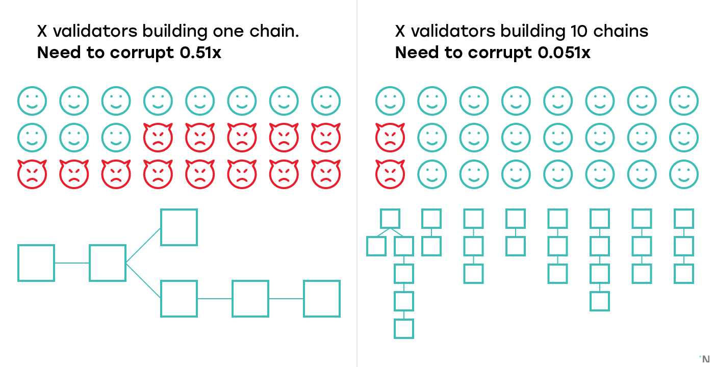
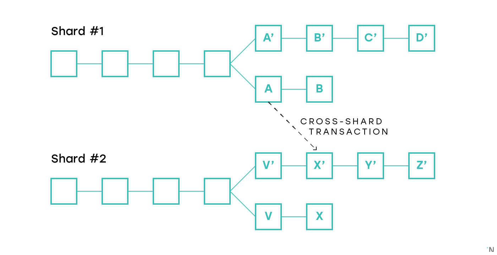
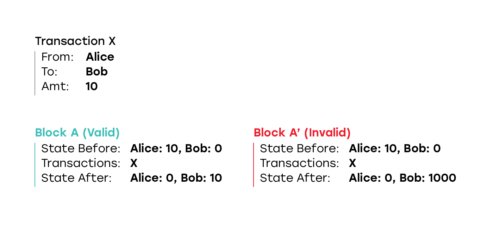
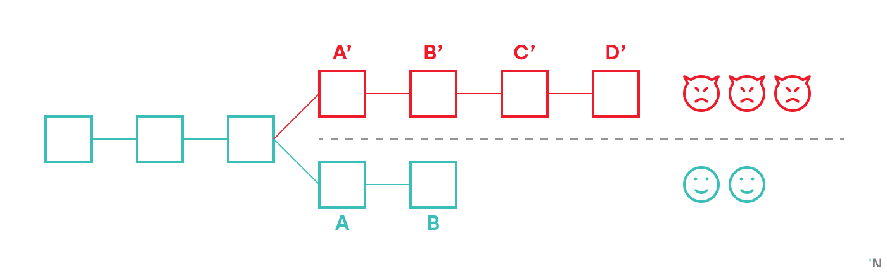

Шардинг в Блокчейне

Всем привет, я один из разработчиков Near Protocol, который, среди прочего, реализует шардинг, и в этой статье хочу подробно рассказать что вообще такое шардинг в блокчейне, как он работает, и коснуться ряда проблем, которые возникают при попытке его построить.

Хорошо известно, что Ethereum, самая популярная dApps платформа, обрабатывает меньше чем 20 транзакций в секунду. Из-за этого ограничения цена транзакций и время на их подтверждение очень высоки: несмотря на то, что блок в Ethereum публикуется раз в 10-12 секунд, согласно [ETH Gas Station](https://ethgasstation.info/) время между отправкой транзакции и тем как она действительно попадает в блок в среднем 1.2 минуты. Низкая пропускная способность, высокие цены и долгое подтверждение транзакций не позволяет запускать на Ethereum какие-либо высокопроизводительные сервисы.

Основная причина того, что Ethereum не может обрабатывать больше 20 транзакций в секунду заключается в том, что каждая нода в Ethereum должна проверить каждую транзакцию. За пять лет с выхода Ethereum было предложено много идей как решить эту проблему. Эти решения можно грубо разбить на две группы: те, которые предлагают делегировать выполнение транзакций небольшой группе нод с очень хорошим железом, и те, которые предлагают каждой ноде обрабатывать только подмножество всех транзакций. Пример первого подхода — это [Thunder](https://www.thundercore.com/), в котором блоки создаются только одной нодой, что позволяет, по утверждениям разработчиков, получать 1200 транзакций в секунду, что в 100 раз больше чем у Ethereum. Другие примеры из первой категории — это [Algorand](https://www.algorand.com/), [SpaceMesh](https://spacemesh.io/), [Solana](https://solana.com/). Все эти протоколы улучшают разные аспекты протокола и позволяют выполнять больше транзакций чем в Ethereum, но все ограничены скоростью одной (пусть и очень мощной) машины.

Второй подход, в котором каждая нода обрабатывает только подмножество транзакций, называется Шардинг. Это то как Ethereum Foundation планирует увеличить пропускную способность Ethereum.

В этом посте я расскажу как работает Шардинг в Blockchain на примере нескольких протоколов, которые сейчас находятся в разработке.

  

**Терминология**

Так как терминология не стандартизована, я буду использовать следующие русские термины в статье:

**Блокчейн** — это либо технология в общем, либо структура данных, содержащая все блоки, включая форки.

**Цепь** — это одна конкретная цепь в блокчейне, то есть все блоки, достижимые начиная с какого-то блока по ссылкам на предыдущий блок.

**Каноническая цепь** — это одна цепь в блокчейне, которую участник, наблюдающий блокчейн, считает текущей цепью. Например в Proof of Work блокчейне это будет цепь с самой большой сложностью.

**Сеть** — это множество участников, строящих и использующих блокчейн.

**Нода** — это сервер, поддерживающий или использующий сеть.

  

## Самый простой Шардинг

В самой простой реализации вместо того, чтобы поддерживать один блокчейн, мы будем поддерживать несколько, и назовем каждый такой блокчейн “шард”. Каждый шард поддерживается независимым множеством нод, которые проверяют транзакции и создают блоки. Здесь и далее я буду называть такие ноды валидаторами.

Каждый шард отвечает за какое-то подмножество контрактов и аккаунтов. Предположим пока что что транзакции всегда оперируют только с контрактами и аккаунтами внутри одного шарда. Такого упрощенного дизайна достаточно, чтобы показать некоторые интересные проблемы и особенности шардинга.

  

## Назначение валидаторов и центральный блокчейн

Первая проблема с тем, что у каждого шарда свои валидаторы, заключается в том, что если у нас есть 10 шадров, то каждый шард теперь в 10 раз менее надежен, чем был бы один блокчейн. Так, если блокчейн с X валидаторами решит сделать хард-форк в шардированную систему с 10 шардами, и разобьет X валидаторов между 10 шардами, в каждом шарде теперь только X/10 валидаторов, и получение контроля над шардом требует получения контроля над 5.1% (51% / 10) валидаторов.

Что приводит к первому интересному вопросу: а кто назначает валидаторов на шарды? Наличие контроля над 5.1% валидаторов является проблемой только если все 5.1% валидаторов в одном шарде. Если валидаторы не могут сами выбрать какому шарду они назначены, получение контроля над 5.1% валидаторов до того как они назначены на шарды не позволит получить контроль ни над одним шардом.

Почти все существующие предложенные дизайны шардинга используют некоторый источник случайных чисел чтобы назначать валидаторов на шарды. Получение случайных чисел в распределенной системе в которой участники друг другу не доверяют — это само по себе не до конца решенная проблема сегодня, которую мы в этой статье не затронем, и просто допустим, что такой источник случайных чисел у нас есть.

И получение случайных чисел, и назначение валидаторов — это вычисления в масштабах всей системы, не специфичные ни какому конкретному шарду. Для таких вычислений в современных дизайнах шардированных блокчейнов существует дополнительный выделенный блокчейн, который существует исключительно чтобы выполнять вычисления в масштабах системы. Помимо случайных чисел и назначения валидаторов такими вычислениями могут быть получения хешей последних блоков с шардов и их сохранение; обработка залогов в Proof-of-Stake системах, и изучение доказательств неправильного поведения с сопутствующим отбиранием таких залогов; перебалансировка шардов, если такая функция предусмотрена. Такой блокчейн называется Beacon chain в Ethereum 2.0 и Near Protocol, Relay chain в PolkaDot, и Cosmos Hub в Cosmos.

В этом посте мы будем называть такой блокчейн “центральным блокчейном”. Существования центрального блокчейна приводит нас к следующей интересной теме — квадратичному шардированию.

  

## Квадратичное шардирование

Шардинг часто презентуют как решение, которое бесконечно масштабируется с увеличением количества нод. Вероятно, можно действительно создать систему с таким свойством, но системы с центральным блокчейном имеют ограничение сверху на количество шард, и как следствие не имеют бесконечной масштабируемости. Легко понять почему: центральный блокчейн выполняет некоторые вычисления, такие как назначение валидаторов и сохранение последних состояний шард, сложность которых пропорциональна количеству шард. Так как сам центральный блокчейн не шардирован, и его пропускная способность ограничена пропускной способностью каждой ноды, количество шард, которые он может поддерживать, ограничено.

Давайте посмотрим как изменится пропускная способность всей системы, если мощность нод, его поддерживающих, вырастет в k раз. Каждый шард сможет обрабатывать в k раз больше транзакций, а центральный блокчейн сможет поддерживать в k раз больше шард. Таким образом пропускная способность всей системы вырастет в k^2 раз. Отсюда название “квадратичное шардирование” (quadratic sharding).

Сложно предсказать сколько шард сегодня сможет поддерживать центральный блокчейн, но вероятнее всего в ближайшее будущее мы не приблизимся к лимиту транзакций для шардированного блокчейна с квадратичным шардированием. Скорее всего мы раньше упремся в лимит того, сколько надо нод, чтобы поддерживать такое количество шард.

  

## Шардирование состояния

Состояние — это вся информация обо всех аккаунтах и контрактах. До сих пор мы говорили о шардинге в общем, не уточняя что конкретно шардируется. Ноды в блокчейне выполняют следующие три задачи: 1) выполняют транзакции 2) пересылают транзакции и блоки другим нодам и 3) хранят состояние и историю блокчейна. Каждая из этих трех задач сопряжена с некоторой постоянно растущей нагрузкой на ноды:

  

1.  Необходимость выполнять транзакции требует больше вычислительных мощностей с ростом количества транзакций;
2.  Необходимость пересылать транзакции требует больше пропускной способности сети с ростом транзакций;
3.  Необходимость сохранять состояние и историю требует больше дискового пространства с увеличением размера состояния и/или истории. Важно отметить, что в отличие от первых двух пунктов, количество требуемого дискового пространства растет даже если количество транзакций в единицу времени не меняется.

Из списка выше может показаться, что дисковое пространство — это самая большая проблема, так как только дисковое пространство растет даже если количество транзакций не растет, но на практике это не так. Сегодня состояние Ethereum занимает около 100GB, что легко можно сохранить на любой современной машине, но количество транзакций, которые Ethereum может обрабатывать ограничено несколькими десятками в секунду, упираясь в вычислительную мощность и сеть.

Zilliqa — это самый известный проект, который [шардирует вычисления и сеть](https://blog.zilliqa.com/provisioning-sharding-for-smart-contracts-a-design-for-zilliqa-cd8d012ee735) но не состояние. Шардирование вычислений проще чем шардирование состояния, потому что все ноды имеют все состояние, и по прежнему могут легко выполнять контракты, которые вызывают другие контракты, или затрагиваю аккаунты на разных шардах. В этих аспектах дизайн Zilliqa’и слишком упрощен, критику дизайна на английском можно прочитать [здесь](https://medium.com/nearprotocol/limitations-of-zilliqas-sharding-approach-8f9efae0ce3b).

В то время как шардирование состояния без шардирования вычислений было предложено, я не знаю ни одного проекта, который действительно это делает, поэтому мы будем полагать что шардирование состояния подразумевает шардирование вычислений.

На практике, тот факт, что состояние шардировано, в некоторой мере изолирует шарды, позволяя им быть независимыми блокчейнами, как мы их определили выше. Валидаторы в шардах сохраняют только состояние, специфичное их шарду, и выполняют и пересылают только транзакции, которые затрагивают это состояние. Это позволяет уменьшить нагрузку на процессор, диск и сеть линейно с количеством шардов, но приносит новые проблемы, такие как между-шардовые транзакции.

  

## Между-шардовые транзакции

До сих пор мы рассматривали шарды как независимые блокчейны с точки зрения того как они выполняют транзакции. При таком дизайне, например, невозможно выполнить транзакцию которая переводит деньги между двумя аккаунтами на двух разных шардах, или вызвать контакт на одном шарде из контракта на другом. И тот и другой сценарий хотелось бы поддерживать.

Для простоты будем рассматривать только транзакции, которые переводят деньги, и будем полагать что у каждого участника есть аккаунт на ровно одном шарде. Если участник на некотором шарде хочет перевести деньги участнику на том же самом шарде, валидаторы этого шарда могут обработать эту транзакцию, и применить ее к состоянию. Но если, например, у Алисы аккаунт на шарде #1 и она хочет отправить деньги Бобу с аккаунтом на шарде #2, ни валидаторы шарда #1 (которые не смогут добавить деньги Бобу) ни валидаторы шарда #2 (которые не смогут забрать деньги Алисы) не могут выполнить транзакцию целиком и обновить состояние.

Есть две больших группы подходов к решению этой проблемы:

  

1.  **Синхронный**: для любой транзакции, затрагивающей несколько шардов, блоки в шардах, содержащие обновление состояния для этой транзакции, производятся одновременно, и валидаторы в этих шардах работают вместе для создания таких блоков. Наиболее проработанный дизайн такого подхода, известный мне, это Merge Blocks, описанный (на английском) [здесь](https://ethresear.ch/t/merge-blocks-and-synchronous-cross-shard-state-execution/1240).
    
      
    
2.  **Асинхронный**: между-шардовая транзакция выполняется в шардах, которые она затрагивает, асинхронно: часть транзакции, которая добавляет деньги Бобу выполняется в шарде #2 когда валидаторы в шарде имеют какое-то доказательство того что часть транзакции, вычитающая деньги у Алисы, была выполнена в шарде #1. Этот подход более популярен в разрабатываемых сегодня системах из-за того что он не требует дополнительной синхронизации между шардами для производства блоков. Такие системы сегодня предложены в Cosmos, Ethereum Serenity, Near Protocol, Kadena, и других. Проблема с таким подходом в том, что если блоки производятся независимо, есть вероятность, что один из блоков, содержащих обновление состояния для транзакции, окажется не в канонической цепи в своем шарде, и таким образом транзакция окажется только частично выполненной. Например рассмотрим рисунок ниже. На нем изображены два шарда, в которых произошли форки, и между-шардовая транзакция, обновление состояния для которой отражено в блоках A и X’ соответственно. Если цепи A-B и V’-X’-Y’-Z’ окажутся каноническими в своих шардах, то транзакция полностью финализирована. Если цепи A’-B’-C’-D’ и V-X окажутся каноническими, то транзакция полностью отменена, что приемлемо. Но если, например, A-B и V-X станут каноническими, то одна часть транзакции финализирована, а другая отменена, и транзакция оказывается выполненной частично.
    
      
    

Описанный выше сценарий — одна из больших проблем в шардинге, у которой все предложенные решения не оптимальны. Мы немного затронем ее ниже.

  

## Плохое поведение

Теперь, когда мы разобрались с тем, как работают шардированные блокчейны, и изучили концепции центрального блокчейна, назначения валидаторов и между-шардовых транзакций, в завершении этой статьи рассмотрим еще одну интересную тему: что может сделать участник, пытающийся атаковать систему, если ему удалось получить контроль над достаточно большим количеством валидаторов в одном шарде.

  

### Целенаправленные форки

Если у участника есть достаточный контроль над шардом, он может целенаправленно создавать форки. Для создания форков не важно какой консенсус используется в шардах, в частности не важно BFT он или нет, если достаточное количество валидаторов под контролем атакующего, он может создать форк. Например, цель форка может быть откатить транзакцию, которая платила за что-то снаружи блокчейна.

Утверждается, что получить контроль над 50% шарда проще, чем 50% всей сети (например потому что участник может попытаться взломать или подкупить валидаторов после того как они были назначены на шард). По определению, между-шардовые транзакции изменяют состояние в нескольких шардах. Такие изменения попадут в какие-то блоки в блокчейнах соответствующих шардов. Необходимо чтобы либо все такие блоки были финализированы (то есть принадлежали канонической цепи в соответствующих шардах), или все были не финализированы (то есть не принадлежали каноническим цепям в своих шардах). Поскольку мы предполагаем, что какие-то участники с плохими намерениями в принципе могут получить контроль над шардом, мы не можем полагать, что форки не произойдут, даже если был достигнут византийский консенсус, или большое количество блоков было построено поверх блока с транзакцией.

У этой проблемы есть много решений, самое простое из которых иногда сохранять хеш последнего блока в шарде в центральный блокчейн. Алгоритм выбора канонической цепи в шардах затем меняется так, чтобы никакая цель, не содержащая последний сохраненный на центральный блокчейн блок, не могла быть канонический. Затем, чтобы совсем избежать ситуаций когда транзакция выполнена частично из-за того что часть блоков, содержащих ее обновление состояния, оказались вне канонических цепей, можно изменить алгоритм выполнения между-шардовых транзакций так чтобы шард A не принимал доказательство выполнения транзакции в шарде B пока блок, содержащий обновление состояния для транзакции в шарде B, не был сохранен в центральном блокчейне.

  

### Создание невалидных блоков

Если участник смог получить контроль над достаточно большим количеством валидаторов в шарде, он может попытаться создать совершенно невалидный блок. Например, пусть до блока состояние было такое что у Алисы было 10 токенов, а в Боба — 0, блок содержит только одну транзакцию, которая отправляет 10 токенов с аккаунта Алисы на аккаунт Боба, но в новом состоянии отражает 0 токенов у Алисы, и 1000 у Боба.

В классическом, не шардированном блокчейне, создание такого блока невозможно, потому что все участники, как те, кто создают блоки, так и те, кто просто использует блокчейн, проверяют все блоки, и сразу отбрасывают любой блок, который содержит такие ошибки. Даже если контролируемые атакующим валидаторы могут строить цепь быстрее, это не позволит им выдать более длинную цепь, содержащую невалидный блок, за каноническую, потому что все участники сети сразу отбросят невалидный блок, и любой блок, который был построен поверх. Честные валидаторы продолжат строить поверх последнего валидного блока, и все участники сети будут видеть их цепь как каноническую.

На рисунке выше пять валидаторов, три из которых под контролем атакующего. Они создали невалидный блок A’, а затем продолжили строить цепь поверх. Два частных валидатора сразу отбросили блок A’ как невалидный и продолжили строить поверх последнего валидного блока, известного им, тем самым создав форк. Поскольку в честной цепи меньше валидаторов чем в нечестной, их цепь короче. Однако, в классическом нешардированном блокчейне все участники системы валидируют все блоки, которые они видят. Таким образом любой участник, использующий блокчейн, увидит что A’ невалиден, отбросит его, а следовательно отбросит и B’, C’ и D’ как построенные поверх невалидного блока, и таким образом все участники будут видеть A-B как каноническую цепь.

В шардированном дизайне ни один участник не может валидировать все блоки во всех блокчейнах. Поэтому нужен какой-то механизм, который позволит валидаторам в конкретном шарде быть уверенными, что ни в какой момент времени в прошлом невалидный блок не был создан в другом шарде, из которого они получили между-шардовую транзакцию.

В отличие от целенаправленных форков, отправка хеша блоков в центральный блокчейн не помогает, потому что у центрального блокчейна тоже нет ресурсов валидировать все блоки во всех шардах. Центральный блокчейн может только валидировать что достаточное количество валидаторов, назначенных на шард, подписали блок (и как следствие заявили о правильности блока).

Я знаю два решения проблемы, ни одно из которых не кажется удовлетворительным:

  

1.  Иметь какой-то механизм который позволит системе быстро замечать появление форков и невалидных блоков. Если используется византийский консенсус, для создания невалидного блока надо чтобы больше чем 2/3 валидаторов принадлежали атакующему или были скомпрометированы им. Если система строится с предположением что такое может произойти, но что хотя бы один честный валидатор всегда есть, то нужен протокол который позволит такому честному валидатору обнаружить что невалидный блок был создан, и оповестить систему. Так как такому честному валидатору надо время чтобы заметить появление блока, проверить его, приготовить транзакцию с доказательством невалидности, такой протокол требует чтобы другие шарды и центральный блокчейн ждали какое-то достаточно долгое время после получения блока прежде чем выполнять любое действие, зависящее от него. Это заметно замедляет любые транзакции, которые задевают несколько шардов.
2.  Использовать какой-то криптографический механизм, который доказывает, что вся цепь блоков, включая блок, содержащий транзакцию и сама транзакция, валидны. Такой механизм есть, он называется [zk-SNARKs](https://medium.com/@VitalikButerin/zk-snarks-under-the-hood-b33151a013f6) (хотя часть про zk, или zero-knowledge, на самом деле не нужна, сегодня почти нет исследований в области non-zk SNARKs). К сожалению, сегодня zk-SNARKs ужасно медленны, и существующие практические реализации работают только для подмножества возможных вычислений.

Многие протоколы, которые сегодня разрабатываются, строятся с предположением, что если валидаторы достаточно часто перераспределяются, то при использовании византийского консенсуса описанных выше проблем не существует. Почему это не так — тема отдельной статьи.

Я много пишу про блокчейн и шардинг на английском. Мы также периодически берем интервью у авторов других протоколов, таких как Cosmos и Solana, копая глубоко в технические детали. Если вам интересна тема, можно следить за новыми публикациями и видео подписавшись на мой Twitter [@AlexSkidanov](https://twitter.com/@AlexSkidanov).