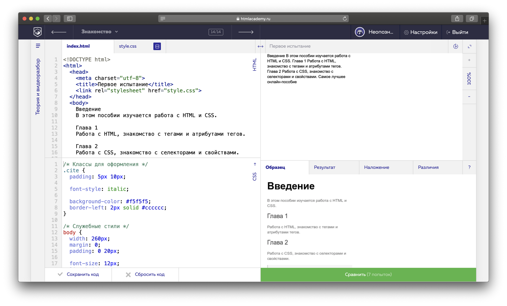
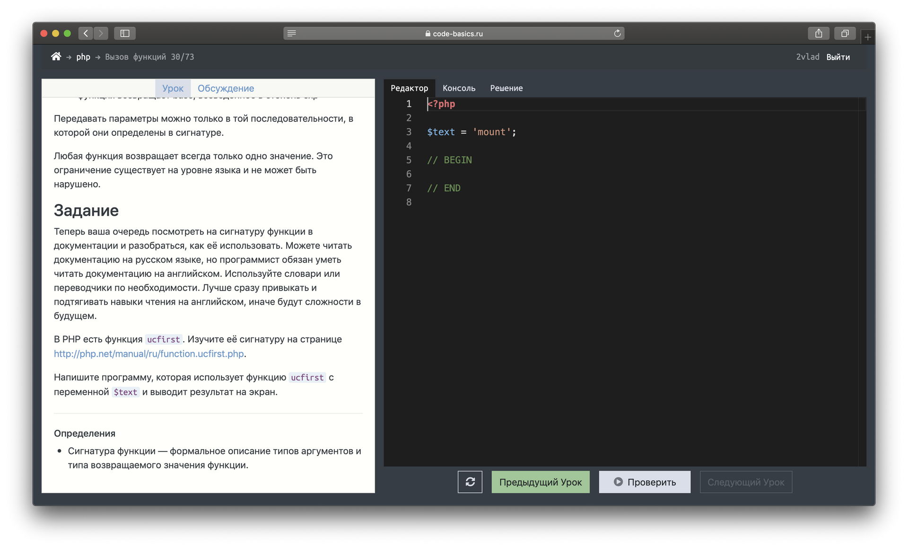
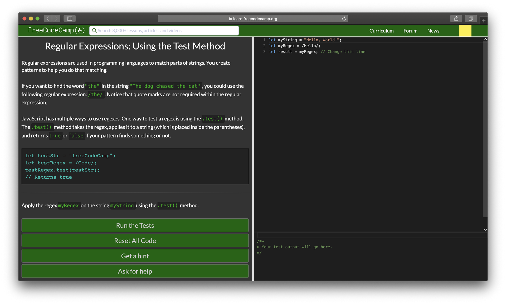
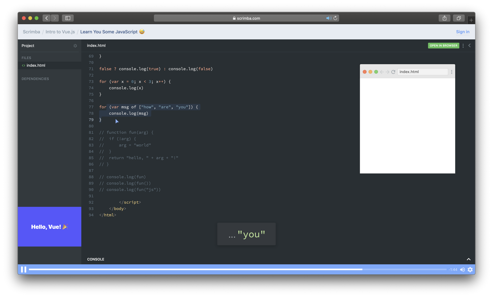
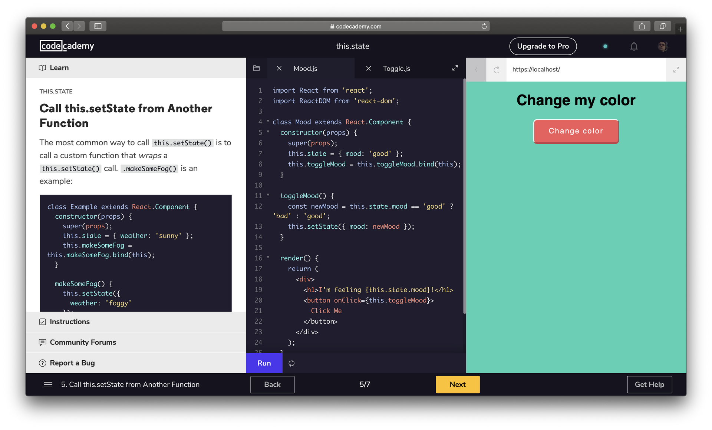
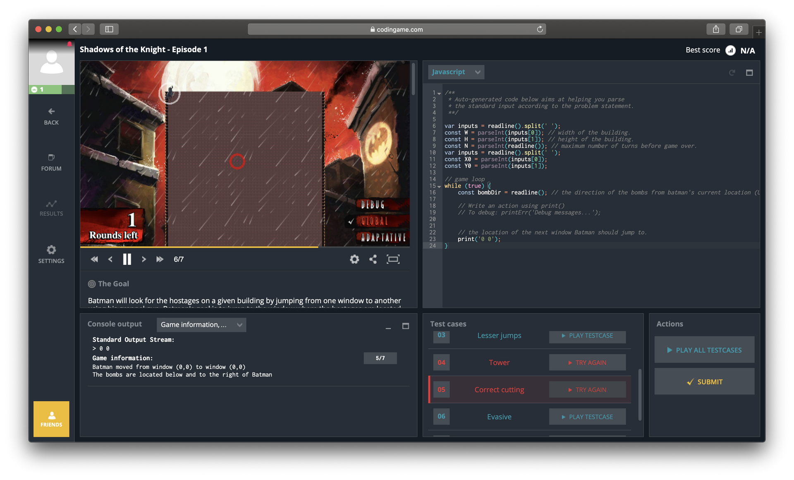

Шесть бесплатных автоматизированных платформ для изучения программирования / Блог компании Hexlet

Привет, сообщество! Мы в [Хекслете](https://ru.hexlet.io/) составили список из пяти бесплатных автоматизированных онлайн-платформ для новичков.

**На русском:**

**[HTML Academy](https://htmlacademy.ru/)**  
«Академия» учит верстать сайты. Основной контент в формате подписки (390 рублей в месяц) и интенсивов (от 12500 рублей), но есть несколько бесплатных автоматизированных курсов по основам HTML, CSS и JavaScript.

В HTML Academy не столько задания для прокачки в программировании, сколько для знакомства с основами веб-разработки. Но это идеальный формат для тех, кто никогда не писал код и хочет попробовать. Большое количество веб-разработчиков начинало путь именно здесь.  

**[Code Basics](https://code-basics.ru/)**  
Это новый бесплатный сервис от Хекслета. Его основная идея — через решение простых заданий прямо в браузере погружать новичков в основы программирования. Сейчас есть уроки по PHP, JavaScript и Python, ближайшее время появятся — новые. Платформа подойдет лучше всего для изучения основ синтаксиса, и меньше — для прокачки алгоритмов.

Обучение построено вокруг чередования небольших порций теории (3-4 абзаца) и закрепления практики в тренажере. У каждого практического задания есть решение учителя, которое можно сравнить со своим после успешного прохождения и раздел для обсуждения задания.  

**На английском:**

**[FreeCodeCamp](http://freecodecamp.com/)**  
Крупная некоммерческая автоматизированная платформа. Учит с нуля основам веб-разработки: HTML, CSS и JavaScript. В конце есть ознакомительные блоки по React/Redux, визуализации данных и даже немного по бэкэнду.

С самого начала и до конца невозможно запутаться — есть всего одна программа из 1400 заданий. Где-то с 200-го задания есть интересный блок с алгоритмическими задачками на JavaScript. Несколько раз за обучение предусмотрена самостоятельная практика у себя в редакторе.  

**[Scrimba](https://scrimba.com/)**  
Органичное сочетание «видео» и заданий в браузере: как если бы преподаватель сидел рядом с вами и показывал что делает в редакторе. У вас есть возможность прямо по ходу записи листать код и наблюдать за курсором преподавателя.

Большое количество тем по веб-разработке: от «флексбоксов» и Bootstrap до React, Vue и Angular. Единственным недостатком платформы может быть только отсутствие поддержки и работы над проектами. Но для этого есть масса других платформ.  

**[Codeacademy](https://www.codecademy.com/)**  
Одна из наиболее известных международных платформ для изучения основ кодинга по разным технологиям: Python, SQL, Java, верстка, JavaScript и другие. Недавно запустили первый курс по C++. Все очень симпатично и ориентировано на решение простых задачек.

Codeacademy заточен на приобретение базовых навыков программирования и подойдет для тех, кто хочет познакомиться с кодингом без больших планов стать профессиональным разработчиком. Все обучение происходит в браузере. В платной версии (за 20 баксов в месяц) есть доступ к квизам, кастомным образовательным трекам и проектам.  

**[Сodingame](https://www.codingame.com/)**  
Красиво нарисованная платформа для изучения программирования в игровой форме. Проходишь в игре уровни, одновременно изучаешь программирование на привычном языке: Python, Java, JavaScript, C++/#.

Платформа предлагает разные игровые сценарии, обсуждения с другими участниками, контесты и 10-ти минутные баттлы по мультиплееру с другими юзерами.  

_Напишите в комментах, если я забыл упомянуть о какой-то хорошей автоматизированной платформе_

_UPD. После публикации вы прислали много хороших сервисов и мы поняли, что есть смысл разделить их на два блока: 1. изучение основ программирования и 2. «задачники». Этот пост мы отредактировали, чтобы он отвечал на первый запрос. Для второго — мы подготовим и опубликуем отдельный пост._