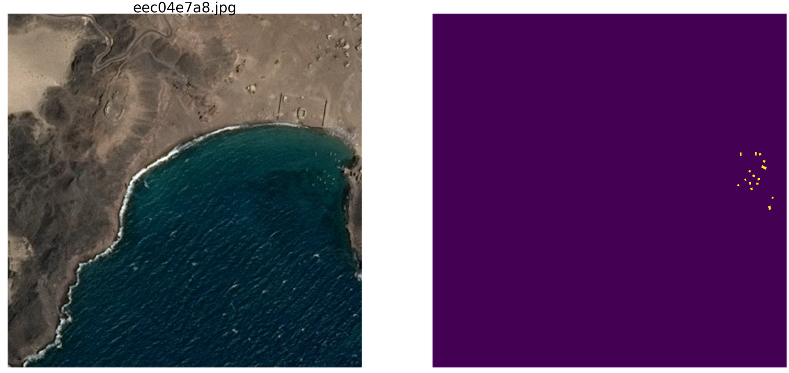
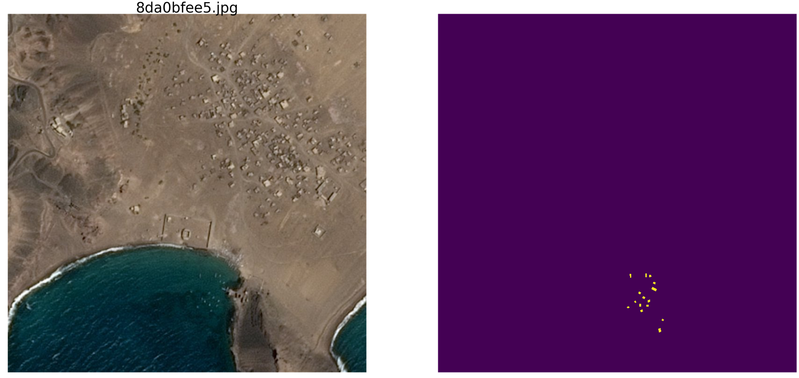
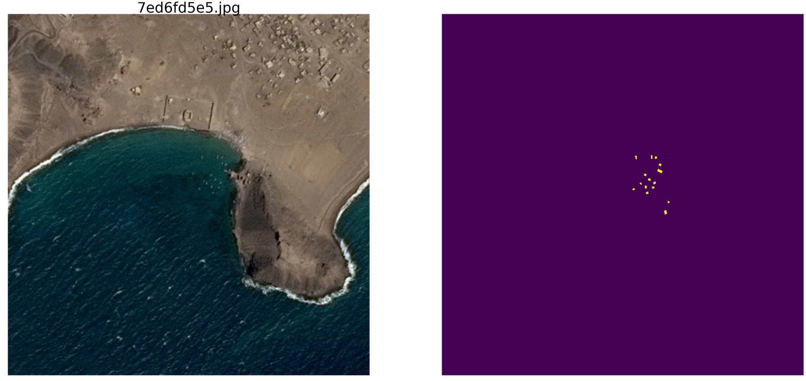
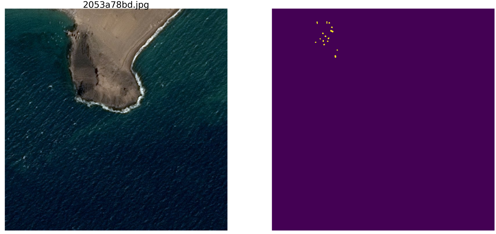
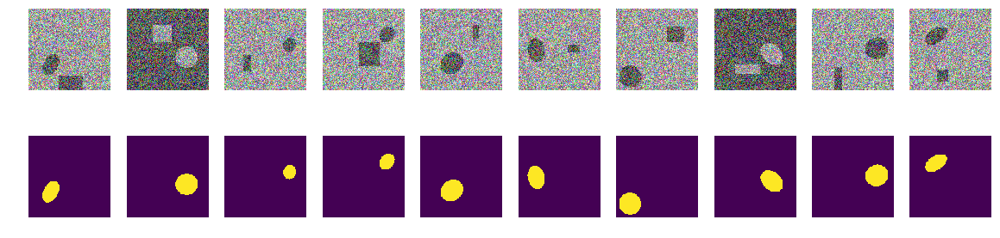
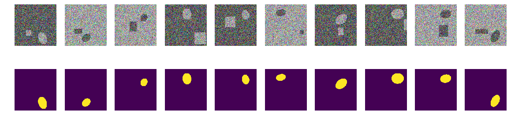

Шпаргалка для искусственного интеллекта — выбрось лишнее, учи главному. Техника обработки обучающих последовательностей

[ChePeter](https://habr.com/ru/users/ChePeter/ "Автор публикации") вчера в 22:19

Это вторая статья по анализу и изучению материалов соревнования по поиску корабликов на море. Но сейчас будем изучать свойства обучающих последовательностей. Попробуем найти в исходных данных лишнюю информацию, избыточность и её удалить.

Статья эта тоже есть просто результат любопытства и праздного интереса, ничего из нее в практике не встречается и для практических задач тут нет почти ничего для копипастинга. Это небольшое исследование свойств обучающей последовательности — рассуждения автора и код изложены, можно все проверить/дополнить/изменить самим.

Недавно закончились соревнования на kaggle по поиску судов на море. Компания Airbus предлагала провести анализ космических снимков моря как с судами так и без. Всего 192555 картинок 768х768х3 — это 340 720 680 960 байт если uint8 и это громадный объем информации и возникло смутное подозрение, что не все картинки нужны для обучения сети и в таком количестве информации очевидны повторы и избыточность. При обучении сети принято некоторую часть данных отделять и не использовать в обучении, а использовать для проверки качества обучения. И если один и тот же участок моря попал на два разных снимка и при этом один снимок попал в тренировочную последовательность, а другой в проверочную, то проверка смысл потеряет и сеть переобучится, мы не проверим свойство сети обобщать информацию, ведь данные те же самые. Борьба с эти явлением отняла много сил и времени GPU участников. Как обычно, победители и призеры не торопятся показать своим поклонникам секреты мастерства и выложить код и нет возможности его изучить и поучиться, поэтому займемся теорией.  
  
Простейшая визуальная проверка показала, что данных действительно слишком много, один и тот же участок моря попал на разные картинки, посмотрите на примеры

Именно по этой причине реальные данные нам не интересны, там много паразитных зависимостей, ненужных нам связей, плохая разметка и другие недостатки.

В [первой статье](https://habr.com/company/ods/blog/431512/) мы рассматривали картинки с эллипсами и помехами, так и продолжим их изучать. Преимущество такого подхода в том, что если найти какую либо привлекательную особенность сети, обученной на произвольном множестве картинок, то не понятно, это свойство сети или свойство обучающего множества. Статистические параметры последовательностей, взятых из реального мира, неизвестны. Недавно грандмастер Плесков Павел [paske57](https://habr.com/ru/users/paske57/) [рассказывал](https://www.youtube.com/watch?v=o6u_Od27IFw) как иногда легко выиграть соревнование по сегментации/классификации картинок, если хорошо покопаться в данных самому, например посмотреть метаданные фотографий. И нет никаких гарантий, что в реальных данных таких, непроизвольно оставленных, зависимостей нет. Поэтому берем для изучения свойств сети картинки с эллипсами и прямоугольниками, и место и цвет и другие параметры определяем с помощью генератора случайных чисел компьютера (у кого это псевдослучайный генератор, у кого это генератор, основанный на других, не цифровых алгоритмах и физических свойствах вещества, Но это не будем обсуждать в этой статье).

Итак, море возьмем _np.random.sample()*0.75_, нам не нужны волны, ветер, берега и иные скрытые закономерности и лики. Суда/эллипсы раскрасим тоже в тот же цвет и чтобы отличать море от кораблика и помехи прибавим к морю или кораблику/помехе 0.25, и все они будут одинаковой формы — эллипсы разного размера и ориентации. Помехи тоже будут только прямоугольниками того же цвета, что и эллипс — это важно, информация и помеха одинакового цвета на фоне шума. Внесем только небольшое изменение в раскраску и будем запускать _np.random.sample()_ для каждой картинки и для каждого эллипса/прямоугольника, т.е. не повторяются ни фон, ни цвет эллипса/прямоугольника. Дальше в тексте есть код программы создания картинок/масок и пример десяти случайно выбранных пар.

Возьмем очень распространенный вариант сети (вы можете взять свою любимую сеть) и попробуем выявить и показать избыточность большой обучающей последовательности, получить хоть какие то качественные и количественные характеристики избыточности. Т.е. автор считает, что многие гигабайты обучающих последовательностей избыточны существенно, там много ненужных картинок, нет никакой необходимости загружать десятки GPU и делать ненужные вычисления. Избыточность данных проявляется не только и не столько в том, что одинаковые части отображены на разных картинках, но и в избыточности информации в этих данных. Данные могут быть избыточны, даже если они не повторяются точно. Прошу учесть, что это не строгое определение информации и её достаточности или избыточности. Мы просто хотим выяснить, на сколько можно сократить трейн, какие картинки можно выбросить из обучающей последовательности и сколько картинок достаточно для приемлемого (точность зададим сами в программе) обучения. Это конкретная программа, конкретный датасет и возможно, что на эллипсах с треугольниками, в качестве помехи, ничего не будет работать так, как и на эллипсах с прямоугольниками (моя гипотеза: что будет всё то же и так же. Но мы сейчас это не проверяем, анализ не проводим и теорем не доказываем).

Итак, дано:

*   обучающая последовательность пар картинка/маска. Мы можем генерить любое количество пар картинок/масок. Сразу отвечу на вопрос — почему цвет и фон случайны? Отвечу просто, кратко, четко и исчерпывающе, что мне так нравится, лишняя сущность в виде границы не нужна;
*   сеть обычная, обыкновенная U-net, немного измененная и широко используемая для сегментации.

Идея для проверки:

*   в построенной последовательности, как и в реальных задачах, используются гигабайты данных. Автор считает, что размер обучающей последовательности не столь критичен и данных должно быть не обязательно много, но они должны содержать «много» информации. Такое количество, десять тысяч пар картинок/масок, не нужно и сеть обучится на гораздо меньшем количестве данных.

Начнем, выберем 10 000 пар и рассмотрим их внимательно. Мы выжмем из этой обучающей последовательности всю воду, все ненужные биты и используем и пустим в дело весь сухой остаток.

Можете сейчас проверить свою интуицию и предположить, сколько пар из 10000 достаточно для обучения и предсказания другой, но так же созданной последовательности в 10000 пар с точность больше 0.98. Запишите на бумажке, после сравним.

Для практического применения прошу учесть, что у нас и море и кораблики с помехами выбраны искусственно, это _np.random.sample()_.

**Загружаем библиотеки, определяем размеры массива картинок**

    import numpy as np
    import matplotlib.pyplot as plt
    %matplotlib inline
    import math
    from tqdm import tqdm
    
    from skimage.draw import ellipse, polygon
    
    from keras import Model
    from keras.optimizers import Adam
    from keras.layers import Input,Conv2D,Conv2DTranspose,MaxPooling2D,concatenate
    from keras.layers import BatchNormalization,Activation,Add,Dropout
    from keras.losses import binary_crossentropy
    from keras import backend as K
    
    import tensorflow as tf
    import keras as keras
    
    w_size = 128
    train_num = 10000
    
    radius_min = 10
    radius_max = 20

  

  

**определяем функции потерь и точности**

    def dice_coef(y_true, y_pred):
        y_true_f = K.flatten(y_true)
        y_pred = K.cast(y_pred, 'float32')
        y_pred_f = K.cast(K.greater(K.flatten(y_pred), 0.5), 'float32')
        intersection = y_true_f * y_pred_f
        score = 2. * K.sum(intersection) / (K.sum(y_true_f) + K.sum(y_pred_f))
        return score
    
    def dice_loss(y_true, y_pred):
        smooth = 1.
        y_true_f = K.flatten(y_true)
        y_pred_f = K.flatten(y_pred)
        intersection = y_true_f * y_pred_f
        score = (2. * K.sum(intersection) + smooth) / (K.sum(y_true_f) + K.sum(y_pred_f) + smooth)
        return 1. - score
    
    def bce_dice_loss(y_true, y_pred):
        return binary_crossentropy(y_true, y_pred) + dice_loss(y_true, y_pred)
    
    def get_iou_vector(A, B):
        
        
        batch_size = A.shape[0]
        metric = 0.0
        for batch in range(batch_size):
            t, p = A[batch], B[batch]
            true = np.sum(t)
            pred = np.sum(p)
            
            
            if true == 0:
                metric += (pred == 0)
                continue
            
            
            
            intersection = np.sum(t * p)
            union = true + pred - intersection
            iou = intersection / union
            
            
            iou = np.floor(max(0, (iou - 0.45)*20)) / 10
            
            metric += iou
            
        
        metric /= batch_size
        return metric
    
    def my_iou_metric(label, pred):
        
        return tf.py_func(get_iou_vector, [label, pred > 0.5], tf.float64)
    
    from keras.utils.generic_utils import get_custom_objects
    
    get_custom_objects().update({'bce_dice_loss': bce_dice_loss })
    get_custom_objects().update({'dice_loss': dice_loss })
    get_custom_objects().update({'dice_coef': dice_coef })
    get_custom_objects().update({'my_iou_metric': my_iou_metric })
    

  

Мы будем использовать метрику из [первой статьи](https://habr.com/company/ods/blog/431512/). Напомню читателям, что будем предсказывать маску пикселя — это «море» или «кораблик» и оценивать истинность или ложность предсказания. Т.е. возможны следующие четыре варианта — мы правильно предсказали, что пиксель это «море», правильно предсказали, что пиксель это «кораблик» или ошиблись в предсказании «море» или «кораблик». И так по всем картинкам и всем пикселям оцениваем количество всех четырех вариантов и подсчитываем результат — это и будет результат работы сети. И чем меньше ошибочных предсказаний и больше истинных, то тем точнее полученный результат и лучше работа сети.

И для проведения исследований возьмем вариант хорошо изученной U-net, это отличная сеть для сегментации картинок. Выбран не совсем классический вариант U-net, но идея та же, сеть производит с картинками очень простую операцию — пошагово уменьшает размерность картинки с некоторыми преобразованиями и после пытается восстановить маску из сжатого изображения. Т.е. размерность картинки в нашем случае доводится до 16x16 и далее пытаемся восстановить маску, используя данные со всех предыдущих слоев сжатия.

Мы исследуем сеть как «черный ящик», мы не станем смотреть, что происходит с сетью внутри, как меняются веса и как выбираются градиенты — это тема другого исследования.

**U-net с блоками**

    def convolution_block(x, 
                          filters, 
                          size, 
                          strides=(1,1), 
                          padding='same', 
                          activation=True):
        x = Conv2D(filters, 
                   size, 
                   strides=strides, 
                   padding=padding)(x)
        x = BatchNormalization()(x)
        if activation == True:
            x = Activation('relu')(x)
        return x
    
    def residual_block(blockInput, num_filters=16):
        x = Activation('relu')(blockInput)
        x = BatchNormalization()(x)
        x = convolution_block(x, num_filters, (3,3) )
        x = convolution_block(x, num_filters, (3,3), activation=False)
        x = Add()([x, blockInput])
        return x
    
    
    def build_model(input_layer, start_neurons, DropoutRatio = 0.5):
    
        conv1 = Conv2D(start_neurons * 1, (3, 3), 
                       activation=None,
                       padding="same"
                      )(input_layer)
        conv1 = residual_block(conv1,start_neurons * 1)
        conv1 = residual_block(conv1,start_neurons * 1)
        conv1 = Activation('relu')(conv1)
        pool1 = MaxPooling2D((2, 2))(conv1)
        pool1 = Dropout(DropoutRatio/2)(pool1)
    
    
        conv2 = Conv2D(start_neurons * 2, (3, 3), 
                       activation=None,
                       padding="same"
                      )(pool1)
        conv2 = residual_block(conv2,start_neurons * 2)
        conv2 = residual_block(conv2,start_neurons * 2)
        conv2 = Activation('relu')(conv2)
        pool2 = MaxPooling2D((2, 2))(conv2)
        pool2 = Dropout(DropoutRatio)(pool2)
    
    
        conv3 = Conv2D(start_neurons * 4, (3, 3), 
                       activation=None,
                       padding="same")(pool2)
        conv3 = residual_block(conv3,start_neurons * 4)
        conv3 = residual_block(conv3,start_neurons * 4)
        conv3 = Activation('relu')(conv3)
        pool3 = MaxPooling2D((2, 2))(conv3)
        pool3 = Dropout(DropoutRatio)(pool3)
    
    
        conv4 = Conv2D(start_neurons * 8, (3, 3),
                       activation=None,
                       padding="same")(pool3)
        conv4 = residual_block(conv4,start_neurons * 8)
        conv4 = residual_block(conv4,start_neurons * 8)
        conv4 = Activation('relu')(conv4)
        pool4 = MaxPooling2D((2, 2))(conv4)
        pool4 = Dropout(DropoutRatio)(pool4)
    
        
        convm = Conv2D(start_neurons * 16, (3, 3),
                       activation=None,
                       padding="same")(pool4)
        convm = residual_block(convm,start_neurons * 16)
        convm = residual_block(convm,start_neurons * 16)
        convm = Activation('relu')(convm)
        
    
        deconv4 = Conv2DTranspose(start_neurons * 8, (3, 3),
                                  strides=(2, 2),
                                  padding="same")(convm)
        uconv4 = concatenate([deconv4, conv4])
        uconv4 = Dropout(DropoutRatio)(uconv4)
        
        uconv4 = Conv2D(start_neurons * 8, (3, 3),
                        activation=None,
                        padding="same")(uconv4)
        uconv4 = residual_block(uconv4,start_neurons * 8)
        uconv4 = residual_block(uconv4,start_neurons * 8)
        uconv4 = Activation('relu')(uconv4)
        
    
        deconv3 = Conv2DTranspose(start_neurons * 4, (3, 3),
                                  strides=(2, 2),
                                  padding="same")(uconv4)
        uconv3 = concatenate([deconv3, conv3])    
        uconv3 = Dropout(DropoutRatio)(uconv3)
        
        uconv3 = Conv2D(start_neurons * 4, (3, 3),
                        activation=None, 
                        padding="same")(uconv3)
        uconv3 = residual_block(uconv3,start_neurons * 4)
        uconv3 = residual_block(uconv3,start_neurons * 4)
        uconv3 = Activation('relu')(uconv3)
    
    
        deconv2 = Conv2DTranspose(start_neurons * 2, (3, 3),
                                  strides=(2, 2),
                                  padding="same")(uconv3)
        uconv2 = concatenate([deconv2, conv2])
            
        uconv2 = Dropout(DropoutRatio)(uconv2)
        uconv2 = Conv2D(start_neurons * 2, (3, 3),
                        activation=None,
                        padding="same")(uconv2)
        uconv2 = residual_block(uconv2,start_neurons * 2)
        uconv2 = residual_block(uconv2,start_neurons * 2)
        uconv2 = Activation('relu')(uconv2)
        
     
        deconv1 = Conv2DTranspose(start_neurons * 1, (3, 3),
                                  strides=(2, 2),
                                  padding="same")(uconv2)
        uconv1 = concatenate([deconv1, conv1])
        
        uconv1 = Dropout(DropoutRatio)(uconv1)
        uconv1 = Conv2D(start_neurons * 1, (3, 3),
                        activation=None,
                        padding="same")(uconv1)
        uconv1 = residual_block(uconv1,start_neurons * 1)
        uconv1 = residual_block(uconv1,start_neurons * 1)
        uconv1 = Activation('relu')(uconv1)
        
        uconv1 = Dropout(DropoutRatio/2)(uconv1)
        output_layer = Conv2D(1, (1,1),
                              padding="same",
                              activation="sigmoid")(uconv1)
        
        return output_layer
    
    
    input_layer = Input((w_size, w_size, 3))
    output_layer = build_model(input_layer, 16)
    model = Model(input_layer, output_layer)
    model.compile(loss=bce_dice_loss, optimizer="adam", metrics=[my_iou_metric])
    
    model.summary()

  

Функция генерации пар картинка/маска. На цветной картинке 128х128 заполненной случайным шумом со случайно выбранным из двух диапазонов, или 0.0...0.75 или 0.25..1.0. Случайным образом на картинке размещаем случайно ориентированный эллипс и там же размещаем прямоугольник. Проверяем, что бы они не пересекались и сдвигаем при необходимости прямоугольник в сторону. Каждый раз заново считаем значения раскраски моря/кораблика. Для простоты мы поместим маску с картинкой в один массив, как четвертый цвет, т.е. Red.Green.Blue.Mask, так проще.

    def next_pair():
        img_l = (np.random.sample((w_size, w_size, 3))*
                 0.75).astype('float32')
        img_h = (np.random.sample((w_size, w_size, 3))*
                 0.75 + 0.25).astype('float32')
        img = np.zeros((w_size, w_size, 4), dtype='float')
    
        p = np.random.sample() - 0.5
        r = np.random.sample()*(w_size-2*radius_max) + radius_max
        c = np.random.sample()*(w_size-2*radius_max) + radius_max
        r_radius = np.random.sample()*(radius_max-radius_min) + radius_min
        c_radius = np.random.sample()*(radius_max-radius_min) + radius_min
        rot = np.random.sample()*360
        rr, cc = ellipse(
            r, c, 
            r_radius, c_radius, 
            rotation=np.deg2rad(rot), 
            shape=img_l.shape
        )
    
        p1 = np.rint(np.random.sample()*
                     (w_size-2*radius_max) + radius_max)
        p2 = np.rint(np.random.sample()*
                     (w_size-2*radius_max) + radius_max)
        p3 = np.rint(np.random.sample()*
                     (2*radius_max - radius_min) + radius_min)
        p4 = np.rint(np.random.sample()*
                     (2*radius_max - radius_min) + radius_min)
    
    
        poly = np.array((
            (p1, p2),
            (p1, p2+p4),
            (p1+p3, p2+p4),
            (p1+p3, p2),
            (p1, p2),
        ))
        rr_p, cc_p = polygon(poly[:, 0], poly[:, 1], img_l.shape)
    
        in_sc_rr = list(set(rr) & set(rr_p))
        in_sc_cc = list(set(cc) & set(cc_p))
    
        if len(in_sc_rr) > 0 and len(in_sc_cc) > 0:
            if len(in_sc_rr) > 0:
                _delta_rr = np.max(in_sc_rr) - np.min(in_sc_rr) + 1
                if np.mean(rr_p) > np.mean(in_sc_rr):
                    poly[:,0] += _delta_rr
                else:
                    poly[:,0] -= _delta_rr
            
            if len(in_sc_cc) > 0:
                _delta_cc = np.max(in_sc_cc) - np.min(in_sc_cc) + 1
                if np.mean(cc_p) > np.mean(in_sc_cc):
                    poly[:,1] += _delta_cc
                else:
                    poly[:,1] -= _delta_cc
       
        rr_p, cc_p = polygon(poly[:, 0], poly[:, 1], img_l.shape)
    
        if p > 0:
            img[:,:,:3] = img_l.copy()
            img[rr, cc,:3] = img_h[rr, cc]
            img[rr_p, cc_p,:3] = img_h[rr_p, cc_p]
        else:
            img[:,:,:3] = img_h.copy()
            img[rr, cc,:3] = img_l[rr, cc]
            img[rr_p, cc_p,:3] = img_l[rr_p, cc_p]
            
        img[:,:,3] = 0.
        img[rr, cc,3] = 1.
    
        return img
    

Создадим обучающую последовательность пар, посмотрим случайные 10

    _txy = [next_pair() for idx in range(train_num)]
    f_imgs = np.array(_txy)[:,:,:,:3].reshape(-1,w_size ,w_size ,3)
    f_msks = np.array(_txy)[:,:,:,3:].reshape(-1,w_size ,w_size ,1)
    del(_txy)
    
    fig, axes = plt.subplots(2, 10, figsize=(20, 5))
    for k in range(10):
        kk = np.random.randint(train_num)
        axes[0,k].set_axis_off()
        axes[0,k].imshow(f_imgs[kk])
        axes[1,k].set_axis_off()
        axes[1,k].imshow(f_msks[kk].squeeze())
    

### Первый шаг. Попробуем обучить на минимальном множестве

Первый шаг нашего эксперимента простой, мы пробуем обучить сеть предсказывать всего 11 первых картинок.

    batch_size = 10
    val_len = 11
    precision = 0.85
    
    m0_select = np.zeros((f_imgs.shape[0]), dtype='int')
    
    for k in range(val_len):
        m0_select[k] = 1
    
    t = tqdm()
    while True:
        fit = model.fit(f_imgs[m0_select>0], f_msks[m0_select>0],
                        batch_size=batch_size, 
                        epochs=1, 
                        verbose=0
                       )
        
        current_accu = fit.history['my_iou_metric'][0]
        current_loss = fit.history['loss'][0]
        t.set_description("accuracy {0:6.4f} loss {1:6.4f} ".\
                          format(current_accu, current_loss))
        t.update(1)
        if current_accu > precision:
            break
    t.close()

`accuracy 0.8636 loss 0.0666 : : 47it [00:29, 5.82it/s]`

Мы выбрали из исходной последовательности первые 11 и обучили сеть на них. Сейчас не важно, заучивает сеть конкретно эти картинки или обобщает, главное, что эти 11 картинок она может распознать так, как нам нужно. В зависимости от выбранного датасета и точности, обучение сети может продолжаться долго, очень долго. Но у нас всего несколько итераций. Повторю, что нам сейчас не важно как и что заучила или выучила сеть, главное, что она достигла установленной точности предсказания.

### Теперь начнем главный эксперимент

Мы будем брать новые пары картинка/маска из построенной последовательности и будем пытаться предсказать их сетью обученной на уже отобранной последовательности. В начале это всего 11 пар картинка/маска и сеть обучена, возможно и не очень корректно. Если в новой паре маска по картинке предсказывается с приемлемой точностью, то эту пару выбрасываем, в ней нет новой информации для сети, она уже знает и может вычислить по этой картинке маску. Если же точность предсказания недостаточна, то эту картинку с маской добавляем в нашу последовательность и начинаем тренировать сеть до достижения приемлемого результата точности на отобранной последовательности. Т.е. эта картинка содержит новую информацию и мы её добавляем в наш обучающую последовательность и извлекаем тренировкой содержащуюся в ней информацию.

    batch_size = 50
    t_batch_size = 1024
    raw_len = val_len
    
    t = tqdm(-1)
    id_train = 0
    
    
    while True:
        t.set_description("Accuracy {0:6.4f} loss {1:6.4f}\
         selected img {2:5d} tested img {3:5d} ".
                          format(current_accu, current_loss, val_len, raw_len))
        t.update(1)
    
        if id_train == 1:
            fit = model.fit(f_imgs[m0_select>0], f_msks[m0_select>0],
                            batch_size=batch_size,
                            epochs=1,
                            verbose=0
                           )
        
            current_accu = fit.history['my_iou_metric'][0]
            current_loss = fit.history['loss'][0]
            if current_accu > precision:
                id_train = 0
                
        else:
            t_pred = model.predict(
                f_imgs[raw_len: min(raw_len+t_batch_size,f_imgs.shape[0])],
                batch_size=batch_size
                                  )
            for kk in range(t_pred.shape[0]):
                val_iou = get_iou_vector(
                    f_msks[raw_len+kk].reshape(1,w_size,w_size,1),
                    t_pred[kk].reshape(1,w_size,w_size,1) > 0.5)
                if val_iou < precision*0.95:
                    new_img_test = 1
                    m0_select[raw_len+kk] = 1                
                    val_len += 1
                    break
            raw_len += (kk+1)
            id_train = 1
        
        if raw_len >= train_num:
            break
    
    t.close()
    

  

    Accuracy 0.9830 loss 0.0287 selected img   271 tested img  9949 : : 1563it [14:16,  1.01it/s]

Здесь accuracy используется в смысле «точность», а не как стандартная метрика keras и для вычисления точности используется подпрограмма «my\_iou\_metric». Очень интересно наблюдать точность и количество исследованных и добавленных картинок. В начале почти все пары картинка/маска сеть добавляет и где то около 70 начинает уже выбрасывать. Ближе к 8000 выбрасывает почти все пары.

Проверим визуально случайные пары выбранные сетью:

    fig, axes = plt.subplots(2, 10, figsize=(20, 5))
    t_imgs = f_imgs[m0_select>0]
    t_msks = f_msks[m0_select>0]
    for k in range(10):х
        kk = np.random.randint(t_msks.shape[0])
        axes[0,k].set_axis_off()
        axes[0,k].imshow(t_imgs[kk])
        axes[1,k].set_axis_off()
        axes[1,k].imshow(t_msks[kk].squeeze())
    

Ничего особенного или сверхъестественного:

Это пары выбранные сетью на разных стадиях обучения. Когда сеть получила на вход пару из этой последовательности, то она не смогла вычислить маску с установленной точностью и эта пара была включена в обучающую последовательность. Но ничего особенного, обычные картинки.

### Проверка результата и точности

Проверим качество программы тренировки сети, убедимся, что качество не существенно зависит от порядка исходной последовательности, для чего перемешаем исходную последовательность пар картинка/маска, берем другие 11 первых и так же, тем же методом тренируем сеть и обрезаем лишнее.

    sh = np.arange(train_num)
    np.random.shuffle(sh)
    f0_imgs = f_imgs[sh]
    f0_msks = f_msks[sh]
    
    model.compile(loss=bce_dice_loss, optimizer="adam", metrics=[my_iou_metric])
    model.summary()

  

**Код тренировки**

    batch_size = 10
    val_len = 11
    precision = 0.85
    
    m0_select = np.zeros((f_imgs.shape[0]), dtype='int')
    
    for k in range(val_len):
        m0_select[k] = 1
    
    t = tqdm()
    while True:
        fit = model.fit(f0_imgs[m0_select>0], f0_msks[m0_select>0],
                        batch_size=batch_size, 
                        epochs=1, 
                        verbose=0
                       )
        
        current_accu = fit.history['my_iou_metric'][0]
        current_loss = fit.history['loss'][0]
        t.set_description("accuracy {0:6.4f} loss {1:6.4f} ".\
                          format(current_accu, current_loss))
        t.update(1)
        if current_accu > precision:
            break
    t.close()

  

    accuracy 0.8636 loss 0.0710 : : 249it [01:03,  5.90it/s]

  

    batch_size = 50
    t_batch_size = 1024
    raw_len = val_len
    
    t = tqdm(-1)
    id_train = 0
    
    
    while True:
        t.set_description("Accuracy {0:6.4f} loss {1:6.4f}\
                        selected img {2:5d} tested img {3:5d} ".
                          format(current_accu, current_loss, val_len, raw_len))
        t.update(1)
    
        if id_train == 1:
            fit = model.fit(f0_imgs[m0_select>0], f0_msks[m0_select>0],
                            batch_size=batch_size,
                            epochs=1,
                            verbose=0
                           )
        
            current_accu = fit.history['my_iou_metric'][0]
            current_loss = fit.history['loss'][0]
            if current_accu > precision:
                id_train = 0
                
        else:
            t_pred = model.predict(
                f_imgs[raw_len: min(raw_len+t_batch_size,f_imgs.shape[0])],
                batch_size=batch_size
                                  )
            for kk in range(t_pred.shape[0]):
                val_iou = get_iou_vector(
                    f_msks[raw_len+kk].reshape(1,w_size,w_size,1),
                    t_pred[kk].reshape(1,w_size,w_size,1) > 0.5)
                if val_iou < precision*0.95:
                    new_img_test = 1
                    m0_select[raw_len+kk] = 1                
                    val_len += 1
                    break
            raw_len += (kk+1)
            id_train = 1
        
        if raw_len >= train_num:
            break
    
    t.close()
    

  

    Accuracy 0.9890 loss 0.0224 selected img   408 tested img  9456 : : 1061it [21:13,  2.16s/it]

  

Результат не зависит существенно от порядка пар исходной последовательности. В предыдущем случае сеть выбрала 271, сейчас 408, если еще перемешать, сеть может выбрать другое количество. Не станем проверять, автор считает, что всегда будет существенно меньше, чем 10000.

Проверим точность предсказания сети на новой независимой последовательности

    _txy = [next_pair() for idx in range(train_num)]
    test_imgs = np.array(_txy)[:,:,:,:3].reshape(-1,w_size ,w_size ,3)
    test_msks = np.array(_txy)[:,:,:,3:].reshape(-1,w_size ,w_size ,1)
    del(_txy)
    test_pred_0 = model.predict(test_imgs)
    t_val_0 = get_iou_vector(test_msks,test_pred_0)
    t_val_0

  

    0.9927799999999938

### Итоги и выводы

Итак, мы смогли выжать из меньше чем трех-четырех сотен, выбранных из 10000 пар, точность предсказания 0.99278, мы взяли все пары, которые содержат хоть какую то полезную информацию и выбросили остальные. Мы не стали выравнивать статистические параметры обучающей последовательности, добавлять повторяемость информации и т.п. и вообще не использовали статистические методы. Мы берем картинку, которая содержит неизвестную еще сети информацию и выжимаем из нее всё в веса сети. Если сеть встретит хоть одну «загадочную» картинку, то она её всю употребит в дело.

Всего в 271 паре картинка/маска содержится информация для предсказания 10000 пар с точностью не меньше 0.8075 на каждой паре, т.е суммарная точность по всей последовательности выше, но и на каждой картинке она не меньше чем 0.8075, у нас нет картинок которые мы не можем предсказать и мы знаем нижнюю границу этого предсказания. ( тут конечно автор прихвастнул, как же без этого, в статье нет ни проверки этого утверждения, про 0.8075, ни доказательства, но скорее всего это верно)

Для обучения сети нет необходимости нагружать GPU всем, что попало под руку, можно вытащить такое вот ядро трейна и на нем обучить сеть, как начало обучения. По мере получения новых картинок можно вручную разметить те, что сеть не смогла предсказать и их добавить в ядро трейна, заново переобучив сеть, что бы выжать из новых картинок всю информацию. И не нужно выделять валидационную последовательность, можно считать, что всё остальное, кроме выбранной и есть валидационная последовательность.

Еще одно математически не строгое, но очень важное замечание. Можно с уверенностью утверждать, что каждая пара картинка/маска содержит «много» информации. В каждой паре содержится «много» информации хоть и в большей части пар картинка/маска информация пересекается или повторяется. Каждая из 271 пар картинка/маска содержит существенную для предсказания информацию и эту пару нельзя просто выбросить.

Ну и небольшое замечание про фолды, многие специалисты и kaggler-ы делят тренировочную последовательности на фолды и тренируют их отдельно, объединяя в дальнейшем хитрыми способами полученные результаты. В нашем случае можно точно также разделять на фолды, если из 10000 изъять 271 пару, то на оставшихся можно точно также создать новую корневую последовательность, которая очевидно предоставит другой, но сопоставимый результат. Можно и просто перемешать и взять другие начальные 11, как показано выше.

В статье предоставлен код и показан способ тренировки U-net для сегментации картинок. Это конкретный пример и в статье намеренно нет никаких обобщений на другие сети, на другие последовательности, нет суровой математики, всё рассказано и показано «на пальцах». Просто пример того, как можно учить сеть и при этом достичь приемлемой точности.

Теги:

*   [искусственный интеллект](https://habr.com/ru/search/?q=%5B%D0%B8%D1%81%D0%BA%D1%83%D1%81%D1%81%D1%82%D0%B2%D0%B5%D0%BD%D0%BD%D1%8B%D0%B9%20%D0%B8%D0%BD%D1%82%D0%B5%D0%BB%D0%BB%D0%B5%D0%BA%D1%82%5D&target_type=posts)
*   [обработка изображений](https://habr.com/ru/search/?q=%5B%D0%BE%D0%B1%D1%80%D0%B0%D0%B1%D0%BE%D1%82%D0%BA%D0%B0%20%D0%B8%D0%B7%D0%BE%D0%B1%D1%80%D0%B0%D0%B6%D0%B5%D0%BD%D0%B8%D0%B9%5D&target_type=posts)