Эволюция переключения контекста x86 в Linux

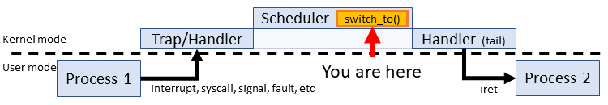

В прошлые выходные, изучая интересные факты об аппаратном переключателе контекста 80386, я вдруг вспомнил, что первые версии ядра Linux полагались именно на него. И я погрузился в код, который не видел уже много лет. Сейчас я решил описать это чудесное путешествие по истории Linux. Я покажу все самородки и забавные артефакты, которые нашёл по пути.

**Задача:** проследить, как изменялось переключение контекста в ядре Linux от первой (0.01) до последней версии LTS (4.14.67), с особым акцентом на первую и последнюю версии.  

*   [Ранний Linux: древняя история](https://habr.com/ru/post/438042/#1)  
    
*   [Linux 1.0: доказательство концепции](https://habr.com/ru/post/438042/#2)  
    
*   [Linux 2.0: кандидат](https://habr.com/ru/post/438042/#3)  
    *   [2.2 переключение на программном уровне](https://habr.com/ru/post/438042/#4)  
        
    *   [2.4: последнее старое ядро](https://habr.com/ru/post/438042/#5)
*   [Linux 2.6: популярность](https://habr.com/ru/post/438042/#6)  
    
*   [Linux 3.0: современная ОС](https://habr.com/ru/post/438042/#7)  
    
*   [Linux 4.14.67: последняя LTS](https://habr.com/ru/post/438042/#8)

На самом деле история не о переключении контекста, а об эволюции Linux от небольшого проекта к современной операционной системе. Переключатель контекста просто отражает эту историю.

## О каком переключении контекста идёт речь?

Хотя много что можно рассматривать как переключение контекста (например, переход в режим ядра, переход к обработчику прерываний), я имею в виду общепринятое значение: **переключение между процессами**. В Linux это макрос `switch_to()`и всё, что в нём находится.

Этот макрос представляет собой простые механические действия между двумя гораздо более интересными системами: планировщиком задач и CPU. Разработчики ОС имеют возможность смешивать и согласовывать стратегии планирования задач. Архитектуры CPU тоже представляют широкий простор: Linux поддерживает десятки типов. Но переключатель контекста — шестерёнка между ними. Её «дизайн» зависит от соседей, так что переключатель контекста претендует на роль _наименее_ интересной части ОС. Повторюсь: он делает только то, что должно быть сделано.

Краткий список задач переключателя контекста:

1.  Переуказание рабочего пространства: восстановление стека (SS:SP).  
    
2.  Поиск следующей инструкции: восстановление IP (CS:IP).  
    
3.  Восстановление состояния задачи: восстановление регистров общего назначения.  
    
4.  Своппинг адресных пространств памяти: обновление каталога страниц (CR3)  
    
5.  … и многое другое: FPU, структуры данных ОС, регистры отладки, аппаратные обходные пути и т. д.

Не всегда очевидно, когда и где выполняются эти задачи, если другой процесс захватывает CPU. Например, аппаратное переключение контекста до Linux 2.2 скрывает задачи 2, 3 и 4. Задача 3 ограничена, так как переключение происходит между режимами ядра. Восстановление пользовательского потока является задачей `iret` после возвращения планировщика. Многие из этих задач в разных версиях ядра плавают между `switch_to()` и планировщиком. Можно гарантировать только то, что в каждой версии мы всегда увидим своп стека и переключение FPU.

### Для кого это предназначено?

Ни для кого конкретно. Для понимания вам нужно только знать ассемблер x86 и, наверное, иметь минимальное образование в части проектирования ОС.

Сразу скажу, я не [мейнтейнер](https://www.kernel.org/doc/linux/MAINTAINERS) и не контрибутор в ядро Linux. Любую информацию от этих товарищей или из [списка рассылки разработчиков ядра](https://lkml.org/), которая противоречит моей информации, следует воспринимать серьёзно. У меня случайный личный проект, а не научная статья в рецензируемом журнале.

Раннее ядро Linux простое и функциональное, с небольшим списком ключевых функций:

*   Единственная архитектура (80386/i386): только один тип переключателя контекста. Многие особенности 80386 жёстко закодированы по всему ядру. Для справки по этим частям я взял «Руководство программиста Intel 80386» (1986).  
    
*   Аппаратное переключение контекста: для смены задач ядро использует встроенные механизмы 80386.  
    
*   Один процесс с упреждающей многозадачностью: одновременно активен только один CPU с одним процессом. Однако в любой момент может начаться другой процесс. Таким образом, применяются обычные правила синхронизации: блокировка общих ресурсов (без спин-блокировок). В крайнем случае возможно отключение прерываний, но сначала рассмотреть блокировку мьютекса.

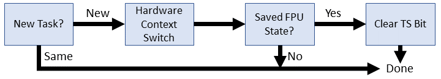

Без дальнейших церемоний, взглянем на два ранних переключателя контекста. Код отформатирован для лучшей читаемости: по одному элементу в строке без символов продолжения (\\).

**Linux 0.01**

    
    #define switch_to(n) {
    struct {long a,b;} __tmp;
    __asm__("cmpl %%ecx,_current\n\t"
      "je 1f\n\t"
      "xchgl %%ecx,_current\n\t"
      "movw %%dx,%1\n\t"
      "ljmp %0\n\t"
      "cmpl %%ecx,%2\n\t"
      "jne 1f\n\t"
      "clts\n"
      "1:"
      ::"m" (*&__tmp.a),
      "m" (*&__tmp.b),
      "m" (last_task_used_math),
      "d" _TSS(n),
      "c" ((long) task[n]));
    }

**Linux 0.11**

    
    #define switch_to(n) {
    struct {long a,b;} __tmp;
    __asm__("cmpl %%ecx,_current\n\t"
      "je 1f\n\t"
      "movw %%dx,%1\n\t"
      "xchgl %%ecx,_current\n\t"
      "ljmp %0\n\t"
      "cmpl %%ecx,_last_task_used_math\n\t"
      "jne 1f\n\t"
      "clts\n"
      "1:"
      ::"m" (*&__tmp.a),
      "m" (*&__tmp.b),
      "d" (_TSS(n)),
      "c" ((long) task[n]));
    }

Сразу бросается в глаза, какой он маленький! Достаточно маленький, чтобы разобрать каждую строчку в отдельности:

    #define switch_to(n) {

Итак, `switch_to()` — это макрос. Он появляется ровно в одном месте: в самой последней строке `schedule()`. Следовательно, после предварительной обработки макрос совместно использует область планировщика. Идёт проверка в глобальной области неизвестных ссылок, таких как `current` и `last_task_used_math`. Входной аргумент `n` — порядковый номер следующей задачи (от 0 до 63).

    struct {long a,b;} __tmp;

Резервирует 8 байт (64 бита) в стеке, доступном через два 4-байтовых элемента `a` и `b`. Мы установим некоторые из этих байтов позже для операции дальнего перехода.

    __asm__("cmpl %%ecx,_current\n\t"

Переключатель контекста — один длинный встроенный блок на ассемблере. Первая инструкция определяет, является ли целевая задача уже текущей. Это вычитающее сравнение значения в регистре ECX со значением текущего `current` из планировщика. Оба содержат указатели на `task_struct` какого-то процесса. Ниже в ECX стоит указатель целевой задачи в качестве заданного входа: `"c" ((long) task[n])`. Результат сравнения устанавливает значение регистра состояния EFLAGS: например, ZF = 1, если оба указателя совпадают (x - x = 0).

    "je 1f\n\t"

Если следующей задачей является текущая, переключать контекст не нужно, поэтому следует пропустить (перепрыгнуть) всю эту процедуру. Инструкция `je` проверяет, что ZF = 1. Если это так, то переходит к первой метке '1' после этой точки в коде, которая находится на 8 строк впереди.

    "xchgl %%ecx,_current\n\t"

Обновляет глобальный `current` для отражения новой задачи. Указатель из ECX (task\[n\]) переключается на current. Флаги не обновляются.

    "movw %%dx,%1\n\t"

Перемещает индекс селектора сегментов дескриптора целевой задачи (TSS) в ранее зарезервированное пространство. Технически это перемещает значение из регистра DX в `__tmp.b`, то есть байты с 5 по 8 нашей зарезервированной 8-байтовой структуры. Значение DX является заданным входом: `"d" (_TSS(n))`. Многоуровневый макрос `_TSS` раскрывается в селекторе сегментов валидного TSS, который я рассмотрю чуть ниже. Суть в том, что наиболее значимые два байта `__tmp.b` теперь содержат указатель сегмента на следующую задачу.

    "ljmp %0\n\t"

Вызывает аппаратный переключатель контекста 80386, перейдя к дескриптору TSS. Этот простой переход может сбить с толку, потому что тут три разные идеи: во-первых, `ljmp` является косвенным дальним переходом, которому нужен 6-байтовый (48-битный) операнд. Во-вторых, операнд %0 ссылается на неинициализированную переменную `__tmp.А`. Наконец, переход к селектору сегментов в GDT имеет особое значение в x86. Давайте разберём эти моменты.

### Косвенный дальний переход

Важный момент, что у этого перехода 6-байтовый операнд. Руководство программиста 80386 описывает переход так:

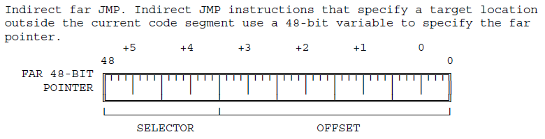

### Переход к __tmp.a

Напомним, что структура `__tmp` содержала два 4-байтных значения, а в основе структуры элемент `a`. Но если мы используем этот элемент в качестве базового адреса 6-байтового операнда, то достигнем двух байтов **внутри** целого числа `__tmp.b`. Эти два байта являются частью «селектора сегмента» дальнего адреса. Когда процессор видит, что сегмент представляет собой TSS в GDT, то часть смещения полностью игнорируется. Тот факт, что `__tmp.a` неинициализирован, не имеет значения, потому что у `__tmp.b` всё равно валидное значение благодаря предыдущей инструкции `movw`. Добавим адрес перехода на диаграмму:

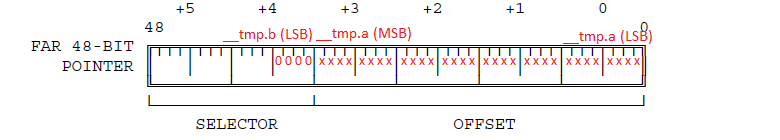

Откуда мы знаем, что этот адрес ссылается на GDT? Я раскрою детали в других строчках кода, но краткая версия заключается в том, что четыре нулевых бита в селекторе запускают поиск GDT. Макрос `_TSS(n)` гарантирует присутствие этих четырёх нулей. Нижние два бита — это уровень привилегий сегмента (00 соответствует supervisor/kernel), следующий нулевой бит означает использование таблицы GDT (хранящейся в GDTR во время загрузки системы). Четвёртый ноль технически является частью индекса сегмента, который форсирует все поиски TSS на чётных записях таблицы GDT.

### Аппаратный переключатель контекста

Адрес перехода в `__tmp` определяет дескриптор TSS в GDT. Вот как это описано в руководстве для 80386:

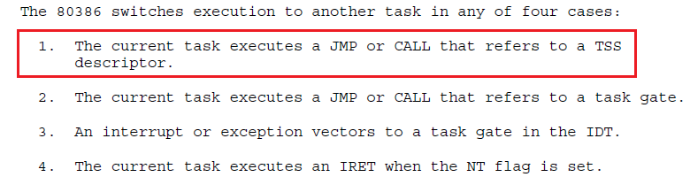

Процессор автоматически делает для нас следующее:

*   Проверяет, разрешён ли текущий уровень привилегий (мы находимся в режиме ядра, поэтому всё нормально).  
    
*   Проверяет, что TSS действителен (должен быть).  
    
*   Сохраняет всё текущее состояние задачи в старом TSS, всё ещё хранящемся в регистре задач (TR), так что не нужно задействовать EAX, ECX, EDX, EBX, ESP, EBP, ESI, EDI, ES, CS, SS, DS ,FS, GS и EFLAGS. EIP увеличивается до следующей инструкции и тоже сохраняется.  
    
*   Обновляет TR для новой задачи.  
    
*   Восстанавливает все регистры общего назначения, EIP и PDBR (своп адресного пространства). Переключатель задач завершил работу, поэтому устанавливается флаг TS в регистре CR0.

Вот так единственная инструкция `"ljmp %0\n\t"` взяла и выполнила все этапы переключения контекста. Осталось только немного прибраться.

    "cmpl %%ecx,%2\n\t"

Проверяем, что предыдущее задание восстановило математический сопроцессор. Аргументом является указатель `last_task_used_math`. Флаг TS помогает проверить, остался ли у сопроцессора остался другой контекст. Аппаратные переключатели контекста не управляют сопроцессором.

    "jne 1f\n\t"

Если последняя задача не восстановила сопроцессор, переходим к концу переключателя контекста. Мы хотим оставить флаг TS, чтобы в следующий раз при использовании сопроцессора можно было выполнить ленивую очистку. «Ленивую», потому что мы откладываем задачу, пока она не становится абсолютно необходимой.

    "clts\n"

Снимаем флаг TS, если последний процесс восстановил состояние сопроцессора.

    "1:"

Метка конца переключателя контекста. Все переходы к этой метке пропускают некоторые или все процедуры.

    ::"m" (*&__tmp.a),

В этом блоке ассемблера нет выходных данных, а первые входные данные (%0) — расположение в памяти первых четырёх байтов дальнего указателя на дескриптор TSS в GDT. Используется только в качестве ссылки на адрес, значение неинициализировано.

    "m" (*&__tmp.b),

Второй вход (%1) — это расположение в памяти байтов 5 и 6 дальнего указателя на дескриптор TSS. Технически это место занимает четыре байта в памяти, но проверяются и используются только первые два.

    "m" (last_task_used_math),

Третий вход (%2) — расположение в памяти указателя на последний `task_struct`, который восстановил состояние сопроцессора.

    "d" (_TSS(n)),

Четвёртый вход (%3 / %%edx) — адрес селектора сегментов дескриптора TSS в GDT. Давайте разберём макрос:

    #define _TSS(n) ((((unsigned long) n)<<4)+(FIRST_TSS_ENTRY<<3))
    #define FIRST_TSS_ENTRY 4

Это означает, что первый дескриптор TSS является 4-й записью (отсчёт индекса начинается с 4-го бита селектора сегмента). Каждая последующая TSS занимает каждую вторую запись GDT: 4, 6, 8 и т. д. Первые восемь задач выглядят так:

| Task # | 16-bit Segment Selector |
| --- | --- |
| 0   | 0000000000100  0  00 |
| 1   | 0000000000110  0  00 |
| 2   | 0000000001000  0  00 |
| 3   | 0000000001010  0  00 |
| 4   | 0000000001100  0  00 |
| 5   | 0000000001110  0  00 |
| 6   | 0000000010000  0  00 |
| 7   | 0000000010010  0  00 |

Биты адреса разделены форматом поля, как это положено в 80386:

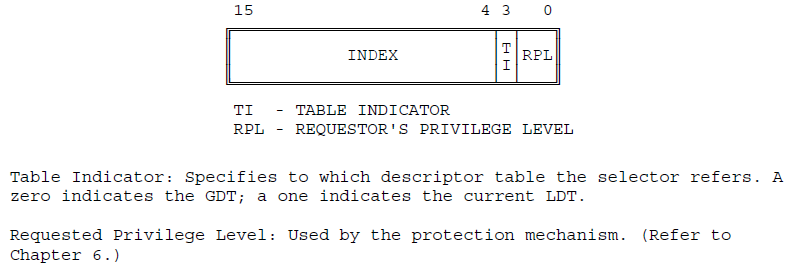

Наименее значимые четыре бита всегда нулевые, что соответствует режиму супервизора, таблице GDT и форсирует чётные записи индекса GDT.

    "c" ((long) task[n]));

Последний вход (%4 / %ecx) — указатель на новый task_struct, на который мы переключаемся. Обратите внимание, что значение %%ecx изменяется на предыдущую задачу непосредственно перед переключением контекста.

### Различия между 0.01 и 0.11

Между переключателями контекста есть два различия. Одно из них — простая очистка кода, а другое — частичное исправление ошибки.

*   `_last_task_used_math` удалён в качестве входной переменной, поскольку символ уже доступен в глобальной области. Соответствующая операция сравнения изменена на прямую ссылку.  
    
*   Инструкция `xchgl` поменялась местами с `movw`, чтобы приблизить её к аппаратному переключателю контекста (`ljmp`). Проблема в том, что эти операции не являются атомарными: маловероятно, что между `xchgl` и `ljmp` может произойти прерывание, которое приведёт к ещё одному переключению контекста с неправильной задачей `current` и несохранённым состоянием реальной задачи. Замена местами этих инструкций делает такую ситуацию очень маловероятной. Однако в долго работающей системе «очень маловероятно» — синоним для «неизбежно».

  

Примерно за год между 0.11 и 1.0 вышло около 20 патчей. Основная часть усилий была сосредоточена на драйверах, функциях для пользователей и разработчиков. Максимальное количество задач увеличилось до 128, но в переключении контекста произошло не так много фундаментальных изменений.

## Linux 1.0

Linux 1.0 по-прежнему работает на одном CPU с одним процессом, используя аппаратное переключение контекста.

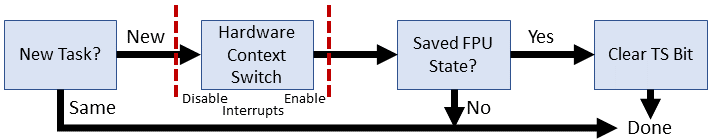

**Linux 1.0**

    
    #define switch_to(tsk)
    __asm__("cmpl %%ecx,_current\n\t"
    	"je 1f\n\t"
    	"cli\n\t"
    	"xchgl %%ecx,_current\n\t"
    	"ljmp %0\n\t"
    	"sti\n\t"
    	"cmpl %%ecx,_last_task_used_math\n\t"
    	"jne 1f\n\t"
    	"clts\n"
    	"1:"
    	: 
    	:"m" (*(((char *)&tsk->tss.tr)-4)),
    	 "c" (tsk)
    	:"cx")

Наиболее существенным изменением стало то, что входной аргумент больше не является индексом номера задачи для массива структур task_struct. Теперь `switch_to()` принимает указатель на новую задачу. Так что можно удалить структуру `__tmp`, а вместо неё использовать прямую ссылку на TSS. Разберём каждую строчку.

    #define switch_to(tsk)

Входные данные теперь являются указателем на task_struct следующей задачи.

    "__asm__("cmpl %%ecx,_current\n\t"

Не изменилось. Проверяет, является ли входная задача уже текущей, так что переключатель не требуется.

    "je 1f\n\t"

Не изменилось. Пропустить переключение контекста, если переключатель отсутствует.

    "cli\n\t"

Отключает прерывания, чтобы таймер (или кто-то другой) не врезался между обновлением глобальной задачи и аппаратным переключением контекста. Этот банхаммер для прерываний решает проблему ранних версий ядра, делая следующие две инструкции (псевдо)атомарными.

    "xchgl %%ecx,_current\n\t"
    "ljmp %0\n\t"

Без изменений: своп текущего процесса для отражения новой задачи и вызова аппаратного переключателя контекста.

    "sti\n\t"

Включает прерывания обратно.

    "cmpl %%ecx,_last_task_used_math\n\t"
    "jne 1f\n\t"
    "clts\n"
    "1:"

Всё без изменений по сравнению с Linux 0.11. Управляет регистром TS и отслеживает очистку математического сопроцессора от предыдущей задачи.

    : 

Этот встроенный ассемблер не имеет выходных данных — кого-то явно раздражало отсутствие комментариев в ранних версиях ядра.

    :"m" (*(((char *)&tsk->tss.tr)-4)),

Загружает селектор сегментов для дескриптора TSS новой задачи, которая теперь непосредственно доступна из указателя task_struct. Элемент `tss.tr` содержит \_TSS(task\_number) для ссылки на память GDT/TSS, которая использовалась в ядре до 1.0. Мы все ещё отступаем на 4 байта и загружаем 6-байтовый селектор сегментов, чтобы взять два верхних байта. Весело!

    "c" (tsk)

Почти без изменений — теперь мы напрямую загружаем указатель, а не ищем индекс.

    :"cx")

Переключение контекста блокирует регистр ECX.

## Linux 1.3

Ядро теперь поддерживает несколько новых архитектур: Alpha, MIPS и SPARC. Следовательно, существует четыре разных версии `switch_to()`, одна из которых включается при компиляции ядра. Код, зависящий от архитектуры, был отделён от ядра, поэтому нужно искать версию x86 в другом месте.

**Linux 1.3**

    
    #define switch_to(tsk) do {
    __asm__("cli\n\t"
    	"xchgl %%ecx,_current\n\t"
    	"ljmp %0\n\t"
    	"sti\n\t"
    	"cmpl %%ecx,_last_task_used_math\n\t"
    	"jne 1f\n\t"
    	"clts\n"
    	"1:"
    	: 
    	:"m" (*(((char *)&tsk->tss.tr)-4)),
    	 "c" (tsk)
    	:"cx");
    	
    	if(current->debugreg[7]){
    		loaddebug(0);
    		loaddebug(1);
    		loaddebug(2);
    		loaddebug(3);
    		loaddebug(6);
    	}
    } while (0)

Несколько маленьких изменений: весь контекстный переключатель обёрнут фейковым циклом do-while. Фейковым, потому что он никогда не повторяется. Проверка переключения на новую задачу переместилась из `switch_to()` в код шедулера на С. Некоторые задачи отладки перемещены из кода C в `switch_to ()`, вероятно, чтобы избежать их разделения. Давайте посмотрим на изменения.

    #define switch_to(tsk) do {

Теперь `switch_to()` обёрнут в цикл do-while(0). Эта конструкция предотвращает ошибки, если макрос расширяется до нескольких операторов как следствие выполнения условия (если оно есть). В настоящее время его нет, но учитывая изменения в планировщике, я подозреваю, что это результат правки кода, оставленный на всякий случай. Моё предположение:

**Реальный планировщик в 1.3**

    ...within schedule()...
    
        if (current == next)
           return;
        kstat.context_swtch++;
        switch_to(next);

**Возможный вариант, который «ломает» switch_to()**

    ...within schedule()...
    
        if (current != next)
            switch_to(next);
    		
     

    __asm__("cli\n\t"
    "xchgl %%ecx,_current\n\t"
    "ljmp %0\n\t"
    "sti\n\t"
    "cmpl %%ecx,_last_task_used_math\n\t"
    "jne 1f\n\t"
    "clts\n"
    "1:"
    : 
    :"m" (*(((char *)&tsk->tss.tr)-4)),
    "c" (tsk)
    :"cx");

Без изменений по сравнению с Linux 1.0. По-прежнему прерывания отключаются перед свопом *task_struct из `current`, затем работает аппаратное переключение контекста и проверяется использование сопроцессора.

    
    if(current->debugreg[7]){

Проверяет контроль отладки для нового процесса на предмет активного ptrace (ненулевой адрес тут подразумевает активный ptrace). Трекинг отладки переместился в `switch_to()`. Точно та же последовательность С используется в 1.0. Предполагаю, разработчики хотели убедиться, что: 1) отладка находится как можно ближе к переключателю контекста 2) switch_to самый последний в `schedule()`.

    loaddebug(0);
    loaddebug(1);
    loaddebug(2);
    loaddebug(3);

Восстанавливает регистры точки останова отладки из сохранённого состояния ptrace.

    loaddebug(6);

Восстанавливает регистр управления отладкой из сохранённого состояния ptrace.

    } while (0)

Закрывает блок `switch_to()`. Хотя условие всегда неизменно, это гарантирует, что парсер примет функцию за базовый блок, который не взаимодействует с соседними условиями в `schedule()`. Обратите внимание на отсутствие запятой в конце — она стоит после вызова макроса: `switch_to(next);`.

В июне 1996 года ядро обновилось до версии 2.0, начав 15-летнюю одиссею под этой основной версией, которая заканчилась широкой коммерческой поддержкой. В 2.x почти все фундаментальные системы в ядре претерпели радикальные изменения. Рассмотрим все минорные релизы до выхода 2.6. Версия 2.6 разрабатывалась так долго, что заслуживает отдельного раздела.

## Linux 2.0

Linux 2.0 начал с кардинального нововведения: **многопроцессорная обработка**! Два или больше процессоров могут одновременно обрабатывать код пользователя/ядра. Естественно, это потребовало некоторой доработки. Например, у каждого процессора теперь есть выделенный контроллер прерываний, APIC, так что прерываниями нужно управлять на каждом процессоре отдельно. Нужно переработать такие механизмы, как прерывание таймера (отключение прерываний влияет только на один процессор). Синхронизация сложна, особенно при попытке применить её к уже большой и несвязанной кодовой базе. Linux 2.0 закладывает основу для того, что станет большой блокировкой ядра (BKL)… с чего-то надо начинать.

Теперь у нас две версии `switch_to()`: однопроцессорная версия (UP) из Linux 1.x и новая улучшенная версия для симметричной многопроцессорной обработки (SMP). Сначала рассмотрим правки в старом коде, потому что некоторые изменения оттуда также включены в версию SMP.

## Linux 2.0.1: однопроцессорная версия (UP)

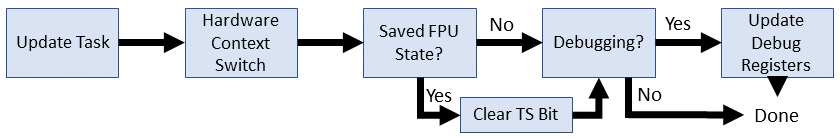

**Linux 2.0.1 (UP)**

    
    #else  
    #define switch_to(prev,next) do {
    __asm__("movl %2,"SYMBOL_NAME_STR(current_set)"\n\t"
    	"ljmp %0\n\t"
    	"cmpl %1,"SYMBOL_NAME_STR(last_task_used_math)"\n\t"
    	"jne 1f\n\t"
    	"clts\n"
    	"1:"
    	: 
    	:"m" (*(((char *)&next->tss.tr)-4)),
    	 "r" (prev), "r" (next));
    	
    	if(prev->debugreg[7]){
    		loaddebug(prev,0);
    		loaddebug(prev,1);
    		loaddebug(prev,2);
    		loaddebug(prev,3);
    		loaddebug(prev,6);
    	}
    } while (0)
    #endif

Cразу очевидны два изменения:

*   У `switch_to()` появился новый аргумент: процесс `*task_struct`, с которого мы переключаемся.  
    
*   Макрос для правильной обработки символов во встроенном ассемблере.

Как обычно, пойдём по строкам и обсудим изменения.

    #define switch_to(prev,next) do {

Аргумент `prev` определяет задачу, с которой мы переключаемся (`*task_struct`). Мы всё ещё оборачиваем макрос в цикл do-while(0), чтобы помочь парсить однострочные if вокруг макроса.

    __asm__("movl %2,"SYMBOL_NAME_STR(current_set)"\n\t"

Обновляет текущую активную задачу на новую выбранную. Это функционально эквивалентно `xchgl %%ecx,_current` за исключением того, что теперь у нас массив из нескольких task_struct и макрос (`SYMBOL_NAME_STR`) для обработки символов встроенного ассемблера. Зачем для этого использовать препроцессор? Дело в том, что некоторые ассемблеры (GAS) требуют добавления символа подчёркивания (_) к имени переменной C. У других ассемблеров нет такого требования. Чтобы жёстко не вбивать конвенцию, можно настроить её во время компиляции в соответствии с вашим набором инструментов.

    "ljmp %0\n\t"
    "cmpl %1,"SYMBOL_NAME_STR(last_task_used_math)"\n\t"
    "jne 1f\n\t"
    "clts\n"
    "1:"
    : 
    :"m" (*(((char *)&next->tss.tr)-4)),

Никаких изменений, о которых мы ещё не говорили.

    "r" (prev), "r" (next));

Сейчас мы несём обе задачи в качестве входных данных для встроенного ассемблера. Одно из незначительных изменений — теперь разрешено любое использование регистра. Раньше `next` был закодирован в ECX.

    
    if(prev->debugreg[7]){
        loaddebug(prev,0);
        loaddebug(prev,1);
        loaddebug(prev,2);
        loaddebug(prev,3);
        loaddebug(prev,6);
        }
    } while (0)

Всё в точности как в ядре 1.3.

## Linux 2.0.1: многопроцессорная версия (SMP)

**Linux 2.0.1 (SMP)**

    
    #ifdef __SMP__   
    #define switch_to(prev,next) do {
        cli();
        if(prev->flags&PF_USEDFPU)
        {
            __asm__ __volatile__("fnsave %0":"=m" (prev->tss.i387.hard));
            __asm__ __volatile__("fwait");
            prev->flags&=~PF_USEDFPU;
        }
        prev->lock_depth=syscall_count;
        kernel_counter+=next->lock_depth-prev->lock_depth;
        syscall_count=next->lock_depth;
    __asm__("pushl %%edx\n\t"
        "movl "SYMBOL_NAME_STR(apic_reg)",%%edx\n\t"
        "movl 0x20(%%edx), %%edx\n\t"
        "shrl $22,%%edx\n\t"
        "and  $0x3C,%%edx\n\t"
        "movl %%ecx,"SYMBOL_NAME_STR(current_set)"(,%%edx)\n\t"
        "popl %%edx\n\t"
        "ljmp %0\n\t"
        "sti\n\t"
        : 
        :"m" (*(((char *)&next->tss.tr)-4)),
         "c" (next));
        
        if(prev->debugreg[7]){
            loaddebug(prev,0);
            loaddebug(prev,1);
            loaddebug(prev,2);
            loaddebug(prev,3);
            loaddebug(prev,6);
        }
    } while (0)

Что, уже становится непонятно? Хотел бы я сказать, что потом станет лучше, но в мире SMP этого не произойдёт. Чтобы сэкономить место, я больше не буду перечислять неизменённые строки.

Три дополнения для переключателя контекста SMP: 1) Изменение способа работы одного сопроцессора с несколькими процессорами; 2) Управление глубиной блокировки, так как блокировка ядра рекурсивна; 3) Ссылка на APIC, чтобы получить CPU ID для текущего *task_struct.

    if(prev->flags&PF_USEDFPU)

Проверяет, что задача, с которой мы переключаемся, использовала сопроцессор. Если так, то нужно захватить контекст в FPU до переключения.

    __asm__ __volatile__("fnsave %0":"=m" (prev->tss.i387.hard));

Сохраняет состояние FPU в TSS. FNSAVE используется для пропуска обработки исключений. `__volatile__` должен защитить эту инструкцию от изменения оптимизатором.

    __asm__ __volatile__("fwait");

Ожидание CPU, пока FPU занят предыдущим сохранением.

    prev->flags&=~PF_USEDFPU;

Отключает флаг использования сопроцессора для этой задачи, там всегда ноль.

    prev->lock_depth=syscall_count;

Хранит количество вложенных использований блокировки ядра для старой задачи.

    kernel_counter+=next->lock_depth-prev->lock_depth;

Обновляет глобальный счётчик блокировки ядра до следующей задачи за вычетом старой задачи. Эффективно удаляет блокировку из теперь неактивной старой задачи, а новая задача может продолжить работу с того места, где остановилась.

    syscall_count=next->lock_depth;

Возвращает состояние блокировки новой задачи. Должно быть там, где она остановилась на последнем отрезке времени.

    __asm__("pushl %%edx\n\t"

Мы собираемся использовать EDX, поэтому сохраним его текущее значение.

    "movl "SYMBOL_NAME_STR(apic_reg)",%%edx\n\t"

Перемещает адрес ввода-вывода APIC в EDX. Нам нужно использовать APIC, чтобы получить CPU ID, так как мы не знаем, какой процессор работает. `apic_reg` транслируется во время инициализации ОС.

    "movl 0x20(%%edx), %%edx\n\t"

Разыменовывает значение регистра идентификатора APIC в EDX. Фактический ID находится в битах 24-27.

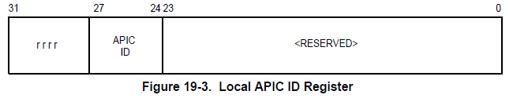

    "shrl $22,%%edx\n\t"

Сдвигает APIC ID в биты 2-5.

    "and $0x3C,%%edx\n\t"

Маскирует только APIC ID в битах 2-5, оставляя номер CPU * 4.

    "movl %%ecx,"SYMBOL_NAME_STR(current_set)"(,%%edx)\n\t"

Обновляет указатель задачи текущего CPU на следующую задачу. В версии UP уже удалили специфическое использование ECX для хранения текущей задачи, но в версии SMP оно ещё используется. EDX содержит номер CPU в битах 2-5, умноженный на 4, в масштабе для смещения размера указателя от \_current\_set.

    "popl %%edx\n\t"

Мы закончили с EDX, поэтому восстановим значение, которое было до этой процедуры.

Остальные строки такие же.

## Linux 2.2 (1999)

Linux 2.2 действительно стоило ждать: здесь пояивлось **программное переключение контекста**! Мы всё ещё используем регистр задач (TR) для ссылки на TSS. Процедуры SMP и UP объединены с унифицированной обработкой состояния FPU. Большая часть переключения контекста теперь выполняется в коде C.

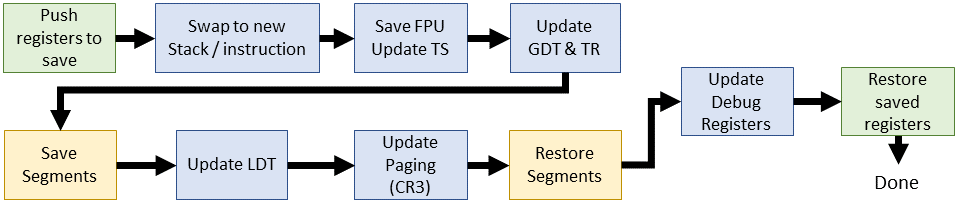

**Linux 2.2.0 (встроенный ассемблер)**

    
    #define switch_to(prev,next) do {
        unsigned long eax, edx, ecx;
        asm volatile("pushl %%ebx\n\t"
                     "pushl %%esi\n\t"
                     "pushl %%edi\n\t"
                     "pushl %%ebp\n\t"
                     "movl %%esp,%0\n\t" 
                     "movl %5,%%esp\n\t" 
                     "movl $1f,%1\n\t"   
                     "pushl %6\n\t"      
                     "jmp __switch_to\n"
                     "1:\t"
                     "popl %%ebp\n\t"
                     "popl %%edi\n\t"
                     "popl %%esi\n\t"
                     "popl %%ebx"
                     :"=m" (prev->tss.esp),"=m" (prev->tss.eip),
                      "=a" (eax), "=d" (edx), "=c" (ecx)
                     :"m" (next->tss.esp),"m" (next->tss.eip),
                      "a" (prev), "d" (next));
    } while (0)

Этот новый `switch_to()` радикально отличается от всех предыдущих версий: он простой! Во встроенном ассемблере меняем местами указатели стека и инструкций (задачи переключения контекста 1 и 2). Всё остальное выполняется после перехода к коду C (`__switch_to()`).

    asm volatile("pushl %%ebx\n\t"
    "pushl %%esi\n\t"
    "pushl %%edi\n\t"
    "pushl %%ebp\n\t"

Хранит EBX, ESI, EDI и EBP в стеке процесса, который мы собираемся поменять местами. (… почему EBX?)

    "movl %%esp,%0\n\t" 
    "movl %5,%%esp\n\t" 

Как понятно из комментариев, мы меняем местами указатели стека между старым и новым процессом. У старого процесса операнд %0 (`prev->tss.esp`), а у нового %5 (`next->tss.esp`).

    "movl $1f,%1\n\t" 

Сохранение значения указателя инструкции для следующей инструкции старой задачи после переключения контекста обратно. Обратите внимание, что значение следующей инструкции использует метку `1`:

    "pushl %6\n\t" 

Подготовка следующей инструкции для новой задачи. Поскольку мы только что перешли на новый стек, этот IP берётся из TSS новой задачи и ставится наверх стека. Выполнение начнётся со следующей инструкции после 'ret' из кода C, который мы собираемся выполнить.

    "jmp __switch_to\n"

Переходим к нашему новому и улучшенному программному переключателю контекста (см. ниже).

    "popl %%ebp\n\t"
    "popl %%edi\n\t"
    "popl %%esi\n\t"
    "popl %%ebx"

Восстанавливаем регистры из стека в обратном порядке, предположительно, после переключения на старую задачу в новом интервале времени.

**Linux 2.2.0 (С)**

    
    void __switch_to(struct task_struct *prev, struct task_struct *next)
    {
        
        unlazy_fpu(prev);
    
        gdt_table[next->tss.tr >> 3].b &= 0xfffffdff;
        asm volatile("ltr %0": :"g" (*(unsigned short *)&next->tss.tr));
    
        asm volatile("movl %%fs,%0":"=m" (*(int *)&prev->tss.fs));
        asm volatile("movl %%gs,%0":"=m" (*(int *)&prev->tss.gs));
    
        
        if (next->mm->segments != prev->mm->segments)
            asm volatile("lldt %0": :"g" (*(unsigned short *)&next->tss.ldt));
    
        
        {
            unsigned long new_cr3 = next->tss.cr3;
            if (new_cr3 != prev->tss.cr3)
                asm volatile("movl %0,%%cr3": :"r" (new_cr3));
        }
    
        
        loadsegment(fs,next->tss.fs);
        loadsegment(gs,next->tss.gs);
    
        if (next->tss.debugreg[7]){
            loaddebug(next,0);
            loaddebug(next,1);
            loaddebug(next,2);
            loaddebug(next,3);
            loaddebug(next,6);
            loaddebug(next,7);
        }
    }

В программном переключателе контекста старый переход к дескриптору TSS заменили на переход к новой функции C: `__switch_to()`. Эта функция написана на C и включает несколько знакомых компонентов, таких как регистры отладки. Переход к коду C позволяет переместить их ещё ближе к переключателю контекста.

    unlazy_fpu(prev);

Проверяем использование FPU и сохраняем его состояние, если он использовался. Теперь это происходит для каждого процесса, который использовал FPU, так что очистка перестала быть ленивой. Процедура такая же, как рутина SMP из 2.0.1, за исключением того, что теперь у нас чистый макрос, который включает в себя ручную настройку TS.

    gdt_table[next->tss.tr >> 3].b &= 0xfffffdff;

Очищает бит BUSY для будущего дескриптора задачи. Использует номер задачи для индексации GDT. `tss.tr` содержит значение селектора сегментов задачи, где для разрешений используются нижние три бита. Нам нужен только индекс, поэтому сдвигаем эти биты. Второй байт TSS изменён для удаления бита 10.

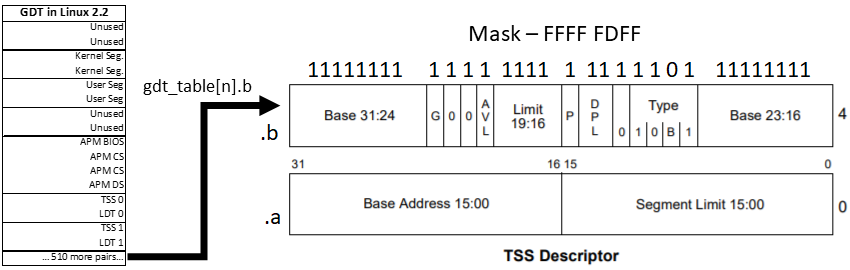

    asm volatile("ltr %0": :"g" (*(unsigned short *)&next->tss.tr));

Загружается регистр задач с указателем на следующий селектор сегментов задач.

    asm volatile("movl %%fs,%0":"=m" (*(int *)&prev->tss.fs));
    asm volatile("movl %%gs,%0":"=m" (*(int *)&prev->tss.gs));

Регистры сегментов FS и GS для предыдущей задачи сохраняются в TSS. В аппаратном переключателе контекста этот шаг выполнялся автоматически, но теперь нам нужно сделать это вручную. Но почему? Как Linux использует FS и GS?

В Linux 2.2 (1999) нет понятного ответа. Сказано только, что они используются, поэтому следует их сохранить, чтобы они оставались доступными. Код режима ядра будет «заимствовать» эти сегменты, чтобы указать на сегменты ядра или пользовательских данных. Звуковые и сетевые драйверы делают то же самое. В последнее время (~2.6 и далее) FS и GS часто поддерживают локальное хранилище потока и области данных на каждый процессор, соответственно.

    if (next->mm->segments != prev->mm->segments)
        asm volatile("lldt %0": :"g" (*(unsigned short *)&next->tss.ldt));

Восстанавливает сегменты локальной таблицы дескрипторов, если они ещё не соответствуют старому процессу. Это делается путём загрузки регистра LDT.

    if (new_cr3 != prev->tss.cr3)
        asm volatile("movl %0,%%cr3": :"r" (new_cr3));

Обновляет состояние виртуальной памяти для новой задачи. Конкретно, устанавливается регистр CR3, который содержит каталог страниц для доступа к памяти в новом контексте.

    loadsegment(fs,next->tss.fs);
    loadsegment(gs,next->tss.gs);

FS и GS восстанавливаются для новой задачи. Здесь обеспечивается правильное выравнивание, а в случае проблемы загружается нулевой сегмент.

    loaddebug(prev,7);

Наконец, регистр управления отладкой теперь хранится и переключается с помощью TSS. Раньше этот регистр только проверялся, а не использовался для хранения.

## Linux 2.4 (2001)

В версии 2.4 появилось много новых функций, таких как потоки ядра и очереди задач. Несмотря на это и несколько изменений в планировщике, переключатель контекста практически не изменился по сравнению с версией 2.2, хотя в нём прекратилось обновление TR в пользу замены всех данных регистра. Я неофициально называю его «последним легаси-ядром», так как во всех следующих релизах используется 64-разрядная архитектура x86.

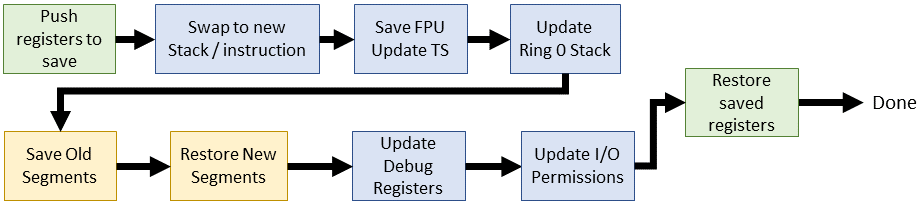

**Linux 2.4.0 (встроенный ассемблер)**

    
    
    #define switch_to(prev,next,last) do {
        asm volatile("pushl %%esi\n\t"
            "pushl %%edi\n\t"
            "pushl %%ebp\n\t"
            "movl %%esp,%0\n\t"	
            "movl %3,%%esp\n\t"	
            "movl $1f,%1\n\t"		
            "pushl %4\n\t"		
            "jmp __switch_to\n"
            "1:\t"
            "popl %%ebp\n\t"
            "popl %%edi\n\t"
            "popl %%esi\n\t"
            :"=m" (prev->thread.esp),"=m" (prev->thread.eip),
             "=b" (last)
            :"m" (next->thread.esp),"m" (next->thread.eip),
             "a" (prev), "d" (next),
             "b" (prev));
    } while (0)

Переключатель контекста в ядре 2.4 вносит лишь несколько незначительных изменений: EBX больше не пушится, а включён в выдачу встроенного ассемблера. Появился новый входной аргумент `last`, который содержит то же значение, что и `prev`. Он передаётся через EBX, но не используется.

    :"=m" (prev->thread.esp),"=m" (prev->thread.eip),
    :"m" (next->thread.esp),"m" (next->thread.eip),

Операнды ввода-вывода теперь ссылаются на указатели стека/инструкций для потоков ядра. Раньше переключатели контекста ссылались на указатели стека из TSS.

**Linux 2.4.0 (С)**

    
    void __switch_to(struct task_struct *prev_p, struct task_struct *next_p)
    {
    	struct thread_struct *prev = &prev_p->thread,
    				 *next = &next_p->thread;
    				 
    	struct tss_struct *tss = init_tss + smp_processor_id();
    
    	unlazy_fpu(prev_p);
    
    	tss->esp0 = next->esp0;
    
    	asm volatile("movl %%fs,%0":"=m" (*(int *)&prev->fs));
    	asm volatile("movl %%gs,%0":"=m" (*(int *)&prev->gs));
    
    	
    	loadsegment(fs, next->fs);
    	loadsegment(gs, next->gs);
    
    	
    	if (next->debugreg[7]){
    		loaddebug(next, 0);
    		loaddebug(next, 1);
    		loaddebug(next, 2);
    		loaddebug(next, 3);
    		
    		loaddebug(next, 6);
    		loaddebug(next, 7);
    	}
    
    	if (prev->ioperm || next->ioperm) {
    		if (next->ioperm) {
    			memcpy(tss->io_bitmap, next->io_bitmap,
    				 IO_BITMAP_SIZE*sizeof(unsigned long));
    			tss->bitmap = IO_BITMAP_OFFSET;
    		} else
    			tss->bitmap = INVALID_IO_BITMAP_OFFSET;
    	}
    }

В части кода C изменилось несколько вещей. Исчезло любое упоминание о регистре TR, вместо этого мы непосредственно меняем активный TSS для текущего процессора. Как и во встроенном ассемблере, каждая задача ссылается на данные TSS в thread\_struct внутри task\_struct. Каждый активный CPU использует выделенный TSS из GDT и напрямую обновляет эти поля.

    void __switch_to(struct task_struct *prev_p, struct task_struct *next_p)

К указателям предыдущей и следующей задач добавлен суффикс `_p`. Это маленький, но важный нюанс, потому что `prev` и `next` собираются перепрофилировать для потоков ядра.

    struct thread_struct *prev = &prev_p->thread,
             *next = &next_p->thread;

Определяются указатели на данные TSS для каждой задачи.

    tss->esp0 = next->esp0;

Замена смещения стека ring 0 смещением из новой задачи. Пока не форсирует перезагрузку таблицы страниц…

    asm volatile("movl %%fs,%0":"=m" (*(int *)&prev->fs));
    asm volatile("movl %%gs,%0":"=m" (*(int *)&prev->gs));

Сохранение FS и GS для старой задачи. Назначение этих сегментов по-прежнему непонятно, но они как-то используются. В конечном итоге в версии 2.6 их начинают использовать для локального хранилища FS:thread и области данных GS:per-processor.

    if (prev->ioperm || next->ioperm) {
        if (next->ioperm) {
          memcpy(tss->io_bitmap, next->io_bitmap,
            IO_BITMAP_SIZE*sizeof(unsigned long));
          tss->bitmap = IO_BITMAP_OFFSET;

Задаёт разрешения ввода-вывода с сопоставлением портов в активной службе TSS для предстоящей задачи.

    } else
    tss->bitmap = INVALID_IO_BITMAP_OFFSET;

Указывает разрешения ввода-вывода для активного TSS на известную невалидную битовую карту (0x8000).

По мере ухода ядра 2.5 планировщик с линейным временем исполнения достиг предела практического использования, а AMD выпустила расширение для x86, которое потребовало немедленного внимания разработчиков ядра: x86-64.

## Linux 2.6.0

В ядре 2.6.0 появился планировщик с постоянным временем исполнения. Хотя это шаг вперёд по сравнению с предыдущим линейным планировщиком, но в 2.6.23 его в конечном счёте заменили на Completely-Fair Scheduler (CFS). С другой стороны, новая 64-разрядная архитектура внесла наиболее существенные изменения на сегодняшний день.

## Linux 2.6.0: версия i386

Это последнее появление 32-битного переключателя контекста в статье.

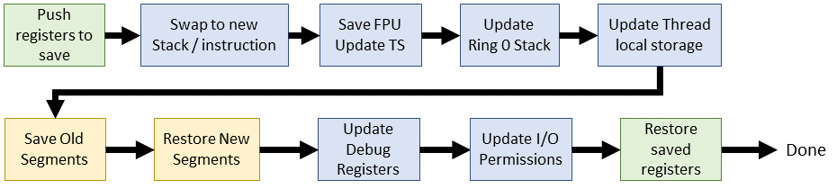

**Linux 2.6.0 (встроенный ассемблер i386)**

    
    #define switch_to(prev,next,last) do {
        unsigned long esi,edi;
        asm volatile("pushfl\n\t"
                "pushl %%ebp\n\t"
                "movl %%esp,%0\n\t"	 
                "movl %5,%%esp\n\t" 
                "movl $1f,%1\n\t"   
                "pushl %6\n\t"	     
                "jmp __switch_to\n"
                "1:\t"
                "popl %%ebp\n\t"
                "popfl"
                :"=m" (prev->thread.esp),"=m" (prev->thread.eip),
                 "=a" (last),"=S" (esi),"=D" (edi)
                :"m" (next->thread.esp),"m" (next->thread.eip),
                 "2" (prev), "d" (next));
    } while (0)

Удалены четыре строки. ESI и EDI раньше помещались в стек, но теперь переносятся через операнды ввода-вывода.

**Linux 2.6.0 (i386 C)**

    
    struct task_struct * __switch_to(struct task_struct *prev_p, struct task_struct *next_p)
    {
        struct thread_struct *prev = &prev_p->thread,
                     *next = &next_p->thread;
        int cpu = smp_processor_id();
        struct tss_struct *tss = init_tss + cpu;
    
        __unlazy_fpu(prev_p);
    
        load_esp0(tss, next->esp0);
    
        
        load_TLS(next, cpu);
    
        asm volatile("movl %%fs,%0":"=m" (*(int *)&prev->fs));
        asm volatile("movl %%gs,%0":"=m" (*(int *)&prev->gs));
    
        
        if (unlikely(prev->fs | prev->gs | next->fs | next->gs)) {
            loadsegment(fs, next->fs);
            loadsegment(gs, next->gs);
        }
    
        
        if (unlikely(next->debugreg[7])) {
            loaddebug(next, 0);
            loaddebug(next, 1);
            loaddebug(next, 2);
            loaddebug(next, 3);
            
            loaddebug(next, 6);
            loaddebug(next, 7);
        }
    
        if (unlikely(prev->io_bitmap_ptr || next->io_bitmap_ptr)) {
            if (next->io_bitmap_ptr) {
                memcpy(tss->io_bitmap, next->io_bitmap_ptr,
                    IO_BITMAP_BYTES);
                tss->io_bitmap_base = IO_BITMAP_OFFSET;
            } else
                tss->io_bitmap_base = INVALID_IO_BITMAP_OFFSET;
        }
        return prev_p;
    }

Некоторые интересные изменения: возвращаемое функцией значение и появление макроса `unlikely()`. Я не буду рассматривать изменения в существующем коде, обёрнутом в \[un\], чтобы не объяснять его повторно. Макрос просто сообщает генератору кода, какой базовый блок должен появиться первым, чтобы помочь конвейеризации.

    struct task_struct *__switch_to(...)

\_\_switch\_to теперь возвращает указатель на старую задачу. Это нигде не обрабатывается, поэтому либо изменение удалили, либо они хотели следовать конвенции. Например, классической конвенции о том, что когда функция изменяет состояние, мы возвращаем предыдущее состояние для сохранения и восстановления позже. Пока это никак не работает.

    load_TLS(next, cpu);

Обновляет дескрипторы локального хранилища потоков в GDT для новой задачи. Linux 2.6 вводит три записи TLS в GDT для специфичных потоковых сегментов. Так, glibc использует первый сегмент, Wine — второй. Теперь мы последовательно используем регистр сегментов FS для ссылки на локальное хранилище потоков по мере необходимости.

    if (unlikely(prev->fs | prev->gs | next->fs | next->gs)) {

Теперь восстанавливаем только FS и GS, если они использовались предыдущей или следующей задачей.

## Linux 2.6.0: версия x86_64

Переключатель контекста x86_64 значительно отличается от 32-разрядного. На этот раз внимательно изучим код, потому что в дальнейшем сосредоточимся только на 64-битной версии.

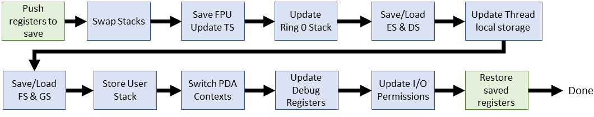

**Linux 2.6.0 (встроенный ассемблер x86_64)**

    
    
    #define SAVE_CONTEXT    "pushfq ; pushq %%rbp ; movq %%rsi,%%rbp\n\t"
    #define RESTORE_CONTEXT "movq %%rbp,%%rsi ; popq %%rbp ; popfq\n\t" 
    #define __EXTRA_CLOBBER
        ,"rcx","rbx","rdx","r8","r9","r10","r11","r12","r13","r14","r15"
    
    #define switch_to(prev,next,last)
        asm volatile(SAVE_CONTEXT
              "movq %%rsp,%P[threadrsp](https://habr.com/ru/post/438042/%[prev])\n\t" 
              "movq %P[threadrsp](https://habr.com/ru/post/438042/%[next]),%%rsp\n\t" 
              "call __switch_to\n\t"
              ".globl thread_return\n"
              "thread_return:\n\t"
              "movq %%gs:%P[pda_pcurrent],%%rsi\n\t"
              "movq %P[thread_info](https://habr.com/ru/post/438042/%%rsi),%%r8\n\t"
              "btr  %[tif_fork],%P[ti_flags](https://habr.com/ru/post/438042/%%r8)\n\t"
              "movq %%rax,%%rdi\n\t"
              "jc   ret_from_fork\n\t"
              RESTORE_CONTEXT
              : "=a" (last)
              : [next] "S" (next), [prev] "D" (prev),
                [threadrsp] "i" (offsetof(struct task_struct, thread.rsp)),
                [ti_flags] "i" (offsetof(struct thread_info, flags)),
                [tif_fork] "i" (TIF_FORK),
                [thread_info] "i" (offsetof(struct task_struct, thread_info)),
                [pda_pcurrent] "i" (offsetof(struct x8664_pda, pcurrent))
              : "memory", "cc" __EXTRA_CLOBBER)

В x86_64 обновлён макрос `_switch_to()`, поэтому придётся заново пройтись по его строкам. Многие изменения — это просто имена регистров (`r..` вместо `e..`). Есть ещё несколько хелперов, которые я указал выше.

    asm volatile(SAVE_CONTEXT

Сохраняет контекст ядра в стеке через вспомогательный макрос, показанный выше. Очень похож на 32-битную версию, за исключением новых имён регистров. Макрос работает в паре с RESTORE_CONTEXT в конце встроенного ассемблерного блока.

    "movq %%rsp,%P[threadrsp](https://habr.com/ru/post/438042/%[prev])\n\t" 

Сохраняет текущий указатель стека в TSS старой задачи. Обратите внимание на новую нотацию, определённую в разделе входного операнда: `[threadrsp]` является непосредственным смещением thread.rsp внутри task_struct. `%P` разыменовывает указатель prev:threadsp для обеспечения правильного хранения обновлённого SP.

    "movq %P[threadrsp](https://habr.com/ru/post/438042/%[next]),%%rsp\n\t" 

Восстанавливает указатель стека новой задачи.

    "call __switch_to\n\t"

Вызывает часть C переключателя контекста. Она описана в следующем разделе.

    ".globl thread_return\n"

Определяет глобальную метку `thread_return`.

    "thread_return:\n\t"

Точка перехода для `thread_return`. Чисто механически, по ней указатель инструкции должен переходить к следующей инструкции. На самом деле не используется ни в ядре, ни в библиотеке (например, glibc). Моё предположение, что её может использовать pthreads… но не похоже, что это так.

    "movq %%gs:%P[pda_pcurrent],%%rsi\n\t"

Задаёт индекс для текущей задачи с помощью ссылки на область данных Per-process Data Area (PDA). В режиме ядра GS всегда должен указывать на данные для каждого процессора.

    "movq %P[thread_info](https://habr.com/ru/post/438042/%%rsi),%%r8\n\t"

Перемещает структуру `thread_info` в r8. Это новинка в Linux 2.6, а по сути облегчённая версия `task_struct`, которая легко помещается в стек.

    "btr %[tif_fork],%P[ti_flags](https://habr.com/ru/post/438042/%%r8)\n\t"

Сохраняет в CF битовое значение TIF_FORK из `thread_info->flags` и обнуляет бит в структуре. Через несколько строчек этот бит будет установлен после форка/клонирования и задействован для запуска ret\_from\_fork.

    "movq %%rax,%%rdi\n\t"

Сохраняет `task_struct` предыдущего потока в RDI. Последняя инструкция, которая работает с EAX — это вызов функции C `__switch_to`, которая возвращает `prev` в EAX.

    "jc ret_from_fork\n\t"

Если этот поток является свежим форком/клоном, переходим к ret\_from\_fork, чтобы запуститься заново.

    : "=a" (last)

Предыдущий поток возвращается в EAX.

    : [next] "S" (next), [prev] "D" (prev),
      [threadrsp] "i" (offsetof(struct task_struct, thread.rsp)),
      [ti_flags] "i" (offsetof(struct thread_info, flags)),
      [tif_fork] "i" (TIF_FORK),
      [thread_info] "i" (offsetof(struct task_struct, thread_info)),
      [pda_pcurrent] "i" (offsetof(struct x8664_pda, pcurrent))

Входные ссылки для встроенного ассемблера. Большинство из них являются непосредственными операндами со смещениями. Выше мы уже пробежались по ним.

    : "memory", "cc" __EXTRA_CLOBBER)

**Linux 2.6.0 (x86_64 C)**

    
    
    struct task_struct *__switch_to(struct task_struct *prev_p, struct task_struct *next_p)
    {
        struct thread_struct *prev = &prev_p->thread,
                     *next = &next_p->thread;
        int cpu = smp_processor_id();  
        struct tss_struct *tss = init_tss + cpu;
    
        unlazy_fpu(prev_p);
    
        tss->rsp0 = next->rsp0;
    
        asm volatile("movl %%es,%0" : "=m" (prev->es)); 
        if (unlikely(next->es | prev->es))
            loadsegment(es, next->es); 
    	
        asm volatile ("movl %%ds,%0" : "=m" (prev->ds)); 
        if (unlikely(next->ds | prev->ds))
            loadsegment(ds, next->ds);
    
        load_TLS(next, cpu);
    
        
        { 
            unsigned fsindex;
            asm volatile("movl %%fs,%0" : "=g" (fsindex)); 
    
            if (unlikely(fsindex | next->fsindex | prev->fs)) {
                loadsegment(fs, next->fsindex);
                if (fsindex)
                    prev->fs = 0;				
            }
            
            if (next->fs) 
                wrmsrl(MSR_FS_BASE, next->fs); 
            prev->fsindex = fsindex;
        }
        { 
            unsigned gsindex;
            asm volatile("movl %%gs,%0" : "=g" (gsindex)); 
            if (unlikely(gsindex | next->gsindex | prev->gs)) {
                load_gs_index(next->gsindex);
                if (gsindex)
                    prev->gs = 0;				
            }
            if (next->gs)
                wrmsrl(MSR_KERNEL_GS_BASE, next->gs); 
            prev->gsindex = gsindex;
        }
    
        
        prev->userrsp = read_pda(oldrsp); 
        write_pda(oldrsp, next->userrsp); 
        write_pda(pcurrent, next_p); 
        write_pda(kernelstack, (unsigned long)next_p->thread_info + THREAD_SIZE - PDA_STACKOFFSET);
    
        
        if (unlikely(next->debugreg7)) {
            loaddebug(next, 0);
            loaddebug(next, 1);
            loaddebug(next, 2);
            loaddebug(next, 3);
            
            loaddebug(next, 6);
            loaddebug(next, 7);
        }
    
         
        if (unlikely(prev->io_bitmap_ptr || next->io_bitmap_ptr)) {
            if (next->io_bitmap_ptr) {
                memcpy(tss->io_bitmap, next->io_bitmap_ptr, IO_BITMAP_BYTES);
                tss->io_bitmap_base = IO_BITMAP_OFFSET;
            } else {
                tss->io_bitmap_base = INVALID_IO_BITMAP_OFFSET;
            }
        }
    
        return prev_p;
    }

В версии x86_64 в код переключателя контекста на C добавлено несколько изменений. Я не буду повторять простые изменения регистра (например, переименование EAX в RAX).

    asm volatile("movl %%es,%0" : "=m" (prev->es)); 
    if (unlikely(next->es | prev->es))
        loadsegment(es, next->es);

Сохраняет сегмент ES для старой задачи, а затем загружает новый, если это необходимо.

    asm volatile ("movl %%ds,%0" : "=m" (prev->ds)); 
    if (unlikely(next->ds | prev->ds))
        loadsegment(ds, next->ds);

Сохраняет сегмент данных для старой задачи, а затем загружает новый, если это необходимо.

    unsigned fsindex;
    asm volatile("movl %%fs,%0" : "=g" (fsindex)); 
    if (unlikely(fsindex | next->fsindex | prev->fs)) {
        loadsegment(fs, next->fsindex);
        if (fsindex)
            prev->fs = 0;
    }

Перемещает сегмент FS в `fsindex`, а затем загружает FS для новой задачи, если это необходимо. В принципе, если старая или новая задача имеет допустимое значение для FS, что-то загружается на её место (может быть NULL). FS обычно используется для локального хранилища потока, но существуют другие применения в зависимости от того, когда происходит переключение контекста. Точно такой же код используется для GS, поэтому нет необходимости повторять. GS обычно является сегментом для `thread_info`.

    if (next->fs)
        wrmsrl(MSR_FS_BASE, next->fs); 

Если в следующей задаче используется регистр FS, то нужно проверить, что записано всё 64-разрядное значение. Напомним, что сегментные регистры — артефакт 16/32-битной эры, так что специальная функция проверяет, что верхние 32 бита записаны.

    prev->fsindex = fsindex;

Сохраняем FS для старой задачи.

    prev->userrsp = read_pda(oldrsp); 
    write_pda(oldrsp, next->userrsp); 
    write_pda(pcurrent, next_p); 
    write_pda(kernelstack, (unsigned long)next_p->thread_info + 
                    THREAD_SIZE - PDA_STACKOFFSET);

Обновление PDA для предстоящей задачи, включая хранение старого RSP (syscall) старой задачи. PDA обновляется с потоком и информацией стека.

Пусть вас не обманывает номер. На самом деле версия 3.0 вышла **почти через 8 лет** после 2.6.0. Огромное количество изменений достойно целой книги, и я не могу рассказать про всё. Что касается переключения контекста, i386 и x86\_64 объединились в x86 с отдельными файлами процессов (process\_32.c и process_64.с.) Эта статья и так слишком большая, поэтому дальше **будем разбирать только версию x86_64**. Некоторые детали лишь обозначим и подробнее рассмотрим в последней LTS.

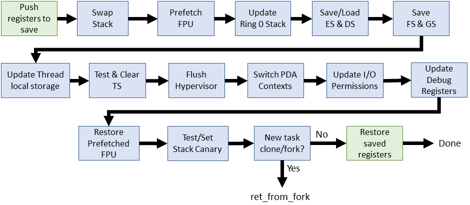

**Linux 3.0.1 (встроенный ассемблер x86_64)**

    
    
    #define SAVE_CONTEXT    "pushf ; pushq %%rbp ; movq %%rsi,%%rbp\n\t"
    #define RESTORE_CONTEXT "movq %%rbp,%%rsi ; popq %%rbp ; popf\t"
    #define __EXTRA_CLOBBER  \
        ,"rcx","rbx","rdx","r8","r9","r10","r11","r12","r13","r14","r15"
    	  
    #define switch_to(prev, next, last)
        asm volatile(SAVE_CONTEXT
             "movq %%rsp,%P[threadrsp](https://habr.com/ru/post/438042/%[prev])\n\t" 
             "movq %P[threadrsp](https://habr.com/ru/post/438042/%[next]),%%rsp\n\t" 
             "call __switch_to\n\t"
             "movq "__percpu_arg([current_task])",%%rsi\n\t"
             __switch_canary
             "movq %P[thread_info](https://habr.com/ru/post/438042/%%rsi),%%r8\n\t"
             "movq %%rax,%%rdi\n\t"
             "testl  %[_tif_fork],%P[ti_flags](https://habr.com/ru/post/438042/%%r8)\n\t"
             "jnz   ret_from_fork\n\t"
             RESTORE_CONTEXT
             : "=a" (last)
               __switch_canary_oparam
             : [next] "S" (next), [prev] "D" (prev),
               [threadrsp] "i" (offsetof(struct task_struct, thread.sp)),
               [ti_flags] "i" (offsetof(struct thread_info, flags)),
               [_tif_fork] "i" (_TIF_FORK),
               [thread_info] "i" (offsetof(struct task_struct, stack)),
               [current_task] "m" (current_task)
               __switch_canary_iparam
             : "memory", "cc" __EXTRA_CLOBBER)

Восемь лет — а в макросе `switch_to()` лишь четыре изменения. Два из них связаны друг с другом, и ничего кардинально нового.

    movq "__percpu_arg([current_task])",%%rsi\n\t

Перемещает новую страутуру `task_struct` в RSI. Таков «новый» способ доступа к информации о задаче: у каждого CPU статический символ. Ранее информация была доступна через GS:\[pda offset\]. Последующие операции по RSI такие же, как в версии 2.6.

    __switch_canary

Этот макрос позволяет дополнительно проверить, включен ли макрос CONFIG\_CC\_STACKPROTECTOR при сборке ядра. Я не собираюсь копать эту тему слишком глубоко, за исключением того, что данный механизм защищает от [хакерского разрушения стека](http://www-inst.eecs.berkeley.edu/~cs161/fa08/papers/stack_smashing.pdf). По сути сохраняем случайное значение, а позже его проверяем. Если значение изменилось — значит, беда.

    testl %[_tif_fork],%P[ti_flags](https://habr.com/ru/post/438042/%%r8)\n\t
    jnz ret_from_fork\n\t

Проверяет, была ли новая задача просто создана с помощью клонирования/форка, а затем переходит к `ret_from_fork()`. Раньше это была инструкция `btr`, но теперь мы откладываем сброс бита до завершения вызова. Имя изменилось на JNZ из-за изменения теста: если бит установлен, TEST (AND) будет положительным.

    __switch_canary_oparam

Вывод stack canary для `CONFIG_CC_STACKPROTECTOR`.

    __switch_canary_iparam

Ввод stack canary для `CONFIG_CC_STACKPROTECTOR`

**Linux 3.0.1 (x86_64 C)**

    
    
    __notrace_funcgraph struct task_struct *
    __switch_to(struct task_struct *prev_p, struct task_struct *next_p)
    {
        struct thread_struct *prev = &prev_p->thread;
        struct thread_struct *next = &next_p->thread;
        int cpu = smp_processor_id();
        struct tss_struct *tss = &per_cpu(init_tss, cpu);
        unsigned fsindex, gsindex;
        bool preload_fpu;
    
        preload_fpu = tsk_used_math(next_p) && next_p->fpu_counter > 5;
    
        
        if (preload_fpu)
            prefetch(next->fpu.state);
    
        
        load_sp0(tss, next);
    
        savesegment(es, prev->es);
        if (unlikely(next->es | prev->es))
            loadsegment(es, next->es);
    
        savesegment(ds, prev->ds);
        if (unlikely(next->ds | prev->ds))
            loadsegment(ds, next->ds);
    
        savesegment(fs, fsindex);
        savesegment(gs, gsindex);
    
        load_TLS(next, cpu);
    
        __unlazy_fpu(prev_p);
    
        
        if (preload_fpu)
            clts();
    
        arch_end_context_switch(next_p);
    
        
        if (unlikely(fsindex | next->fsindex | prev->fs)) {
            loadsegment(fs, next->fsindex);
            if (fsindex)
                prev->fs = 0;
        }
        
        if (next->fs)
            wrmsrl(MSR_FS_BASE, next->fs);
        prev->fsindex = fsindex;
    
        if (unlikely(gsindex | next->gsindex | prev->gs)) {
            load_gs_index(next->gsindex);
            if (gsindex)
                prev->gs = 0;
        }
        if (next->gs)
            wrmsrl(MSR_KERNEL_GS_BASE, next->gs);
        prev->gsindex = gsindex;
    
        
        prev->usersp = percpu_read(old_rsp);
        percpu_write(old_rsp, next->usersp);
        percpu_write(current_task, next_p);
    
        percpu_write(kernel_stack,
            (unsigned long)task_stack_page(next_p) +
            THREAD_SIZE - KERNEL_STACK_OFFSET);
    
        
        if (unlikely(task_thread_info(next_p)->flags & _TIF_WORK_CTXSW_NEXT ||
                task_thread_info(prev_p)->flags & _TIF_WORK_CTXSW_PREV))
            __switch_to_xtra(prev_p, next_p, tss);
    
        
        if (preload_fpu)
            __math_state_restore();
    
        return prev_p;
    }

В коде C ещё несколько изменений, но их относительно мало, учитывая восемь лет между релизами. Некоторые из них косметические, например, перемещение наверх всех деклараций. Вот что изменилось:

    __notrace_funcgraph struct task_struct * __switch_to(...)

Новая сигнатура `__notrace_funcgraph` запрещает активному ftrace отслеживать `switch_to`.

    preload_fpu = tsk_used_math(next_p) && next_p->fpu_counter > 5;
    if (preload_fpu)
            prefetch(next->fpu.state);

Проверяет, использовался ли FPU в последней задаче за последние 5 временных срезов, а затем пытается захватить данные в кэш для последующего использования.

    load_sp0(tss, next);

Загружает указатель стека пространства ядра, обновляет таблицы страниц и уведомляет гипервизор (если применимо).

    savesegment(es, prev->es);

Сохраняет сегмент ES. Это не совсем нововведение, просто замена для встроенного ассемблера из 2.6: `asm volatile("movl %%es,%0" : "=m" (prev->es));`.

    if (preload_fpu)
            clts();

Немедленно перезагружает FPU, если вероятность использования высока. Применение `clts()` — та же идея, которую мы видели с первой версии Linux: `"cmpl %%ecx,%2\n\t jne 1f\n\t clts\n"`.

    jne 1f\n\t     clts\n"
    
    arch_end_context_switch(next_p);

Имеет значение только при [виртуализации](https://elixir.bootlin.com/linux/v3.0.1/source/arch/x86/include/asm/paravirt.h#L718). При нормальных обстоятельствах функция [ничего не делает](https://elixir.bootlin.com/linux/v3.0.1/source/arch/x86/include/asm/pgtable.h#L82). Подробнее см. в финальной версии ядра.

    if (unlikely(task_thread_info(next_p)->flags & _TIF_WORK_CTXSW_NEXT ||
            task_thread_info(prev_p)->flags & _TIF_WORK_CTXSW_PREV))
        __switch_to_xtra(prev_p, next_p, tss);

Занимается административной работой, которая раньше описывалась в конце `switch_to`, включая регистры отладки и параметры битовой карты ввода-вывода. Подробнее об этом расскажем в обзоре кода 4.14.67.

    if (preload_fpu)
            __math_state_restore();

Восстанавливает FPU после проверки его использования. При удачном стечении обстоятельств данные уже должны быть в кэше благодаря предварительной выборке, произведённой ранее.

Это наше самое глубокое погружение во внутреннюю работу переключателя контекста. Процедуру значительно пересмотрели с момента выхода 3.0 и организовали код. В ц��лом, он теперь выглядит более чистым и организованным, чем когда-либо. Для x86_64:

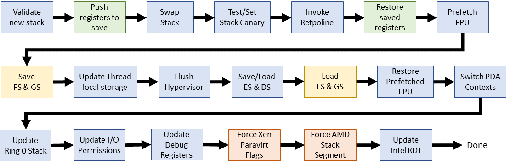

*   После версии 3.4 макрос верхнего уровня `switch_to()` обзавёлся собственным заголовочным файлом [arch/x86/include/asm/switch_to.h](https://elixir.bootlin.com/linux/v4.14.67/source/arch/x86/include/asm/switch_to.h#L71). Макрос вызывается ровно один раз, в конце `context_switch()` из [kernel/sched/core.с](https://elixir.bootlin.com/linux/v4.14.67/source/kernel/sched/core.c#L2807).  
    
*   Начиная с версии 4.9 `switch_to()` разбит на две части: макрос `prepare_switch_to()` и часть встроенного ассемблера перемещены в реальный файл ассемблера ([arch/x86/entry/entry_64.S](https://elixir.bootlin.com/linux/v4.14.67/source/arch/x86/entry/entry_64.S#L333)).  
    
*   Написанная на C часть переключателя контекста всё ещё вызывается через переход в середине ассемблерного кода. С версии 2.6.24 исходник находится в [arch/x86/kernel/process_64.c](https://elixir.bootlin.com/linux/v4.14.67/source/arch/x86/kernel/process_64.c#L395).

**Linux 4.14.67**

    
    
    #define switch_to(prev, next, last)
    do {
        prepare_switch_to(prev, next);
    
        ((last) = __switch_to_asm((prev), (next)));	
    } while (0)

Выглядит просто по сравнению со старыми ядрами. Эта реорганизация стала результатом решения проблемы, когда Энди Лутомирски внедрял [виртуально сопоставленные стеки ядра](https://lwn.net/Articles/692208/).

    prepare_switch_to(prev, next);

Гарантирует, что стеки ядра доступны перед попыткой переключения контекста. Это позволяет избежать возможной двойной ошибки или паники ядра во время попытки переключения контекста при использовании виртуально сопоставленных стеков ядра.

    ((last) = __switch_to_asm((prev), (next)));

Запускает фактическое переключение контекста.

Взглянем на `prepare_switch_to`, определённый в том же исходном файле.

**Linux 4.14.67**

    
    
    static inline void prepare_switch_to(struct task_struct *prev,
    				     struct task_struct *next)
    {
    #ifdef CONFIG_VMAP_STACK
    	READ_ONCE(*(unsigned char *)next->thread.sp);
    #endif
    }

    #ifdef CONFIG_VMAP_STACK

Определяется, когда стек использует виртуальную память. Нам нужно подготовиться к переключению контекста только если мы используем виртуальные стеки. Это параметр конфигурации во время сборки ядра. Во многих современных дистрибутивах по умолчанию его значение `yes`.

    READ_ONCE(*(unsigned char *)next->thread.sp);

Обращение к следующему стеку, чтобы исправить таблицы страниц (pgd). Основная проблема заключается в том, что мы пытаемся получить доступ к указателю, который не только за пределами страниц (paged-out), но даже не в контексте памяти этой задачи из-за отложенной загрузки области vmalloc. Отсутствие и недоступность указателя [означает панику ядра](https://lkml.org/lkml/2016/8/11/169), если заранее не решить проблему.

**Linux 4.16.67**

    
    
    ENTRY(__switch_to_asm)
        UNWIND_HINT_FUNC
    	
        
        pushq	%rbp
        pushq	%rbx
        pushq	%r12
        pushq	%r13
        pushq	%r14
        pushq	%r15
    
        
        movq	%rsp, TASK_threadsp(%rdi)
        movq	TASK_threadsp(%rsi), %rsp
    
    #ifdef CONFIG_CC_STACKPROTECTOR
        movq	TASK_stack_canary(%rsi), %rbx
        movq	%rbx, PER_CPU_VAR(irq_stack_union)+stack_canary_offset
    #endif
    
    #ifdef CONFIG_RETPOLINE
        FILL_RETURN_BUFFER %r12, RSB_CLEAR_LOOPS, X86_FEATURE_RSB_CTXSW
    #endif
    
        
        popq	%r15
        popq	%r14
        popq	%r13
        popq	%r12
        popq	%rbx
        popq	%rbp
    
        jmp	__switch_to
    END(__switch_to_asm)

В [entry_64.S](https://elixir.bootlin.com/linux/v4.14.67/source/arch/x86/entry/entry_64.S#L333) содержится работа, которую предыдущие 25 лет в Linux выполнял встроенный ассемблер.

    UNWIND_HINT_FUNC

Генерирует подсказки, используемые инструментом трассировки стека objtool, который только что вышел. Это необходимо для специальных процедур сборки, которые не соответствуют обычным соглашениям о вызовах языка C. Такие хинты — причина успешного внедрения [«разматывателя кода» ORC](https://lwn.net/Articles/728339/) в версии 4.6.

    pushq	%rbp, %rbx, %r12, %r13, %r14, %r15

Сохраняем регистры в **старый стек**, из которого мы переключаемся.

    movq	%rsp, TASK_threadsp(%rdi)
    movq	TASK_threadsp(%rsi), %rsp

Меням местами указатели стека между старой и новой задачей. Непосредственно из окружающего ассемблера это не ясно, но RDI и RSI содержат входные аргументы `task_struct *`, **prev** и **next** в соответсвии с конвенциями System V ABI. Вот подмножество регистров вместе с их использованием:

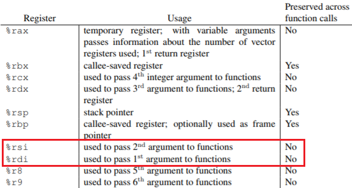

    #ifdef CONFIG_CC_STACKPROTECTOR
        movq	TASK_stack_canary(%rsi), %rbx
        movq	%rbx, PER_CPU_VAR(irq_stack_union)+stack_canary_offset

Если включена защита стека, то значение canary этой задачи перемещается в соответствующее место стека прерываний текущего CPU. Защита стека обычно включена по умолчанию, так что обычно так и происходит.

    #ifdef CONFIG_RETPOLINE
        FILL_RETURN_BUFFER %r12, RSB_CLEAR_LOOPS, X86_FEATURE_RSB_CTXSW

Это [защита](https://lkml.org/lkml/2018/1/4/724) от возможной эксплуатации предсказания ветвлений (уязвимость Spectre). Чистое [вуду](https://elixir.bootlin.com/linux/v4.14.67/source/arch/x86/include/asm/nospec-branch.h#L36)!

    popq	%r15, %r14, %r13, %r12, %rbx, %rbp

Восстанавливает все регистры из **нового стека** в обратном порядке: (r15, r14, r13, r12, rbx, rbp)

**Linux 4.16.67 ([исходник](https://elixir.bootlin.com/linux/v4.14.67/source/arch/x86/kernel/process_64.c#L395) с комментариями)**

    
    
    __visible __notrace_funcgraph struct task_struct *
    __switch_to(struct task_struct *prev_p, struct task_struct *next_p)
    {
        struct thread_struct *prev = &prev_p->thread;
        struct thread_struct *next = &next_p->thread;
        struct fpu *prev_fpu = &prev->fpu;
        struct fpu *next_fpu = &next->fpu;
        int cpu = smp_processor_id();
        struct tss_struct *tss = &per_cpu(cpu_tss_rw, cpu);
    
        WARN_ON_ONCE(IS_ENABLED(CONFIG_DEBUG_ENTRY) &&
                this_cpu_read(irq_count) != -1);
    
        switch_fpu_prepare(prev_fpu, cpu);
    
        save_fsgs(prev_p);
    
        load_TLS(next, cpu);
    
        arch_end_context_switch(next_p);
    
        savesegment(es, prev->es);
        if (unlikely(next->es | prev->es))
            loadsegment(es, next->es);
    
        savesegment(ds, prev->ds);
        if (unlikely(next->ds | prev->ds))
            loadsegment(ds, next->ds);
    
        load_seg_legacy(prev->fsindex, prev->fsbase,
                next->fsindex, next->fsbase, FS);
        load_seg_legacy(prev->gsindex, prev->gsbase,
                next->gsindex, next->gsbase, GS);
    
        switch_fpu_finish(next_fpu, cpu);
    
        
        this_cpu_write(current_task, next_p);
        this_cpu_write(cpu_current_top_of_stack, task_top_of_stack(next_p));
    
        
        update_sp0(next_p);
    
        
        if (unlikely(task_thread_info(next_p)->flags & _TIF_WORK_CTXSW_NEXT ||
                task_thread_info(prev_p)->flags & _TIF_WORK_CTXSW_PREV))
            __switch_to_xtra(prev_p, next_p, tss);
    
    #ifdef CONFIG_XEN_PV
        if (unlikely(static_cpu_has(X86_FEATURE_XENPV) &&
                prev->iopl != next->iopl))
            xen_set_iopl_mask(next->iopl);
    #endif
    
        if (static_cpu_has_bug(X86_BUG_SYSRET_SS_ATTRS)) {
            unsigned short ss_sel;
            savesegment(ss, ss_sel);
            if (ss_sel != __KERNEL_DS)
                loadsegment(ss, __KERNEL_DS);
    	}
    
        
        intel_rdt_sched_in();
    
        return prev_p;
    }

Этот последний блок кода позволяет познакомиться с последними изменениями в переключателе контекста! Если вы сразу промотали статью на это место, не волнуйтесь — я здесь (повторно) рассмотрю большинство пунктов, причём более подробно. Обратите внимание на некоторые исключительные ситуации, которые попали в переключатель контекста.

    __visible __notrace_funcgraph struct task_struct * __switch_to(struct task_struct *prev_p, struct task_struct *next_p)

В сигнатуре для переключателя контекста на C несколько частей:

*   **__visible** — этот атрибут гарантирует, что [оптимизация в процессе компоновки](https://lwn.net/Articles/512548/) не удалит символ `__switch_to()`.
*   **\_\_notrace\_funcgraph** — защищает `__switch_to()` от трассировщика ftrace. Функцию добавили примерно в версии 2.6.29, а вскоре её включили.
*   Входные аргументы являются указателями на старую и новую задачи, которые передаются в RDI и RSI.

  

    struct thread_struct *prev = &prev_p->thread;
    struct thread_struct *next = &next_p->thread;
    struct fpu *prev_fpu = &prev->fpu;
    struct fpu *next_fpu = &next->fpu;

Собирает некоторую информацию из входных данных `task_struct *`. В thread_struct [содержатся](https://elixir.bootlin.com/linux/v4.14.67/source/arch/x86/include/asm/processor.h#L451) данные TSS для задачи (регистры и т. д.).Структура `fpu>` содержит данные FPU, такие как последний используемый CPU, инициализация и значения регистра.

    int cpu = smp_processor_id();

Возвращает номер процессора, который нам понадобится для управления GDT для данных TSS, локального хранилища потоков и сравнения состояния АЗГ.

    struct tss_struct *tss = &per_cpu(cpu_tss_rw, cpu);

Указывает на [текущий CPU TSS](https://elixir.bootlin.com/linux/v4.14.67/source/arch/x86/kernel/process.c#L51).

    WARN_ON_ONCE(IS_ENABLED(CONFIG_DEBUG_ENTRY) &&
            this_cpu_read(irq_count) != -1);

Определяет, используется ли стек IRQ во время переключения контекста, и сообщает об этом один раз за загрузку. Это добавили в начале разработки 4.14, и фактически данный код не влияет на переключение контекста.

    switch_fpu_prepare(prev_fpu, cpu);

Сохраняет текущее состояние FPU, пока мы находимся в старой задаче.

    save_fsgs(prev_p);

Хранит FS и GS, прежде чем мы изменим локальное хранилище потока.

    load_TLS(next, cpu);

Перезагружает GDT для локального хранилища потока новых задач. Механически копирует tls_array из нового потока в записи GDT 6, 7 и 8.

    arch_end_context_switch(next_p);

Эта функция определяется только при паравиртуализации. Изменяет режим paravirt и очищает все оставшиеся пакетные работы. Введена в последних версиях 2.6.х. Я не слишком силён в этой функциональности, поэтому оставлю для [исследования](https://en.wikipedia.org/wiki/Paravirtualization#Linux_paravirtualization_support) читателям.

    savesegment(es, prev->es);
        if (unlikely(next->es | prev->es))
        loadsegment(es, next->es);

Сохраняет сегмент ES и загружает новый при необходимости. Аналогичный вызов DS опущен. Даже если новая задача не использует DS/ES, она всё равно удаляет все старые значения.

    load_seg_legacy(prev->fsindex, prev->fsbase,
    next->fsindex, next->fsbase, FS);

Загружает новые сегменты FS (GS опущен). Это позволит обнаружить и загрузить регистры для 32- и 64-разрядных типов регистров. Новая задача теперь готова к работе TLS.

    switch_fpu_finish(next_fpu, cpu);

Инициализирует состояние FPU для входящей задачи.

    this_cpu_write(current_task, next_p);

Обновляет текущую задачу CPU (`task_struct *`). Эффективно обновляет состояния FPU и PDA (область данных для каждого процессора).

    this_cpu_write(cpu_current_top_of_stack,
        task_top_of_stack(next_p));

Обновляет указатель вершины стека CPU, что фактически является перегруженным sp1 как [генерируемый код](https://elixir.bootlin.com/linux/v4.14.67/source/arch/x86/entry/entry_64.S#L162) (entry trampoline) для безопасности.

    update_sp0(next_p);

Валидация нового стека, чтобы проверить его. Похоже, здесь должен быть указан sp0, а не sp1? Вероятно, следует переименовать.

    if (unlikely(task_thread_info(next_p)->flags & _TIF_WORK_CTXSW_NEXT ||
            task_thread_info(prev_p)->flags & _TIF_WORK_CTXSW_PREV))
        __switch_to_xtra(prev_p, next_p, tss);

Обновляет регистры отладки и битовые карты ввода-вывода. Эти две задачи раньше обрабатывались непосредственно в переключателе контекста, но теперь перемещены в `__switch_to_xtra()`.

    #ifdef CONFIG_XEN_PV
    if (unlikely(static_cpu_has(X86_FEATURE_XENPV) &&
            prev->iopl != next->iopl))
        xen_set_iopl_mask(next->iopl);

Вручную меняет местами биты привилегий I/O для паравиртуализации Xen. По-видимому, обычный переключатель флагов [не работает должным образом](https://people.canonical.com/~ubuntu-security/cve/2016/CVE-2016-3157.html), и поэтому приходится напрямую маскировать текущие биты.

    if (static_cpu_has_bug(X86_BUG_SYSRET_SS_ATTRS)) {
        unsigned short ss_sel;
        savesegment(ss, ss_sel);
        if (ss_sel != __KERNEL_DS)
            loadsegment(ss, __KERNEL_DS);

Скрывает [неожиданное поведение SYSRET](https://lore.kernel.org/patchwork/patch/564016/) в процессорах AMD, которые неправильно обновляют дескрипторы сегментов.

    intel_rdt_sched_in();

Некоторые задачи Intel по уборке ресурсов. Обновляет [RMID и CLOSid](https://software.intel.com/en-us/blogs/2014/12/11/intel-s-cache-monitoring-technology-software-visible-interfaces).

    return prev_p;

Готово!

**Почему вы выбрали именно эти версии ядра?**  
Первая и последняя версии были очевидными кандидатами. Первоначально я планировал рассмотреть ещё четыре промежуточные версии (2.1, 2.3, 2.5 и 2.6.26), но изменений оказалось недостаточно, чтобы чрезмерно раздувать статью. Она и так слишком большая.

**Сколько времени заняло это исследование?**  
Две недели. Одна неделя на анализ кода, заметки и изучение технических руководств. Затем одна неделя на переписывание заметок, рисование диаграмм и форматирование статьи.

**4.14.67 — не последний релиз LTS?**  
Я начал изучать код 1 сентября и взял исходники 4.14.67. Версию 4.14.68 завершили через четыре дня.

**Другие вопросы добавлю по мере поступления.**