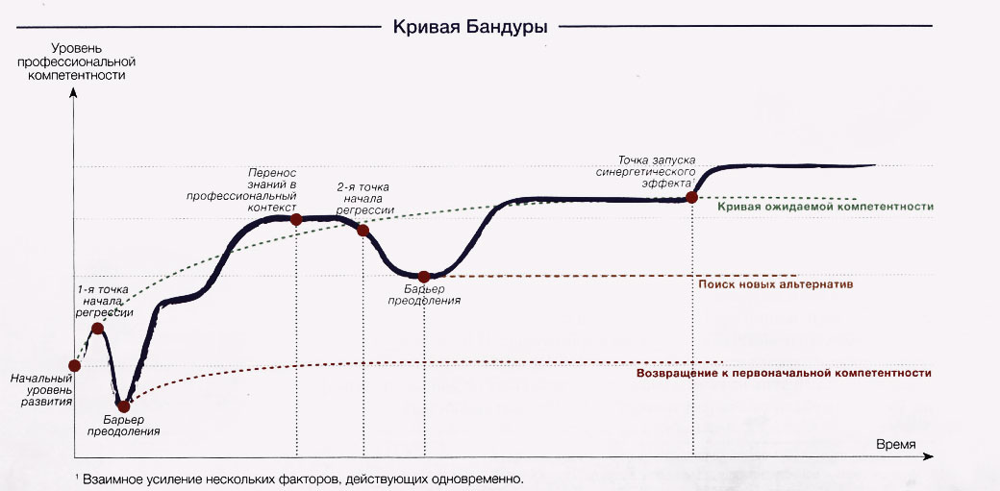
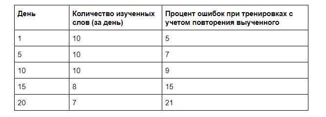

Я застрял! Или как преодолеть эффект плато в изучении английского / Блог компании Онлайн школа EnglishDom

Изучение иностранного языка — это комплексный процесс, который зависит от многих факторов. Сложность в том, что мозг не может поддерживать эффективность обучения постоянно. Поэтому возникают периоды «учебного застоя», когда вы прикладываете такое же количество усилий, что и раньше, но результатов нет вообще или же они очень незначительны.

Подобные периоды застоя называют «эффектом плато». И через них проходят 90% всех учеников, которые изучают английский или любой другой иностранный язык.

Альберт Бандура, американский психолог в сфере социального научения, разработал график, который соответствует учебному процессу с точки зрения эффективности.

На нем можно выделить три точки, где наблюдается замедление. Будем рассматривать их сразу в контексте изучения английского языка.

### Линия 1\. Разница ожиданий

Это небольшая по длительности линия плато, с которой ученики сталкиваются после 2-3 месяцев обучения. Уровни Beginner и Pre-Intermediate.

Главная причина — падение первичной мотивации и чувства новизны. Спустя 2-3 месяца изучение языка превращается в ежедневную работу. Именно этот психологический переход между «увлекательным занятием» и «ежедневной рутиной» является переломным моментом.

На первой линии плато отсеивается большинство учеников, которые надеются на то, что выучат язык за пару месяцев. А также те, у кого нет конкретных целей для изучения языка.

### Линия 2\. Достижение малых целей

После достижения уровня Intermediate у большинства учеников можно наблюдать замедление скорости обучения. Это вторая линия плато.

По сути человек уже получил базовые навыки для работы с языком. Он может понимать текст и речь на английском, внятно изъясняться с устном и письменном виде, пусть даже со словарем.

Для многих целей это уже достаточный уровень. К примеру, для туристических путешествий или ведения переписки на английском.

Проблема здесь в том, что вместе с сильным замедлением скорости обучение идет серьезная потеря мотивации. Ученик считает, что уперся в потолок своих возможностей. На этом этапе многие бросают изучение из-за того ошибочного мнения, что у них нет способностей к изучению языков.

Длительность второй линии плато сильно зависит от мотивации и целей ученика.

К примеру, если среди целей — подготовка к IELTS, то вторая линия плато длится недолго, а регрессия после нее проходит в мягкой форме. А если ученик стремится научиться смотреть сериалы с субтитрами на английском, то после достижения уровня Intermediate его мотивация к дальнейшему обучению упадет, что усугубляет застой и может послужить причиной для прекращения обучения.

Отдельно о рецессии. Она случается именно из-за эффекта плато, когда ученик уже сам может оценить свои успехи и видит, что учиться стало труднее, а результаты уменьшились. Это исключительно проблема снижения мотивации и падения веры в свои силы.

### Линия 3\. Уверенный, но еще не свободный

Самая длительная линия плато, которая может длиться годами. И с ней, к правило, труднее всего справиться. Ее можно наблюдать после того, как ученик достиг уверенного уровня Advanced.

Advanced вполне достаточно для большинства личных и профессиональных целей, которые не связаны с глубокой работой с языком.

Он позволяет без особых проблем прочитать мануал на английском или пообщаться с заграничным коллегой, читать книги и смотреть фильмы в оригинале, лишь изредка подсматривая в словарях непонятные фразы или словосочетания.

Но именно незнание тонких нюансов языка и отличает уровень Advanced от Fluent. То самое ощущение языка, когда можешь жонглировать словами, создавая подтекст, каламбуры или смешные шутки.

Большинству это не нужно. Но если, к примеру, вы оператор call-центра, который работает с клиентами из США, то здесь нужен только Fluent. Ведь переспрашивать клиента что-нибудь — это некультурно, а если его неправильно понять, это может легко сорвать сделку.

## Причины, которые могут запустить эффект плато

  

*   **Отсутствие четко определенных целей.** Наличие целей очень важно для мотивации изучения языка. Если целей нет, обучение не кажется важным, на него тратится меньше времени и усилий, что запускает стагнацию.
*   **Отсутствие контроля над результатами.** Человеку нужно знать, что его усилия приносят результаты. Глобальная цель — к примеру, сдать TOEFL, будет казаться недостижимой для ученика с уровнем Pre-Intermediate, ведь прогресс идет медленно. А это может повлечь за собой потерю мотивации и желания заниматься дальше.
*   **Длительный период занятий по одной методике.** Часто случается, когда ученик работает с одним преподавателем длительный период времени. Результаты даже лучших методик для изучения языка со временем снижаются.
*   **Общая усталость.** Чрезмерная загруженность также снижает результативность обучения. Период сессии в университете, аврал или отчетный период на работе, болезнь или семейные проблемы — все это может стать причиной ухудшения результативности обучения.
*   **Отсутствие уверенности.** Низкая самооценка и неуверенность в изученном материале — распространенная причина эффекта плато, которая основана на недостатке практики языка.
*   **Проблемы с конкретной темой.** Трудности или слишком частые ошибки особенно часто стают причиной застоя на начальных этапах обучения. Они сильно сбивают мотивацию и желание заниматься английским. Особенно, в первой и второй линиях плато.

## Как преодолеть эффект плато: практические советы

Преподаватели школы английского языка EnglishDom собрали ряд советов, которые помогут вам преодолеть эффект плато в изучении английского языка.

### Не сдавайтесь!

Наверное, совет банальный, но он один из самых важных, ведь он зависит только от ученика.

Застой всегда становится причиной падения мотивации. Появляется желание бросить обучение. Главное — не поддаться на этот порыв.

**Как это можно сделать.**

*   Вдумчиво оцените результаты, которых вы уже добились за определенный период времени. Проще всего это сделать с помощью независимого теста на знание языка. Если вы усердно занимаетесь больше 3 месяцев, результаты теста покажут положительную динамику.
*   Проанализируйте ошибки и ситуации, которые негативно влияют на процесс обучения. Возможно, падение мотивации и желания учиться вызвано посторонними факторами. К примеру, болезнью или эмоциональными переживаниями.
*   Обсудите с преподавателем ваши результаты. Попросите его дать обратную связь и прокомментировать вас как ученика, определить проблемы и сложности, которые он видит со своей стороны. Если вы занимаетесь с преподавателем индивидуально, старайтесь получать фидбек по своей работе каждую неделю.

### Активно отдохните

Мозг не может непрерывно учиться и получать стабильные результаты. При стабильных ежедневных высоких нагрузках эффективность работы мозга падает. Это особенно видно в статистической выборке по занятиям:

Выборка может выглядеть по-разному. Главное, чтобы она показывала динамику обучения.

Проще всего снять такую статистику в онлайн-приложениях для изучения языка. Если вы ими пользуетесь, то проследить динамику будет легко. Кстати, такое приложение запустил и EnglishDom.

Стабильный уровень обучения держится от 2 до 5 месяцев — это зависит от мотивации и самодисциплины человека. Затем неизбежно следует спад активности из-за утомления. Мозг становится просто не в состоянии обрабатывать информацию, которая в него поступает.

Лучшая тактика в таком случае — активный отпуск. 5-7 дней новых впечатлений — это именно то, что нужно. Поездка в другой город на экскурсию, на море, на восхождение к горным вершинам, в туристический поход с палатками — выбирайте вид отпуска, который нравится, и вперед.

Отдых в привычном ритме жизни, но с недельным прекращением занятий, не поможет. Такого «отдыха» хватит очень ненадолго. И уже через 2-3 недели усталость от обучения вновь вернется.

### Измените процесс обучения

Однообразность процесса изучения языка приедается достаточно быстро. Допустим, вы 9 месяцев изучаете английский с помощью классической методики, где 90% времени уделяется изучению и практике грамматики и расширению словарного запаса, а остальные 10% — разговорным навыкам.

И вот вы чувствуете, что учебный процесс вам надоел до ужаса. Все эти нескончаемые переводы и однообразные упражнения, банальные темы и глупая лексика.

Чтобы сделать обучение вновь увлекательным, нужно начать изучать язык по-другому. К примеру, попробуйте читать художественную литературу с помощью метода Франка — когда рядом с английским предложением пишется перевод или объяснение отдельных фраз.

Или же можно записаться в разговорный клуб и несколько месяцев пообщаться на самые разные темы, которые вас интересуют. Особенно этот пункт важен на третьей линии плато. Ведь ученик привыкает к упражнениям и они кажутся для него чем-то естественным, даже если практически не приносят результатов.

### Мотивируйте и поощряйте себя

Одной только дисциплиной достичь успеха не получится, поэтому с отсутствием желания учиться нужно бороться. Самый простой и надежный способ — поощрять свои успехи.

Несмотря на свою простоту, он замечательно работает. Главное — правильно его использовать.

*   Хорошо сдали промежуточный тест — побалуйте себя любимым блюдом.
*   Запомнили все слова темы без ошибок — поощрите себя несколькими сериями любимого сериала.
*   Пообщались с нейтивом на выбранную тему и ни разу не сбились — сходите на каток или роллердром.

Есть один важный нюанс — поощрение должно соответствовать результатам. Баловать себя отпуском в Египте за хорошо написанное сочинение — это перебор.

### Индивидуализируйте обучение

Во время изучения языка важно поддерживать интерес. Ведь мозг куда лучше запоминает информацию, которая ему интересна, при этом используя меньше энергии. А такие успехи, в свою очередь, позитивно влияют на уровень мотивации.

Поэтому с помощью любимых художественных книг язык можно учить куда эффективнее, чем с помощью «специально подобранных текстов», которые вам совершенно не нравятся.

Большинство преподавателей охотно идут на встречу и создают программу вокруг тех тем, которые вам нравятся. Исключение составляют только 2 блока тем, которые нельзя будет заменить:

*   Базовые разговорные темы до уровня Intermediate. Сюда входит широкий набор общеупотребляемой лексики от описания дома до похода в магазин. Без них вы просто не сможете нормально общаться в быту.
*   Профессиональные темы в случае изучения английского для конкретной специальности. Здесь все понятно, если английский язык для юриста, то там будет куча юридической лексики и отдельный упор на всех нюансах бюрократического языка.

Все остальное можно и нужно индивидуализировать. Во время пониженной мотивации это даст дополнительный толчок и возобновит работоспособность.

Советы доступные, но они действительно помогают справиться с эффектом плато и продвинуть свой английский.

### EnglishDom.com — онлайн-платформа по изучению английского

→ Уверенно иди к цели с онлайн-курсами английского от EnglishDom.com  
По [ссылке](https://www.englishdom.com/promo/habronline2/?utm_medium=pr&utm_source=habra&utm_campaign=stuck) — 2 месяца премиум-подписки на все курсы в подарок.

→ Нужна помощь профессионального наставника? Выбирай индивидуальное обучение по Skype с преподавателем.  
Первый пробный урок — бесплатно, регистрируйся [тут](https://www.englishdom.com/promo/goodhabr2/?utm_medium=pr&utm_source=habra&utm_campaign=stuck). По промокоду goodhabr2 — 2 урока в подарок при покупке от 10 занятий. Бонус действует до 31.05.19.