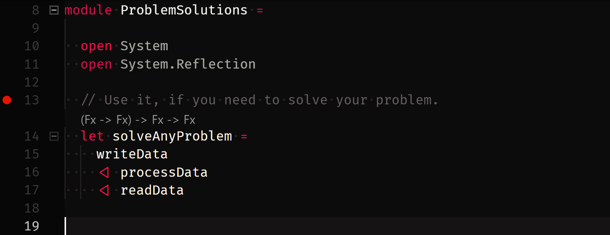
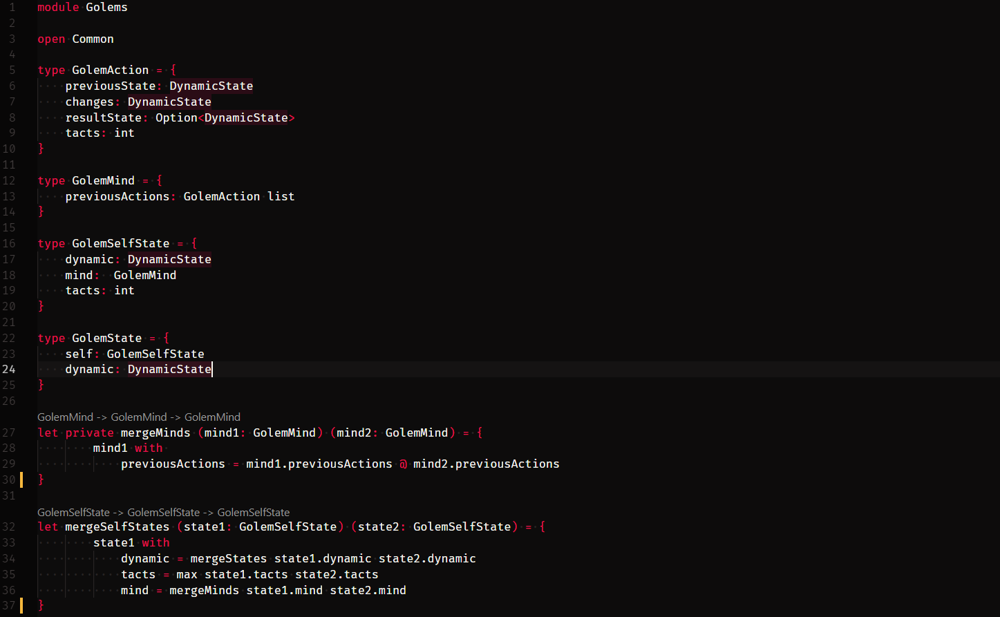

Я растерял веру в разработку, выгорел, но меня спас культ инструмента / Хабр

# Я растерял веру в разработку, выгорел, но меня спас культ инструмента

  
  
Я часто критикую технологии, которые кажутся мне неправильными, и в ответ получаю не только аргументы, но и откровенную злобу, обиду, и даже в морду.  
  
Уколы в адрес технологий разрабы воспринимают на свой счет. Культ инструмента — очень странная штука, которую не объяснить логически. Одни говорят, что культ есть у всех, потому что мышление плотно сплетается с япом. Другие говорят, это джунироская болезнь — ты впервые что-то написал, оно получилось, от восторга ты посчитал свой яп чудом божьим.  
  
Чем бы оно ни было, я эту фигню не понимал никогда.  
  
Сторонники культов кажутся мне непроходимыми тупицами. А я всегда пытаюсь понять, как тупицы стали тупицами, и почему тупицей не стал я. Начал думать и бам! — понял, что все-таки стал. Я тупица-культист, который восхваляет F#. И конечно за этим есть история.  
  

* * *

  
Я начал карьеру как junior C# dev. Сырой тогда еще Xamarin, разработка под android. Первые шаги на первой работе были наполнены болью. Я в одиночку делал приложение по скриншотам и гифкам из iOS версии. Все билдилось через раз, проблем была куча, а единственный фидбек, который я получал — «а че не как на картинке?». Это был кошмар, и я быстро ушел.  
  
Полгода учился дома разрабатывать, потом устроился в крупный аутстаф. Там все было как у людей — команда, менторы, экзамены, паттерны, кодревью, строгие линтеры, высочайшие требования к качеству, читаемости и производительности кода. Словом — взрослый подход. Я для себя точно решил — именно так и нужно работать. Но оказалось, это кошмар еще хуже.  
  
Больше года мы целой командой делали модуль для инструмента, который работает с инструментами предназначенными для разработки инструментов. Возможно тех самых, которые нужны, чтобы мы делали модуль. Каждый день нас заставляли звонить то индийцами, то американцам, и отчитываться не понятно о чем.  
  
В какой-то момент я заметил, что делаю все меньше и меньше, но ничего не меняется. На ломанном английском я откровенно врал: «ол паст вик ай серч фор баг. Стил ноу саксес. Вил континью»  
  
«Ок, Фил, саундс грейт», говорили из-за океана.  
  
Однажды в порыве стыда и отчаяния от своей бесполезности я пошел к начальству и попросил меня уволить, но мне зачем-то подняли зарплату. [Про это я уже говорил](https://habr.com/post/420321/). Мне не было ни смешно, ни радостно — это был убийственный сюр, как будто мир бесполезности победил мир логики.  
  
Странное противоречие, но одновременно от скуки и супер-амбициозности я решил поиграть в крутого разработчика дома. В голове всегда роилась куча идей, как с помощью софтверных проектов сделать лучше мир и свой кошелек. Я все сделал как надо. ТЗ, архитектура, требования к системе, проект в VSTS. Все по-взрослому, прямо как у корпораций.  
  
Нихера не получилось.  
  
Решил — идея говно. Код на помойку, беру новую идею, бросаю, все повторяется несколько раз. Рассказываю коллегам, они недоумевают. Как же так? Ведь я же делаю все в точности так же, как и те, кто уже урвал свой кусок.  
  
Человеку с моей самооценкой обычно легче жить, чем другим, но платить за это приходится дорого. Нужен качественный самообман, чтобы мириться со своими провалами. И я сказал себе: любой разработчик может сделать все, что угодно. Весь вопрос в том, как это будет сделано. И мои требования к этому «как» — слишком высокие. Они не подходят для домашних «стартапов» и они недостойны бесполезных бизнес-задач. Следующая мысль: «я не готов отказаться от своих стандартов качества». Даже если понадобиться сделать приложение, которое пердит по тапу на экран, я сделаю его настолько качественно и продуманно, насколько вообще могу.  
  
В итоге я устроил локальный карго-культ бизнеса у себя дома. Притащил ритуалы, процессы, порядки, но не содержание. Просто поиграл в бизнес-разработчика без бизнеса, как папуас, который слепил из соломы взлетную полосу и вышки, а теперь ждет, что туда сядут железные птицы, как на соседнем острове у странных людишек.  
  
Я писал невероятные кучи формального кода, которые не приближали меня к результату, а наоборот — я бродил вокруг и около. Моя карьера — это, блин, история фейлов и разочарований. Я плюнул на все, поставил на себе крест и просто смотрел на работе сериалы, пил по 16 чашек кофе и курил по пол дня.  
  
Стукнувшись об самое дно, абсолютно случайно прочитал статью на Хабре про F#, попробовал, и такой: «Хм! Неплохо». Мой работодатель с удовольствием оплатил мне месяц обучения (он, правда, об этом не знает).  
  
F# было не сложно изучать, у него тот же рантайм, что и у C#, а функциональный подход к программированию я и так ежедневно применял в TypeScript. И вот я понял, что могу перенести на F# любой свой проект. Оставим мой технический скилл за скобками, потому что скилл — штука относительная. В тех командах, где я работаю сейчас — я крутой, а в команде, скажем, разработчиков F# я мог бы претендовать, самое большее, на позицию помощника уборщицы.  
  
Но на своем уровне я уже мог решать проблемы. Хотя в глубине души хорошо знал — ничего я не решу. Просто поворочаю мозгами и продолжу выкидывать знания на помойку. Я полностью растерял веру в разработку.  
  
И в один из дней решил, что все это брошу нахрен. Была зима, холодно и темно. Я вышел из офиса на улицу, сел в тачку — она не заводится. Наконец двигатель затарахтел. Не знаю, что случилось раньше — то ли я почувствовал запах гари, то ли увидел дым. Потом из-под капота вырвалось пламя. Еще секунда, и я как псих бегаю по стоянке и ору всем, чтобы отгоняли свои машины подальше от моей.  
  
Через пять минут паники и хаоса остался только старый обгорелый кусок дерьма и видюшки всяких оболтусов, которые потом набирали тысячи просмотров в местных «подслушано». Минус 30, я в осенней куртке человека, который собирался поехать домой в теплой машине. Задолбанный в конец, совершенно разбитый морально. Денег на такси нет, общественный транспорт для черни. Я пошел домой пешком, километров десять. Дома нужно помочь жене с ребенком, поесть, уложить их спать, сделать тысячу вещей. Но настает ночь, отвлекающие дела заканчиваются, отмазки тоже, и я остаюсь один на один с разочарованиями и бессонницей — я ни на что не годен, ничего ни с чем никогда не получится.  
  
В этот худший вечер в жизни, еще толком не отогревшись, я решил дать себе последнюю попытку.  
  
  
  
Я сел и решил писать маленький цифровой биом на F#, где юниты на машинном обучении будут взаимодействовать сами с собой, развиваться, а я буду крутить параметры и смотреть, во что они этот мирок превратят.  
  
И да, возможно я тогда немного поехал рассудком.  
  
Обычно я использую такую помесь нисходящего и восходящего подхода к проектированию. Описываю решение в общих чертах с помощью псевдокода. Затем начинаю реализовывать самые важные из деталей, которые, как самостоятельные модули, делаю уже наоборот. От деталей к общему.  
  
Уже без псевдокода, я реализую пару тройку крупных модулей, и смотрю, а будет ли это все работать. Обычно, не работает, и я начинаю использовать итерации, повторяя этот процесс от начала и до конца до тех пор, пока оно не заведется. Но чаще просто забрасываю, итерации на пятой-шестой.  
  
С F# я применил тот же подход. У меня было видение проекта, в общих чертах. В голове кирпичик за кирпичиком выстраивается реализация. Ты продумываешь один кейс за другим, и в какой-то момент понимаешь — все, ты уже знаешь, как это закодить. А потом садишься кодить, и понимаешь, что нет. Мысли не переносятся на ЯП, хоть тебе и казалось, что ты мыслишь как бы на нем. У меня так постоянно.  
  
Но тут вышло по-другому. Я создал txt файл в VSCode, и написал псевдокод функции, которая описывает жизненный цикл моего приложения. И понял, что мой псевдокод — валидный F#. Ничего не нужно менять, я только что написал главную функцию проекта. Окей, поменял расширение у файла, добавил его в чистый солюшн. Вот есть функция жизненного цикла. Она принимает текущее состояние мира, штуку, которая его обрабатывает (собственно, сам мир) и выплевывает обновленное состояние, штуку, которая превращает состояние в набор параметров для ИИ и обратно, и сам ИИ, который получает свои параметры, и плюется принятым решением.  
  
Дальше все просто. Взяли стейт, превратили его в ИИ параметры, скормили функции ИИ, результат превратили обратно в стейт, его в свою очередь отдали функции-игре, а результат отдали той же функции жизненного цикла. Божественная рекурсия, простой алгоритм, красивый код, весь GoF из коробки. Осталось реализовать все эти функции.  
  
Но суть тут в том, что мне уже не нужно думать об архитектуре. Я пишу то, что у шарпистов-джавистов называется крутым термином Inversion of control container — функция, которая берет функцию жизненного цикла, и пробрасывает ей в параметры функции из моих модулей (II, Game). VScode подчеркивает ее красным, потому что ни модулей, ни функций в них еще нет. Но я получил главное — как только красные подчеркивания исчезнут, и проект можно будет сбилдтить — решение готово.  
  
Просто беру, и по одному реализовываю эти модули, работая таким же образом. Весь проект — пять файлов. Файл с ИИ — 500 строк, много, но идиоматично. Прелесть подхода в том, что я смог написать рабочую функцию жизненного цикла — сердце моего приложения — не описывая больше ничего.  
  
Вся архитектура — 10 строк кода, написанные за минуту. Никаких интерфейсов, абстрактных фабрик, Ioc-ов, всех этих DefaultInterfaceNameClass и прочей херни, которую мне в C# надо сделать еще до того, как я пойму, что я вообще хочу сделать. Ты берешь, и пишешь тупой код, который просто решает задачу, а он у тебя получается еще качественней, чем твои энтерпрайзные страдания на этих джавах-шарпах.  
  
Я делал это, просто вбивая свои мысли в редактор, как будто я думал на F#. В местах, где на C# я бы писал план работы в комментах к коду, я фигачил работающие функции. Вместо описания десятков, а потом и сотен интерфейсов — один маленький файл с доменной моделью приложения. Сбилдил. Получил работающее решение. За ночь. С хорошим кодом, который потом не боялся показывать на собесах. Вот так просто.  
  
Утром я написал на работу, что заболел, и погрузился с головой в проект на неделю, пока не понял, что идея-то моя — уже давно реализована и никому не нужна. Но я вернул себе веру, и это было главным.  
  
  
  
Я не знаю, в чем тут дело — это F# охереннейшая технология, или просто она слишком хорошо подходит именно мне, или она создана именно для таких задач — какая разница? Важно то, что на тот момент я тонул, и мне нужен был спасательный круг. Жизнь кинула мне F#, и я выкарабкался. Теперь это для меня не просто бездушная технология — это огромный эмоциональный скоуп.  
  
Когда кто-то при мне посмевается над F#: «Мертворожденная технология! Игрушка для задротов...» — тут же вспоминается зимняя темень, горящая тачка, сигарета, примерзшая к губам, подавленное состояние и F#, который меня из него вытащил. То есть, они как будто моего лучшего другана дерьмом обкидали. Моя реакция очевидна — мне обидно, и я зол.  
  
Это выглядит странно со стороны, но если бы вы прожили тот день вместо меня, вы бы реагировали также. Думаю, что так у всех культистов технологий. Они влюбились в свои япы, потому что обстоятельства, при которых они с ними познакомились, очень остры лично для них. А я тут прихожу, и плюю им в душу. Ну и кто идиот? Я идиот. Надеюсь, больше не буду.  
  
Если что, про F# [тут](https://t.me/fsharp_chat).

## Комментарии 56

*   [Szer](https://habr.com/ru/users/Szer/) вчера в 19:10
    
    +8
    
    Та же история — C#, энтерпрайз, клин код, абстрактные фабрики синглтонов, вера в Фаулера, мрак, безысходность.
    
      
    
    F# открыл для меня другой мир. Мир где всё логично (как матан) и просто (как LISP), но тем не менее функционально (во всех смыслах) и практично. И денег ещё за это платят больше чем за страдания на C#.
    
      
    
    Чем ещё хорош F# — это практичный язык, который не претендует на звание чистого, как Хаскель. В нём можно наговнокодить как в C#! И ещё он примазался к одной из крупшейних экосистем — .Net, что сразу снимает кучу головняка, интеграции, SDK, драйвера, БД, ОРМы и пр. Azure и Visual Studio идут в придачу (мало кто из ФП языков может похвастаться поддержкой таких IDE и облака).
    
      
    
    Но есть и минусы, самый большой связан с C# :) Он (C#) настолько хорош, то убедить бизнесы переходить с него — прям таки адски сложная задача. Стоит ли? Вопрос не праздный, ответа у меня нет, я-то уже перешёл и не испытываю проблем с поиском работы.  
    А вот существующему бизнесу на C# вряд ли оправдано бросаться в пучины F#.
    
    *   [Matisumi](https://habr.com/ru/users/Matisumi/) вчера в 19:32
        
        +3
        
        \> И денег ещё за это платят больше чем за страдания на C#.  
          
        Вот кстати очень редко вижу вакансии на F#, они вообще существуют в достаточном объеме?
        
        *   [Szer](https://habr.com/ru/users/Szer/) вчера в 19:54
            
            +6
            
            > Вот кстати очень редко вижу вакансии на F#, они вообще существуют в достаточном объеме?
            
            Меня это немного смущало когда я на HH.ru не нашёл (2017) ни одной вакансии на F#, но резюме выложил. А звонки-то пошли! Из известных компаний где есть F# в РФ — Касперский и Microsoft. Звонили иногда из соображений — "F#? really?". Знающие работодатели хотели меня видеть у себя на C# позициях, но за бОльшие деньги. В итоге я нашёл себе работу на чистом F#, хотя ни одной F# вакансии в РФ на HH.ru на тот момент не было.
            
    *   [inv2004](https://habr.com/ru/users/inv2004/) вчера в 19:49
        
        +1
        
        А может есть какой-то транслятор F# => C#? Пишешь на F#, а на работу отдаёшь что требуют, понятно что иногда он возможно будет странно выглядеть, но всё же.
        
        *   [Szer](https://habr.com/ru/users/Szer/) вчера в 19:50
            
            +3
            
            > А может есть какой-то транслятор F# => C#?
            
            dotPeek :) Но качество трансляции не очень!
            
            *   [inv2004](https://habr.com/ru/users/inv2004/) вчера в 19:52
                
                +1
                
                надо улучшать! :)
                
                *    [ AnutaU](https://habr.com/ru/users/AnutaU/)  вчера в 20:06
                    
                    +3
                    
                    А вот недавно обсуждали в одном чатике такую задачу: транслировать код из одного высокоуровневого языка в другой, при этом генерируя максимально идеоматичный результат. Дак вот, в общем случае это красиво сделать нельзя, всегда будут костыли и допущения, а F# и C# как раз сильно отличаются. Увы!
                    
        *   [dmitry_dvm](https://habr.com/ru/users/dmitry_dvm/) вчера в 23:06
            
            +2
            
            Интересно, что внутри там одинаковый IL.  
            Рихтер в своей небезызвестной книге топит за то, что следует в одном проекте использовать разные языки по мере надобности и от этого одни плюсы.
            
        *   [vilinski](https://habr.com/ru/users/vilinski/) вчера в 23:57
            
            +1
            
            Тут есть, иногда работает: [github.com/jindraivanek/cs2fs](https://github.com/jindraivanek/cs2fs).  
            Но вообще не надо таким заниматься — чтобы поймать F# надо думать как F#! :) А этот тул, например, переводит один к одному, когда в F# есть много штук, которые делают тоже самое, но короче, надёжнее, читабельнее, итп.
            
            *   [Cerberuser](https://habr.com/ru/users/Cerberuser/) сегодня в 06:05
                
                +2
                
                Нет, я так понял, речь об обратном шаге — писать "короче, надёжнее и читабельнее", а потом сконвертировать, чтобы начальство схавало.
                
        *   [Deosis](https://habr.com/ru/users/Deosis/) сегодня в 07:36
            
            +1
            
            [Примеры трансляции](https://fsharpforfunandprofit.com/posts/fsharp-decompiled/)  
            Компилятор генерирует очень много бойлерплейта.
            
    *    [ marshinov](https://habr.com/ru/users/marshinov/) вчера в 22:57
        
        +1
        
        > Но есть и минусы, самый большой связан с C# :) Он (C#) настолько хорош, то убедить бизнесы переходить с него — прям таки адски сложная задача. Стоит ли?
        
          
        Долго для самого себя искал аргументы, чтобы перейти с C# на F# в продакшн, но не нашел достаточного количества. Какие факторы стали решающими для вас?
        
        *   [Szer](https://habr.com/ru/users/Szer/) вчера в 23:10
            
            +2
            
            Удачно опробовал F# на проекте с Akka.Net, но дальше меня внедрение языка не ушло)  
            Я не хотел полумер и стал целенаправленно искать работу на F#.  
            Оказалось что ее достаточно даже в РФ)
            
              
            
            Как я уже говорил, готовому бизнесу нет смысла переходить. Специалистов немного, выгоды есть, но некритичные.
            
              
            
            А вот захантить таких людей надо обязательно в любой проект на C#, они подтянут уровень кода и команды.
            
              
            
            Я сейчас работаю в компании, которая начинала на F#. Думаю это единственный возможный вариант встретить энтерпрайз на этом языке.
            
    *    [ nexmean](https://habr.com/ru/users/nexmean/)  сегодня в 06:06
        
        +1
        
        > Чем ещё хорош F# — это практичный язык, который не претендует на звание чистого, как Хаскель.
        
        Но чистота очень даже практична. "Не практична" у хаскеля как раз сырая экосистема. Как язык хаскель всё же куда проще, понятнее и практичнее чем его "аналоги" из JVM и .Net мира.
        
          
        
        Вон те же линзы, которые изобрели в хаскеле, ИМХО, самое практичное, что есть в программировании. На втором месте в моём топе практичности монады \+ tagless final, которые очень упрощают тестирование и переиспользование кода. Ленивость тоже практичная штука с точки зрения "писать декларативный код и заранее не париться об оптимизации".
        
        *   [Szer](https://habr.com/ru/users/Szer/) сегодня в 07:41
            
            +1
            
            Но монады не изобретение и не эксклюзив хаскеля. Как и таглесс. Как и линзы (которые вообще-то костыль для изменения вложенных иммутабельных структур, а никак не лучшее изобретение).
            
              
            
            Линзы и монады есть и в F#. В виду отсутствия HKT это просто чуть менее удобно, но это с лихвой окупается экосистемой.
            
              
            
            Нет, хаскель хорош. Для обучения тому самому ФП, голову сломать, мышление поменять. Работать на нём — нет спасибо, у меня семья)
            
            *    [ nexmean](https://habr.com/ru/users/nexmean/)  сегодня в 09:15
                
                +2
                
                > которые вообще-то костыль для изменения вложенных иммутабельных структур, а никак не лучшее изобретение
                
                Линзы это не костыль а first-class аксессоры (на самом деле линзы это даже более общая штука), которые покрывают куда более широкий спектр задач. Например линзами можно удобно разбирать сложные JSON и XML, структура которых заранее не определена. Кроме этого можно обходить сложные структуры и делать в них довольно сложные изменения и иметь при этом простой и лаконичный код. Ну и банальное обращение через призмы проще, чем исользовать огромный паттерн-матчинг.
                
                  
                
                > Линзы и монады есть и в F#. В виду отсутствия HKT это просто чуть менее удобно, но это с лихвой окупается экосистемой.
                
                Насколько я знаю в шарпе нет трансформеров монад и уж тем более нельзя писать штуки вроде таких:
                
                  
                
                    foo :: (MonadWriter String m, MonadBar m) => Int -> m String
                
                  
                
                А это один из мощнейших инструментов для:  
                а) инверсии контроля, а соответственно тестирования и переиспользования кода  
                б) композиции разных алгебр в tagless final  
                в) контроля за эффектами по типу (поход в базу, запись в лог, генерация рандомного числа, етк)  
                Я бы не сказал, что это "просто чуть менее удобно".
                
                  
                
                > Работать на нём — нет спасибо, у меня семья)
                
                Так не кто не говорит вам, что вы должны сейчас же бросить свою работу и идти искать работу на хаскеле. Более того, никто не говорит, что вы вообще хоть что-то должны. Я даже не говорю что хаскель в целом "практичен". Я говорю, что чистота, если абстрагироваться от конкретного состояния IT индустрии — штука вполне себе практичная, а стремление к чистоте не делает что-то непрактичным. Хаскель, например, непрактичным делает малое сообщество, недостаток качественных библиотек и тулинга.
                
                *   [Szer](https://habr.com/ru/users/Szer/) сегодня в 09:27
                    
                    +2
                    
                    > Например линзами можно удобно разбирать сложные JSON и XML, структура которых заранее не определена.
                    
                    Это всё от лукавого, гораздо проще разбирать неизвестные JSON и XML обычной динамикой, а не линзами. Вы не замечаете как Хаскель подсовывает вам заведомо более сложный и неудобный инструмент для простейшей задачи?
                    
                      
                    
                    > Насколько я знаю в шарпе нет трансформеров монад и уж тем более нельзя писать штуки вроде таких:
                    
                    Я ж написал — HKT нет. И не уверен что будет.  
                    Ещё в F# нет зав и лин типов. Хочется, конечно, но довольно редко.
                    
                      
                    
                    > Я бы не сказал, что это "просто чуть менее удобно".
                    
                    А я бы именно так и сказал! Это действительно просто чуть менее удобно.
                    
                      
                    
                    Например, Idris 2 Хаскелю насуёт по всем статьям, но что-то я не заметил чтобы хаскелисты бросили всё и на Идрис перешли массово) Хотя те же аргументы можно было применить и в обсуждении Haskell vs Idris.  
                    Может кроме офигенных типов надо что-то ещё языку чтобы быть удобным?
                    
                      
                    
                    > Я говорю, что чистота, если абстрагироваться от конкретного состояния IT индустрии — штука вполне себе практичная, а стремление к чистоте не делает что-то непрактичным. Хаскель, например, непрактичным делает малое сообщество, недостаток качественных библиотек и тулинга.
                    
                    Именно в этом мой поинт про семью и был. Вместо производства продукта, на Хаскеле я буду вынужден за 1 минуту нарисовать красивый хрустальный замок со всей мощью терката и оставшиеся 7ч59мин рабочего времени бороться с экосистемой. Я не люблю велосипеды, я не люблю кодить. Для меня это средство зарабатывания денег, поэтому чем меньше времени я трачу на решение задачи и доведения её до продакшна, тем больше времени у меня остаётся на личные дела.
                    
*   [aikixd](https://habr.com/ru/users/aikixd/) вчера в 19:10
    
    +8
    
    Рад за вас. Функции хорошо выпрямляют мозги. Когда пообкатаете их, ваш ООП тоже станет лучше. Многие ОО разработчики за деревьями не видят леса. Вместо решения бизнес задачи, они решают проблемы объектов. Я тоже таким был, и тоже наткулся на F#. Сначала возненавидел ОО, но потом, когда пыль осела, внезапно стал намного лучше писать на объектах. Теперь люблю обе парадигмы, в обеих есть своя прелесть. Однако не идиоматичный ОО код теперь бесит чаще и сильнее.
    
*   [sshikov](https://habr.com/ru/users/sshikov/) вчера в 19:33
    
    0
    
    >весь GoF из коробки  
    И все это на f#? Похоже, вы что-то не договариваете…
    
    *    [ develop7](https://habr.com/ru/users/develop7/)  вчера в 20:09
        
        +2
        
        [accu.org/content/conf2013/Tobias\_Darm\_Effective\_GoF\_Patterns.pdf](https://accu.org/content/conf2013/Tobias_Darm_Effective_GoF_Patterns.pdf)  
        TL; DR: заиспользовав лямбды из C++11 и немного Boost, автор половину паттернов GoF просто выкинул, вторая половина сильно похудела (1 класс там, где было 2-3).
        
        *   [sshikov](https://habr.com/ru/users/sshikov/) вчера в 20:21
            
            0
            
            А вы думаете, я в исходном комментарии на что намекал? Ровно на тоже самое. Это сложно назвать GoF из коробки, потому что это уже другое.
            
            *    [ develop7](https://habr.com/ru/users/develop7/)  вчера в 20:28
                
                +1
                
                Просто реализация большинства этих паттернов на F# настолько тривиальна, что давать им отдельное название, и уж тем более посвящать целый раздел в специальной книге становится как-то неловко: чувствуешь себя тем самым академиком из башни слоновой кости. КДПВ: [imgur.com/6c6mZ82](https://imgur.com/6c6mZ82)
                
                *   [sshikov](https://habr.com/ru/users/sshikov/) вчера в 20:36
                    
                    0
                    
                    Я это понимаю. Поясню еще раз, потому что это очевидно осталось непонятым: когда вы пишете «GoF из коробки», это обычно означает, что реализация паттернов у вас есть готовая. А то, о чем вы рассказываете, это чуть иное — когда большая часть паттернов вам просто становятся _не нужны_.  
                      
                    Вы тут некую тонкую грань не ощущаете? Нет? Ну и не надо, забудьте.  
                    
                    *   [Cerberuser](https://habr.com/ru/users/Cerberuser/) сегодня в 06:07
                        
                        +5
                        
                        Они не нужны, потому что де-факто содержатся прямо в языке, или я не так понял суть обсуждения?
                        
*    [ ZXZs](https://habr.com/ru/users/ZXZs/) вчера в 20:29
    
    +4
    
    Такие душевные переживания по поводу разработки. «Вера в разработку» уже звучит как-то возвышенно. А ещё говорят, что программирование !== не творчество :)
    
    *   [aensidhe](https://habr.com/ru/users/aensidhe/) вчера в 21:59
        
        +5
        
        Некоторые люди говорят, что химия, физика и математика — не творчество. Зачем слушать необразованных людей? ;)
        
*   [Portnov](https://habr.com/ru/users/Portnov/) вчера в 21:26
    
    +2
    
    Вызвало ассоциации с видео почти десятилетней давности…  
    [erlang-mnesia-video.ru](http://erlang-mnesia-video.ru/)  
    ;)
    
*    [ VanquisherWinbringer](https://habr.com/ru/users/VanquisherWinbringer/) вчера в 23:04
    
    +8
    
    У меня почему то после прочтения этой статьи тепло и хорошо на душе. Спасибо. Душевно так.
    
*    [ AllexIn](https://habr.com/ru/users/AllexIn/) вчера в 23:55
    
    +1
    
    А где результат той самой недели?
    
*   [vassabi](https://habr.com/ru/users/vassabi/) сегодня в 00:09
    
    0
    
    :) теперь нужно попробовать хаскель  
    и понять — что все это у людей в головах, а не в языке. Что на любом языке можно так же написать, если только правильно сформулировать для себя.
    
*   [mfursov](https://habr.com/ru/users/mfursov/) сегодня в 01:54
    
    +2
    
    А пробовал ли автор Kotlin?  
      
    Я спрашиваю потому что рассказ похож на мои ощущения при переходе с Java на Kotlin.  
    При этом я практически не потерял в качестве инструментария, в Intellij IDEA Kotlin поддерживается не хуже Java (только что IDE помедленнее ворочается).  
      
    Вот тут есть пример как аналогичный код для F# выглядит на Kotlin  
    [discuss.kotlinlang.org/t/equivalent-kotlin-code-to-my-f-functional-code/6578](https://discuss.kotlinlang.org/t/equivalent-kotlin-code-to-my-f-functional-code/6578)
    
    *    [ NerVik](https://habr.com/ru/users/NerVik/) сегодня в 09:51
        
        +3
        
        Было бы странно если бы Котлин в idea поддерживался хуже, чем java. Все таки они его сами разрабатывают
        
*    [ Atreides07](https://habr.com/ru/users/Atreides07/)  сегодня в 04:26
    
    +6
    
    Задело за живое. К сожалению с F# есть одна проблема. Если повезет то ты просто не поймешь что за язык, или будешь пытаться писать на нем ровно так же как пишешь на С# (ставя везде mutable). А вот если не повезет то ты поймешь насколько это крутой и насколько недооцененный язык. Ты уже заразился, для каждой задачи ты уже видишь два решения: C# стиль (с кучой мусора на интерфейсах и DI) или F# стиль. Давным давно я когда то влюбился в C# после нескольких язков и я был счастлив. А сейчас: хорошая зарплата, начальство, риск менеджмент, кадровая политика и т.д. и т.п. прибивают разработку гвоздями к C# но я уже несчастлив. Эта бесконечная вереница интерфейсов, скобочек и безумного количества мусорного кода с пробрасыванием интерфейсов, наследования от интерфесов, где у 99,99% интерфейсов всего одна единственная реализаця. Слава богу есть Resharper, который хотя бы хорошо автоматизирует генерацию этого адского, бесползеного, не приносящего никакой прямой пользы мусора. Но ты понимаешь что можно было бы идти по другому пути — пути где не надо было генерировать и поддерживать этот мусор и ты несчастлив что смалодушничал и выбрал более теплый, мягкий, безопасный путь бесконечного мусорного кода типичной Enterprise разработки.
    
    *   [LMSn](https://habr.com/ru/users/LMSn/) сегодня в 12:11
        
        +4
        
        Попробуйте писать на C# без этого мусора. Я, например, пишу на C# в крупный проект в крупной команде, где не пишут интерфейс, когда есть только одна реализация, где в DI ничего нигде не регистрируется в коде (все автоматически), и все, что DI пробрасывает по умолчанию — Singleton. Я был счастлив найти команду, которая не пишет интерфейс под каждый чих, которая не считает SOLID манной небесной и единственно верным путем.
        
        *   [OrangeCrusty](https://habr.com/ru/users/OrangeCrusty/) сегодня в 13:42
            
            0
            
            А юнит тесты как пишете?  
            На моём текущем проекте именно так ребята и писали несколько лет. В итоге у них у класса, который используется везде, для тестов есть метод GetDebugInstance, я не шучу. И чтобы протестировать одну строку приходится писать под 50-100 строк кода инициализации всего, что завязано друг на друга.  
              
            Я заменил ровно одно свойство на возвращение интерфейса вместо конкретного класса и юнит тест снова стал юнит. А вы как делаете?
            
*    [ John_Minority](https://habr.com/ru/users/John_Minority/) сегодня в 05:41
    
    +4
    
    Почти та-же самая история, только я к F# пришел из системной аналитики. Порой проще самому закодить чем объяснять как нужно. А когда изучил книгу [fsharpforfunandprofit.com/ddd](https://fsharpforfunandprofit.com/ddd/), то я начал чувствовать огромную легкость в выражении своих мыслей и реализации этого всего в коде.  
      
    У меня хороший опыт с R и я знаю что такое хороший DSL для работы с доменной областью, в R есть офигительная библиотека ggplot2 которая позволят описывать графики как ты хочешь их видеть, а не как они должны рисоваться, это очень удобно и легко. Ну и все библиотеки из tidyverse построены по этому принципу — предоставление удобного DSL для выполнения конкретной задачи.  
      
    Собственно понимание что на F# можно написать свой собственный DSL и решать свои задачи на нем меня в него и привело. И то, что я получил — это огонь.
    
    *    [ prospero78su](https://habr.com/ru/users/prospero78su/) сегодня в 08:59
        
        +2
        
        Когда МС попыталось оценить число программистов не на окладе — оказалось их было по всему миру как минимум 18 миллионов против 6 профессиональных миллионов. И эти 18 миллионов потому на 2005 год и существовали, что физик-теоретик не сможет за короткий срок объяснить программисту-профессионалу — как сделать правильно. Легче сделать самому. И ответственность за принятое решение тоже придётся нести самому. Советую посмотреть доклад старшего научного сотрудника доктора ф. м. наук РАН ВНИИ ЯИ (Троицк) Ткачёва Ф. В. со «Дня Оберона-2018», что проходил в Орле не так давно. Там вообще выступления есть очень сильные по этому поводу.
        
*   [Deys85](https://habr.com/ru/users/Deys85/) сегодня в 09:51
    
    +4
    
    Вот состояние прям как у меня сейчас :(  
    Тебе за 30, семья, дети, ипотека, ЗП не хватает(и к сожалению повышать не собираются), ты являешься не официальным разрабом при отделе(хоть и очень крупной компании РФ), твой культ Delphi/Pascal, но сейчас пишешь(уже только иногда) для офисного планктона макросики, да инструменты на VBA(Excel), поддерживаешь те оставшиеся инструменты, которые остались после оптимизации отдела, при этом ты владеешь PHP(но не имеешь опыта, кроме домашних поделок), базовое понимание SQL и умение проектирования БД(с нуля) в My/MS SQL, способность с нуля создать/сопровождать многопользовательскую систему, как говорится «из подручных» и доступных, в наших бюрократических условиях, средств. Но все попытки перевода в специализированные отделы разрабов сводятся к отсутствию опыта именно вот по тем новомодным технологиям которые нужны именно сейчас, хотя время на освоение не более месяца хватит для адаптации к этим «яйцам», ну а тонкости с опытом.  
    И вот сидишь и руки опускаются. У себя в отделе тебя ценят уважают, знают на что способен и как это оптимизировало процессы, но ЗП не могут поднять т.к. не от них зависит, а от долбанных стандартов и новой политики, нового руководства, а соседние отделы еще на этапе собеседования, смотрят на тебя как на студента-самоучку(выскачку) и впринципе опыт/умения не интересует т.к. это же Васик, не топовый язык. Вот тут руки и опускаются.  
    Спасибо. Очень воодушевила Ваша история. )))  
      
    П.С.: Сорри. Крик души…
    
    *   [anaken](https://habr.com/ru/users/anaken/) сегодня в 11:02
        
        +1
        
        \> базовое понимание SQL и умение проектирования БД(с нуля) в My/MS SQL  
        впервые вижу такое в одном предложении))) умение создавать таблички и накидывать в них новые поля — это еще не умение проектировать БД)  
          
        Попробуйте освоить какой нить новомодный язык программирования (типа Go или NodeJS), попрактикуйтесь в решении сколько нибудь серьезных задач, посмотрите как люди пишут производственные приложения или полистайте код на github. Сменить профиль IT не так сложно как кажется, поверьте.
        
*   [anaken](https://habr.com/ru/users/anaken/) сегодня в 09:51
    
    –4
    
    Так уж получилось, что «с детства» недолюбливаю .NET и все что с ним связано, особенно нелепо для меня выглядят решения реализованные с использованием .NET без контекста использования в среде Windows. Из текста статьи осмелюсь предположить, что автор до использования F# писал только C#, что в общем прискорбно.
    
*   [helgisbox](https://habr.com/ru/users/helgisbox/) сегодня в 09:55
    
    +2
    
    Как это все знакомо, годы спустя тоже к этому пришел: «Но настает ночь, отвлекающие дела заканчиваются, отмазки тоже, и я остаюсь один на один с разочарованиями и бессонницей — я ни на что не годен, ничего ни с чем никогда не получится.»
    
*    [ igrishaev](https://habr.com/ru/users/igrishaev/)  сегодня в 10:02
    
    +3
    
    Да хватит уже выгорать. Смотришь твиттер — этот выгорел, тот выгорел. Посты на три экрана. Проблема преувеличена.
    
      
    
    > я пошел к начальству и попросил меня уволить
    
    А что еще делать начальнику? Надо не просить уволить, а увольняться. Иначе в его глазах вы выглядите как капризная телочка, которая не знает, что ей нужно. Насколько я понял, после этого вы не уволились, то есть подтвердили мнение начальника.
    
      
    
    Кодить по ночам — отстой. Это нехватка сна, нерподуктивный день и возбуждение перед сном. Снова кодинг ночью, и так по кругу.
    
    *    [ develop7](https://habr.com/ru/users/develop7/) сегодня в 10:21
        
        +1
        
        > Проблема преувеличена.
        
        депрессию вы, должно быть, тоже отрицаете?
        
        *    [ igrishaev](https://habr.com/ru/users/igrishaev/)  сегодня в 10:32
            
            0
            
            Я не писал, что отрицаю депрессию. Депрессию нужно лечить, бороться с ней. А ночной кодинг и примерзжая к губам сигарета этому не способствуют. Это инфантильный романтизм, упивание собственным страданием. Жаль, что на такое ведутся толпы людей. Срабатывает принцип "это обо мне", все считают себя тоже выгоревшими и пишут посты.
            
            *    [ develop7](https://habr.com/ru/users/develop7/) сегодня в 11:04
                
                0
                
                Как же тогда быть с [Z-73.0](https://icd.who.int/browse10/2016/en#/Z73.0) по классификации ICD-10?
                
    *    [ i360u](https://habr.com/ru/users/i360u/)  сегодня в 12:34
        
        +2
        
        Экстраполяция себя любимого на весь мир — это наше все. Если я не испытываю от работы никаких эмоций — то это правильно и у всех должно быть так-же, да? Программирование, как вид деятельности, вполне располагает к "мукам творчества", если вы не человек-функция, клепающая одинаковые формочки. А для многих кодинг еще и базовое средство самовыражения, центр притяжения для всей жизненной философии. И не говорите, что это плохо.
        
*    [ igrishaev](https://habr.com/ru/users/igrishaev/) сегодня в 10:18
    
    +2
    
    И еще позвольте спросить — так вы пишете на F# в прод за деньги, или это хобби? Из поста это не понятно.
    
      
    
    Пока это хобби, вы в пузыре и сами себе хозяин. Вас радует не язык, а свобода от надоевших правил. Начнете писать в прод — бОльшая часть проблем вернется на круги своя.
    
      
    
    Спрашиваю, потому что знаю по опыту — даже самый экзотичный язык меркнет в повседневной работе. В моем случае это Clojure. Переключение на функциональный язык сперва окрыляет, но в итоге ты выигрываешь не так много, как думал сначале.
    
    *   [tamapw](https://habr.com/ru/users/tamapw/) сегодня в 13:24
        
        0
        
        > Спрашиваю, потому что знаю по опыту — даже самый экзотичный язык меркнет в повседневной работе. В моем случае это Clojure. Переключение на функциональный язык сперва окрыляет, но в итоге ты выигрываешь не так много, как думал сначале.
        
          
        Не думали написать статью об этом в разрезе Clojure? Статей про этот язык маловато, а статей о промышленном использовании, с примерами и проблемами и вовсе не припоминаю.
        
        *    [ develop7](https://habr.com/ru/users/develop7/) сегодня в 13:36
            
            0
            
            > с примерами и проблемами и вовсе не припоминаю
            
            «Зря слона ругаешь — не продашь»
            
*    [ igorp1024](https://habr.com/ru/users/igorp1024/) сегодня в 10:44
    
    +5
    
    Я, конечно, понимаю, что тут поётся ода F#, но
    
      
    
    > Денег на такси нет, общественный транспорт для черни. Я пошел домой пешком, километров десять.
    
    Для черни?
    
    *   [Daddy_Cool](https://habr.com/ru/users/Daddy_Cool/) сегодня в 11:13
        
        +2
        
        Конечно же. Голубая кровь даже за два часа (10 км пешком) при температуре минус 30 не замерзает.  
        )))
        
    *   [Samoglas](https://habr.com/ru/users/Samoglas/) сегодня в 11:52
        
        +3
        
        Очевидная самоирония, не?
        
        *    [ igorp1024](https://habr.com/ru/users/igorp1024/) сегодня в 12:09
            
            –1
            
            Неочевидная. 10 км пешком или 30 минут на общественном транспорте — лично для меня выбор очевиден.
            
*   [DrGluck07](https://habr.com/ru/users/DrGluck07/) сегодня в 11:55
    
    +2
    
    Я растерял веру в разработку, выгорел, но меня спас проект, который я начал делать в качестве хобби
    
*    [ Gorthauer87](https://habr.com/ru/users/Gorthauer87/) сегодня в 12:54
    
    +2
    
    Если абстрагироваться от деталей, то напоминает рассказы тех, кто ударились в религию после тяжелых событий.
    
*   [Exponent](https://habr.com/ru/users/Exponent/) сегодня в 13:12
    
    0
    
    Психотип автора не подходит для разработчика, скорее для автора стартапа, т.е. он занялся не своим делом, потому все ему выглядит тупо и уныло.
    
