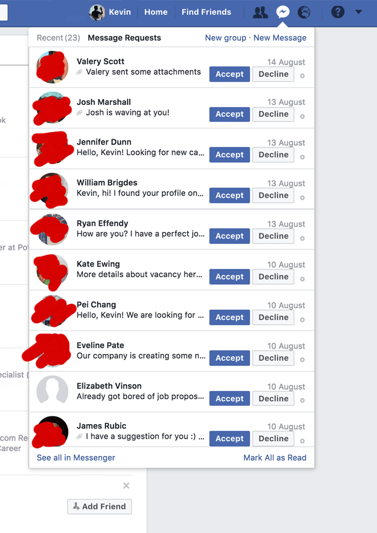
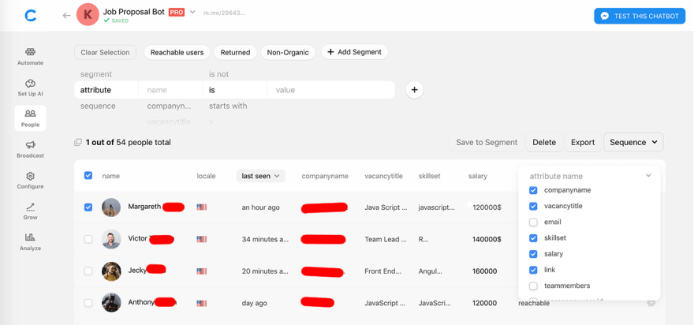
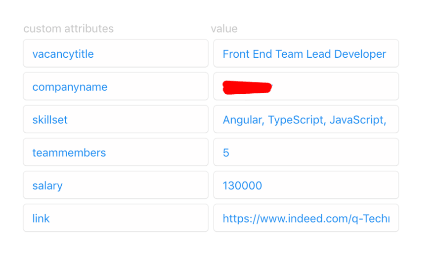

Я сделал бота, который общается за меня с рекрутерами, и мне понравилось / Блог компании Everyday Tools

Меня зовут Кевин и я хотел бы рассказать о том, как нехитрым способом отделался от рекрутерского спама. Я фронтенд-разработчик с хорошей работой, стою во главе команды из семи человек. Но рекрутеры заваливают меня письмами до такой степени, что иногда просто неохота заходить в почту. Я уже заранее знаю, что там будут они, со всеми этими «Надеюсь, у вас все идет хорошо» и «Нет ли у вас желания побеседовать?». Нет, ни малейшего. Я хочу, чтобы меня оставили в покое заниматься задачами и выполнять работу, которая у меня уже есть.  
  
Иногда рекрутеры подстерегают меня и на Facebook. Вот пожалуйста, запросы от желающих переписываться:

Вот так я и пришел к мысли, что проще сделать бота, чем продолжать читать все это и беситься. При создании бота я решил обратиться к платформе Messenger, ведь рекрутеры повально пользуются Facebook, значит, им так будет удобнее общаться с моим виртуальным братишкой.

Сейчас существует множество инструментов для создания ботов, ну и конечно, всегда есть вариант сделать все самому с нуля, без конструкторов. Я решил не расставаться с Chatfuel. На этой платформе очень просто работать, особенно когда как следует разберешься с логикой. Я потратил на создание бота несколько часов и — [вот он](https://m.me/296432910906505?ref=bot1), во всей своей сияющей красе!

На чем я акцентировал внимание?

Как человек, который получает массу предложений, я уже четко определился, какие критерии для меня имеют больший вес, а какие — меньший. В том, что касается выуживания интересующих меня сведений из этих длинных бестолковых писем, я прямо-таки рок-звезда (слышите, рекрутеры?):

**Расположение офиса.** В данный момент я живу в Чикаго и хотел бы здесь оставаться как можно дольше. Соответственно, предложения, предполагающий переезд, меня не интересуют (ну, разве что куда-нибудь на Бали). Поэтому я добавил в репертуар чатбота для рекрутеров вопрос про географическое положение. Приняв подобные меры, я получил возможность спокойно фильтровать запросы по завершению беседы, откуда бы они ни поступали.

**Навыки.** Нет, правда, хватит уже спрашивать меня про Java, рекрутеры. Не пишу я на Java! У меня возникло желание включить также какую-нибудь короткую проверку или комментарий, которые гарантировали бы понимание, что Java и Javascript — это не одно и то же. Для меня это было бы удобно… да и для рекрутеров тоже (не такой уж я и злобный, на самом-то деле). Еще один занимательный факт обо мне: я усиленно ищу крутые проекты на React, которые дали бы мне возможность прокачаться в этой области — это еще одна причина, по которой я добавил вопрос о навыках.

**Опыт.** Я работаю разработчиком четыре года, так что очень странно бывает получать письма, где черным по белому написано: «От пяти лет опыта». Уж либо вообще уберите этот критерий из требований, либо определитесь, где именно проводите черту.

**Зарплата.** Тоже немаловажное соображение. Сначала я включил ее в список фильтров, но потом решил, что это как-то уж совсем бесцеремонно, и убрал.

Этих критериев было достаточно, чтобы сделать бота, который был бы прост в использовании и при этом защитил бы меня (как я надеялся) от лавины мусора в папке «Входящие».

Но как заставить рекрутеров с ним разговаривать?

Я взял ссылку и воткнул ее везде, где только мог: на свою страницу на LinkedIn, на GitHub, на Facebook, на Slack, на Instagram. Кроме того, я создал шаблон письма для Gmail, которое автоматически отсылалось рекрутерам, со следующим текстом:

> _Добрый день, уважаемый рекрутер!
> 
> Благодарю Вас за проявленный интерес. Если Вы хотите рассказать мне о каких-либо карьерных возможностях, воспользуйтесь, пожалуйста, вот этим ботом. Так будет проще и для Вас, и для меня: я получу всю полезную информацию о Вашем предложении о работе в структурированном виде, а Вы сэкономите время на написании текста и поиске личной информации, которую можно бы было использовать, чтобы персонализировать письмо и побудить меня его открыть.
> 
> Спасибо!  
> Кевин
> 
> _

После этих действий предложения о работе стали поступать ко мне уже через бот. На Chatfuel это выглядит так:

А внутри — вот так:

Какие преимущества дает подобный метод?

Я могу получать предложения о работе и описания вакансий в том формате, который для меня предпочтителен. Как видно на скриншоте, Chatfuel позволяет сортировать информацию по интересующим вас полям. В почтовый ящик рекрутеры теперь ломятся ощутимо меньше. И я могу рассылать сообщения массово и давать всем фидбэк! Также снижается вероятность, что рекрутер пропадет из моего поля зрения: у меня ведь есть его профиль в Facebook и я даже могу посмотреть, есть ли у нас общие друзья.

Поработав по такой схеме около месяца, я стал анализировать результаты. Оказалось, что предложения рекрутеров стали намного меньше меня раздражать. Я снова могу располагать своей почтой и сортирую письма по своему усмотрению. Мне пришло четыре предложения, которые меня заинтересовали. И теперь я намного больше знаю о рынке труда: какую зарплату в среднем платят, какие навыки востребованы — у меня ведь собирается статистика по предложениям рекрутеров.

В общем, получилось весьма занятно! Даже сами рекрутеры говорили мне, что им понравилось, как я вышел из положения. Можно ли без этого обойтись? Разумеется, но чатбот значительно облегчает мне жизнь. Время на вес золота, детали имеют большое значение, так что советую и вам прибегнуть к такому способу.

P.S. Уже после написания статьи я обнаружил инструмент [Reply.id](https://dev.to/whokilledkevin/reply.id) на Product Hunt — похоже, ребята сделали его с прицелом как раз на таких, как я. Возможно, вам стоит попробовать и его тоже.